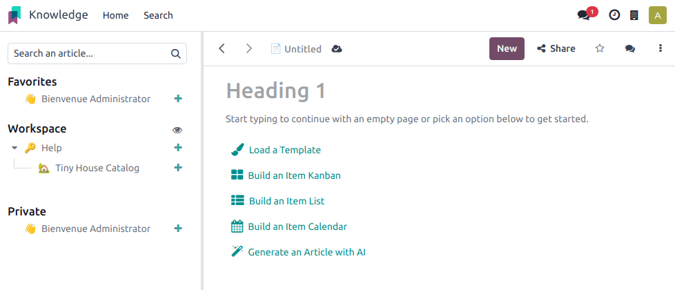

====================================
Article creation and content editing
====================================

Article creation
================

Use the :guilabel:`Private` or :guilabel:`Workspace` section of the sidebar tree to start creating
an article. The former is for drafting ideas, and the latter is for sharing with internal users.
Hover above your preferred section, then click the :icon:`fa-plus` :guilabel:`(plus)` icon. An
:guilabel:`Untitled` page appears and offers you the option to start writing your content or do the
following:

- :guilabel:`Load a Template`: Load preconfigured templates.
- :guilabel:`Build an Item Kanban`: Visualize tasks or items in a Kanban view.
- :guilabel:`Build an Item List`: Build a structured list of items.
- :guilabel:`Build an Item Calendar`: Create a calendar view to track items by date.
- :guilabel:`Generate an Article with AI`: Generate content based on your prompt.

.. tip::
   After filling in the :guilabel:`Heading 1` field, click :guilabel:`Untitled` on the top bar to
   automatically match your h1 :dfn:`(First-level header)` title to the name of the article. To
   change the name of your article later, you must do it manually: click the name on the top bar
   and proceed to the modification.

Content editing
===============

Customize and personalize your content by using the text editor, adding a cover picture and an
emoji.

.. _knowledge/text-editor:

Text editor
-----------

To edit a paragraph, select it or double-click on it to display the text editor, and apply the
desired editing options. To know more about the editing options, please refer to
:doc:`../../../applications/essentials/text_editor`.

Cover pictures
--------------

To add a cover picture, click the :icon:`fa-ellipsis-v` :guilabel:`(ellipsis)` icon, then
:guilabel:`Add Cover`. The following options allow you to select and insert pictures from different
sources:

- Search the **Unsplash** database.
- Enter a picture's **URL**.
- Click :guilabel:`Upload an image`.

To replace the cover picture, hover above it, click :guilabel:`Replace Cover`, and choose a new one
from the selection.

To reposition the cover picture, hover above it and click :guilabel:`Reposition`. Adjust the
picture, then click :guilabel:`Save Position`.

To remove the cover picture, hover above it and click :guilabel:`Remove Cover`.

.. note::
   If your database and your **Unsplash** account are associated, the cover picture is
   automatically selected based on the title of the article. To associate **Unsplash** with your
   database, please refer to :doc:`/applications/general/integrations/unsplash`.

Emojis
------

There are two possibilities to add an emoji to your article:

- Through the ellipsis icon:

#. Click the :icon:`fa-ellipsis-v` :guilabel:`(ellipsis)` icon at the top right side.
#. Click :guilabel:`Add Icon` to generate a random emoji that appears near the title of the article.
#. To change the emoji, click :guilabel:`Remove Icon`, then :guilabel:`Add Icon` again.

- Through the emoji search bar:

#. Click the :icon:`fa-file-text-o` :guilabel:`(page)` icon next to the title of the article to
   open the emoji search bar.
#. Use the search bar or scroll down to find the desired emoji.
#. Select the desired emoji, which will appear close to the title of the article.
#. (Optional) Click the selected emoji to open the emoji search bar, and select a different
   one.

.. note::
   - Adding an emoji through the ellipsis icon requires repeating the operation as many times as
     needed to find the suitable emoji for your article. However, once you click
     :guilabel:`Add Icon`, click on the generated emoji to open the emoji search bar and proceed as
     in the second option.
   - The system also displays the emoji before the corresponding article in the sidebar tree.
   - Click on the emoji in the sidebar tree to change it without opening the related article.

.. _knowledge/powerbox:

Commands
========

Type `/` to use a command and open the **powerbox**. Some commands, such as `/Image` or
`/Article`, are common to all apps, but others are specific to the :guilabel:`Knowledge` app and
cannot be found or used in any other app. To know more about the list of commands, please refer to
:doc:`../../../applications/essentials/text_editor`.

Content from other apps
=======================

To insert content views from other apps, go to the desired app and do the following:

#. Select the preferred view:

   - :icon:`oi-view-list` (List)
   - :icon:`oi-view-kanban` (Kanban)
   - :icon:`fa-calendar` (Calendar)
   - :icon:`oi-view-pivot` (Pivot)
   - :icon:`fa-area-chart` (Graph)
   - :icon:`fa-map-marker` (Map)
   - :icon:`fa-tasks` (Gantt)
   - :icon:`oi-view-cohort` (Cohort)

#. Click the :icon:`fa-cog` :guilabel:`(Cog)` icon at the top left corner.
#. Click :menuselection:`Knowledge --> Insert view in article`.
#. Select the article for which you want to insert the view.

.. example::
   To retrieve the view below, we created it by going to :menuselection:`Sales --> Graph icon -->
   Pie Chart icon` and inserted it by clicking :menuselection:`Favorite --> Insert view in article`
   and selecting the *Sales Playbook* article.

   .. image:: articles_editing/inserted-view.png
      :align: center
      :alt: article view from the Sales app

.. note::
   - Users who do **not** have access to the view will **not** be able to access it in **Knowledge**
     even though they have access to the article containing the view.
   - In some apps, certain views are not available.
