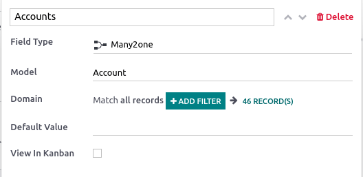

==========
Properties
==========

Properties are fields containing data and that can be added to articles by any user with **write**
access. These fields are shared between all the child articles and article items under the same
parent.

.. note::
   To be able to add properties, an article must be either a **child article** or an **article
   item**.

Add property fields
===================

Hover above the first-level header to make the buttons appear. Click :menuselection:`⚙ Add
Properties --> Field Type`, select the type and add a default value if needed. To make the fields
appear in **kanban views**, check :guilabel:`View in Kanban` as well. To validate and close the
property creation window, click anywhere.

.. image:: properties/fields.png
   :align: center
   :alt: Dropdown of property fields types

The different types assess what the field content can be:

.. list-table::
   :widths: 20 80
   :header-rows: 1
   :stub-columns: 1

   * - Types
     - Uses
   * - :guilabel:`Text`
     - Allows adding any content with no restriction.
   * - :guilabel:`Checkbox`
     - Add a checkbox.
   * - :guilabel:`Integer`
     - Allows adding integer numbers.
   * - :guilabel:`Decimal`
     - Allows adding any number.
   * - :guilabel:`Date`
     - Allows selecting a date.
   * - :guilabel:`Date & Time`
     - Allows selecting a date and time.

Some **field types** need to be configured:

.. list-table::
   :widths: 20 80
   :header-rows: 1
   :stub-columns: 1

   * - Types
     - Uses
   * - :guilabel:`Selection`
     - Add a drop-down selection menu with restricted values that have been set at the property
       creation.

       To set it up, click :guilabel:`Add a Value` next to the :guilabel:`Values` field. Enter
       predetermined values and press **enter** to validate; you can enter as many values as needed.
       Click anywhere to close the property creation window.
   * - :guilabel:`Tags`
     - Allows creating and applying as many tags as needed.

       To set it up, enter your `new_tag` in the :guilabel:`Tags` field, and press **enter** or
       click :guilabel:`Create "new_tag"`. Click anywhere to close the window. Then, add the tags
       into the property field. To do so, click the property field and choose from the created tags;
       enter the tags' name and press **enter**; enter a new tag's name and create a new one on the
       spot.
   * - :guilabel:`Many2one`
     - Choose from a list of records that result from a model's domain. You can only select one
       result.

       To set it up, click :guilabel:`Search a Model` in the :guilabel:`Model` field, select the
       model. Match all records by clicking :guilabel:`## Record(s)`, or filter the results by
       clicking :guilabel:`+ Add Filter` and show the records by clicking :guilabel:`## Record(s)`.
   * - :guilabel:`Many2many`
     - Choose from a list of records that result from a model's domain. You can select as many
       results as needed.

       To set it up, click :guilabel:`Search a Model` in the :guilabel:`Model` field, select the
       model. Match all records by clicking :guilabel:`## Record(s)`, or filter the results by
       clicking :guilabel:`+ Add Filter` and show the records by clicking :guilabel:`## Record(s)`.

Delete property fields
======================

To remove a property, click the **pencil** icon next to the targeted property, then click
:menuselection:`Delete --> Delete`.

.. warning::
   Once a property field is deleted, you cannot retrieve it.

Hide the property panel
=======================

To hide the property sidebar panel, click the gear :guilabel:`(⚙)` button.
