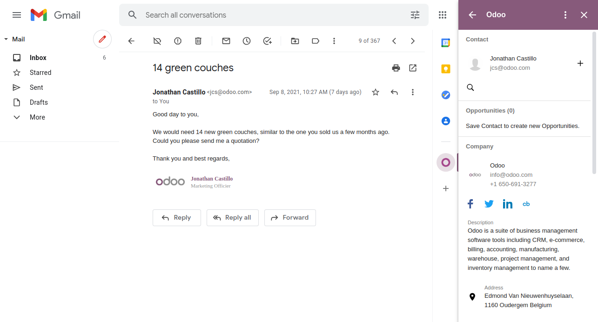

===============
Gmail Extension
===============

The **Odoo Gmail Extension** is a connector that bridges your Gmail mailbox with your Odoo database.

This extension allows you to:

- Create leads from emails sent to your mailbox.
- Create tickets from emails sent to your email address.
- Centralize Prospects' emails into a CRM.
- Generate Tasks from emails sent to your email address in any Odoo project.
- Search and store insights on your contacts.

.. important::
   The Gmail Extension uses *Partner Autocomplete IAP credits* to search and store insights on
   your contacts. See the :doc:`Pricing section <./pricing>` for more information.

.. _gmail_extension/configuration:

Configuration
=============

The Gmail Extension requires to be configured both in Odoo and in Gmail.

.. _gmail_extension/enable-feature:

Enable the feature on your database
-----------------------------------

To enable this feature on your Odoo database, go to :menuselection:`Settings --> General Settings -->
Integrations`, enable **Mail Plugin**, and click on *Save*.

.. _gmail_extension/add-in-installation:

Install the add-in on Gmail
---------------------------

To install the add-in,

.. |gmail-addin-project-url| raw:: html

   <a href="https://script.google.com/d/1n7cxtaR4fGXKcP0RwinNQmL8S4FhVqpo-ZZ_cUAhYuuDpZAP_CnHE_7q/edit" target="_blank">Gmail Add-In Project</a>

#. Go on the following URL: |gmail-addin-project-url|.

#. If you are logged with many Google account at the same time, check that you are using the one on which you want to install the add-in

   .. image:: media/gmail-extension-check-login.png
      :align: center
      :alt: Check your login

#. Click on **Publish** then **Deploy from manifest...**

   .. image:: media/gmail-extension-deploy-from-manifest.png
      :align: center
      :alt: Deploy from manifest

#. Click on **Install add-on** and the Odoo plugin will be available on Gmail

   .. image:: media/gmail-extension-install-addon.png
      :align: center
      :alt: Install the addon

Connect to your database
------------------------

#. Open any email in your Gmail inbox and click on the Odoo icon.
   This opens the extension as a panel on the right side of your screen.

   .. image:: media/gmail-extension-open-addon.png
      :align: center
      :alt: Open the Gmail add-in

#. Click on *login* at the bottom of the extension.

#. Insert your database's URL then click on *Login*.

#. Log into your database by entering your credentials. Skip this step if you are already logged in
   with this browser.

#. A message asks you if you want to let Gmail access your Odoo database. Click on *Allow* to
   complete the connection.

   .. important::
      Make sure first to :ref:`enable the feature on your database
      <gmail_extension/enable-feature>`.

.. note::
   The extension displays some information, even if you do not connect it to any Odoo database.
   Note that only a limited amount of contact enrichment requests are available as a trial, as this
   feature requires prepaid credits. See the :doc:`Pricing section <./pricing>` for more information.
