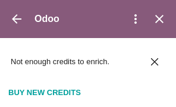

=======
Pricing
=======

The extension is **free** and doesn't require any purchase to be installed and used.

However, this extension provides you with *Lead Enrichment* in the **Company Insights** section.
This service is part of a paid service known as **Lead Generation**.

The extension allows you to test this service for free, whether you connect the extension to a
database or not. After a while, the extension asks you to buy credits to keep using this additional
service.

|outlook-extension-credits-message| |gmail-extension-credits-message|

.. |outlook-extension-credits-message| image:: media/outlook-extension-credits-message.png
   :width: 35%
   :alt: "Could not auto-complete the company: not enough credits!" warning message in the Outlook
         extension

         extension

.. tip::
   You can buy more *Lead Generation* credits to keep using this service or disregard this message
   and keep using the extension for free without *Lead Enrichment*.

In-App Purchase
===============

| *Lead Generation* is an *In-App Purchase (IAP)* service, which requires prepaid credits to be
  used. Each request consumes one credit.
| To buy credits, go to :menuselection:`Settings --> Contacts --> Partner Autocomplete or Odoo IAP -->
  View My Services` and select a package.

.. note::
   - If you run out of credits, the only information populated when clicking on the suggested
     company is the website link and logo.
   - If you are on Odoo Online (SAAS) and have the Enterprise version, you benefit from free
     trial credits to test the feature.
   - Learn about our *Privacy Policy* `here <https://iap.odoo.com/privacy#header_2>`_.

.. seealso::
   - :doc:`../../general/in_app_purchase/in_app_purchase`
   - `Odoo Tutorials: Lead Enrichment <https://www.odoo.com/r/p73>`_
