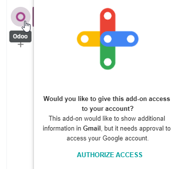

============
Gmail Plugin
============

The *Gmail Plugin* integrates an Odoo database with a Gmail inbox, so users can keep track of all
their work between Gmail and Odoo, without losing any information.

Odoo Online users
=================

For databases hosted on Odoo Online (or Odoo.sh), follow the steps below to configure the Gmail
Plugin.

Install the Gmail Plugin
------------------------

First, log in to the Gmail account that the user wishes to connect to Odoo.

From the Gmail inbox, click the plus sign icon on the right side panel to get add-ons. If the side
panel is not visible, click on the arrow icon at the bottom right corner of the inbox to reveal it.

.. image:: gmail/gmail-side-panel.png
   :align: center
   :alt: Plus sign icon on the Gmail inbox side panel.

Then, use the search bar to search for `Odoo` and locate the :guilabel:`Odoo Inbox Addin`.

.. image:: gmail/google-workspace-marketplace.png
   :align: center
   :alt: Odoo Inbox Addin on Google Workspace Marketplace.

Or, go directly to the :guilabel:`Odoo Inbox Addin` page on the `Google Workspace Marketplace
<https://workspace.google.com/marketplace/app/odoo_inbox_addin/873497133275>`_.

Once the plugin is located, click :guilabel:`Install`. Then, click :guilabel:`Continue` to start
the installation.

Next, select which Gmail account the user wishes to connect to Odoo. Then click :guilabel:`Allow`
to let Odoo access the Google account. Google will then show a pop-up window confirming that the
installation was successful.

Configure the Odoo database
---------------------------

The :guilabel:`Mail Plugin` feature must be enabled in the Odoo database in order to use the Gmail
Plugin. To enable the feature, go to :menuselection:`Settings --> General Settings`. Under the
:guilabel:`Integrations` section, activate :guilabel:`Mail Plugin`, and then click
:guilabel:`Save`.

.. image:: gmail/mail-plugin-setting.png
   :align: center
   :alt: The Mail Plugin feature in the Settings.

Configure the Gmail inbox
-------------------------

In the Gmail inbox, a purple Odoo icon is now visible on the right side panel. Click on the Odoo
icon to open up the Odoo plugin window. Then, click on any email in the inbox. Click
:guilabel:`Authorize Access` in the plugin window to grant Odoo access to the Gmail inbox.

Next, click :guilabel:`Login`. Then, enter the URL of the Odoo database that the user wishes to
connect to the Gmail inbox, and log in to the database.

.. note::
   Use the general URL for the database, not the URL of a specific page in the database. For
   example, use `https://mycompany.odoo.com`, not
   `https://mycompany.odoo.com/web#cids=1&action=menu`.

Finally, click :guilabel:`Allow` to let Gmail access the Odoo database. The browser will then show
a :guilabel:`Success!` message. After that, close the window. The Gmail inbox and Odoo database are
now connected.

Odoo On-Premise users
=====================

For databases hosted on servers other than Odoo Online (or Odoo.sh), follow the steps below to
configure the Gmail Plugin.

.. note::
   As part of their security guidelines, Google requires add-on creators to provide a list of URLs
   that can be used in actions and redirections launched by the add-on. This protects users by
   ensuring, for example, that no add-on redirects users toward a malicious website. (Read more on
   `Google Apps Script <https://developers.google.com/apps-script/manifest/allowlist-url>`_.)

   Since Odoo can only list the `odoo.com` domain and not every on-premise customer's unique server
   domain, on-premise customers cannot install the Gmail Plugin from the Google Workspace
   Marketplace.

Install the Gmail Plugin
------------------------

First, make sure you can create Google App Scripts. Visit https://script.google.com/home/usersettings
and enable them if they are disabled.

Then, access the `GitHub repository <https://github.com/odoo/mail-client-extensions>`_ for the
Odoo Mail Plugins. Next, click on the green :guilabel:`Code` button. Then, click
:guilabel:`Download ZIP` to download the Mail Plugin files onto the user's computer.

.. image:: gmail/gh-download-zip.png
   :align: center
   :alt: Download the ZIP file from the Odoo GitHub repository for Mail Plugins.

Decompress the ZIP file on the computer. Then, go to :menuselection:`mail-client-extensions-master -->
gmail --> src --> views`, and open the :file:`login.ts` file using any text editor software,
such as Notepad (Windows), TextEdit (Mac), or Visual Studio Code.

Delete the following three lines of text from the :file:`login.ts` file:

.. code-block::

   if (!/^https:\/\/([^\/?]*\.)?odoo\.com(\/|$)/.test(validatedUrl)) {
        return notify("The URL must be a subdomain of odoo.com");
   }

Similarly, go to :menuselection:`mail-client-extensions-master --> gmail`, and edit the file 
:file:`appsscript.json`. Inside that file, you will see a list of URL patterns under the 
``urlFetchWhitelist`` key. There:

#. Replace all occurrences of ``https://odoo.com`` with your domain 
   (e.g. ``https://my-odoo.example.com``). 
#. If you need to use subdomains, replace all occurrences of ``https://*.odoo.com`` with your
   domain (e.g. ``https://*.example.com``).
#. If you don't need to use subdomains, remove all lines that contain ``https://*.odoo.com``.

.. note::
   If these URL patterns are not enough for you, read
   `Google documentation <https://developers.google.com/apps-script/add-ons/concepts/workspace-manifests#adding_prefixes_to_your_allowlist>`__
   for more details on how to customize this list of URL patterns.

This removes the `odoo.com` domain constraint from the Gmail Plugin program and enables your
own domain(s).

.. note::
   The computer must be able to run Linux commands in order to follow the following instructions.
   It also needs to have a working `NodeJS <https://nodejs.org/>`__ installation with 
   `npm <https://www.npmjs.com/>`__ and `Clasp <https://github.com/google/clasp>`__ available.

Next, in the decompressed ZIP folder, go to :menuselection:`mail-client-extensions-master --> gmail`
and open a Linux terminal there. Run these ``bash`` commands:

.. code-block:: bash

   # Remove upstream Google Apps Script definition
   rm .clasp.json

   # Log in Google
   clasp login

   # Enable this required API (you must follow instructions from the command output)
   clasp apis enable gmail

   # Create and deploy your own version of the Google Apps Script
   clasp create --type standalone
   clasp push --force
   read -p "Enter your domain: " domain
   clasp deploy --description "Odoo Gmail Plugin ($domain)"
   clasp open

At this point, you have the project open in your browser. Share it with the 
Gmail account(s) that must connect to Odoo.

Configure the Odoo database
---------------------------

The :guilabel:`Mail Plugin` feature must be enabled in the Odoo database in order to use the Gmail
Plugin. To enable the feature, go to :menuselection:`Settings --> General Settings`. Under the
:guilabel:`Integrations` section, activate :guilabel:`Mail Plugin`, and then click
:guilabel:`Save`.

.. image:: gmail/mail-plugin-setting.png
   :align: center
   :alt: The Mail Plugin feature in the Settings.

Configure the Gmail inbox
-------------------------

In the Gmail inbox, a purple Odoo icon is now visible on the right side panel. Click on the Odoo
icon to open up the Odoo plugin window. Then, click on any email in the inbox. Click
:guilabel:`Authorize Access` in the plugin window to grant Odoo access to the Gmail inbox.

Next, click :guilabel:`Login`. Then, enter the URL of the Odoo database that the user wishes to
connect to the Gmail inbox, and log in to the database.

.. note::
   Use the general URL for the database, not the URL of a specific page in the database. For
   example, use `https://mycompany.odoo.com`, not
   `https://mycompany.odoo.com/web#cids=1&action=menu`.

Finally, click :guilabel:`Allow` to let Gmail access the Odoo database. The browser will then show
a :guilabel:`Success!` message. After that, close the window. The Gmail inbox and Odoo database are
now connected.
