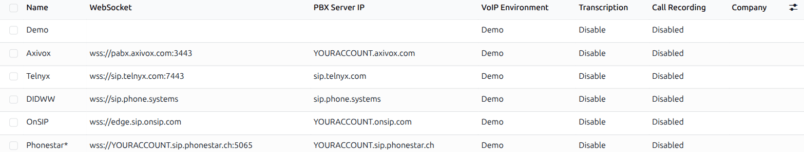
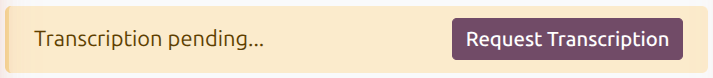
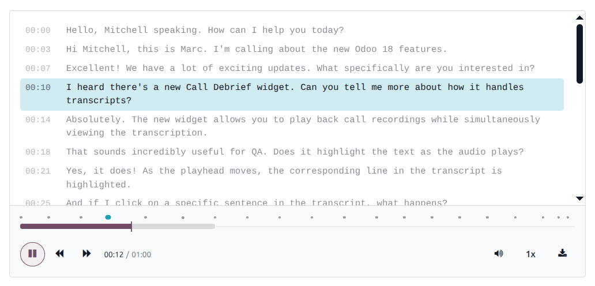

:show-content:

.. |VOIP| replace:: :abbr:`VoIP (Voice over Internet Protocol)`

=====
Phone
=====

.. note::
   As of Odoo 19.0, the *VoIP* module has been renamed to *Odoo Phone*.

The Odoo **Phone** app enables businesses to handle calls over the internet by integrating directly
with Odoo apps like **CRM** and **Helpdesk**. The **Phone** app can link calls and messages to
customer interactions, log communication history, and automate call routing based on predefined
rules. Features like :ref:`call recording <productivity/phone/recording-transcription>` and
analytics provide insights into call volume and response times, helping businesses streamline
external communication and track team performance.

.. cards::
   .. card:: Phone widget
      :target: phone/phone_widget
      :large:

      Get started with the **Phone** widget essentials, including actions that can be taken during a
      call.

   .. card:: Devices and integrations
      :target: phone/devices_integrations
      :large:

      Learn how to access the **Phone** widget from different devices (like phones) and apps (like
      Linphone).

.. seealso::
   `Odoo Tutorials: Phone <https://www.odoo.com/slides/voip-voice-over-ip-315>`_

.. _productivity/phone/about-voip:

About VoIP
==========

The **Phone** app uses the following technologies to make and receive calls in Odoo:

- **Voice over Internet Protocol (VoIP)**: Technology that is used to handle calls that are not made
  from a phone line.
- **Session Initiation Protocol (SIP)**: Technology included in |VOIP| that specifically handles the
  setup, management, and termination of calls.
- **Call queue**: A system to route calls (usually in a support team). This allows customers to wait
  for help if no support agents are available.
- **Dial plans**: A system to define how |VOIP| calls are routed, based on set rules.

.. _productivity/phone/configure:

Configure the Phone app
=======================

To make |VOIP| calls in Odoo, first :ref:`install <general/install>` the **Phone** app.

Once the app is installed, a :icon:`oi-voip` (:guilabel:`Phone`) icon will appear at the top of the
screen. When this icon is clicked, a **Phone** pop-up widget appears on the screen. This is where
users can make and receive calls, send emails, edit user and employee info, and manage activities.
The widget stays open when navigating other Odoo apps.

.. _productivity/phone/assign-user-permissions:

Assign user permissions
-----------------------

.. note::
   As of Odoo 19.0, the **Phone** app has three access roles that can be assigned.

By default, users can receive their own calls, and managers can receive calls for their team
members. To grant additional **Phone** app permissions to a user, go to :menuselection:`Settings app
--> Users \& Companies --> Users` and search for the user. Open the user's contact card and navigate
to the *Access Rights* tab. Go to the *Productivity* section, and in the |VOIP| field, select the
desired access role.

The **Phone** app has three access roles:

- :guilabel:`No`: cannot access **Phone** app features.
- :guilabel:`Officer`: can view and report on all calls.
- :guilabel:`Administrator`: can view, report, and manage call settings.

.. important::
   | Database administrators are not automatically granted administrator rights for the **Phone**
     app.
   | Make sure to set the correct access role for each **Phone** app user.

To modify these roles or add custom roles, see :ref:`Create and modify groups
<access-rights/groups>`.

.. _productivity/phone/connect-voip-provider:

Connect to a VoIP provider
--------------------------

Making calls through the **Phone** app also requires a |VOIP| service provider. Odoo supports three
verified providers by default: :doc:`Axivox <phone/axivox>`, :doc:`DIDWW <phone/didww>`, and
:doc:`OnSIP <phone/onsip>`. Click on the cards below to learn how to configure these service
providers in the Odoo database:

.. cards::
   .. card:: Axivox configuration
      :target: phone/axivox
      :large:

      Learn how to set up Axivox in Odoo. This includes adding users to Axivox, setting up call
      queues, and more.

   .. card:: DIDWW configuration
      :target: phone/didww
      :large:

      Learn how to set up DIDWW in Odoo. This includes entering DIDWW credentials into Odoo and
      purchasing new numbers.

   .. card:: OnSIP configuration
      :target: phone/onsip
      :large:

      Learn how to set up OnSIP in Odoo. This includes entering OnSIP credentials into Odoo and
      handling troubleshooting.

Other providers must meet two requirements to connect with Odoo:

#. The |VOIP| host must provide access to a SIP server via a WebSocket connection.
#. The |VOIP| host must support WebRTC protocol.

.. important::

   If these requirements are met, it should be possible to add the alternate provider to Odoo.
   However, Odoo recommends using a verified provider and cannot guarantee compatibility with every
   alternate provider.

To add credentials for an alternate provider, go to the :menuselection:`Phone app --> Configuration
--> Settings`. Click :guilabel:`New`, then enter the provider information (such as the websocket's
URL). Enter the domain created by the alternate provider in the :guilabel:`OnSIP Domain` field.

For issues setting up the |VOIP| service provider in Odoo, follow the :ref:`relevant troubleshooting
steps <phone/phone_widget/troubleshooting>`. For any other issues with the |VOIP| service provider,
contact their support team directly.

.. _productivity/phone/recording-transcription:

Record and transcribe calls
===========================

Calls made through the **Phone** app can be recorded, and recordings can be transcribed into text.

.. _productivity/phone/configure-recording:

Configure call recording
------------------------

To configure call recording and transcription, go to :menuselection:`Phone app --> Configuration -->
Providers`. For each |VOIP| provider, select the desired setting:

- :guilabel:`Call Recording`: Select :guilabel:`Disabled`, :guilabel:`Let users decide`, or
  :guilabel:`Force for all users`.
- :guilabel:`Transcription`: Select :guilabel:`Disable` or :guilabel:`Force for all users`.

Recordings are stored using the :doc:`Cloud Storage <../general/integrations/cloud_storage>`
integration. If it is not configured, a warning is shown on this page, and call recording cannot be
enabled.

.. _productivity/phone/request-transcription:

Request a transcription
-----------------------

After a call has been recorded, its recording can be transcribed into text. A
:guilabel:`Transcription pending...` banner appears at the top of the call's record, with a
:guilabel:`Request Transcription` button. Transcription is only available when enabled for the
call's |VOIP| provider (see :ref:`productivity/phone/configure-recording` above).

If the transcription fails, the banner displays an error message instead.

.. _productivity/phone/call-debrief-panel:

Call Debrief panel
------------------

Once a call has a recording or transcript, a **Call Debrief** panel with a timestamped transcript
and audio player appears. The transcript and audio player are synced. Click a line in the transcript
to jump to that moment in the recording, or play the recording to highlight each corresponding line
as it plays.

The audio player has a timeline with a marker for each transcript line and the following controls:

.. list-table::
   :header-rows: 1
   :widths: auto

   * - Control
     - Description
     - Keyboard shortcut
   * - :icon:`fa-play` :guilabel:`Play`
     - Play or pause the recording.
     - :kbd:`K`
   * - :icon:`fa-backward` :guilabel:`Skip backward`
     - Skip backward 5 seconds in the recording.
     - :kbd:`J`
   * - :icon:`fa-forward` :guilabel:`Skip forward`
     - Skip forward 5 seconds in the recording.
     - :kbd:`L`
   * - :icon:`fa-volume-up` :guilabel:`Mute`
     - Hover over the icon to reveal a volume slider.
     - :kbd:`M`
   * - :guilabel:`1x`
     - Change the playback speed. Speeds between 0.25x and 3x are available in increments of 0.25.
     - :kbd:`Shift + ,` to decrease, :kbd:`Shift + .` to increase
   * - :icon:`fa-download` :guilabel:`Download`
     - Download the recording as an MP3 audio file.
     - N/A

.. _productivity/phone/voip-workflows:

VoIP workflows
==============

Odoo **Phone** is popular with sales teams and support teams, but can be useful for other teams as
well. Click the cards below to learn about |VOIP| workflows in Odoo:

.. cards::
   .. card:: Sales teams and VoIP
      :target: phone/sales_calls
      :large:

      Learn how to use Odoo **Phone** for a sales team workflow. This includes making sales calls,
      handling follow-ups, and sending a sales quotation while on a call.

   .. card:: Support queues and VoIP
      :target: phone/support_calls
      :large:

      Learn how to use Odoo **Phone** for a support team workflow. This includes joining a call
      queue as an agent and handling live phone support tickets.

.. toctree::
   :titlesonly:

   phone/axivox
   phone/didww
   phone/onsip
   phone/phone_widget
   phone/devices_integrations
   phone/sales_calls
   phone/support_calls
