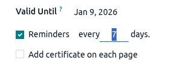

===================
Request a signature
===================

Via the Odoo Sign app or directly from an Odoo record, you can:

- request the signature of one or more signers on :ref:`a one-off document or envelope of
  multiple one-off documents <sign/request-signatures/one-off>`
- :ref:`use templates <sign/request-signatures/templates>` to request the signature of one or more
  signers on frequently used documents

Once a document or :ref:`document envelope <sign/prepare-document/create-envelope>` has been fully
signed, i.e., completed and signed by all signers, the signed document(s) and the :ref:`certificate
of completion <sign/security/certificate-of-completion>` are sent via email to the requestor, and to
any contacts added in :guilabel:`CC` when the signature request was :ref:`configured
<sign/configure-signature-request>`.

.. _sign/request-signatures/one-off:

One-off documents
=================

.. _sign/request-signatures/one-off-app:

From the Sign app
-----------------

To request the signature of a one-off document or :ref:`document envelope
<sign/prepare-document/create-envelope>` from the Sign app:

#. Go to :menuselection:`Sign --> Documents --> My Documents` or :menuselection:`--> All Documents`,
   click :guilabel:`Upload PDF`, then select and open the relevant `.pdf` document(s).
   If the document needs to be imported from the :doc:`Documents <../documents>` app, click the
   :icon:`fa-cog` :guilabel:`(Actions)` icon beside the name of the view, then
   :menuselection:`Import from Documents`.

   .. tip::
      If you are creating a document envelope that includes one document saved in the Documents app,
      import that document *before* :ref:`adding subsequent documents
      <sign/prepare-document/create-envelope>`.

#. :ref:`Prepare the document(s) for signing <sign/prepare-document>` by adding the relevant
   fields; add additional signers and/or documents, if relevant.
#. Click :guilabel:`Send`.
#. Complete the relevant fields of the :ref:`New Signature Request
   <sign/configure-signature-request>` window.
#. If you are:

   - one of the signers and you are ready to sign the document directly, click :guilabel:`Sign Now`,
     then :ref:`complete and sign the document(s) <sign/sign-document/signature-request>`.
   - not one of the signers or a signing order has been defined and you need to sign the document
     *after* other signers, click :guilabel:`Send`.

.. _sign/request-signatures/one-off-record:

From an Odoo record
-------------------

To request the signature of a one-off document or :ref:`document envelope
<sign/prepare-document/create-envelope>` from an Odoo record:

#. With the relevant record open, click the :icon:`fa-cog` :guilabel:`(Actions)` icon in the
   upper-left corner, then :icon:`fa-file-text` :guilabel:`Request Signature`.
#. In the :guilabel:`New Signature Request` window, click :guilabel:`Upload PDF`, select the
   relevant `.pdf` document(s), then click :guilabel:`Open`.
#. :ref:`Prepare the document(s) for signing <sign/prepare-document>` by adding the relevant
   fields; add additional signers and/or documents, if relevant.
#. Click :guilabel:`Send`.
#. Complete the relevant fields of the :ref:`New Signature Request
   <sign/configure-signature-request>` window.

   .. note::
      When sending a signature request from an Odoo record, the related customer (or the relevant
      party) is automatically added as a signer.

#. If you are:

   - one of the signers and you are ready to sign the document directly, click :guilabel:`Sign Now`,
     then :ref:`complete and sign the document(s) <sign/sign-document/signature-request>`.
   - not one of the signers or a signing order has been defined and you need to sign the document
     *after* other signers, click :guilabel:`Send`.

.. note::
   Once a document or :ref:`document envelope <sign/prepare-document/create-envelope>` has been
   fully signed, the signed document(s) and the certificate of completion are also added to the
   record's chatter.

.. _sign/request-signatures/templates:

Templates
=========

When the same single document or :ref:`envelope of multiple documents
<sign/prepare-document/create-envelope>` needs to be used regularly, creating and using a template
can save time and streamline the workflow. Templates are prepared for signing in the same way as
one-off documents, by adding the necessary fields, signers, documents, and tags, as relevant.

.. _sign/templates/create:

Create a template
-----------------

To create a template:

#. Go to :menuselection:`Sign --> Templates`.
#. Click :guilabel:`Upload PDF`, then select and open the relevant `.pdf` document(s). If the
   document needs to be imported from the :doc:`Documents <../documents>` app, click the
   :icon:`fa-cog` :guilabel:`(Actions)` icon beside the name of the view, then
   :menuselection:`Import from Documents`.

   .. tip::
      If you need to upload multiple documents, i.e., create a :ref:`document envelope
      <sign/prepare-document/create-envelope>`, and one of the documents is saved in the Documents
      app, import that document *before* :ref:`adding subsequent documents
      <sign/prepare-document/create-envelope>`.

Once you have created the template, you can start :ref:`editing it <sign/templates/edit>`.

.. _sign/templates/edit:

Edit a template
---------------

A template can be edited at any time, provided it has *not yet been used* to send a signature
request.

To edit a template, go to :menuselection:`Sign --> Templates` and click on the relevant template to
open it. Alternatively, hover over the template, click the :icon:`fa-ellipsis-v`
:guilabel:`(vertical ellipsis)` icon in the top-right corner of the card, then click
:guilabel:`Edit`.

.. note::
   When you open a template that has already been used to send a signature request, the template is
   in *visualization mode*. Clicking :icon:`fa-pencil` :guilabel:`Edit Template` in this case
   creates a copy of the template, which can then be edited.

   .. image:: request_signatures/visualization-mode.png
      :alt: Viewing a template that has been used to send a signature request

Edit the template:

- :ref:`Prepare the document(s) for signing <sign/prepare-document>` by adding or editing fields,
  and, if relevant, adding or removing signers and/or documents.
- Optionally, :ref:`define or edit settings for specific signers
  <sign/prepare-document/signer-settings>`, such as requiring additional authentication, allowing a
  signer to delegate signing, or assigning a fixed signer.
- Optionally, define or edit general settings for the template by clicking the :icon:`fa-cog`
  :guilabel:`(cog)` icon beside the template name, then clicking :icon:`fa-cog`
  :menuselection:`Configuration`:

  - By default, the **name of the template** is the name of the document that was uploaded, or, in
    the case of a :ref:`document envelope <sign/prepare-document/create-envelope>`, the name of the
    first document uploaded. If desired, edit the name of the template.
  - :guilabel:`Tags`: Add :ref:`tags <sign/configuration/tags>` to categorize the
    template.
  - :guilabel:`Model`: Select the :doc:`Odoo model <../../studio/models_modules_apps>` to which the
    template is linked to restrict the template to :ref:`signatures requests made from records of
    that model <sign/templates/use-odoo-record>`. Leave the field empty to make the template
    available from any model.
  - :guilabel:`Redirect Link`: Add a url to which the user is redirected after signing the document,
    e.g., to a *Thank you* page, or to your company's homepage.
  - :guilabel:`Documents folder`: Define in which :ref:`folder in the Documents app
    <documents/folders>` the documents using this template should be saved once fully signed.
  - :guilabel:`Documents tags`: Determine which :ref:`Documents-app tags <documents/tags>` should be
    assigned to documents using this template once fully signed.
  - :guilabel:`Authorized Users`: Determine which specific users are authorized to view and use
    this template.
  - :guilabel:`Valid for`: Set a default number of days after which signature requests using this
    template expire; enter `0` if signature requests should not expire.

    .. note::
       The validity date of a signature request can always be modified when :ref:`configuring the
       signature request <sign/configure-signature-request>`.

  - In the :guilabel:`Communication` tab, type a default text that will be added when a signature
    request using this template is sent via email; the text can still be edited before sending.

    .. tip::
       Type `/` to open the :ref:`powerbox <essentials/html_editor/commands>`, then use commands to
       insert headings, bulleted lists, documents, images, etc.

  - If :guilabel:`Manage template access` is enabled in the :ref:`main Sign settings
    <sign/configuration/settings>`, it is also possible to configure the following fields:

    - :guilabel:`Authorized Groups`: Define user groups whose members are authorized to view and use
      this template.
    - :guilabel:`Responsible` user: By default, this is set to the user who created the template,
      but a different user can be selected.

.. _sign/templates/use:

Use templates
-------------

Templates can be used when initiating a signature request :ref:`from the Sign app
<sign/templates/use-sign-app>` or directly :ref:`from an Odoo record
<sign/templates/use-odoo-record>`.

.. _sign/templates/use-sign-app:

From the Sign app
~~~~~~~~~~~~~~~~~

When using a template, there are two ways a signature request can be sent from the Sign app:

- **via direct email** to one or more specific signers; or
- **via a shareable link**, provided the document or document envelope has *only one signer*. This
  option is useful when multiple individuals need to sign a personal copy of a document that
  requires a single signature, e.g., a non-disclosure agreement.

.. note::
   Each time a template is used to send a signature request via direct email, and each time a
   recipient of a link signs a document, a new document is created within Odoo Sign and appears in
   :menuselection:`Sign --> All Documents`.

To send a signature request using a template to one or more specific signers from the Sign app:

#. Go to :menuselection:`Sign --> Templates` to see all existing templates.
#. From the Kanban or list view, click :guilabel:`Send` on the line of the relevant template.
   Alternatively, from the Kanban view, click on a template to open it, then click :guilabel:`Send`.
#. Complete the relevant fields of the :ref:`New Signature Request
   <sign/configure-signature-request>` window.
#. If you are:

   - one of the signers and you are ready to sign the document directly, click :guilabel:`Sign Now`,
     then :ref:`complete and sign the document(s) <sign/sign-document/signature-request>`.
   - not one of the signers or a signing order has been defined and you need to sign the document
     *after* other signers, click :guilabel:`Send`.

To copy a link to a templated document or document envelope:

#. Go to :menuselection:`Sign --> Templates` to see all existing templates.
#. From the Kanban or list view, click :guilabel:`Share` on the line of the relevant template.
   Alternatively, from the Kanban view, click on a template to open it, then click
   :guilabel:`Share`.
#. Optionally, update the :guilabel:`Valid Until` date if the signature request link should expire;
   leave this blank if the signature request does not expire.
#. Click :icon:`fa-clone` to copy the link to your clipboard.

.. tip::
   - After a link has been shared, a :guilabel:`Shared` tag appears on the card of the relevant
     template in the :guilabel:`Templates` Kanban view.
   - To stop sharing a link, from the :guilabel:`Templates` Kanban view, click
     :guilabel:`Share` on the line of the relevant template, then click :guilabel:`Stop sharing`.
     Alternatively, hover over the relevant template, click the :icon:`fa-ellipsis-v`
     :guilabel:`(vertical ellipsis)` icon in the top-right corner of the card, then click
     :guilabel:`Stop sharing`.

.. _sign/templates/use-odoo-record:

From an Odoo record
~~~~~~~~~~~~~~~~~~~

To send a signature request using a template from an Odoo record:

#. With the relevant record open, click the :icon:`fa-cog` :guilabel:`(Actions)` icon in the
   upper-left corner, then :icon:`fa-file-text` :guilabel:`Request Signature`.
#. In the :guilabel:`New Signature Request` window, select the relevant :guilabel:`Template` from
   the dropdown.
#. Complete the relevant fields of the :ref:`New Signature Request
   <sign/configure-signature-request>` window.
#. If you are:

   - one of the signers and you are ready to sign the document directly, click :guilabel:`Sign Now`,
     then :ref:`complete and sign the document(s) <sign/sign-document/signature-request>`.
   - not one of the signers or a signing order has been defined and you need to sign the document
     *after* other signers, click :guilabel:`Send`.

.. note::
   - Templates linked to the current :doc:`Odoo model <../../studio/models_modules_apps>` can be
     selected, as well as templates that are not linked to any model.
   - When sending a signature request from an Odoo record, the related customer (or the relevant
     party) is automatically added as a signer.
   - Once a document or :ref:`document envelope <sign/prepare-document/create-envelope>` has been
     fully signed, the signed document(s) and the certificate of completion are also added to the
     record's chatter.

.. _sign/templates/manage:

Manage templates
----------------

Manage templates by going to :menuselection:`Sign --> Templates`. By default, templates are shown in
a Kanban view, with cards shown horizontally.

.. tip::
   - Remove the :guilabel:`My Favorites` :ref:`filter <search/preconfigured-filters>` to view all
     document templates in the database.
   - A panel on the left side allows the view to be filtered by :ref:`tag
     <sign/configuration/tags>`, if the displayed templates have been assigned tags. Click the
     :icon:`oi-panel-right` icon to close or open the panel.

For each template, the following information is shown:

- the name of the template
- the month and year in which the template was created
- the avatar of the :guilabel:`Responsible` user for the template; this is by default the user who
  created the template, but this can be changed in the configuration settings of the template if
  :guilabel:`Manage template access` is enabled in the :ref:`main Sign settings
  <sign/configuration/settings>`
- any tags assigned to the template
- the number of documents created using the template for which a signature request is
  :guilabel:`In Progress`
- the number of documents created using the template that have been fully :guilabel:`Signed`

.. tip::
   Templates you created yourself are automatically marked as favorites for quicker access. To
   favorite templates created by others, click the :icon:`fa-star` :guilabel:`(star)` in front of
   the template name.

Hovering over the template's card reveals a :icon:`fa-ellipsis-v` :guilabel:`(vertical ellipsis)`
icon in the top-right corner. Click the icon to:

- :ref:`Edit a template <sign/templates/edit>` that has *not yet been used* to send a signature
  request. Alternatively, click on a template to open it for editing.
- :guilabel:`Duplicate` a template. The duplicated template can then be
  :ref:`edited <sign/templates/edit>` as needed.
- :guilabel:`Archive` a template that is not currently needed.
- Select a :guilabel:`Color` to add a colored bar to the left side of a card to visually
  differentiate it.

.. _sign/prepare-document:

Prepare a document for signing
==============================

To prepare any document for signing, :ref:`add the relevant fields
<sign/prepare-document/add-fields>` for each signer.

It is also possible to:

- :ref:`add additional documents <sign/prepare-document/create-envelope>`
- :ref:`configure and add signers <sign/prepare-document/signers>`
- :ref:`add tags <sign/prepare-document/add-tags>`

.. _sign/prepare-document/add-fields:

Add fields to a document
------------------------

To add a field to a document, drag it from the left panel and drop it in the appropriate place in
the document.

.. note::
   Various fields are available by default. These fields can be :ref:`edited and additional fields
   can be created <sign/fields/create-edit-fields>` if needed.

Fields of the following :ref:`field types <sign/fields/field-types>` require some additional
configuration when they are added to a document:

- :guilabel:`Initial`: When this field is added to a multi-page document, a pop-up message asks if
  the field should be added to all pages of the document, or only the current page.
- :guilabel:`Radio`: By default, two radio buttons are added; there must always be a minimum of two
  options. To increase or decrease the number of options, click on one of the radio buttons, then
  under :guilabel:`Options`, use the :icon:`fa-caret-up` :guilabel:`(increase)` or
  :icon:`fa-caret-down` :guilabel:`(decrease)` icons as needed. Each radio button can be
  repositioned independently by clicking and dragging it.
- :guilabel:`Selection`: To define options, type each option on a new line in the
  :guilabel:`Options` text box, ensuring you have pressed `Enter` after each option. To delete
  options, remove the corresponding text from the text box.
- :guilabel:`Strikethrough`: To use this field to allow signers to reject a certain phrase or
  phrases, position the field on top of the relevant text by dragging it. Ensure that the field is
  not :guilabel:`Mandatory` to allow the signer to freely decide which phrases to reject.

Once a field has been added, it is possible to:

- **Reposition the field**: Hover over the field until the :icon:`fa-hand-paper-o`
  :guilabel:`(hand)` icon appears, then click and drag the field to the desired position.

- **Change the size of the field**: Hover over the bottom edge, right edge, or bottom-right corner
  to reveal resize arrows. Drag the vertical or horizontal resize arrows to adjust the height or
  width, respectively, or drag the diagonal resize arrows to scale both dimensions
  simultaneously.

- **Modify certain attributes of the field**: Click on the field to open it, make the necessary
  changes, then click :guilabel:`Save`.

  Depending on the :ref:`field type <sign/fields/field-types>`, attributes that can be modified
  include:

  - the :guilabel:`Placeholder` text, i.e., the temporary text the signer sees before starting to
    complete the field
  - whether or not a field is a :guilabel:`Mandatory field`
  - whether or not a field that is :ref:`configured to be auto-completed
    <sign/fields/auto-fill>` is :guilabel:`Read-only`
  - the horizontal alignment of the text within the field

  .. note::
     Any changes made to the attributes of a field after adding the field to a document apply *to
     the current document only*. To make permanent changes to the field, :ref:`edit the field
     <sign/fields/create-edit-fields>`.

- **Remove a field**: Click on the field to open it, then click :icon:`fa-trash` :guilabel:`(remove)`
  to remove the field from the document.

- **Duplicate a field**: Click on the field to open it, then click :icon:`fa-clone`
  :guilabel:`(duplicate)` to create a copy of the field. Alternatively, use your regular keyboard
  shortcuts to copy and paste a field.

  .. tip::
     To reposition or duplicate multiple fields at once, select the fields by drawing a selection
     area around them with your mouse. Then:

     - to reposition the fields, hover over one of the selected fields until the
       :icon:`fa-hand-paper-o` :guilabel:`(hand)` icon appears, then click and drag the fields to
       the desired position.
     - to copy and paste the fields, use your regular keyboard shortcut to copy the fields, place
       your cursor where you want to paste the fields, then use your regular keyboard shortcut to
       paste them.

.. _sign/prepare-document/create-envelope:

Document envelopes
------------------

A document envelope allows for multiple documents to be signed at the same time or sent for signing
in a single signature request. It is possible to create a one-off document envelope or a
:ref:`template <sign/request-signatures/templates>` based on a document envelope.

To create a document envelope *during* the initial file upload, after clicking
:guilabel:`Upload PDF`, select the relevant `.pdf` documents and click :guilabel:`Open`.

.. tip::
   If, when creating a document envelope via the Sign app, you need to include one document saved
   in the Documents app, import that document *before* adding subsequent documents. To do so,
   click the :icon:`fa-cog` :guilabel:`(Actions)` icon beside the name of the view, then
   :guilabel:`Import from Documents`.

To add one or more documents *after* the initial file upload:

#. Open the initial document or document envelope, then click :guilabel:`Add` in the
   :guilabel:`Documents` section.
#. Select the relevant `.pdf` document(s), then click :guilabel:`Open`.

.. tip::
   To change the order in which documents are presented to the signer, click the
   :icon:`fa-ellipsis-v` :guilabel:`(vertical ellipsis)` icon beside the relevant document in the
   :guilabel:`Documents` section, then click :icon:`fa-arrow-up` :guilabel:`Move Up` or
   :icon:`fa-arrow-down` :guilabel:`Move Down` as appropriate. To remove a document from the
   envelope, click :icon:`fa-trash` :guilabel:`Delete`.

   .. image:: request_signatures/multiple-documents.png
      :alt: Document envelope with two documents

.. _sign/prepare-document/signers:

Add and configure signers
-------------------------

By default, a document or document envelope has one signer. Additional :ref:`signers can be added
<sign/prepare-document/add-signers>` and :ref:`advanced configuration can be defined
<sign/prepare-document/signer-settings>` for one or more signers.

.. _sign/prepare-document/add-signers:

Add signers
~~~~~~~~~~~

To add additional signers to a document or document envelope:

#. Open the document or document envelope, then click :guilabel:`Add` in the :guilabel:`Signers`
   section.
#. Optionally, edit the name of the signer by hovering over the name, e.g., `Signer 2`, clicking the
   :icon:`fa-pencil` :guilabel:`(pencil)` icon, then typing the new name.

   .. image:: request_signatures/edit-signer.png
      :alt: Editing the name of signers

.. tip::
   - Each signer is assigned a unique color and all fields associated with a specific signer have
     the same background color.
   - When a document or document envelope has multiple signers, it is possible to define the
     order in which signers receive and sign when :ref:`configuring the signature request
     <sign/configure-signature-request>`.

.. _sign/prepare-document/signer-settings:

Signer settings
~~~~~~~~~~~~~~~

To define additional configuration for signers, click the :icon:`fa-ellipsis-v` :guilabel:`(vertical
ellipsis)` icon on the row of the signer.

For each signer, the following options are available:

- :guilabel:`Authentication`: Require the signer to :ref:`authenticate using a specific
  authentication method <sign/security/authentication>`.
- :guilabel:`Can delegate`: Enable this option to allow the signer to delegate signing to another
  person. The person to whom signing is delegated then signs the document in their own name.
- :guilabel:`Assign to`: Assign a specific contact as signer by selecting them from the dropdown.

.. _sign/prepare-document/add-tags:

Add tags
--------

To add :ref:`tags <sign/configuration/tags>` to a document or document envelope *before sending a
signature request*, select the relevant tags from the :guilabel:`Tags` dropdown in the upper-right
corner above the document.

Tags can also be added to, or removed from, a document :ref:`after a signature request has been sent
<sign/request-signatures/manage-update-tags>`.

.. _sign/configure-signature-request:

Configure the signature request
===============================

After :ref:`preparing a one-off document or document envelope for signing <sign/prepare-document>`
or selecting a template, click :guilabel:`Send`, then configure the signature request in the
:guilabel:`New Signature Request` window.

For each signer, select a contact or type an email address. Optionally, enable :ref:`Signing Order
<sign/configure-request/signing-order>` to control the order in which the document or document
envelope is signed.

It is also possible to:

- :ref:`set a Valid Until date <sign/configure-request/validity>` after which the signature request
  expires
- :ref:`set Reminders <sign/configure-request/validity>` to be sent at fixed intervals
- enable :guilabel:`Add certificate on each page` to add the reference of the :ref:`certificate of
  completion <sign/security/certificate-of-completion>` to each page of the document(s)
- have one or more parties notified when the document is fully signed by adding the relevant
  contact(s) or email address(es) in the :guilabel:`CC` field

- add a message to the signature request email

  .. tip::
     When :ref:`creating a template <sign/request-signatures/templates>`, it is
     possible to define a default message to be added to the signature request; this can still be
     edited before sending.

- add attachments to the signature request via the :icon:`fa-paperclip` :guilabel:`(paperclip)` icon
  at the bottom of the window, or, to add an attachment saved in the Documents app, click the
  Documents app icon
- schedule the sending of the signature request via the :icon:`fa-clock-o` :guilabel:`(clock)` icon

.. _sign/configure-request/signing-order:

Signing order
-------------

When a document or document envelope needs to be signed by multiple parties, and the order of
signing is important, it is possible to define the :guilabel:`Signing order` when configuring the
signature request. This controls the order in which your recipients receive the document(s) for
signature.

To define a signing order:

#. In the :guilabel:`New Signature Request` window, enable :guilabel:`Signing Order`.
#. Change the order by editing the number beside each signer, e.g., changing a `3` to a `2` in the
   first column.

The signer indicated in position `1` receives the signature request first, and each recipient
receives the request only once the previous recipient has signed the document.

.. example::
   In the example, the AB & Co Legal contact will receive the signature request first, the AB & Co
   CEO second, and Mitchell Admin last.

   .. image:: request_signatures/signing-order.png
      :alt: Configuring signing order by editing the signer number
      :scale: 80%

.. _sign/configure-request/validity:

Validity dates and reminders
----------------------------

For documents that need to be signed within a certain timeframe, you can indicate the last possible
signing date using the :guilabel:`Valid Until` field when configuring the signature request. After
this date, the document is no longer accessible via the link in the signature request email.

If the signature request does not expire, leave this field blank.

  .. note::
     When using a :ref:`template <sign/request-signatures/templates>` for which a default validity
     period has been defined, the :guilabel:`Valid Until` date is updated automatically in the
     signature request email; this date can be changed if desired.

To set automatic reminders, enable :guilabel:`Reminders`, then define the interval, in days, at
which reminders should be sent until the document has been signed by the signer.

.. _sign/request-signatures/manage:

Manage signature requests and signed documents
==============================================

All signature requests that have been sent are visible in :menuselection:`Sign --> Documents --> All
Documents`. The list view and Kanban view offer different possiblities:

In the list view:

- see the overall :guilabel:`Status` of the signature request, e.g., :guilabel:`To Sign`,
  :guilabel:`Signed`, :guilabel:`Cancelled`
- :icon:`fa-refresh` :guilabel:`Resend` a signature request manually
- :icon:`fa-pencil-square-o` :guilabel:`Sign` a document or document envelope
- :icon:`fa-download` :guilabel:`Download` the fully signed document(s)
- for a cancelled signature request, click :icon:`fa-info` :guilabel:`Details` to see the details of
  the cancelled request

.. tip::
   Click the :icon:`oi-settings-adjust` :guilabel:`(slider)` icon in the upper-right corner to see
   more information for each request, such as each document included, tags, and, in the case of
   documents sent using a template, the :doc:`Odoo model <../../studio/models_modules_apps>` the
   template is linked to.

In the Kanban view:

- see the status of individual signers, per signature request:

  - when a signer has fully signed the document(s), the checkbox is ticked, the signer's name
    appears in green, and the date of the signature is added after the name
  - when a signature request is cancelled, the signers name appears in red with a :icon:`fa-times`
    :guilabel:`(cross)` beside it, followed by the date on which the signature request was cancelled
- see any tags added to the document(s)
- click the :icon:`fa-clock-o` :guilabel:`(clock)` icon to schedule an activity related to the
  signature request
- click the :icon:`fa-ellipsis-v` :guilabel:`(vertical ellipsis)` icon in the top-right of the card
  to reveal more options:

  - see the :guilabel:`Details` of the signature request, including the expiry date, if relevant,
    whether or not reminders have been set, activity logs, and more
  - :guilabel:`Cancel` a signature request that *has not been* fully signed
  - :guilabel:`Archive` a signature request
  - select a color dot to add a a colored bar to the left side of a card to visually differentiate
    it

.. _sign/request-signatures/manage-update-tags:

Update the tags of a sent or signed document
--------------------------------------------

To add tags to, or remove tags from, a document or document envelope for which a signature request
has already been sent:

#. Go to :menuselection:`Sign --> Documents --> All Documents`, then switch to the Kanban view.
#. Hover over the relevant card, click the :icon:`fa-ellipsis-v` :guilabel:`(vertical ellipsis)` in
   the top-right corner of the card, then click :guilabel:`Details`.
#. Beside the :guilabel:`Tags` field, add new tags by selecting them from the dropdown or delete
   tags by clicking the :icon:`fa-times` :guilabel:`(cross)` on the tag.
