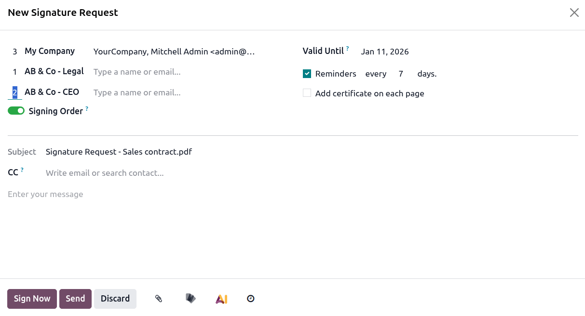
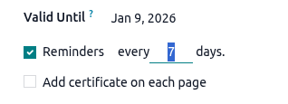

===================
Request a signature
===================

When you need to request a signature from one or more signers on a single document or :ref:`document
envelope <sign/prepare-document/create-envelope>`, you can initiate a signature request:

- :ref:`from the Sign app <sign/request-signatures/sign-app>`
- :ref:`from an Odoo record <sign/request-signatures/odoo-record>`

In both cases, you can upload one-off documents or :ref:`use templates
<sign/request-signatures/template>` for documents or document envelopes that are used regularly.

Once a document or document envelope has been fully signed, the signed document and the
:ref:`certificate of completion <sign/security/certificate-of-completion>` is sent to you, and to
any contacts added in :guilabel:`CC` when you configured the signature request, via email.

All signature requests that have been sent and completed :ref:`are visible, and can be managed
<sign/request-signatures/manage>`, in :menuselection:`Sign --> Documents --> All Documents`.

.. _sign/request-signatures/sign-app:

From the Sign app
=================

.. _sign/request-signatures/one-off:

One-off documents
-----------------

To request the signature of a one-off `.pdf` document or document envelope:

#. From :menuselection:`Documents --> My Documents` or :menuselection:`--> All Documents`, click
   :guilabel:`Upload PDF` then select and open the relevant `.pdf` document(s). Alternatively,
   :ref:`import a document <sign/request-signatures/import-documents>` from the Documents app.
#. :ref:`Prepare the document(s) for signing <sign/prepare-document>` by adding the relevant
   fields and additional signers and/or documents, if relevant.
#. Click :guilabel:`Send`.
#. Complete the relevant fields of the :ref:`New Signature Request
   <sign/configure-signature-request>` window.
#. If you are:

   - one of the signers and are ready to sign the document directly, click :guilabel:`Sign Now`,
     complete and sign the document, then click :guilabel:`Validate & Send Completed Document`.
   - not one of the signers or a signing order has been defined and you need to sign the document
     *after* other signers, click :guilabel:`Send`.

.. _sign/request-signatures/template:

Using templates
---------------

When using a :ref:`template of a document or document envelope
<sign/request-signatures/create-manage-templates>`, it is possible to:

- send a signature request to one or more specific signers; or
- for a document or document envelope with *only one signer*, copy a link that can be shared outside
  the Sign app. This option is useful when you need to have multiple individuals sign a copy of a
  document that requires a single signature, e.g., a non-disclosure agreement.

.. note::
   Each time a template is used to send a signature request, and each time a recipient of a link
   signs a document, a new document is created within Odoo Sign.

To request the signature of one or more specific signers on the same templated document:

#. Click :menuselection:`Templates` to see all existing templates.
#. From the kanban or list view, click :guilabel:`Send` on the line of the relevant template.
   Alternatively, from the kanban view, click on a template to open it, then click :guilabel:`Send`.
#. Complete the relevant fields of the :ref:`New Signature Request
   <sign/configure-signature-request>`.
#. If you are:

   - one of the signers and are ready to sign the document directly, click :guilabel:`Sign Now`,
     complete and sign the document, then click :guilabel:`Validate & Send Completed Document`.
   - not one of the signers or a signing order has been defined and you need to sign the document
     *after* other signers, click :guilabel:`Send`.

To copy a link to a templated document or document envelope:

#. Click :menuselection:`Templates` to see all existing templates.
#. From the kanban or list view, click :guilabel:`Share`. Alternatively, from the kanban view, click
   on a template to open it, then click :guilabel:`Share`.
#. Optionally, update the :guilabel:`Valid Until` date if the signature request link should expire;
   leave this blank if the signature request does not expire.
#. Click :icon:`fa-clone` to copy the link to your clipboard.

.. tip::
   - After a link has been shared, a :guilabel:`Shared` tag appears on the card of the relevant
     template in the :menuselection:`Templates` kanban view.
   - To stop sharing a link, from the :menuselection:`Templates` kanban view, click the
     :icon:`fa-ellipsis-v` :guilabel:`(vertical ellipsis)` icon in the top-right corner of the card,
     then click :guilabel:`Stop sharing`.

.. _sign/request-signatures/import-documents:

Import a document from the Documents app
----------------------------------------

To import a `.pdf` document into the Sign app from the Documents app:

#. From :menuselection:`Sign --> Documents --> My Documents` or :menuselection:`--> All Documents`,
   or :menuselection:`Sign --> Templates`, click the :icon:`fa-cog` :guilabel:`(Actions)` icon
   beside the name of the view, then :menuselection:`Import from Documents`.

   .. image:: request_signatures/import-document.png
      :alt: Importing a document from the Documents app
      :scale: 80%

#. In the window that opens, select the document to import from the dropdown or click
   :guilabel:`Search more` to see a list of all `.pdf` documents in the Documents app.
#. Click :guilabel:`Import and Sign`.

.. _sign/request-signatures/odoo-record:

From an Odoo record
===================

To send a signature request from an Odoo record:

#. With the relevant record open, click the :icon:`fa-cog` :guilabel:`(Actions)` icon, then
   :icon:`fa-file-text` :guilabel:`Request Signature`.

   .. image:: request_signatures/request-record.png
      :alt: Request a signature from an Odoo record
      :scale: 80%

#. In the :guilabel:`New Signature Request` window:

   - to use a :ref:`template <sign/request-signatures/create-manage-templates>`, select the relevant
     :guilabel:`Template` from the dropdown; or
   - to upload a one-off document or documents, click :guilabel:`Upload PDF`, select the relevant
     `.pdf` document(s), then click :guilabel:`Open`.

     .. image:: request_signatures/template-record.png
        :alt: Selecting a template to request a signature
        :scale: 80%

   .. note::
      Templates linked to the current model can be selected, as well as templates that are not
      linked to any model; the latter are available in any model. A template can be linked
      to a model in the template's configuration settings when :ref:`creating or editing the
      template <sign/request-signatures/create-manage-templates>`.

#. If you are sending a one-off document or documents, :ref:`prepare the document(s) for signing
   <sign/prepare-document>`, then click :guilabel:`Send`.

#. Complete the relevant fields of the :ref:`New Signature Request
   <sign/configure-signature-request>` window.

   .. note::
      When sending a signature request from an Odoo record, the related customer (or the relevant
      party) is automatically added as a signer.

#. If you are:

   - one of the signers and are ready to sign the document directly, click :guilabel:`Sign Now`,
     complete and sign the document, then click :guilabel:`Validate & Send Completed Document`.
   - not one of the signers or a signing order has been defined and you need to sign the document
     *after* other signers, click :guilabel:`Send`.

.. note::
   Once a document or document envelope has been fully signed, the signed document(s) and the
   certificate of completion are also added to the record's chatter.

.. _sign/request-signatures/create-manage-templates:

Create and manage templates
===========================

When the same document or document envelope needs to be used regularly, using a template can save
time and streamline the workflow.

.. _sign/templates/create:

Create a template
-----------------

To create a template:

#. Go to :menuselection:`Sign --> Templates`.
#. Click :guilabel:`Upload PDF` then select and open the relevant `.pdf` document(s). Alternatively,
   :ref:`import a document <sign/request-signatures/import-documents>` from the Documents app.

Once you have created the template, you can start :ref:`editing it <sign/templates/edit>`.

.. _sign/templates/edit:

Edit a template
---------------

A template can be edited at any time, provided it has *not yet been used* to send a signature
request. To edit an existing template, go to :menuselection:`Sign --> Templates` and click on a
template to open it. Alternatively, click the :icon:`fa-ellipsis-v` :guilabel:`(vertical ellipsis)`
icon in the top-right corner, then :guilabel:`Edit`.

With the template open:

- :ref:`Prepare the document(s) for signing <sign/prepare-document>` by adding or editing fields,
  and, if relevant, adding or removing signers and/or documents.
- Optionally, :ref:`define or edit settings for specific signers
  <sign/prepare-document/signer-settings>`, such as requiring additional authentication, allowing a
  signer to delegate signing, or assigning a fixed signer.
- Optionally, define or edit general settings for the template by clicking the :icon:`fa-cog`
  :guilabel:`(cog)` icon beside the template name, then clicking :icon:`fa-cog`
  :menuselection:`Configuration`:

  - :guilabel:`Model`: Select the model the template is linked to.

    .. note::
       If no model is selected, the template can be used when :ref:`requesting a signature from a
       record <sign/request-signatures/odoo-record>` of *any* model. If a model is selected, the
       template can only be used in that model.

  - :guilabel:`Redirect Link`: Add a url to which the user is redirected after signing the
    the document, e.g., to a thank you page, or to your company's homepage.
  - :guilabel:`Documents folder`: Define in which folder in the Documents app the documents
    using this template should be saved once fully signed.
  - :guilabel:`Documents tags`: Determine which Documents-app tags should be assigned to documents
    using this template once fully signed.
  - :guilabel:`Authorized Users`: Determine which specific users are authorized to view and use
    this template.
  - :guilabel:`Valid for`: Set a default number of days after which signature requests using this
    template expire; enter `0` if signature requests should not expire.

    .. note::
       The validity date of a signature request can always be modifed when configuring the request.

  - In the :guilabel:`Communication` tab, type a default text that will be added when a signature
    request using this template is sent via email; the text can still be edited before sending.

    .. tip::
       Type `/` to open the :ref:`powerbox <essentials/html_editor/commands>`, then use commands to
       insert headings, bulleted lists, documents, images, etc.

  If :guilabel:`Manage template access` is enabled in :menuselection:`Sign --> Configuration -->
  Settings`, it is also possible to configure the following fields:

  - :guilabel:`Authorized Groups`: Define user groups whose members are authorized to view and use
    this template.
  - :guilabel:`Responsible` user: By default, this is set to the user who created the template, but
    a different user can be selected.

  .. tip::
     By default, the name of the template is the name of the document that was uploaded, or, in the
     case of a :ref:`document envelope <sign/prepare-document/create-envelope>`, the name of the
     first document uploaded. If desired, edit the name of the template in the template's
     :guilabel:`Configuration` settings.

  Click the name of the template in the breadcrumbs at the top left to return to the previous
  screen.

.. _sign/templates/manage:

Manage templates
----------------

Manage templates by going to :menuselection:`Sign --> Templates`. By default, templates are shown in
a kanban view, with cards shown horizontally.

.. tip::
   - Remove the :guilabel:`My Favorites` :ref:`filter <search/preconfigured-filters>` to view all
     document templates in the database.
   - A panel on the left side allows the view to be filtered by :ref:`tag
     <sign/configuration/tags>`, if the displayed templates have been assigned tags. Click the
     :icon:`oi-panel-right` icon to close or open the panel.

For each template, the following information is shown:

- the name of the template;
- the month and year in which the template was created;
- the avatar of the :guilabel:`Responsible` user for the template; this is by default the user who
  created the template, but this can be changed in the configuration settings of the template if
  :guilabel:`Manage template access` is enabled in :menuselection:`Sign --> Configuration -->
  Settings`;
- any tags assigned to the template;
- the number of documents created using the template for which a signature request is
  :guilabel:`In Progress`;
- the number of documents created using the template that have been fully :guilabel:`Signed`.

To mark a template as a favorite for quicker access, click the :icon:`fa-star` :guilabel:`(star)`
in front of the template name.

Hovering over the template's card reveals a :icon:`fa-ellipsis-v` :guilabel:`(vertical ellipsis)`
icon in the top-right corner. Click the icon to reveal the following options:

- :guilabel:`Edit` to :ref:`edit a template <sign/templates/edit>` that has *not yet been used* to
  send a signature request. Alternatively, click on a template to open it for editing.

  .. note::
     Once a signature request has been sent using a template, it is no longer possible to modify
     the template. The template can, however, be duplicated.

- :guilabel:`Duplicate` to make a copy of a template. The duplicated template can then be
  :ref:`edited <sign/templates/edit>` as needed.
- :guilabel:`Archive` to archive a template that is not currently needed.

  .. tip::
     Archived templates are removed from the main :menuselection:`Sign --> Templates` view but can
     be viewed using the :guilabel:`Archived` filter via the search bar.

- Select a :guilabel:`Color` to add a colored bar to the left side of a card to visually
  differentiate it.

.. _sign/prepare-document:

Prepare a document for signing
==============================

To prepare any document or document envelope for signing, :ref:`add the relevant fields
<sign/prepare-document/add-fields>` for each signer.

It is also possible to:

- :ref:`add additional documents <sign/prepare-document/create-envelope>`
- :ref:`configure and add signers <sign/prepare-document/signers>`
- :ref:`add tags <sign/prepare-document/add-tags>`

.. _sign/prepare-document/add-fields:

Add fields to a document
------------------------

To add a field to a document, drag it from the left panel and drop it in the appropriate place in
the document.

.. note::
   Various fields are available by default. These fields can be :ref:`edited and additional fields
   can be created <sign/fields/create-edit-fields>` if needed.

Once a field has been added, it is possible to:

- **Modify the attributes of the field**: Click on the field to open it, make the necessary changes,
  then click :guilabel:`Save`.

  Depending on the field and :ref:`field type <sign/fields/field-types>`, attributes that can be
  modified include:

  - the placeholder text, i.e., the temporary text the signer sees before starting to complete the
    field: enter the desired text in the :guilabel:`Placeholder` field.
  - whether or not a field is mandatory: uncheck :guilabel:`Mandatory field` to make a field
    optional;
  - whether or not a field that is :ref:`configured to be auto-completed
    <sign/fields/auto-fill>` is read-only: check :guilabel:`Read-only` to prevent the signer from
    editing the field;
  - the horizontal alignment of the text within the field: where this is available, select the
    desired alignment;
  - for a :guilabel:`Radio` button field, the number of options: hover over the :guilabel:`Options`
    value then use the :icon:`fa-caret-up` :guilabel:`(increase)` and :icon:`fa-caret-down`
    :guilabel:`(decrease)` icons to increase or decrease the number of :guilabel:`Options`. A
    minimum of two options is required;
  - for a selection field, the number and names of options: add each option on a new line in the
    text box, ensuring you have pressed `Enter` after each option. To delete options, remove the
    corresponding text from the text box.

  .. note::
     Any changes made to the attributes of a field from within a document apply *to the current
     document only*. To make permanent changes to the field, :ref:`edit the field
     <sign/fields/create-edit-fields>`.

- **Change the size of a field**: Hover over the bottom right of the field until the horizontal,
  vertical or diagonal double arrows appear, then drag the edge of the box until it reaches the
  desired size.

- **Remove a field**: Click on the field to open it then click :icon:`fa-trash` :guilabel:`(remove)`
  to remove the field from the document.

- **Change the position of a field**: Hover over the field until the :icon:`fa-hand-paper-o`
  :guilabel:`(hand)` icon appears, then click and drag the field to the desired position.

- **Duplicate a field**: Click on the field to open it then click :icon:`fa-clone`
  :guilabel:`(duplicate)` to create a copy of the field. Alternatively, use your regular keyboard
  shortcuts to copy and paste a field.

  .. tip::
     To reposition or duplicate multiple fields at once, select the fields by drawing a selection
     area around them with your mouse. Then:

     - to reposition the field, hover over one of the selected fields until the
       :icon:`fa-hand-paper-o` :guilabel:`(hand)` icon appears, then click and drag the fields to
       the desired position.
     - to copy and paste the fields, use your regular keyboard shortcut to copy the fields, place
       your cursor where you want to paste the fields, then use your regular keyboard shortcut to
       paste them.

.. _sign/prepare-document/create-envelope:

Create a document envelope
--------------------------

A document envelope allows you to upload multiple documents at once, or to add additional documents
after the initial upload, and send them for signing in a single signature request. It is also
possible to create a template of a document envelope.

To create a document envelope *during* the initial upload:

#. From :menuselection:`Sign --> Documents --> My Documents` or :menuselection:`Sign --> Templates`,
   click :guilabel:`Upload PDF`.
#. Select the relevant `.pdf` documents and click :guilabel:`Open`.

To add one or more documents *after* the initial upload:

#. With the initial document or document envelope open, click :guilabel:`Add` in the
   :guilabel:`Documents` section.
#. Select the relevant `.pdf` document(s) and click :guilabel:`Open`.

.. tip::
   To change the order in which documents are presented to the signer, click the
   :icon:`fa-ellipsis-v` :guilabel:`(vertical ellipsis)` icon beside the relevant document in the
   :guilabel:`Documents` section, then click :icon:`fa-arrow-up` :guilabel:`Move Up` or
   :icon:`fa-arrow-down` :guilabel:`Move Down` as appropriate. To remove a document from the
   envelope, click :icon:`fa-trash` :guilabel:`Delete`.

.. _sign/prepare-document/signers:

Add and configure signers
-------------------------

By default, a document or document envelope has one signer. Additional :ref:`signers can be added
<sign/prepare-document/add-signers>` and :ref:`advanced configuration can be defined
<sign/prepare-document/signer-settings>` for one or more signers.

.. _sign/prepare-document/add-signers:

Add signers
~~~~~~~~~~~

To add additional signers to a document or document envelope:

#. With the document or document envelope open, click :guilabel:`Add` in the :guilabel:`Signers`
   section.
#. Optionally, edit the name of the signer by hovering over the name, e.g., `Signer 2`, clicking the
   :icon:`fa-pencil` :guilabel:`(pencil)` icon, then typing the new name.

.. tip::
   - Each signer is assigned a unique color and all fields associated with a specific signer have
     the same background color.
   - When a document or document envelope has multiple signers, it is possible to :ref:`define the
     order <sign/configure-request/signing-order>` in which signers receive and sign when
     :ref:`configuring the signature request <sign/configure-signature-request>`.

.. _sign/prepare-document/signer-settings:

Signer settings
~~~~~~~~~~~~~~~

To define additional configuration for signers, click the :icon:`fa-ellipsis-v` :guilabel:`(vertical
ellipsis)` icon on the row of the signer.

For each signer, the following options are available:

- :guilabel:`Authentication`: Require the signer to :ref:`authenticate using a specific
  authentication method <sign/security/authentication>`.
- :guilabel:`Can delegate`: Enable this option to allow the signer to delegate signing to another
  person. The person to whom signing is delegated then signs the document in their own name.
- :guilabel:`Assign to`: Assign a specific contact as signer by selecting them from the dropdown.

.. _sign/prepare-document/add-tags:

Add tags
--------

To add :ref:`tags <sign/configuration/tags>` to a document or document envelope *before sending a
signature request*, select the relevant tags from the :guilabel:`Tags` dropdown in the upper-right
corner above the document.

Tags can also be added to, or removed from, a document :ref:`after a signature request has been sent
<sign/request-signatures/manage-update-tags>`.

.. _sign/configure-signature-request:

Configure the signature request
===============================

After preparing a one-off document or document envelope for signing and clicking :guilabel:`Send`,
or selecting a template and clicking :guilabel:`Send`, the :guilabel:`New Signature Request` window
appears.

For each signer, select a contact or type an email address. Optionally, enable :ref:`Signing Order
<sign/configure-request/signing-order>` to control the order in which the document or document
envelope is signed.

It is also possible to:

- :ref:`set a Valid Until date <sign/configure-request/validity>` after which the signature request
  expires
- :ref:`set Reminders <sign/configure-request/validity>` at fixed intervals
- enable :guilabel:`Add certificate on each page` to add the reference of the :ref:`certificate of
  completion <sign/security/certificate-of-completion>` to each page of the document(s)
- have one or more parties notified when the document is fully signed by adding the relevant
  contact(s) or email address(es) in the :guilabel:`CC` field

- add a message to the signature request email

  .. tip::
     When :ref:`creating a template <sign/request-signatures/create-manage-templates>`, it is
     possible to define a default message to be added to the signature request; this can still be
     edited before sending.

- add attachments to the signature request via the :icon:`fa-paperclip` :guilabel:`(paperclip)` icon
  at the bottom of the window, or, to add an attachment saved in the Documents app, click the
  Documents app icon
- schedule the sending of the signature request via the :icon:`fa-clock-o` :guilabel:`(clock)` icon

.. _sign/configure-request/signing-order:

Signing order
-------------

When a document or document envelope needs to be signed by multiple parties, and then the order of
signing is important, it is possible to define the :guilabel:`Signing order` when configuring the
signature request. This controls the order in which your recipients receive the document(s) for
signature.

To define a signing order:

#. In the :guilabel:`New Signature Request` window, enable :guilabel:`Specify Signing Order`.
#. Change the order by editing the number beside each signer, e.g., changing a `3` to a `2` in the
   first column.

The signer indicated in position `1` receives the signature request first, and each recipient
receives the request only once the previous recipient has singed the document.

.. _sign/configure-request/validity:

Validity dates and reminders
----------------------------

For documents that need to be signed withing a certain timeframe, you can indicate the last possible
signing date using the :guilabel:`Valid Until` field when configuring the signature request. After
this date, the document is no longer accessible via the link in the signature request email.

If the signature request does not expire, leave this field blank.

  .. tip::
     When using a :ref:`template <sign/request-signatures/create-manage-templates>` for which a
     default validity period has been defined, the :guilabel:`Valid Until` date is updated
     automatically; this date can be changed when configuring the signature request if desired.

To set automatic reminders, enable :guilabel:`Reminders`, then define the interval, in days, at
which reminders should be sent until the document has been fully signed by the signer.

.. _sign/request-signatures/manage:

Manage signature requests and signed documents
==============================================

All signature requests that have been sent are visible in :menuselection:`Sign --> Documents --> All
Documents`. The :icon:`oi-view-list` :guilabel:`(List)` view and :icon:`oi-view-kanban`
:guilabel:`(Kanban)` view offer different possiblities:

In the :icon:`oi-view-list` :guilabel:`List` view:

- see the overall :guilabel:`Status` of the signature request, e.g., :guilabel:`To Sign`,
  :guilabel:`Signed`, :guilabel:`Cancelled`
- :icon:`fa-refresh` :guilabel:`Resend` a signature request manually
- :icon:`fa-pencil-square-o` :guilabel:`Sign` a document or document envelope
- :icon:`fa-download` :guilabel:`Download` the fully signed document(s)
- for a cancelled signature request, click :icon:`fa-info` :guilabel:`Details` to see the details of
  the cancelled request

.. tip::
   Click the :icon:`oi-settings-adjust` :guilabel:`(slider)` icon in the upper-right corner to see
   more information for each request, such as each document included, tags, and, in the case of
   documents sent using a template, the model the template is linked to.

In the :icon:`oi-view-kanban` :guilabel:`(Kanban)` view:

- see the status of individual signers, per signature request:

  - when a signer has fully signed the document(s), the checkbox is ticked, the signers name appears
    in green, and the date of the signature is added after the name
  - when a signature request is cancelled, the signers name appears in red :icon:`fa-times` with a
    cross :guilabel:`(cross)` beside it, followed by the date on which the signature request was
    cancelled
- see any tags added to the document(s)
- click the :icon:`fa-clock-o` :guilabel:`(clock)` icon to schedule an activity related to the
  signature request
- click the :icon:`fa-ellipsis-v` :guilabel:`(vertical ellipsis)` icon in the top-right of the card
  to reveal more options:

  - see the :guilabel:`Details` of the signature request, including the expiry date, if relevant,
    whether or not reminders have been set, activity logs, and more
  - :guilabel:`Cancel` a signature request that *has not been* fully signed
  - :guilabel:`Archive` a signature request
  - select a color dot to add a a colored bar to the left side of a card to visually differentiate
    it

    .. image:: request_signatures/signature-status.png
       :alt: Options available in the kanban view for sent signature requests
       :scale: 80%

.. _sign/request-signatures/manage-update-tags:

Update the tags of a sent or signed document
--------------------------------------------

To add tags to, or remove tags from, a document or document envelope for which a signature request
has already been sent:

#. Go to :menuselection:`Sign --> Documents --> All Documents`, then switch to the
   :icon:`oi-view-kanban` :guilabel:`(Kanban)` view.
#. Hover over the relevant card, click the :icon:`fa-ellipsis-v` :guilabel:`(vertical ellipsis)` in
   the top-right corner of the card, then click :guilabel:`Details`.
#. Beside the :guilabel:`Tags` field, add new tags by selecting them from the dropdown or delete
   tags by clicking the :icon:`fa-times` :guilabel:`(cross)` on the tag.
