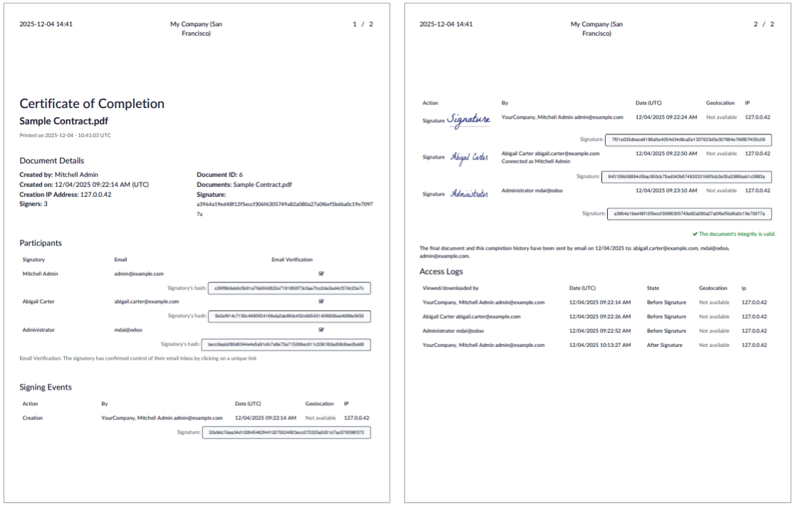

===========================
Security and authentication
===========================

Various security features are integrated into Odoo Sign by default, such as:

- :ref:`email verification <sign/security/authentication>`, whereby the signer receives a unique
  link to the document or :ref:`envelope of multiple documents
  <sign/prepare-document/create-envelope>` via an email sent directly to their email address
- a :ref:`signatory hash <sign/security/hash>` that links the signer's identity to the exact content
  of the document at the moment of signing
- a :ref:`certificate of completion <sign/security/certificate-of-completion>` that provides
  details of the signing process

Additional security can be ensured by:

- requiring other methods of :ref:`secured identification <sign/security/authentication>`, such as
  SMS, Aadhaar eSign (India) or itsme® (European Union, United Kingdom, Norway and Iceland)
- using a :ref:`cryptographic signature <sign/security/cryptographic>` by means of a digital
  certificate issued by a Certificate Authority (CA) or generated yourself

.. _sign/security/hash:

Signatory hash
==============

When someone signs a document, a *hash*, i.e., a unique digital signature of the operation, is
generated to link the signer's identity to the exact content of the document at the moment of
signing. This process guarantees that any changes made after a signature has been added can be
easily detected, maintaining the document's authenticity and integrity throughout its lifecycle.

A visual security frame displaying the beginning of the hash is added to signatures and initials.

.. image:: security_authentication/hash-frame.png
   :alt: Adding the visual security frame to a signature.
   :scale: 80%

.. tip::
   Internal users can hide or show it by turning the :guilabel:`Frame` option on or off when
   :ref:`adding their signature or initials to the document
   <sign/sign-document/initials-signature>`.

The signatory hash of each signer is provided on the :ref:`certificate of completion
<sign/security/certificate-of-completion>` that is generated when a document is fully signed.

.. _sign/security/certificate-of-completion:

Certificate of completion
=========================

Each time a document or document envelope is fully signed, i.e., completed and signed by all
signers, a certificate of completion is generated and sent to all signers via email, along with the
fully signed document(s).

.. note::
   When documents are :doc:`signed via an Odoo record's chatter <sign_document>`, or when a
   signature request initiated from an Odoo record is fully completed (whether a :ref:`one-off
   document <sign/request-signatures/one-off-record>` or :ref:`using a template
   <sign/templates/use-odoo-record>`), the certificate of completion is also added to the chatter,
   along with the fully signed document(s).

This certificate contains details of the signing process that support the validity of the signatures
and provide proof that the document has not been altered after signing.

The following information is provided:

- :guilabel:`Document Details`, which include when the signature request was created and by who,
  the file name of the `.pdf` document or documents that were signed, the number of signers, and a
  unique reference hash that can optionally be added to each page of a signed document.
- A list of :guilabel:`Participants` who have signed the document, including the verification method
  and a unique :ref:`signatory hash <sign/security/hash>` that ensures traceability and integrity.
- Timestamped, IP, and geographically traceable records of :guilabel:`Signing Events` and
  :guilabel:`Access Logs`.

As well as being sent via email, a signed document's certificate of completion can be downloaded at
any time via the Sign app:

#. Go to :menuselection:`Sign --> All Documents` and switch to the Kanban view.
#. Click the :icon:`fa-ellipsis-v` :guilabel:`(vertical ellipsis)` icon in the top-right of the card
   of a document, then click :guilabel:`Details`.
#. Click :guilabel:`Download` then :guilabel:`Certificate`.

.. _sign/security/authentication:

Secured identification
======================

When a signature request is sent via email, the signer accesses the document by clicking on a unique
link contained in the email. This default verification step serves as confirmation that the signer
controls the email address associated with the signature request.

It is also possible to require additional authentication for one or more signers via one of the
following methods:

- :ref:`Unique Code via SMS <sign/security/authentication-sms>`
- :ref:`Via Aadhar eSign <sign/security/authentication-aadhaar>` (available in India)
- :ref:`Via itsme® <sign/security/authentication-itsme>` (available in the European Union, the
  United Kingdom, Norway and Iceland)

.. important::
   These authentication methods require :ref:`buying credits <in_app_purchase/credits>`. If you do
   not have any credits left, authentication is skipped.

.. seealso::
   - :doc:`In-App Purchase (IAP) <../../essentials/in_app_purchase>`
   - :doc:`SMS pricing and FAQ <../../marketing/sms_marketing/pricing_and_faq>`

.. _sign/security/authentication-sms:

Unique code via SMS
-------------------

With authentication via SMS, signers receives a one-time code by SMS, which they enter when
prompted during the signing process to identify themselves.

This feature is enabled by default in Sign's :ref:`general settings <sign/configuration/settings>`.

.. note::
   Before being able to send SMS messages, you need to register your mobile phone number. To do so,
   go to :menuselection:`Sign --> Configuration --> Settings` and, under :guilabel:`Authenticate by
   SMS`, click :guilabel:`Manage Service & Buy Credits`. On the next screen, click
   :icon:`fa-arrow-right` :guilabel:`Register` then proceed to register your phone number.

To require signer authentication via SMS:

#. With the document or document envelope open, in the left panel, click the :icon:`fa-ellipsis-v`
   :guilabel:`(vertical ellipsis)` icon next to the relevant signer, then click :guilabel:`Edit`.
#. In the pop-up, select :guilabel:`Unique Code via SMS` as :guilabel:`Authentication`.
#. Click :guilabel:`Save`.

Upon signing the document, an extra :guilabel:`Final Validation` window is displayed where the
signer enters first their phone number, then the one-time code received.

.. image:: security_authentication/sms-verification.png
   :alt: Pop-up where signer enters phone number and one-time code

.. _sign/security/authentication-aadhaar:

Aadhaar eSign
-------------

Aadhaar eSign allows signers in **India** to digitally sign documents using their Aadhaar number and
OTP (One Time Password) verification. This provides a secure and legally valid way to complete
signatures directly within Odoo Sign.

.. important::
   In Odoo Sign, Aadhaar eSign can only be used for signature requests containing a single document.
   Additionally, only one signer per document can be required to authenticate via Aadhaar eSign, and
   this party must be the last party to sign the document.

   This method is therefore most suitable for a single document with a single signer, or where the
   first signer is the party sending the signature request.

To enable authentication with Aadhaar eSign, go to :menuselection:`Sign --> Configuration -->
Settings`, then enable :guilabel:`Sign with Aadhar eSign`.

To require signer authentication via Aadhaar eSign:

#. With the document or document envelope open, in the left panel, click the :icon:`fa-ellipsis-v`
   :guilabel:`(vertical ellipsis)` icon next to the relevant signer.
#. In the pop-up, select :guilabel:`Via Aadhaar eSign` under :guilabel:`Authentication`.
#. Click :guilabel:`Save`.

Upon signing the document, an extra :guilabel:`Final verification` page is displayed where
authentication via Aadhaar is required.

.. note::
   The digital certification from eMudhra is available in the downloaded document.

.. _sign/security/authentication-itsme:

Itsme®
------

Itsme® authentication allows signers in **the European Union**, **the United Kingdom**, **Iceland**
and **Norway** to prove their identity.

To enable authentication with itsme®, go to :menuselection:`Sign --> Configuration
--> Settings`, then enable :guilabel:`Identify with itsme®`.

To require signer authentication via itsme®:

#. With the document or document envelope open, in the left panel, click the :icon:`fa-ellipsis-v`
   :guilabel:`(vertical ellipsis)` icon next to the relevant signer.
#. In the pop-up, select :guilabel:`Via itsme®` under :guilabel:`Authentication`.
#. Click :guilabel:`Save`.

Upon signing the document, an extra :guilabel:`Final verification` page is displayed where
authentication via itsme® is required.

.. _sign/security/cryptographic:

Cryptographic signature
=======================

Odoo Sign allows you to use your own digital certificate to sign documents. A digital certificate
uses cryptography, which relies on secure mathematical algorithms, to ensure a signed document's
authenticity and integrity.

Authenticity is ensured as your verified identity is linked to the signature, while integrity is
ensured as the document cannot be altered without invalidating, or 'breaking', the cryptographic
signature.

A digital certificate is stored in a file such a `.p12` or `.pfx` file. This is a secure container
that contains:

- a *private key* that applies a unique cryptographic signature to a document; and
- identifying information about the signer and a *public key* that is shared with the recipient for
  signature validation

The file is always protected by a password, which is never stored in plain text. Odoo uses this
password to decrypt the private key at the moment a document is signed.

.. _sign/security/cryptographic-obtain-create:

Obtain or create a digital certificate
--------------------------------------

Most businesses obtain their digital certificate from a trusted Certificate Authority (CA). In many
cases, the :abbr:`CA (Certificate Authority)` provides the `.p12` or `.pfx` file directly, along
with its password.

It is also possible to generate a certificate yourself. `Adobe Acrobat
<https://helpx.adobe.com/be_en/acrobat/desktop/protect-documents/manage-digital-ids/create-self-signed-id.html>`_
and `Microsoft <https://support.microsoft.com/en-us/office/obtain-a-digital-certificate-and-create-a-digital-signature-e3d9d813-3305-4164-a820-2e063d86e512>`_,
for example, allow the creation of digital certificates.

.. note::
   Self-generated digital certificates do not provide the same level of trust as a certificate
   obtained from a trusted :abbr:`CA (Certificate Authority)`. However, they can be useful if you
   need to provide a digital signature urgently or for less official situations.

Once you have obtained or created a digital certificate, you can then :ref:`upload it to your Odoo
database <sign/security/cryptographic-upload>`.

.. _sign/security/cryptographic-upload:

Upload a digital certificate in Odoo
------------------------------------

To upload a digital certificate in Odoo:

#. Go to :menuselection:`Sign --> Configuration --> Settings`.
#. Under :guilabel:`Cryptographic signature`, click the :guilabel:`Signing certificate` dropdown and
   click :guilabel:`Create`.
#. In the pop-up, complete the relevant fields:

   - :guilabel:`Name`: Enter a name for the certificate.
   - :guilabel:`Certificate`: Click :guilabel:`Upload your file`, then select the relevant
     certificate file in `.p12` or `.pfx` format.
   - :guilabel:`Certificate Password`: Enter the certificate password for the uploaded file; it must
     be minimum six characters. This password is used to decrypt the private key during the signing
     process.

#. Click :guilabel:`Save`.

.. note::
   - After the certificate has been uploaded, two read-only fields are auto-completed: the
     :guilabel:`Validity` date, i.e., the date on which it starts to be valid, and the
     :guilabel:`Serial number` that will be added to signed documents.
   - In a multi-company environment, one certificate can be uploaded per company.
