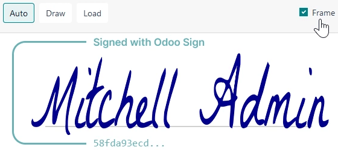
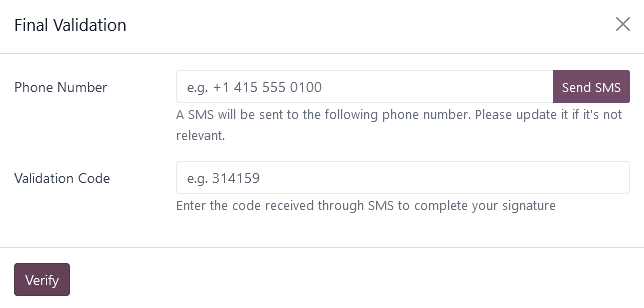

===========================
Security and authentication
===========================

.. _sign/security/hash:

Signatory hash
--------------

Each time someone signs a document, a *hash*, i.e., a unique digital signature of the operation, is
generated to ensure traceability and integrity. This process guarantees that any changes made after
a signature has been added can be easily detected, maintaining the document's authenticity and
security throughout its lifecycle.

A visual security frame displaying the beginning of the hash is added to the signatures. Internal
users can hide or show it by turning the :guilabel:`Frame` option on or off when signing the
document.

.. _sign/security/authentication:

Secured identification
----------------------

As the owner of a document, when :ref:`configuring signers
<sign/prepare-document/signer-settings>`, you can request :guilabel:`Authentication` through one
of the following methods:

- :ref:`Unique Code via SMS <sign/security/authentication-sms>`
- :ref:`Via Aadhar eSign <sign/security/authentication-aadhaar>` (available in India)
- :ref:`Via itsme® <sign/security/authentication-itsme>` (available in Belgium and the Netherlands)

.. important::
   These authentication methods require :ref:`buying credits <in_app_purchase/credits>`. If you do
   not have any credits left, authentication is skipped.

.. seealso::
   - :doc:`In-App Purchase (IAP) <../../essentials/in_app_purchase>`
   - :doc:`SMS pricing and FAQ <../../marketing/sms_marketing/pricing_and_faq>`

.. _sign/security/authentication-sms:

Unique code via SMS
~~~~~~~~~~~~~~~~~~~

With authentication via SMS, signers receives a one-time code by SMS, which they enter when
prompted during the signing process to identify themselves.

This feature is enabled by default in :ref:`Sign's general settings <sign/configuration/settings>`.

.. note::
   Before being able to send SMS messages, you need to register your mobile phone number. To do so,
   go to :menuselection:`Sign --> Configuration --> Settings` and, under :guilabel:`Authenticate by
   SMS`, click :guilabel:`Manage Service & Buy Credits`. On the next screen, click
   :icon:`fa-arrow-right` :guilabel:`Register` then proceed to register your phone number.

To request signer authentication via SMS:

#. With the document or document envelope open, in the left panel, click the :icon:`fa-ellipsis-v`
   :guilabel:`(vertical ellipsis)` icon next to the relevant signer.
#. In the pop-up, select :guilabel:`Unique Code via SMS` as :guilabel:`Authentication`.
#. Click :guilabel:`Save`.

Upon signing the document, an extra :guilabel:`Final Validation` window is displayed where the
signer enters first their phone number, then the one-time code received.

.. _sign/security/authentication-aadhaar:

Aadhaar eSign
~~~~~~~~~~~~~

Aadhaar eSign allows signers in **India** to digitally sign documents using their Aadhaar number and
OTP (One Time Password) verification. This provides a secure and legally valid way to complete
signatures directly within Odoo Sign.

To enable authentication with Aadhaar eSign, go to :menuselection:`Sign --> Configuration -->
Settings`, then enable :guilabel:`Sign with Aadhar eSign`.

To request signer authentication via Aadhaar eSign:

#. With the document or document envelope open, in the left panel, click the :icon:`fa-ellipsis-v`
   :guilabel:`(vertical ellipsis)` icon next to the relevant signer.
#. In the pop-up, select :guilabel:`Via Aadhaar eSign` under :guilabel:`Authentication`.
#. Click :guilabel:`Save`.

Upon signing the document, an extra :guilabel:`Final verification` page is displayed where
authentication via Aadhaar is required.

.. note::
   The digital certification from eMudhra is available in the downloaded document.

.. _sign/security/authentication-itsme:

Itsme®
~~~~~~

Itsme® authentication can be used to allow signers to prove their identity using itsme®. This
feature is only available in **Belgium** and **the Netherlands**.

To enable authentication with itsme®, go to :menuselection:`Sign --> Configuration
--> Settings`, then enable :guilabel:`Identify with itsme®`.

To request signer authentication via itsme®:

#. With the document or document envelope open, in the left panel, click the :icon:`fa-ellipsis-v`
   :guilabel:`(vertical ellipsis)` icon next to the relevant signer.
#. In the pop-up, select :guilabel:`Via Aadhaar eSign` under :guilabel:`Authentication`.
#. Click :guilabel:`Save`.

Upon signing the document, an extra :guilabel:`Final verification` page is displayed where
authentication via itsme® is required.

.. _sign/security/authentication-certificate:

Cryptographic signature
-----------------------

Odoo Sign supports the use of personal digital signing certificates for signer authentication. This
process employs cryptography to securely link your verified identity to the document and guarantee
that the document has not been altered since signing.

To create a signing certificate:

#. Go to :menuselection:`Sign --> Configuration --> Settings`.
#. Under :guilabel:`Cryptographic signature` click the :guilabel:`Signing certificate` dropdown and
   click :guilabel:`Create`.
#. In the pop-up, complete the relevant fields:

   - :guilabel:`Name`: Enter a name for the certificate.
   - :guilabel:`Certificate`: Click :guilabel:`Upload your file`, then select the relevant
     certificate file in `.pfx` or `.p12` format.

     .. tip::
       After the certificate has been uploaded, two read-only fields are auto-completed: the
       :guilabel:`Validity` date, i.e., the date on which is starts to be valid, and the
       :guilabel:`Serial number` that will be added to signed documents.

   - :guilabel:`Certificate Password`: Enter the certificate password for the uploaded file. This
     password is entered to decrypt the private key during the signing process.

#. Click :guilabel:`Save`.
