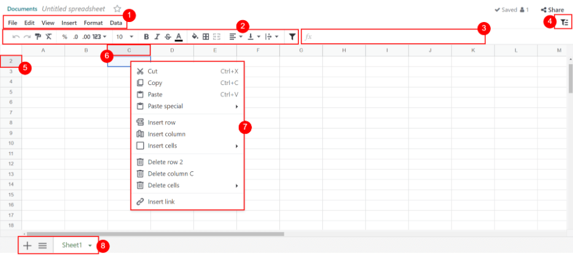

:show-content:
:hide-page-toc:

===========
Spreadsheet
===========

.. toctree::
   :titlesonly:

   spreadsheet/insert
   spreadsheet/functions
   spreadsheet/templates
   spreadsheet/global_filters

Spreadsheet lets you organize, analyze, and visualize your data in tabular form. Among others, you
can:

- :doc:`Insert and link your Odoo data (pivots, graphs, lists, and menus) <spreadsheet/insert>`.
- :doc:`Use global filters <spreadsheet/global_filters>`.
- :doc:`Use formulas and functions <spreadsheet/functions>`.
- :doc:`Use default templates or create new ones <spreadsheet/templates>`.
- Format data.
- Sort and filter data.

.. _spreadsheet/glossary:

Glossary
========

Some of Spreadsheet's main :abbr:`UI (user interface)` elements are highlighted and defined below.

#. Menu bar
#. Top bar
#. Formula bar
#. Filters button
#. Row header
#. Column header
#. Cell menu
#. Bottom bar
