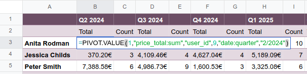
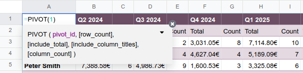

====================
Dynamic pivot tables
====================

.. role:: raw-html(raw)
   :format: html

.. |formula| replace:: :raw-html:`<svg xmlns="http://www.w3.org/2000/svg" width="20" height="20" viewBox="0 0 121.83 122.88" style="enable-background:new 0 0 121.83 122.88" xml:space="preserve"><g><path d="M27.61,34.37l-4.07,4.6l0.4,1.74h10.48c-2.14,12.38-3.74,23.54-6.81,40.74c-3.67,21.94-5.78,27.33-7.03,29.3 c-1.1,1.95-2.68,2.96-4.82,2.96c-2.35,0-6.6-1.86-8.88-3.97c-0.82-0.56-1.79-0.42-2.82,0.26C2,111.74,0,114.42,0,116.82 c-0.12,3.24,4.21,6.06,8.34,6.06c3.64,0,9-2.28,14.64-7.64c7.71-7.31,13.48-17.34,18.3-39.02c3.1-13.84,4.56-22.84,6.74-35.5 l13.02-1.18l2.82-5.17H49.2C52.99,10.53,55.95,7,59.59,7c2.42,0,5.24,1.86,8.48,5.52c0.96,1.32,2.4,1.18,3.5,0.28 c1.85-1.1,4.13-3.92,4.28-6.48C75.96,3.5,72.6,0,66.82,0C61.58,0,53.55,3.5,46.8,10.38c-5.92,6.27-9.02,14.1-11.16,23.99H27.61 L27.61,34.37z M69.27,50.33c4.04-5.38,6.46-7.17,7.71-7.17c1.29,0,2.32,1.27,4.53,8.41l3.78,12.19 c-7.31,11.18-12.66,17.41-15.91,17.41c-1.08,0-2.17-0.34-2.94-1.1c-0.76-0.76-1.6-1.39-2.42-1.39c-2.68,0-6,3.25-6.06,7.28 c-0.06,4.11,2.82,7.05,6.6,7.05c6.49,0,11.98-6.37,22.58-23.26l3.1,10.45c2.66,8.98,5.78,12.81,9.68,12.81 c4.82,0,11.3-4.11,18.37-15.22l-2.96-3.38c-4.25,5.12-7.07,7.52-8.74,7.52c-1.86,0-3.49-2.84-5.64-9.82l-4.53-14.73 c2.68-3.95,5.32-7.27,7.64-9.92c2.76-3.15,4.89-4.49,6.34-4.49c1.22,0,2.28,0.52,2.94,1.25c0.87,0.96,1.39,1.41,2.42,1.41 c2.33,0,5.93-2.96,6.06-6.88c0.12-3.64-2.14-6.74-6.06-6.74c-5.92,0-11.14,5.1-21.19,20.04l-2.07-6.41 c-2.9-9-4.82-13.63-8.86-13.63c-4.7,0-11.16,5.78-17.48,14.94L69.27,50.33L69.27,50.33z"/></g></svg>`

When a pivot view from an Odoo database is inserted in a spreadsheet, it is by default a static
pivot table. Each cell in a static pivot table contains an :ref:`Odoo-specific function
<insert/pivot-table/functions-static>` that retrieves data from your database.

When the corresponding data in your database changes, e.g., the sales related to a given quarter or
an individual salesperson, the cells of your static pivot table are updated.

However, a static pivot table does not expand automatically to accommodate new data, e.g., sales
data for a new quarter or for a newly hired salesperson. Neither is it possible to add or manipulate
dimensions (i.e., columns or rows) or measures via the pivot table properties.

.. note::
   If you attempt to update or manipulate the properties of a pivot table that has just been
   inserted into a spreadsheet, an error message appears in the top right corner of the screen:

   .. image:: dynamic_pivot_tables/pivot-table-error.png
      :alt: Error message when trying to manipulate static pivot table

To have more flexibility in how you can manipulate your pivot table, you can :ref:`create a dynamic
pivot table <dynamic_pivot_tables/create>` from a static pivot table.

.. _dynamic_pivot_tables/create:

Create a dynamic pivot table
============================

There are two main ways to create a dynamic pivot table from a static pivot table:

- **Duplicate the static pivot table from the pivot table properties**: :ref:`Open the pivot table
  properties <insert/pivot-table/properties>`, click the :icon:`fa-cog` (cog) icon at the top right
  of the pane, then click :icon:`fa-copy` :guilabel:`Duplicate`.

  A new data source is created and a dynamic version of the pivot table is inserted in a new sheet.
  The styling of the original pivot table is maintained.

  .. note::
     When you use this method, your new dynamic pivot table gets the next available pivot ID. This
     means you can create multiple pivot views that are associated with the same model, but that can
     have distinct settings, groupings or calculations.

- **Re-insert the dynamic pivot table from the Data menu**: On the sheet that contains your static
  pivot, position your cursor in an empty cell. Click :menuselection:`Data --> Re-insert dynamic
  pivot` from the menu bar then select the relevant pivot table. A new pivot table appears with the
  same styling as the static pivot.

  .. note::
     When you use this method, both your static and dynamic pivot have the same pivot ID. To avoid
     confusion, delete the original static pivot table.

.. tip::
   It is also possible to directly enter the :ref:`function <dynamic_pivot_tables/functions>` of the
   dynamic pivot table in an empty cell. However, with this method, the table styling needs to be
   re-applied manually.

.. _dynamic_pivot_tables/functions:

Dynamic pivot table functions
-----------------------------

Instead of each cell containing a unique function that retrives data from your database, as in a
:ref:`static pivot table <insert/pivot-table/functions-static>`, a dynamic pivot table has one
unique function:

.. code-block:: text

   =PIVOT( pivot_id, [row_count], [include_total], [include_column_titles], [column_count] )

The arguments of the function are as follows:

- `pivot_id`: the id assigned when the pivot table is inserted. The first pivot table
  inserted in a spreadsheet is assigned pivot id 1, the second, pivot id 2, etc.
- `row_count` and `column count`: the number of rows and columns respectively.
- `include_total` and `include_column_titles`: values of `0` remove the total and column
  titles respectively.

This is an array function, which allows the pivot table to expand automatically to accommodate the
results of the function.

The top-left cell contains the editable function, while clicking on any other cell reveals this
formula greyed out.

.. tip::
   If necessary, you can update the function of a dynamic pivot table, via the top-left cell, to
   remove elements like the total or column titles.

   With the function open in the formula bar or the top-left cell, position your cursor after the
   pivot ID then type `,` to advance to the optional field you want to modify and update as needed.
   For example, adding the value `0` for `[include_total]` removes the totals row and column from
   the pivot table.

.. _dynamic_pivot_tables/manipulate:

Manipulate a dynamic pivot table
================================

To manipulate data in a dynamic pivot table, :ref:`open the pivot table properties
<insert/pivot-table/properties>`.

The following options are available by clicking the :icon:`fa-cog` icon:

- :icon:`fa-exchange` :guilabel:`Flip axes`: to move the dimensions represented in columns to rows
  and vice versa.

  .. tip::
     Flipping the axes presents the data from a different perspective, possibly bringing new
     insights. However, depending on the volume of data, it can result in #SPILL errors. This
     happens when a formula tries to output a range of values, but something is blocking those
     cells, such as other data, merged cells, or the boundaries of the current sheet.

     Hovering over the cell containing :guilabel:`#SPILL` details the error.

- :icon:`fa-copy` :guilabel:`Duplicate`: to duplicate the dynamic pivot table and create a new data
  source with distinct properties.
- :icon:`fa-trash` :guilabel:`Delete`: to delete the data source of the dynamic pivot table.

  .. note::
     Deleting the data source of a pivot table does not delete the visual representation of the
     data. Delete the table from the spreadsheet using your preferred means.

.. _dynamic_pivot_tables/manipulate/dimensions:

Dimensions
----------

The dimensions of your pivot table, i.e., how you are categorizing or grouping your data, are
placed in :guilabel:`Columns` and :guilabel:`Rows` according to how they appeared in the
:guilabel:`Pivot` :icon:`oi-view-pivot` view in your database, i.e. before the pivot table was
inserted in the spreadsheet.

You can:

- :guilabel:`Add` new dimensions
- or :icon:`fa-trash` (delete) dimensions
- change the order in which dimensions are displayed in :guilabel:`Columns` or :guilabel:`Rows` by
  clicking then dragging the dimension to the desired position within its respective section
- change the axis on which a dimension is shown, e.g., move a dimension from :guilabel:`Columns`
  to :guilabel:`Rows`
- change how the data per column or row is ordered; the options are: :guilabel:`Ascending`,
  :guilabel:`Descending` and :guilabel:`Unsorted`
- for date- or time-based fields, select the desired granularity of the data from the options in the
  drop-down menu

.. _dynamic_pivot_tables/manipulate/measures:

Measures
--------

The measures of your pivot table, i.e., the data you are measuring, or analyzing, based on the
dimensions you have chosen, are listed in the order they appeared in the
:guilabel:`Pivot` :icon:`oi-view-pivot` view in your database. You can:

- :guilabel:`Add` new measures, including :ref:`calculated measures
  <dynamic_pivot_tables/manipulate/measures-calculated-measures>`
- :icon:`fa-eye` (hide), :icon:`fa-eye-slash` (show) or :icon:`fa-trash` (delete) existing measures
- edit the name of existing measures by clicking on the name
- change the order in which measures are displayed by clicking then dragging the measure
- change how measures are displayed by clicking :icon:`fa-cog` then selecting the desired option
  from the drop-down menu, e.g., :guilabel:`% of grand total` or :guilabel:`Rank smallest to
  largest`. The pivot table data updates dynamically as different options are selected.
- choose how measures are aggregated, e.g., by :guilabel:`Sum`, :guilabel:`Average`,
  :guilabel:`Minimum`

.. _dynamic_pivot_tables/manipulate/measures-calculated-measures:

Calculated measures
~~~~~~~~~~~~~~~~~~~

It is possible to add :ref:`calculated measures
<dynamic_pivot_tables/manipulate/measures-calculated-measures>` if such measures did not exist in
the original pivot view. For example, you could add a calculated measure to show the average revenue
per order, or the profit margin per product.

To add a calculated measure:

#. From the :guilabel:`Measures` section of the pivot table properties, click :guilabel:`Add`
#. Below the scrollable list, click |formula| :guilabel:`Add calculated measure`
#. Rename the calculated measure by clicking on the name and typing
#. Click on the line starting with :guilabel:`=` and enter the formula.

   .. example::
      In the below example, the average revenue per order is added by dividing the total sum of the
      sales per salesperson with the number of orders.

      .. image:: dynamic_pivot_tables/calculated-measure.png
         :alt: Formula for a calculated measure

#. Select how the measure should be aggregated.

.. tip::
   There are advantages to using a static pivot table, for example, being able to see and manipulate
   the formulas behind individual cells. To have this possibility, select the relevant portion of
   your dynamic pivot table, copy it, then paste it in an empty part of the sheet. Click on any
   pasted cell to see the Odoo formula used to retrieve the information.

