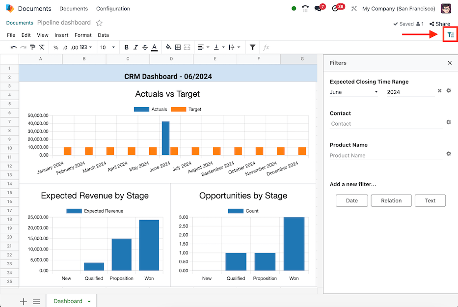

==============
Global filters
==============

.. role:: raw-html(raw)
   :format: html

.. |global-filter| replace:: :raw-html:`<svg xmlns="http://www.w3.org/2000/svg" width="20" height="20" viewbox="0 0 20 20"><path fill="currentColor" d="M1 3h12L7 9M5.5 6h3v11l-3-3M14 4h4v2h-4m-3 3h7v2h-7m0 3h7v2h-7"></path></svg>` :guilabel:`(global filter)`
.. |drag-handle| replace:: :raw-html:`<svg xmlns="http://www.w3.org/2000/svg" width="20" height="20" viewBox="0 0 4 16" fill="currentColor"><circle cx="2" cy="3.5" r="1"></circle><circle cx="2" cy="6.5" r="1"></circle><circle cx="2" cy="9.5" r="1"></circle><circle cx="2" cy="12.5" r="1"></circle></svg>` :guilabel:`(drag handle)`

Create dynamic views of :doc:`inserted data <insert>`, by mapping data source fields to *global
filters* in the Odoo **Spreadsheets** app.

.. note::
   The global filters are represented by the |global-filter| icon, and enable data that was inserted
   via a pivot table, list, or chart to be filtered. Global filters differ from the *sort and
   filter* feature for cell ranges represented by the :icon:`fa-filter` :guilabel:`(filter)` icon.

Add filters
===========

Navigate to the :menuselection:`Documents app` and click on the desired spreadsheet, then open the
|global-filter| filter menu.

Create a new filter by selecting one of the buttons under the :guilabel:`Add a new filter...`
section:

- :ref:`Date <spreadsheet/global-filter-date>`: filter dates by matching data source date fields to
  a time range (e.g., *Month / Quarter*, *Relative Period*, or *From / To*).
- :ref:`Relation <spreadsheet/global-filter-relation>`: filter records by matching data source
  fields to fields in a related model (e.g., *Lead/Opportunity*, *Sales Order*, or *Event
  Registration*).
- :ref:`Text <spreadsheet/global-filter-text>`: filter text by matching data source text fields to a
  string of text (e.g., *Restrict values to a range* and/or provide a *Default value*).

.. note::
   Only filters that are able to be applied to the fields in the data source are shown.

.. _spreadsheet/global-filter-date:

Date
----

The *Date* global filter enables the filtering of data sources by a specific time range, to
automatically filter on the current period, or to offset the time range relative to the period.

With the |global-filter| menu open, select the :guilabel:`Date` button to create a new date filter.
The :guilabel:`Filter properties` menu displays the following fields for configuration below.

First, enter a name for the new date filter in the :guilabel:`Label` field.

Then, select one of the three period options in the :guilabel:`Time range` field:

- :guilabel:`Month / Quarter`: enables a drop-down menu of specific months and quarters of a year
  (i.e., *Q1*, *Q2*, *January*, etc.).
- :guilabel:`Relative Period`: enables a drop-down menu of specific moving time frames (i.e., *Year
  to Date*, *Last 7 Days*, *Last 30 Days*, etc.).
- :guilabel:`From / To`: enables *Date from...* and *Date to...* date selection fields to define a
  specific time range (e.g., `06/05/2024` to `06/27/2024`).

Optionally, set a :guilabel:`Default value` for the :guilabel:`Time range`.

.. note::
   The :guilabel:`Default value` field only appears for :guilabel:`Month / Quarter` or
   :guilabel:`Relative Period` ranges.

   If the :guilabel:`Month / Quarter` range is selected, tick the :guilabel:`Automatically filter on
   the current period` checkbox to define the default period of either :guilabel:`Month`,
   :guilabel:`Quarter`, or :guilabel:`Year`.

Next, configure the :guilabel:`Field matching` for each data source. To do so, expand the section by
clicking on the :guilabel:`Field matching` heading, to reveal a list of the data sources in the
spreadsheet where each data source has two fields for matching:

- :guilabel:`Date field`: select a date field from the data source model to apply the time range to.
- :guilabel:`Period offset`: (optionally) select an offset that shifts the time range by a relative
  period.

  The options available are: :guilabel:`Previous`, :guilabel:`Before Previous`, :guilabel:`Next`,
  :guilabel:`After Next`.

Lastly, once all the information is entered on the form, click the :guilabel:`Save` button. If any
of the data source fields do not match the data type of *date* (or *datetime*), an error is shown
stating :guilabel:`Some required fields are not valid`.

.. example::
   Consider a :guilabel:`Period offset` of :guilabel:`Next` when using the :guilabel:`Month /
   Quarter` range to apply the filter to the *next* period relative to the set time range.

   With this configuration, selecting `January` `2024` as the date, filters data as `February`
   `2024`; where the selected month is offset to the next month.

   .. image:: global_filters/date-period-offset.png
      :align: center
      :alt: A date filter with a period offset of "Next" configured.

.. _spreadsheet/global-filter-relation:

Relation
--------

The *Relation* global filter enables the filtering of records in data sources by selecting a field
from a related model.

With the |global-filter| menu open, select the :guilabel:`Relation` button to create a new relation
filter. The :guilabel:`Filter properties` menu displays the following fields for configuration.

First, enter a name for the new relation filter in the :guilabel:`Label` field.

Then, select or search for a model from the :guilabel:`Related model` field.

Once a model is selected, the :guilabel:`Default value` and :guilabel:`Field matching` fields
appear.

Optionally, set a :guilabel:`Default value` for the :guilabel:`Related model`. The available options
are records of the model.

Next, configure the :guilabel:`Field matching` for each data source. To do so, expand the section by
clicking on the :guilabel:`Field matching` heading, to reveal a list of the data sources in the
spreadsheet where each data source has a field for matching.

Select a field from the data source model from which to apply the relation filter.

Lastly, once all the information is entered on the form, click the :guilabel:`Save` button. If any
of the data source fields do not match the data type of the related model, an error is shown
stating :guilabel:`Some required fields are not valid`.

.. example::
   Consider a *Relation* filter with the :guilabel:`Related model` set as :guilabel:`Contact`. The
   :guilabel:`Field matching` *CRM* lead (`crm.lead`) pivot data sources are set to
   :guilabel:`Customer`.

   With this configuration, selecting a customer record filters the pivot table to only leads that
   are related to the selected customer record.

   .. image:: global_filters/relation-contact.png
      :align: center
      :alt: A relation filter with the Contact model configured.

.. _spreadsheet/global-filter-text:

Text
----

The *Text* global filter enables the filtering of text by matching data source text fields to a
string of text or to a range of predefined values.

With the |global-filter| menu open, select the :guilabel:`Text` button to create a new text filter.
The :guilabel:`Filter properties` menu displays the following fields for configuration.

First, enter a name for the new text filter in the :guilabel:`Label` field.

Then, choose whether or not to :guilabel:`Restrict values to a range` by ticking the checkbox. Doing
so, reveals a field to input a range within the spreadsheet. Either type in or select the range.

Next, configure the :guilabel:`Field matching` for each data source. To do so, expand the section by
clicking on the :guilabel:`Field matching` heading, to reveal a list of the data sources in the
spreadsheet where each data source has a field for matching.

Select a field from the data source model from which to apply the text filter.

Lastly, once all the information is entered on the form, click the :guilabel:`Save` button. If any
of the data source fields do not match the data type of the related model, an error is shown
stating :guilabel:`Some required fields are not valid`.

.. example::
   Consider a text filter with the range `A2:A6` added to the :guilabel:`Restrict values to a range`
   field. The spreadsheet has five different product names listed as values in the cells of column
   `A`, rows `2` though `6`.

   With the above configuration, a pivot table of products can be filtered by product name by
   selecting one of the 5 predefined values available in the text filter.

   Furthermore, if the values in the range `A2:A6` are added dynamically– the text filter becomes
   dynamic as well.

   .. image:: global_filters/text-values.png
      :align: center
      :alt: A dynamic text filter with a restricted range.

Manage filters
==============

Open the |global-filter| filter menu by navigating to the :menuselection:`Documents app` and
clicking on the desired spreadsheet.

Existing global filters appear under the :guilabel:`Filters` section. Filters can be used
individually, or at the same time.

.. tip::
   The order of existing filters can be changed by hovering over a filter and using the
   |drag-handle| icon to change the position.

To reset a filter with set values back to default, click on the :icon:`fa-times` (clear) icon next
to the value in the filter.

To edit an existing filter, select the :icon:`fa-cog` :guilabel:`(gear)` icon to open the filter's
:guilabel:`Filter properties` menu. From here, edits can be made or the filter can be deleted by
clicking the :guilabel:`Remove` button.
