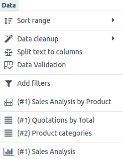

============================
Insert and link to Odoo data
============================

Several elements from your Odoo database can be inserted into an Odoo spreadsheet, namely:

- lists, i.e., data from a :ref:`list view <studio/views/multiple-records/list>`
- pivot tables, i.e., data from a :ref:`pivot view <studio/views/reporting/pivot>`
- charts, i.e., data from a :ref:`graph view <studio/views/reporting/graph>`

.. note::
   Lists, pivot tables, and charts from different apps and models can be inserted into the same
   spreadsheet.

Each time a list, pivot table, or chart is inserted, a :ref:`data source
<spreadsheet/insert/data-sources>` is created. This data source connects the spreadsheet to your
Odoo database, retrieving up-to-date information every time the spreadsheet is opened, the browser
page is reloaded, or data is manually refreshed by clicking :menuselection:`Data --> Refresh all
data` from the menu bar.

:ref:`Inserted lists <spreadsheet/insert/list>` and :ref:`inserted pivot tables
<spreadsheet/insert/pivot-table>` use formulas with Odoo-specific :ref:`list functions
<spreadsheet/insert/list-functions>` and :ref:`pivot table functions
<spreadsheet/insert/pivot-table-functions-static>` to retrieve data from your database and can be
further manipulated in the spreadsheet. Certain elements of :ref:`inserted charts
<spreadsheet/insert/chart>` can be modified, but no data manipulation or computation is possible.

.. tip::
   If you intend to use :doc:`global filters <global_filters>` to dynamically filter Odoo data in
   a spreadsheet or dashboard, do not use the same conditions to establish the initial list, pivot
   table, or chart in your database.

It is also possible to:

- :ref:`add clickable links <spreadsheet/insert/clickable-links>` to Odoo menu items, to other
  sheets of the same spreadsheet, or to external URLs
- :ref:`insert financial data <spreadsheet/insert/financial-data>` from your Odoo database using
  Odoo-specific spreadsheet :doc:`functions <functions>`
- paste data from another Odoo spreadsheet, Excel spreadsheet, or Google Sheet directly into any
  Odoo spreadsheet

.. _spreadsheet/insert/data-sources:

Data sources
============

Data sources, which are created each time a :ref:`list <spreadsheet/insert/list>`, :ref:`pivot table
<spreadsheet/insert/pivot-table>`, or :ref:`chart <spreadsheet/insert/chart>` is inserted into an
Odoo spreadsheet, connect the spreadsheet and the relevant :doc:`model
<../../studio/models_modules_apps>` in your database, ensuring the data stays up-to-date and
allowing you to :ref:`access the underlying data <spreadsheet/insert/accessing-data>`.

Each data source is defined by properties that can be accessed via the :guilabel:`Data` menu. Data
sources are identified by their respective :icon:`oi-view-pivot` :guilabel:`(pivot table)`,
:icon:`oi-view-list` :guilabel:`(list)` or :icon:`fa-bar-chart` :guilabel:`(chart)` icon, followed
by their ID and name, e.g., :icon:`oi-view-pivot` *(#1) Sales Analysis by Product*.

Clicking on a data source opens the related properties in a panel on the right of the spreadsheet.

.. tip::
   - The properties panel can also be opened by right-clicking any cell of an inserted list or pivot
     table, then clicking :icon:`oi-view-list` :guilabel:`See list properties` or
     :icon:`oi-view-pivot` :guilabel:`See pivot properties`, or by clicking the :icon:`fa-bars`
     :guilabel:`(menu)` icon at the top right of an inserted chart, then clicking
     :icon:`fa-pencil-square-o` :guilabel:`Edit`.
   - Once the properties of a specific data source are open, they remain open even when navigating
     between spreadsheet tabs. To close the properties panel, click the :icon:`fa-times`
     :guilabel:`(close)` icon at the top right of the panel.
   - Click :icon:`fa-thumb-tack` :guilabel:`(pin)` at the top of the properties panel to allow
     another panel, such as the :doc:`global filters <global_filters>` panel, to open beside it.

.. note::
   Deleting an inserted list or pivot table, or deleting the sheet into which it was inserted, does
   not delete the underlying data source. The data source of an inserted list or pivot table can
   only be deleted via the data source's properties.

   A warning in the :guilabel:`Data` menu identifies any data sources for which the corresponding
   list or pivot table no longer appears in the spreadsheet.

   .. image:: insert/list-deleted.png
      :alt: Warning message about unused list

   Deleting an inserted chart, on the other hand, also deletes the underlying data source.

.. _spreadsheet/insert/accessing-data:

Accessing underlying data
-------------------------

The underlying data of an inserted list, pivot table, or chart can be accessed at any time. To view:

- an individual record of an **inserted list**, right-click any cell of the relevant row, then
  select :icon:`fa-eye` :guilabel:`See record`
- a list of records referenced by an individual cell of an **inserted pivot table**, right-click the
  cell, then select :icon:`fa-eye` :guilabel:`See records`
- a list of records represented by a data point of an **inserted chart**, click the data point.

.. tip::
   Use the middle mouse button or `Ctrl` + left-click (Microsoft/Linux), or `Command` + left-click
   (Mac OS) to open the results in a new browser tab.

To return to the spreadsheet after viewing the underlying data, click the name of the spreadsheet in
the breadcrumbs at the top of the page.

.. _spreadsheet/insert/list:

Insert a list
=============

.. important::
   Before inserting a list in a spreadsheet, ensure the list is tailored to your needs. Consider
   which fields should be visible as well as how the records are filtered and/or sorted. This can
   impact both the loading time and the user-friendliness of your spreadsheet.

To insert a list:

#. With the relevant list view open in your database, click the :icon:`fa-cog`
   :guilabel:`(Actions)` icon beside the name of the view, then :menuselection:`Spreadsheet -->`
   :icon:`oi-view-list` :menuselection:`Insert list in spreadsheet`.

   .. note::
      To insert only specific records, select the relevant records, click the :icon:`fa-cog`
      :guilabel:`Actions` button that appears at the top center of the screen, then
      :icon:`oi-view-list` :guilabel:`Insert in spreadsheet`.

#. In the window that opens, edit the :guilabel:`Name of the list` if needed.

   The list name is used in the sheet name and in the :ref:`list properties
   <spreadsheet/insert/list-properties>`.

   .. image:: insert/insert-list.png
      :alt: Inserting a list in a spreadsheet

#. Edit the number of records, i.e., rows, to be inserted if needed.

   By default, the number shown is the number of records visible on the first page of the list. For
   example, if the list contains 150 records but only 80 are visible, this field will show 80.

   .. note::
      While the data in your list is kept up to date thanks to the connection to your database, an
      inserted list will not automatically expand to accommodate new records, e.g., a new product
      category or a new salesperson.

      If you anticipate new records being added, consider adding extra rows when inserting the list.
      Records/rows can also be :ref:`added manually <spreadsheet/insert/list-add-records>` after the
      spreadsheet has been inserted.

      .. example::
         Your company currently has ten product categories and you insert this list in a
         spreadsheet. If an 11th product category is created and your inserted list only had ten
         rows, the new category will be inserted in the appropriate position in the spreadsheet,
         thereby removing an existing category.

         One way to avoid this is to :ref:`add extra rows <spreadsheet/insert/list-add-records>`
         when inserting the list.

#. Click :guilabel:`Blank spreadsheet` to create a new spreadsheet, or select in which existing
   spreadsheet the list should be inserted.

   .. note::
      When inserting a list into a new spreadsheet, the spreadsheet is saved in the **Odoo
      Documents** app in the :icon:`fa-hdd-o` :guilabel:`My Drive` personal workspace.

#. Click :guilabel:`Confirm`.

The list is inserted into a new sheet in the spreadsheet. The sheet tab in the bottom bar shows the
name of the list followed by the list ID, e.g., *Quotations by Total (List #1)*. A panel on the right
side of the screen shows the :ref:`list properties <spreadsheet/insert/list-properties>`.

.. tip::
   - To sever the link between an inserted list and your database, select the entire list,
     right-click and select :icon:`fa-clipboard` :guilabel:`Copy` then right-click again and select
     :menuselection:`Paste special --> Paste as value`.
   - Do not modify the list ID in the sheet name, as the inserted list retains this ID for the
     lifetime of the spreadsheet. This list ID is used in the :ref:`spreadsheet functions
     <spreadsheet/insert/list-functions>` that retrieve data from your database.

.. _spreadsheet/insert/list-functions:

List functions
--------------

When a list is inserted into a spreadsheet, the following :doc:`functions <functions>` are used to
retrieve the header and field values, respectively:

.. code-block:: text

   =ODOO.LIST.HEADER(list_id, field_name)
   =ODOO.LIST(list_id, index, field_name)

The arguments of the function are as follows:

- `list_id`: the ID assigned when the list is inserted. The first list inserted into a spreadsheet
  is assigned list ID `1`, the second, list ID `2`, etc.
- `index`: identifies the line on which the record appeared in the list before insertion. The
  first line has an index of `1`, the second an index of `2`, etc.
- `field_name`: the technical name of the field.

.. tip::
   Clicking on an individual cell displays the related formula, if relevant, in the formula bar. To
   display all the formulas of a spreadsheet at the same time, click :menuselection:`View -->`
   :icon:`fa-eye` :menuselection:`Show --> Formulas` on the menu bar. The example below shows the
   functions used to retrieve list headers and values.

   .. image:: insert/list-formulas.png
      :alt: Viewing formulas of spreadsheet cells

.. _spreadsheet/insert/list-properties:

List properties
---------------

The list properties appear on the right side of the screen when a list is inserted. They can be
accessed at any time via the :guilabel:`Data` menu by clicking the relevant list, as prefaced by
the :icon:`oi-view-list` :guilabel:`(list)` icon, or by right-clicking anywhere on the list and
clicking :icon:`oi-view-list` :guilabel:`See list properties`.

The following list properties are shown, some of which can be edited:

- :guilabel:`List #`: the list ID. List IDs are assigned sequentially as additional lists are
  inserted into the spreadsheet.
- :guilabel:`List Name`: the name of the list. Edit this if needed. Note that editing the list name
  in the list properties does not modify the list name shown in the sheet name, and vice versa.
- :guilabel:`Model`: the model from which the data has been extracted.
- :guilabel:`Columns`: the fields of the model that were visible when the list was inserted.
- :guilabel:`Domain`: the rules used to determine which records are shown. Click
  :ref:`Edit domain <search/custom-filters>` to add or edit rules.

  .. note::
     When :doc:`global filters <global_filters>` are used, this domain is combined with the selected
     values of the global filter before the data is loaded into the spreadsheet.

- :guilabel:`Sorting`: how the data is sorted, if applicable. To add a sorting rule, click
  :guilabel:`Add`, select the field, then choose whether sorting should be :guilabel:`Ascending` or
  :guilabel:`Descending`. Delete a sorting rule by clicking the :icon:`fa-times`
  :guilabel:`(delete)` icon.

To :ref:`duplicate <spreadsheet/insert/list-duplicate>` or :ref:`delete
<spreadsheet/insert/list-delete>` a list's data source, click the :icon:`fa-cog` :guilabel:`(gear)`
icon, then click :icon:`fa-clone` :guilabel:`Duplicate` or :icon:`fa-trash` :guilabel:`Delete` as
relevant.

.. _spreadsheet/insert/list-manage:

Manage an inserted list
-----------------------

After a list from an Odoo database has been inserted into an Odoo spreadsheet, you can:

- :ref:`add records <spreadsheet/insert/list-add-records>`, i.e., rows
- :ref:`add fields <spreadsheet/insert/list-add-fields>`, i.e., columns
- :ref:`duplicate the list <spreadsheet/insert/list-duplicate>` to create a new, identical data
  source
- :ref:`delete the list and its underlying data source <spreadsheet/insert/list-delete>`

.. _spreadsheet/insert/list-add-records:

Add records/rows to a list
~~~~~~~~~~~~~~~~~~~~~~~~~~

To add records to a list, use one of the following methods:

- Select the last row of the table, then hover over the blue square until the plus icon appears.
  Click and drag down to add the desired number of rows. The cells of the new rows are populated
  with the :ref:`appropriate formula <spreadsheet/insert/list-functions>` to retrieve the list
  values. If there is corresponding data in your database, the cells are populated.

  .. image:: insert/list-add-records.png
     :alt: Add records by dragging the cell down

- Position your cursor in the top left cell of the sheet, click :menuselection:`Data --> Re-insert
  list` from the menu bar, then select the appropriate list. In the pop-up window, indicate the
  number of records to insert and click :guilabel:`Confirm`. An updated list is inserted,
  overwriting the previous list.

.. tip::
   The above methods can also be used to add additional blank rows to your spreadsheet table. This
   may be useful for lists where you expect additional records to be generated in your database,
   e.g., new product categories or new salespersons.

.. _spreadsheet/insert/list-add-fields:

Add fields/columns to a list
~~~~~~~~~~~~~~~~~~~~~~~~~~~~

To add fields/columns to a list:

#. Select the column to the right or left of where the new column should be inserted.
#. Click :menuselection:`Insert -->` :icon:`os-insert-col` :menuselection:`Insert column` then
   :icon:`os-insert-col-before` :menuselection:`Column left` or :icon:`os-insert-col-after`
   :menuselection:`Column right` from the menu bar, or right-click then :icon:`os-insert-col-before`
   :guilabel:`Insert column left` or :icon:`os-insert-col-after` :guilabel:`Insert column right` as
   appropriate.
#. Copy the header cell of any column, paste it into the header cell of the new column, and press
   `Enter`.
#. Double-click the new header cell then click on the field name that appears in quotation marks at
   the end of the formula; a list of all the technical names of the fields of the related model
   appears.

   .. image:: insert/list-add-columns.png
      :alt: Add fields/columns by editing the formula

#. Select the appropriate field name and press `Enter`. The field's label appears in the header.

   .. tip::
      To know a field's technical name, navigate to the relevant view, :ref:`activate developer mode
      <developer-mode>`, then check the field name by hovering over the question mark beside a
      field's label.

#. With the header cell selected, double-click on the blue square in the bottom-right corner. The
   cells of the column are populated with the appropriate formula to retrieve the list values. If
   there is corresponding data in your database, the cells are populated.

.. _spreadsheet/insert/list-duplicate:

Duplicate a list
~~~~~~~~~~~~~~~~

Duplicating a list via the list's properties creates an additional data source. This allows for
different manipulations to be performed on the same data within one spreadsheet.

With the :ref:`list properties <spreadsheet/insert/list-properties>` open, click the :icon:`fa-cog`
:guilabel:`(gear)` icon then :icon:`fa-clone` :guilabel:`Duplicate`.

The new data source is assigned the next available list ID. For example, if no other lists have been
inserted in the meantime, duplicating *List #1* results in the creation of *List #2*.

Unlike when you insert a list, a duplicated list is not automatically inserted into the spreadsheet.
To insert it, perform the following steps:

#. Add a new sheet by clicking the :icon:`os-plus` :guilabel:`(add sheet)` icon at the bottom left
   of the spreadsheet.
#. Click :menuselection:`Data --> Re-insert list` from the menu bar, then select the appropriate
   list.
#. Define the number of records to insert and click :guilabel:`Confirm`.
#. Edit the :guilabel:`List Name` in the properties panel if needed.
#. Rename the sheet by right-clicking on the sheet tab, selecting :guilabel:`Rename`, and entering
   the new sheet name.

.. note::
   Duplicating an inserted list by copying and pasting it or by duplicating the sheet into which it
   has been inserted does not create a new data source. Any changes made to the list's properties
   would therefore impact any copies of the list.

.. _spreadsheet/insert/list-delete:

Delete a list
~~~~~~~~~~~~~

To fully delete a list and the underlying data source from a spreadsheet, perform the following
steps in any order:

- Delete the spreadsheet table using your preferred means, e.g., via keyboard commands, spreadsheet
  menus, or by deleting the sheet. This deletes the visual representation of the data.
- From the :ref:`properties panel <spreadsheet/insert/list-properties>` of the relevant list, click
  the :icon:`fa-cog` :guilabel:`(gear)` icon then :icon:`fa-trash` :guilabel:`Delete`. This deletes
  the data source of the list from the spreadsheet.

.. _spreadsheet/insert/pivot-table:

Insert a pivot table
====================

.. tip::
   Converting an inserted pivot table to a :doc:`dynamic pivot table <dynamic_pivot_tables>` allows
   you to add, remove, and manipulate dimensions (i.e., columns and rows) and measures. It is
   therefore possible to insert a basic pivot table with minimal configuration, convert it to a
   dynamic pivot table, then refine it directly in the spreadsheet.

To insert a pivot table:

#. With the relevant pivot view open in your database, click :guilabel:`Insert in Spreadsheet`.
#. In the window that opens, edit the :guilabel:`Name of the pivot` if needed.

   This name is used in the sheet name and in the :ref:`pivot table properties
   <spreadsheet/insert/pivot-table-properties>`.

   .. image:: insert/insert-pivot-table.png
      :alt: Inserting a pivot table in a spreadsheet

#. Click :guilabel:`Blank spreadsheet` to create a new spreadsheet, or select in which existing
   spreadsheet the pivot table should be inserted.

   .. note::
      When inserting a pivot table into a new spreadsheet, the spreadsheet is saved in the **Odoo
      Documents** app in the :icon:`fa-hdd-o` :guilabel:`My Drive` personal workspace.

#. Click :guilabel:`Confirm`.

The pivot table is inserted into a new sheet in the spreadsheet. The sheet tab in the bottom bar
shows the name of the pivot table followed by the pivot table ID, e.g., *Sales Analysis by Sales
Team (Pivot #1)*. A panel on the right side of the screen shows the :ref:`pivot table properties
<spreadsheet/insert/pivot-table-properties>`.

.. tip::
   - To sever the link between an inserted pivot table and your database, select the entire pivot
     table, right-click and select :icon:`fa-clone` :guilabel:`Copy`, then right-click again and
     select :menuselection:`Paste special --> Paste as value`.
   - Do not modify the pivot table ID in the sheet name, as the inserted pivot table retains this ID
     for the lifetime of the spreadsheet. This pivot table ID is used in the :ref:`spreadsheet
     functions <spreadsheet/insert/pivot-table-functions-static>` that retrieve data from your
     database.

.. _spreadsheet/insert/pivot-table-functions-static:

Pivot table functions
---------------------

An inserted pivot table that has not been converted to a :doc:`dynamic pivot table
<dynamic_pivot_tables>` uses the following :doc:`functions <functions>` to retrieve the header and
field values, respectively:

      .. code-block:: text

         =PIVOT.HEADER(pivot_id, [domain_field_name, …], [domain_value, …])
         =PIVOT.VALUE(pivot_id, measure_name, [domain_field_name, …], [domain_value, …])

The arguments of the functions are as follows:

- `pivot_id`: the ID assigned when the pivot table is inserted. The first pivot table inserted
  in a spreadsheet is assigned pivot ID `1`, the second, pivot ID `2`, etc.
- `measure_name`: the technical name of what is being measured, followed by the type of aggregation,
  e.g., `product_uom_qty:sum`.
- `domain_field_name`: the technical name of the field used as a dimension, e.g., `user_id`, or, if
  the dimension is a time period, the technical name of the date field, followed by the time period,
  e.g., `date_order:month`.
- `domain_value`: the ID of the record, or, if the dimension is a time period, the date or time
  period targeted.

.. tip::
   Clicking on an individual cell displays the related formula, if relevant, in the formula bar. To
   display all the formulas of a spreadsheet at the same time, click :menuselection:`View -->`
   :icon:`fa-eye` :menuselection:`Show --> Formulas` on the menu bar. The example below shows the
   functions used to retrieve headers and values of a static pivot table.

   .. image:: insert/pivot-table-formulas.png
      :alt: Functions of a static pivot table

.. _spreadsheet/insert/pivot-table-properties:

Pivot table properties
----------------------

The pivot table properties appear on the right side of the screen when a pivot table is inserted.
They can be accessed at any time via the :guilabel:`Data` menu by clicking the relevant pivot table,
as prefaced by the :icon:`oi-view-pivot` :guilabel:`(pivot)` icon, or by right-clicking anywhere on
the pivot table and clicking :icon:`oi-view-pivot` :guilabel:`See pivot properties`.

The following pivot table properties are shown, some of which can be edited:

- :guilabel:`Pivot #`: the pivot table ID. Pivot table IDs are assigned sequentially as additional
  pivot tables are inserted in the spreadsheet.
- :guilabel:`Name`: the name of the pivot table. Edit this if needed. Note that editing the name
  in the pivot table properties does not modify the name shown in the sheet name, and vice versa.
- :guilabel:`Model`: the model from which the data has been extracted.
- :guilabel:`Columns` and :guilabel:`Rows`: dimensions you are using to categorize or group data
  from the model.
- :guilabel:`Measures`: what you are measuring, or analyzing, based on the dimensions you have
  chosen.

  .. tip::
     If you attempt to make changes to the columns, rows, or measures of a pivot table that has just
     been inserted into a spreadsheet, an error appears at the top right of the screen.

      .. image:: dynamic_pivot_tables/pivot-table-error.png
         :alt: Error message when trying to manipulate static pivot table

     To be able to manipulate a pivot table's properties, convert a static pivot table to a
     :ref:`dynamic pivot table <spreadsheet/dynamic-pivot-tables/create>`.

- :guilabel:`Domain`: the rules used to determine which records are shown. Click
  :ref:`Edit domain <search/custom-filters>` to add or edit rules.

  .. note::
     When :doc:`global filters <global_filters>` are used, this domain is combined with the selected
     values of the global filter before the data is loaded into the spreadsheet.

To :ref:`duplicate <spreadsheet/insert/pivot-table-duplicate>` or :ref:`delete
<spreadsheet/insert/pivot-table-delete>` a pivot table's data source, click the :icon:`fa-cog`
:guilabel:`(gear)` icon then :icon:`fa-clone` :guilabel:`Duplicate` or :icon:`fa-trash`
:guilabel:`Delete`.

.. _spreadsheet/insert/pivot-table-manage:

Manage an inserted pivot table
------------------------------

After a pivot table from an Odoo database has been inserted into an Odoo spreadsheet, you can:

- :ref:`convert it to a dynamic pivot table <spreadsheet/dynamic-pivot-tables/create>` to be able to
  manipulate the dimensions and measures
- :ref:`duplicate the pivot table <spreadsheet/insert/pivot-table-duplicate>` to create a new,
  identical data source
- :ref:`delete the pivot table and its underlying data source
  <spreadsheet/insert/pivot-table-delete>`

.. _spreadsheet/insert/pivot-table-duplicate:

Duplicate a pivot table
~~~~~~~~~~~~~~~~~~~~~~~

Duplicating a pivot table via the pivot table's properties creates an additional data source. This
allows for different manipulations to be performed on the same data within one spreadsheet.

For example, you can see the same data aggregated by different dimensions or use :doc:`global
filters <global_filters>` to offset the date and create pivot tables that compare the current
period's data with a previous period.

To duplicate a pivot table, perform the following steps:

#. With the :ref:`pivot table properties <spreadsheet/insert/pivot-table-properties>` open, click
   the :icon:`fa-cog` :guilabel:`(gear)` icon then :icon:`fa-clone` :guilabel:`Duplicate`.

   The duplicated pivot table is automatically inserted into a new sheet in the spreadsheet, with
   the pivot table properties open in the right panel.
#. Edit the :guilabel:`Name` in the properties panel and the sheet tab if needed.

The new data source is assigned the next available pivot table ID. For example, if no other pivot
tables have been inserted in the meantime, duplicating *Pivot #1* results in the creation of
*Pivot #2*.

.. note::
   - Duplicating an inserted pivot table by copying and pasting it or by duplicating the sheet does
     not create a new data source. Any changes made to the pivot table's properties would therefore
     impact any copies of the pivot table.
   - When a pivot table is duplicated, the new pivot table is by default a :doc:`dynamic pivot table
     <dynamic_pivot_tables>`.

.. _spreadsheet/insert/pivot-table-delete:

Delete a pivot table
~~~~~~~~~~~~~~~~~~~~

To fully delete a pivot table and the underlying data source from a spreadsheet, perform the
following steps in any order:

- Delete the spreadsheet table using your preferred means, e.g., via keyboard commands, spreadsheet
  menus, or by deleting the sheet. This deletes the visual representation of the data.
- From the :ref:`properties panel <spreadsheet/insert/pivot-table-properties>` of the relevant pivot
  table, click the :icon:`fa-cog` :guilabel:`(gear)` icon then :icon:`fa-trash` :guilabel:`Delete`.
  This deletes the data source of the pivot table.

.. _spreadsheet/insert/chart:

Insert a chart
==============

To insert a chart from an Odoo database into an Odoo spreadsheet:

#. With the relevant graph view open in your database, click :guilabel:`Insert in Spreadsheet`.
#. In the window that opens, edit the :guilabel:`Name of the graph` if needed.

#. Click :guilabel:`Blank spreadsheet` to create a new spreadsheet, or select in which existing
   spreadsheet the chart should be inserted.

   .. note::
      When inserting a chart into a new spreadsheet, the spreadsheet is saved in the **Odoo
      Documents** app in the :icon:`fa-hdd-o` :guilabel:`My Drive` personal workspace.

#. Click :guilabel:`Confirm`.

Charts are inserted on the first sheet of the spreadsheet.

.. tip::
   Clicking on a data point in a chart opens the relevant list view in the database. In the example,
   clicking on :guilabel:`Jessica Childs` opens the list view of all sales by this salesperson that
   match the domain of the chart.

   .. image:: insert/clickable-link-chart.png
      :alt: A clickable link to an Odoo menu plus clickable data point

.. _spreadsheet/insert/chart-properties:

Chart properties
----------------

When you insert a chart into a spreadsheet, the chart properties appear on the right side of the
screen. Access these at any time via the :guilabel:`Data` menu by clicking the relevant chart, as
prefaced by the :icon:`fa-bar-chart` :guilabel:`(chart)` icon. Alternatively, hover over the chart
then click the :icon:`fa-bars` :guilabel:`(menu)` icon and click :icon:`fa-pencil-square-o`
:guilabel:`Edit`.

In the chart properties, the :icon:`fa-sliders` :guilabel:`Configuration` and :icon:`fa-paint-brush`
:guilabel:`Design` tabs let you modify various elements of the chart.

Configuration
~~~~~~~~~~~~~

The :icon:`fa-sliders` :guilabel:`Configuration` tab includes the following sections:

- :guilabel:`Chart type`: the type of chart. By default, this indicates the type of chart you
  selected in the graph view in the database before inserting the chart in the spreadsheet.

  After a chart has been inserted, more chart types are available. Click the dropdown menu to
  select the most appropriate chart type for the data.

  .. note::
     The chart types in the :guilabel:`Other` tab below are only available when creating a chart
     from spreadsheet data; an inserted chart cannot be converted to a chart type shown in that tab.
     All other chart types are available for both inserted charts and when creating a chart directly
     from spreadsheet data.

  .. tabs::

     .. tab:: Line

        .. image:: insert/chart-type-line.png
           :alt: Line chart icon

        :guilabel:`Line`: best for showing trends or changes over time, such as sales
        growth across months or temperature variations.

        .. image:: insert/chart-type-line-stacked.png
           :alt: Stacked line chart icon

        :guilabel:`Stacked Line`: useful for visualizing cumulative trends where multiple series
        contribute to a total, like revenue by department over time.

        .. image:: insert/chart-type-line-combo.png
           :alt: Combo chart icon

        :guilabel:`Combo`: combines multiple chart types (e.g., bars and lines) to compare different
        data types or highlight key metrics alongside trends.

     .. tab:: Column

        .. image:: insert/chart-type-column.png
           :alt: Column chart icon

        :guilabel:`Column`: ideal for comparing values across discrete categories, such as sales per
        product or revenue by region.

        .. image:: insert/chart-type-column-stacked.png
           :alt: Stacked column chart icon

        :guilabel:`Stacked Column`: displays part-to-whole relationships within categories, such as
        regional contributions to total sales.

     .. tab:: Bar

        .. image:: insert/chart-type-bar.png
           :alt: Bar chart icon

        :guilabel:`Bar`: similar to a column chart but horizontal, making it better for comparing
        long category names or datasets.

        .. image:: insert/chart-type-bar-stacked.png
           :alt: Stacked bar chart icon

        :guilabel:`Stacked Bar`: highlights cumulative contributions across categories, often used
        in demographic or resource allocation analysis.

     .. tab:: Area

        .. image:: insert/chart-type-area.png
           :alt: Area chart icon

        :guilabel:`Area`: similar to a line chart but fills the area beneath the lines to emphasize
        magnitude, perfect for cumulative metrics over time.

        .. image:: insert/chart-type-area-stacked.png
           :alt: Stacked area chart icon

        :guilabel:`Stacked Area`: visualizes the composition of changes over time, such as market
        share by product category.

     .. tab:: Pie

        .. image:: insert/chart-type-pie.png
           :alt: Pie chart icon

        :guilabel:`Pie`: best for showing proportions or percentages of a whole, such as market
        share or budget allocation.

        .. image:: insert/chart-type-doughnut.png
           :alt: Doughnut chart icon

        :guilabel:`Doughnut`: a variation of the pie chart with a hollow center, offering similar
        use cases but with a modern aesthetic.

     .. tab:: Hierarchical

        .. image:: insert/chart-type-sunburst.png
           :alt: Sunburst chart icon

        :guilabel:`Sunburst`: a variation of the doughnut chart with hierarchical rings, showcasing
        part-to-whole relationships across multiple levels.

        .. image:: insert/chart-type-treemap.png
           :alt: Treemap chart icon

        :guilabel:`Treemap`: a multi-level rectangular chart that displays hierarchical data through
        nested rectangles, ideal for illustrating proportions and categories.

     .. tab:: Miscellaneous

        .. image:: insert/chart-type-scatter.png
           :alt: Scatter chart icon

        :guilabel:`Scatter`: ideal for analyzing relationships or correlations between two numerical
        variables, such as price vs. quantity sold.

        .. image:: insert/chart-type-waterfall.png
           :alt: Waterfall chart icon

        :guilabel:`Waterfall`: ideal for visualizing cumulative effects of sequential positive and
        negative values, such as profit/loss analysis.

        .. image:: insert/chart-type-population-pyramid.png
           :alt: Population pyramid chart icon

        :guilabel:`Population Pyramid`: a specialized chart for comparing distributions, often used
        in demographics, such as age and gender group analysis.

        .. image:: insert/chart-type-radar.png
           :alt: Radar chart icon

        :guilabel:`Radar`: displays multivariate data as a polygon on axes radiating from a center,
        allowing for profile comparisons across multiple variables.

        .. image:: insert/chart-type-filled-radar.png
           :alt: Filled radar chart icon

        :guilabel:`Filled radar`: fills the area within the radar chart's polygon, emphasizing the
        overall magnitude of values across different attributes for comparison.

        .. image:: insert/chart-type-geo.png
           :alt: Geo chart icon

        :guilabel:`Geo`: visualizes data on a map using color variations to represent values or
        categories across different geographical regions.

        .. image:: insert/chart-type-funnel.png
           :alt: Funnel chart icon

        :guilabel:`Funnel`: visualizes data that progressively decreases over stages of a
        process, with the option to display cumulative data for each stage.

     .. tab:: Other

        When creating a chart from spreadsheet data, rather than inserting one from a graph view,
        the following chart types are also available:

        .. image:: insert/chart-type-gauge.png
           :alt: Gauge chart icon

        :guilabel:`Gauge`: displays progress toward a goal or a single key metric, such as
        performance against a target.

        .. image:: insert/chart-type-scorecard.png
           :alt: Scorecard icon

        :guilabel:`Scorecard`: used to summarize key performance indicators (KPIs) in a compact
        format, such as total sales or conversion rates, and compare to a baseline or a previous
        value.

- :guilabel:`Domain`: the rules used to determine which records are shown. Click :ref:`Edit domain
  <search/custom-filters>` to add or edit rules.
- :guilabel:`Link to Odoo menu`: to add a :ref:`clickable link <spreadsheet/insert/clickable-links>`
  from a chart to an Odoo menu item, i.e., a specific view of a model.

Design
~~~~~~

Depending on the chart type, the :icon:`fa-paint-brush` :guilabel:`Design` tab has one or more
sections.

The :guilabel:`General` section allows you to modify the following elements:

- :guilabel:`Background color`: Add or change the background color by clicking on the color dot.
  Choose one of the standard colors or click the :icon:`fa-plus` icon to manually select a custom
  color.
- :guilabel:`Chart title`: Edit the chart title, if needed. The font formatting, horizontal
  alignment, font size, and color of the title can be modified using the editor.
- :guilabel:`Legend position`: Change the position of the legend or opt to have no legend.
- Enable :guilabel:`Show values` to add numeric values to the data points on the
  chart.

The :guilabel:`Data Series` section allows you to modify the following elements:

- :guilabel:`Series color`: With the relevant data series selected, change the color of the related
  data points on the chart by clicking on the color dot circle. Choose one of the standard colors or
  click the :icon:`fa-plus` icon to manually select a custom color.
- :guilabel:`Series name`: Edit the name of a data series, if needed.
- :guilabel:`Serie type`: For each data series of a :guilabel:`Combo` chart, determine whether the
  series is shown as a :guilabel:`Bar` or :guilabel:`Line`.
- :guilabel:`Vertical axis`: For the selected data series of a :guilabel:`Line`, :guilabel:`Area`,
  or :guilabel:`Column` chart, select whether it should be displayed on the :guilabel:`Left`
  (primary) or :guilabel:`Right` (secondary) vertical axis.
- :guilabel:`Trend line`: With the relevant data series selected, enable :guilabel:`Show trend line`
  then select the type of trend line from the dropdown; the options are :guilabel:`Linear`,
  :guilabel:`Exponential`, :guilabel:`Polynomial`, :guilabel:`Logarithmic`, and :guilabel:`Trailing
  moving average`. The color of the trend line can be changed by clicking on the color circle.

The :guilabel:`Axes` section allows you add a title to one or both axes of a chart. The font
formatting, horizontal alignment, font size, and color of the title can be modified using the
editor.

Waterfall charts have a dedicated :guilabel:`Waterfall design` section.

Manage an inserted chart
------------------------

After a chart from an Odoo database has been inserted into an Odoo spreadsheet, you can:

- move the chart within the same sheet by selecting it, then dragging the chart to the desired
  position
- resize the chart by selecting it, then clicking and dragging the blue markers until the chart is
  the desired size
- hover over the chart, then click the :icon:`fa-bars` :guilabel:`(menu)` icon to reveal the
  following options:

  - :icon:`fa-clipboard` :guilabel:`Copy` or :icon:`os-cut` :guilabel:`Cut`: to copy or cut a chart
    with the intention of pasting it *within the same spreadsheet*, click the relevant icon or use
    the relevant keyboard shortcut. Paste the chart in the desired location by clicking
    :menuselection:`Edit -->` :icon:`os-paste` :menuselection:`Paste` from the menu bar or use the
    relevant keyboard shortcut.

    .. note::
       Copying/cutting and pasting a chart in this way maintains the link between the chart and your
       database. The data in the pasted chart remains up-to-date, and clicking on a data point opens
       the related list view in the database.

  - :guilabel:`Copy as image`: to copy an image of a chart to your clipboard with the intention of
    pasting it *in any location within or outside your spreadsheet*, click :guilabel:`Copy as
    image`. Paste the image in the desired location using the paste function of the destination
    program or the relevant keyboard shortcut.

    .. note::
       Copying and pasting a static image of a chart implies there is no longer any link between the
       chart and your database.

  - :icon:`fa-trash-o` :guilabel:`Delete`: delete a chart and its underlying :ref:`data source
    <spreadsheet/insert/data-sources>` by clicking :icon:`fa-trash-o` :guilabel:`Delete`.
    Alternatively, use your preferred keyboard command to delete a chart and its data source.

.. _spreadsheet/insert/clickable-links:

Insert clickable links
======================

Adding links to related or supporting information can make your report or dashboard more
user-friendly and effective.

You can :ref:`insert a clickable link from any spreadsheet cell
<spreadsheet/insert/clickable-links-cell>` to:

- an Odoo menu item
- another sheet inside the same spreadsheet
- an external URL

You can :ref:`insert a clickable link from any chart <spreadsheet/insert/clickable-links-chart>` to
an Odoo menu item.

.. note::
   - Clicking a link to a menu item provides the same result as navigating via the Odoo menu within
     an app, e.g., the menu item :guilabel:`Sales/Orders/Quotations` corresponds to the default view
     when navigating to :menuselection:`Sales --> Orders --> Quotations`.
   - It is also possible to insert a clickable link to a specific view of a model in a spreadsheet
     starting from the view itself. However, as this method inserts each new link in a new sheet, it
     is more efficient to create links to specific views starting from the spreadsheet.

.. tip::
   Use the middle mouse button or `Ctrl` + left-click (Microsoft/Linux), or `Command` + left-click
   (Mac OS) to open clickable links in a new browser tab.

.. _spreadsheet/insert/clickable-links-cell:

Insert a clickable link from a cell
-----------------------------------

To insert a clickable link from a cell:

#. Click :menuselection:`Insert -->` :icon:`fa-link` :menuselection:`Link` from the menu bar or
   right-click on the cell, then click :icon:`fa-link` :guilabel:`Insert link`. Next, depending on
   the desired outcome, perform one of the following actions:

   - Click the :icon:`fa-bars` :guilabel:`(menu)` icon, then :guilabel:`Link an Odoo menu`. Select
     the relevant menu item from the list or click :guilabel:`Search more` to choose from a list of
     all menu items. Click :guilabel:`Confirm`.
   - Click the :icon:`fa-bars` :guilabel:`(menu)` icon, then :guilabel:`Link sheet`, then choose the
     relevant sheet from the current spreadsheet.
   - Under :guilabel:`Link`, type a URL.

#. Enter or edit the label for the link in the :guilabel:`Text` field.
#. Click :guilabel:`Confirm`.

.. _spreadsheet/insert/clickable-links-chart:

Insert a clickable link from a chart
------------------------------------

To insert a clickable link from a chart to an Odoo menu item:

#. Hover over the top right of the chart's box, then click the :icon:`fa-bars` :guilabel:`(menu)`
   icon, then :icon:`fa-pencil-square-o` :guilabel:`Edit`. The chart properties appear at the right
   of the screen.
#. At the bottom of the :icon:`fa-sliders` :guilabel:`Configuration` tab of the chart properties
   panel, click under :guilabel:`Link to Odoo menu`, then select a menu.

Hover over the top right of the chart's box to see that a new :icon:`fa-external-link`
:guilabel:`(external link)` icon has been added.

.. _spreadsheet/insert/financial-data:

Insert financial data
=====================

When building reports and dashboards, it may be useful to include certain accounting-related data,
such as account IDs, credits and debits for specific accounts, and dates of the start and end of the
tax year.

:ref:`Odoo-specific spreadsheet functions <spreadsheet/functions/odoo>` allow you to retrieve such
accounting data from your database and insert it into a spreadsheet.
