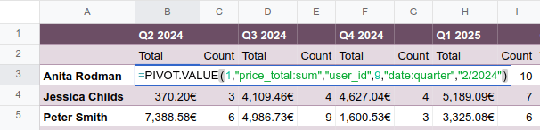
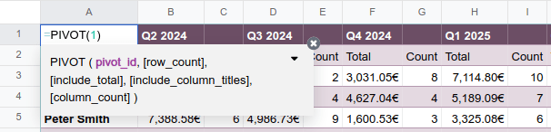

====================
Dynamic pivot tables
====================

When a pivot view from an Odoo database is inserted in a spreadsheet, it is by default a static
pivot table. Each cell in a static pivot table contains an :ref:`Odoo-specific function
<spreadsheet/insert/pivot-table-functions-static>` that retrieves data from your database.

When the corresponding data in your database changes, e.g., the sales related to a given quarter or
an individual salesperson, the cells of your static pivot table are updated.

However, a static pivot table does not expand automatically to accommodate new data, e.g., sales
data for a new quarter or for a newly hired salesperson. Neither is it possible to add or manipulate
dimensions (i.e., columns or rows) or measures via the pivot table properties.

.. note::
   If you attempt to update or manipulate the properties of a pivot table that has just been
   inserted into a spreadsheet, an error message appears in the top right corner of the screen:

   .. image:: dynamic_pivot_tables/pivot-table-error.png
      :alt: Error message when trying to manipulate static pivot table

To have more flexibility in how you can manipulate your pivot table, you can :ref:`create a dynamic
pivot table <spreadsheet/dynamic-pivot-tables/create>` from a static pivot table.

.. _spreadsheet/dynamic-pivot-tables/create:

Create a dynamic pivot table
============================

There are two main ways to create a dynamic pivot table from a static pivot table:

- **Duplicate the static pivot table from the pivot table properties**: :ref:`Open the pivot table
  properties <spreadsheet/insert/pivot-table-properties>`, click the :icon:`fa-cog`
  (:guilabel:`gear`) icon at the top right of the pane, then click :icon:`fa-clone`
  :guilabel:`Duplicate`.

  A new data source is created and a dynamic version of the pivot table is inserted into a new
  sheet. The dynamic pivot table has the same styling as the original pivot table.

  .. note::
     When you use this method, your new dynamic pivot table gets the next available pivot ID. This
     means you can create multiple pivot views associated with the same model, but with distinct
     settings, groupings, or calculations.

- **Re-insert the dynamic pivot table from the Data menu**: On the sheet that contains your static
  pivot table, position your cursor in an empty cell. Click :menuselection:`Data -->`
  :icon:`os-insert-pivot` :menuselection:`Re-insert dynamic pivot` from the menu bar, then select
  the relevant pivot table.

  A new, dynamic pivot table appears, with the same styling as the original pivot table.

  .. note::
     When you use this method, your static and dynamic pivot share the same data source, and,
     consequently, the same pivot ID. To avoid confusion, delete the original static pivot table.

.. tip::
   It is also possible to directly enter the :ref:`function
   <spreadsheet/dynamic-pivot-tables/functions>` of the dynamic pivot table in an empty cell.
   However, with this method, the table styling needs to be re-applied manually.

.. _spreadsheet/dynamic-pivot-tables/functions:

Dynamic pivot table functions
-----------------------------

Instead of each cell containing a unique function that retrieves data from your database, as in a
:ref:`static pivot table <spreadsheet/insert/pivot-table-functions-static>`, a dynamic pivot table
has a single function:

.. code-block:: text

   =PIVOT(pivot_id, [row_count], [include_total], [include_column_titles], [column_count] )

The arguments of the function are as follows:

- `pivot_id`: the ID assigned when the pivot table is inserted. The first pivot table
  inserted in a spreadsheet is assigned pivot ID `1`, the second, pivot ID `2`, etc.
- `row_count` and `column count`: the number of rows and columns respectively.
- `include_total` and `include_column_titles`: values of `0` remove the total and column
  titles respectively.

This is an array function, which allows the pivot table to expand automatically to accommodate the
results of the function.

The top-left cell contains the editable function, while clicking on any other cell reveals this
formula greyed out.

.. tip::
   If necessary, you can update the function of a dynamic pivot table to remove elements like the
   total or column titles.

   With the function open in the formula bar or the top-left cell of the pivot table, position your
   cursor after the pivot ID then type `,` to advance to the optional field you want to modify. In
   the example below, adding the value `0` for `[include_total]` removes both the row total and
   column total from the pivot table.

   .. image:: dynamic_pivot_tables/modify-function.png
      :alt: Modifying the function of a dynamic pivot table

.. _spreadsheet/dynamic-pivot-tables/manipulate:

Manipulate a dynamic pivot table
================================

To manipulate data in a dynamic pivot table, :ref:`open the pivot table properties
<spreadsheet/insert/pivot-table-properties>`.

The following options are available by clicking the :icon:`fa-cog` (:guilabel:`gear`) icon:

- :icon:`fa-exchange` :guilabel:`Flip axes`: to move all the dimensions represented in columns to
  rows and vice versa.

  .. tip::
     Flipping the axes presents the data from a different perspective, possibly bringing new
     insights. However, depending on the volume of data, it can result in #SPILL errors. This
     happens when a formula tries to output a range of values, but something is blocking those
     cells, such as other data, merged cells, or the boundaries of the current sheet.

     Hovering over the cell containing :guilabel:`#SPILL` details the error.

- :icon:`fa-clone` :guilabel:`Duplicate`: to duplicate the dynamic pivot table and create a new data
  source with distinct properties.
- :icon:`fa-trash` :guilabel:`Delete`: to delete the data source of the dynamic pivot table.

  .. note::
     Deleting the data source of a pivot table does not delete the visual representation of the
     data. Delete the table from the spreadsheet using your preferred means, e.g., via keyboard
     commands, spreadsheet menus, or by deleting the sheet.

.. _spreadsheet/dynamic-pivot-tables/manipulate-dimensions:

Dimensions
----------

The dimensions of the pivot table, i.e., how the data is grouped, are placed in :guilabel:`Columns`
and :guilabel:`Rows` according to how they appeared in the pivot view in your database, i.e., before
the pivot table was inserted in the spreadsheet.

You can:

- add new dimensions by clicking :guilabel:`Add`
- delete existing dimensions by clicking the :icon:`fa-trash` :guilabel:`(delete)` icon on the
  relevant dimension
- change the order in which dimensions are displayed in :guilabel:`Columns` or :guilabel:`Rows` by
  clicking then dragging the dimension to the desired position within its respective section
- change the axis on which a dimension is shown by clicking then dragging the dimension from
  :guilabel:`Columns` to :guilabel:`Rows` or vice versa
- change how a dimension's values are ordered by selecting :guilabel:`Ascending`,
  :guilabel:`Descending`, or :guilabel:`Unsorted` in the :guilabel:`Order by` field
- for date- or time-based dimensions, select the desired :guilabel:`Granularity` from the options in
  the dropdown menu

.. _spreadsheet/dynamic-pivot-tables/manipulate-measures:

Measures
--------

The measures of your pivot table, i.e., what you are measuring, or analyzing, based on the
dimensions you have chosen, are listed in the order they appeared in the pivot view in your
database.

You can:

- add new measures, including :ref:`calculated measures
  <spreadsheet/dynamic-pivot-tables/manipulate-measures-calculated-measures>`, by clicking
  :guilabel:`Add`
- hide (:icon:`fa-eye`), show (:icon:`fa-eye-slash`), or delete (:icon:`fa-trash`) existing measures
- edit the name of existing measures by clicking on the measure's name
- change the order in which measures are displayed by clicking then dragging the measure to the
  desired position
- change how measures are displayed by clicking the :icon:`fa-cog` :guilabel:`(gear)` icon, then
  selecting the desired option from the dropdown menu, e.g., :guilabel:`% of grand total` or
  :guilabel:`Rank smallest to largest`. The pivot table data updates dynamically as different
  options are selected.
- choose how measures are aggregated, e.g., by :guilabel:`Sum`, :guilabel:`Average`,
  :guilabel:`Minimum`

.. tip::
   To sort the values of a dynamic pivot table by measure for a specific dimension, right-click any
   pivot table value, then click :icon:`os-sort-range` :guilabel:`Sort pivot` and select
   :guilabel:`Ascending` or :guilabel:`Descending` from the dropdown. To return to the default
   order, follow the same steps then select :guilabel:`No sorting` from the dropdown.

.. _spreadsheet/dynamic-pivot-tables/manipulate-measures-calculated-measures:

Calculated measures
~~~~~~~~~~~~~~~~~~~

It is possible to add calculated measures if the desired measure did not exist in the original pivot
view. For example, a calculated measure could be added to show the average revenue per order or the
profit margin per product.

To add a calculated measure:

#. From the :guilabel:`Measures` section of the pivot table properties, click :guilabel:`Add`.
#. Below the scrollable list, click :icon:`os-formula` :guilabel:`Add calculated measure`.
#. Rename the calculated measure by clicking on the name and typing.
#. Click on the line starting with `=` and enter the formula.

   .. example::
      In the below example, the average revenue per order is added by dividing the sum of the sales
      by the number of orders.

      .. image:: dynamic_pivot_tables/calculated-measure.png
         :alt: Formula for a calculated measure

#. Choose how the measure should be aggregated by selecting a value from the dropdown.

.. tip::
   There are advantages to using a static pivot table, for example, being able to see the functions
   behind individual cells. To have this possibility, select the relevant portion of your dynamic
   pivot table, copy it, then paste it into an empty part of the sheet. Click on any pasted cell to
   see the :ref:`Odoo function <spreadsheet/functions/odoo>` used to retrieve the data.

