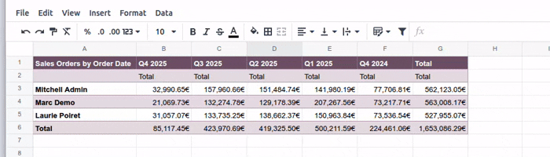

============
Pivot tables
============

Pivot tables allow you to organize, summarize, and analyze large amounts of data without the need
for complex formulas. By grouping and segmenting data into :ref:`dimensions
<spreadsheet/pivot-tables/dimensions>` (i.e., the fields added as columns and rows) and defining
what is being :ref:`measured <spreadsheet/pivot-tables/measures>` (e.g., the total amount or
quantity ordered), the corresponding values of each intersecting data point are calculated
automatically.

Various manipulations can be performed to see the same dataset from different perspectives, such as
:ref:`rearranging or sorting dimensions <spreadsheet/pivot-tables/dimensions>`, or
:ref:`changing how measures are aggregated or calculated <spreadsheet/pivot-tables/measures>`.

.. example::
   In the example, the pivot table shows the :guilabel:`Total` amount of sales orders per
   salesperson per quarter. The :guilabel:`Salesperson` field is represented in rows, the
   :guilabel:`Order Date` (grouped by quarter and year) in columns, while the values represent the
   total amount for the given salesperson and quarter.

   .. image:: pivot_tables/pivot-table.png
      :alt: Pivot table showing sales per salesperson per quarter

With Odoo Spreadsheet, it is possible to:

- :ref:`insert a pivot table from an Odoo pivot view <spreadsheet/insert_pivot_table/from_view>`
  into an Odoo spreadsheet, Odoo dashboard, or quote calculator spreadsheet.

- :ref:`insert a pivot table referencing Odoo data directly from an Odoo spreadsheet
  <spreadsheet/insert_pivot_table/from_spreadsheet>`. This option allows you to retrieve and work
  with data from any model, including models for which no Odoo pivot view is available e.g., the
  *Sales Order Line* model.

- :ref:`insert a pivot table from a range of data <spreadsheet/pivot-tables/create>`. The data
  can be static data or dynamic Odoo data that had been inserted into the spreadsheet, e.g., from a
  list view.

When a pivot table is inserted in an Odoo spreadsheet, a :ref:`data source
<spreadsheet/insert/data-sources>` is created, which connects the pivot table to the underlying
database data or spreadsheet range.

.. seealso::
   :ref:`Static vs dynamic pivot tables <spreadsheet/insert-pivot-table/static-vs-dynamic>`

.. _spreadsheet/pivot-tables/create:

Insert a pivot table from a range of data
=========================================

.. tip::
   Before inserting a pivot table from a range of data:

   - Organize your data in columns, not rows, i.e., each column should contain one category of
     information, while each row should contain one record.
   - Ensure all columns have a unique header; avoid double rows of headers or merged cells.
   - Format your data as a table by selecting any cell in the range, clicking :icon:`os-edit-table`
     :icon:`fa-caret-down` :guilabel:`Insert table` from the toolbar, then selecting a style. This
     ensures any updates to the table are reflected in the pivot table.

To create a pivot table from a range of data:

#. Open the relevant Odoo spreadsheet.
#. Select any cell within the range of data to be analyzed, then click :menuselection:`Insert -->`
   :icon:`oi-view-pivot` :menuselection:`Pivot table` :icon:`fa-caret-right` :menuselection:`From
   range` from the menu bar.

A new sheet opens with an empty pivot table in the top-left corner of the sheet; the sheet name is
the :ref:`pivot table ID <spreadsheet/pivot-tables/properties-id>`, e.g., *Pivot #2*. By default,
the pivot table is a :ref:`dynamic pivot table <spreadsheet/insert-pivot-table/static-vs-dynamic>`,
where the top-left cell contains an :ref:`Odoo-specific array function
<spreadsheet/insert-pivot-table/dynamic-function>` that retrieves data from the range of data
once :ref:`columns, rows, and measures have been added <spreadsheet/pivot-tables/build-manipulate>`.

A panel on the right side of the spreadsheet shows the :ref:`properties of the pivot table
<spreadsheet/pivot-tables/properties>`.

.. seealso::
   :ref:`Build and manipulate a pivot table <spreadsheet/pivot-tables/build-manipulate>`

.. _spreadsheet/pivot-tables/properties:

Pivot table properties
======================

When a pivot table is inserted into an Odoo spreadsheet, a properties panel opens to the right of
the spreadsheet.

Here, it is possible to modify various aspects of the pivot table's configuration and presentation
via the :icon:`fa-sliders` :ref:`Configuration <spreadsheet/pivot-tables/properties-configuration>`
and :icon:`fa-paint-brush` :ref:`Design <spreadsheet/pivot-tables/properties-design>` tabs
respectively.

.. _spreadsheet/pivot-tables/properties-open:

.. tip::
   A pivot table's properties panel can be opened at any time via the :guilabel:`Data` menu by
   clicking the relevant pivot table, as prefaced by the :icon:`oi-view-pivot` :guilabel:`(pivot)`
   icon, or by right-clicking anywhere on the relevant pivot table and clicking
   :icon:`oi-view-pivot` :guilabel:`See pivot properties`.

.. _spreadsheet/pivot-tables/properties-configuration:

Configuration tab
-----------------

Depending on how the pivot table has been inserted, the following properties are shown, some of
which can be edited:

.. _spreadsheet/pivot-tables/properties-id:

- :guilabel:`Pivot #`: the pivot table ID.

  .. note::
     A pivot table retains its ID for the lifetime of the spreadsheet. As well as being referenced
     at the top of the properties panel, this ID also identifies the pivot table in the
     :guilabel:`Data` menu. Pivot table IDs are assigned sequentially as additional pivot tables are
     inserted into the spreadsheet.

- :guilabel:`Name`: the name of the pivot table. Edit the name if needed. Note that editing the name
  in the pivot table properties does not modify the sheet name, and vice versa.
- :guilabel:`Range`: for a pivot table created from a range of data, the range used. Edit the range
  if needed.
- :guilabel:`Model`: for a pivot table referencing Odoo data that was inserted from an Odoo pivot
  view or inserted directly from the spreadsheet, the model from which the data is retrieved.
- :guilabel:`Columns` and :guilabel:`Rows`: the :ref:`dimensions
  <spreadsheet/pivot-tables/dimensions>` used to group or segment data.
- :ref:`Measures: <spreadsheet/pivot-tables/measures>` what is being measured, or analyzed, based on
  the selected dimensions.

.. _spreadsheet/pivot-tables/properties-domain:

- :guilabel:`Domain`: for a pivot table referencing Odoo data that was inserted from an Odoo pivot
  view or inserted directly from the spreadsheet, the rules used to determine which Odoo records
  are shown. Click :guilabel:`Edit domain` to add or edit rules.

  .. note::
     When referencing dynamic Odoo data in a pivot table and using :doc:`global filters
     <global_filters>`, this domain is combined with the selected values of the global filter before
     the data is loaded into the spreadsheet.

To :ref:`prevent real-time updates <spreadsheet/pivot-tables/properties-defer-updates>` while
building or manipulating a pivot table, enable :guilabel:`Defer updates`.

To duplicate or delete *the data source* of a pivot table, click the :icon:`fa-cog`
:guilabel:`(gear)` icon at the top of the properties panel, then :icon:`fa-clone`
:guilabel:`Duplicate` or :icon:`fa-trash` :guilabel:`Delete` as relevant.

.. seealso::
   - :ref:`Duplicate a pivot table <spreadsheet/pivot-tables/duplicate>`
   - :ref:`Delete a pivot table <spreadsheet/pivot-tables/delete>`

.. _spreadsheet/pivot-tables/properties-design:

Design tab
----------

The :guilabel:`Design` tab of the properties panel allows you to control the display and style
of the pivot table:

- :guilabel:`Display options`: define the maximum number of rows or columns to show, or determine if
  the totals, column titles, and/or measure titles are shown.
- :guilabel:`Pivot table style`: use banded rows and/or banded columns, add a filter, or change the
  appearance of the pivot table by selecting an alternative style.

.. tip::
   The display options of a :ref:`dynamic pivot table
   <spreadsheet/insert-pivot-table/static-vs-dynamic>` can also be controlled via the :ref:`pivot
   table function <spreadsheet/insert-pivot-table/dynamic-function>`.

.. _spreadsheet/pivot-tables/build-manipulate:

Build or manipulate a pivot table
=================================

After a pivot table has been inserted into an Odoo spreadsheet, it is possible to:

- :ref:`add or manipulate dimensions <spreadsheet/pivot-tables/dimensions>`
- :ref:`add or manipulate measures <spreadsheet/pivot-tables/measures>`
- :ref:`edit the domain <spreadsheet/pivot-tables/properties-domain>` of a pivot table linked to an
  Odoo model

.. important::
   A pivot table inserted from an Odoo pivot view must first be :ref:`converted to a dynamic pivot
   table <spreadsheet/insert-pivot-table/static-convert>` to be able to manipulate the
   dimensions and measures.

.. _spreadsheet/pivot-tables/properties-defer-updates:

.. tip::
   By default, most manipulations of a pivot table are reflected in the pivot table data in real
   time. To prevent updates while you make changes, for example, if the dataset is very large,
   enable :guilabel:`Defer updates` at the bottom of the properties panel. When you have finished
   making changes, click :guilabel:`Update (Apply all changes)` or :icon:`fa-undo`
   :guilabel:`(Discard all changes)`.

   Disabling :guilabel:`Defer updates` applies all the changes made since the option was enabled and
   restores real-time updating.

.. _spreadsheet/pivot-tables/dimensions:

Dimensions
----------

The dimensions of a pivot table, i.e., fields added as columns and rows, represent the categories
used to group or segment the data. Columns are typically used for fields that can provide a
comparative view, e.g, :guilabel:`Order Date` grouped by quarter, while rows are typically used for
fields that will return many values, e.g., :guilabel:`Customer` or :guilabel:`Product`.

It is possible to:

- :ref:`add or remove dimensions <spreadsheet/pivot-tables/dimensions-add-remove>`
- :ref:`rearrange dimensions <spreadsheet/pivot-tables/dimensions-rearrange>`
- :ref:`sort dimensions <spreadsheet/pivot-tables/dimensions-sorting>`

.. _spreadsheet/pivot-tables/dimensions-add-remove:

Add or remove dimensions
~~~~~~~~~~~~~~~~~~~~~~~~

Adding or removing dimensions allows you to tailor the pivot table to your needs and control the
level of granularity of the data.

To add a dimension to a pivot table:

#. Open the :ref:`pivot table's properties panel <spreadsheet/pivot-tables/properties>`.
#. In the :guilabel:`Columns` or :guilabel:`Rows` section, as relevant, click :guilabel:`Add`.
#. Select the appropriate field.
#. Change the :ref:`sorting <spreadsheet/pivot-tables/dimensions-sorting>`, if desired.

.. tip::
   - For date- or time-based dimensions, select the desired :guilabel:`Granularity` from the options
     in the dropdown menu.
   - In a pivot table referencing Odoo data that was inserted from an Odoo pivot view or inserted
     directly from the spreadsheet, click the :icon:`oi-chevron-right` :guilabel:`(right arrow)`
     next to the field name to access the list of related fields when adding columns or rows.

To remove a dimension from a pivot table, click the :icon:`fa-trash` :guilabel:`(delete)` icon on
the dimension's card.

.. _spreadsheet/pivot-tables/dimensions-add-nested:

Nested dimensions
*****************

Adding multiple row or column dimensions creates a nested hierarchy. To change the hierarchy of the
dimensions, drag the dimension's card to the desired position within its section.

.. example::
   In the example, the field :guilabel:`Product` was added as a row dimension in addition to
   :guilabel:`Saleperson` to show products per salesperson. Switching the order of the
   dimensions then shows salesperson per product.

   .. image:: pivot_tables/nested-hierarchy.gif
      :alt: Creating a nested hierarchy of dimensions

To collapse or expand a nested hierarchy in the pivot table, click the :icon:`fa-plus-square-o`
:guilabel:`(expand)` or :icon:`fa-minus-square-o` :guilabel:`(collapse)` icon as relevant.

.. _spreadsheet/pivot-tables/dimensions-rearrange:

Rearrange dimensions
~~~~~~~~~~~~~~~~~~~~

Rearranging the dimensions of a pivot table, i.e., moving a field from a column to a row, or vice
versa, allows you to view the same dataset from different perspectives and potentially gain new
insights.

To change the axis on which an individual dimension is shown:

#. Open the :ref:`pivot table's properties panel <spreadsheet/pivot-tables/properties>`.
#. Drag the dimension's card from the :guilabel:`Columns` section to the :guilabel:`Rows` section or
   vice versa.

To move *all* the dimensions represented in columns to rows and vice versa, at the same time:

#. Open the :ref:`pivot table's properties panel <spreadsheet/pivot-tables/properties>`.
#. Click the :icon:`fa-cog` :guilabel:`(gear)` icon.
#. Click :icon:`fa-exchange` :guilabel:`Flip axes`.

  .. note::
     Depending on the volume of data, flipping the axes of a pivot table can result in a
     :guilabel:`#SPILL` error. This happens when a formula tries to output a range of values, but
     something is preventing cells from being populated, such as other data, merged cells, or the
     boundaries of the current sheet.

     Hovering over the cell containing :guilabel:`#SPILL` provides details of the error.

.. _spreadsheet/pivot-tables/dimensions-sorting:

Sort dimensions
~~~~~~~~~~~~~~~

Sorting dimensions allows you to organize pivot table data and more easily uncover the insights you
need. Any dimension can be sorted :ref:`by dimension value
<spreadsheet/pivot-tables/dimensions-sorting-value>`, while row dimensions can also be sorted
:ref:`by measure <spreadsheet/pivot-tables/dimensions-sorting-measure>`.

.. _spreadsheet/pivot-tables/dimensions-sorting-value:

By dimension value
******************

Dimension values are typically sorted in ascending alphabetical, chronological, or numerical order
by default.

To change how a dimension is sorted by dimension value:

#. Open the :ref:`pivot table properties <spreadsheet/pivot-tables/properties>`.
#. On the card of the relevant dimension, in the :guilabel:`Order by` field, select
   :guilabel:`Ascending`, :guilabel:`Descending`, or :guilabel:`Unsorted`.

.. _spreadsheet/pivot-tables/dimensions-sorting-measure:

By measure
**********

Row dimensions can be sorted by measure, e.g., to see the total amount of sales orders per
salesperson per quarter in ascending order based on the total amount.

To sort row dimensions by measure:

#. Open the :ref:`pivot table's properties panel <spreadsheet/pivot-tables/properties>`.
#. Right-click any value in the relevant column, then click :icon:`os-sort-range` :guilabel:`Sort
   pivot` and select :guilabel:`Ascending` or :guilabel:`Descending`.

To return to the default order, follow the same steps, then select :guilabel:`No sorting` from the
dropdown.

.. _spreadsheet/pivot-tables/dimensions-grouping:

Group dimension values
~~~~~~~~~~~~~~~~~~~~~~

Grouping dimension values allows you to declutter your pivot table by combining multiple dimension
values into a single, collapsible group. This can be useful, for example, for creating an
:guilabel:`Others` category to group less significant values and allow focus to be placed on more
significant data.

To group dimension values and create an :guilabel:`Others` category:

#. Open the :ref:`pivot table's properties panel <spreadsheet/pivot-tables/properties>`.
#. Hold `Ctrl` then select the cells of the row or column dimension values that should be grouped.
#. Right-click one of the selected cells, then click :icon:`fa-plus-square-o` :guilabel:`Group
   pivot dimensions`. A new dimension is added to the :guilabel:`Columns` or :guilabel:`Rows`
   section, as relevant. Change the sorting to :guilabel:`Ascending` or :guilabel:`Descending`.
#. On the card of the new dimension:

   - Change the :guilabel:`Order by` field from :guilabel:`Unsorted` to :guilabel:`Ascending` or
     :guilabel:`Descending`, as desired.
   - Click :icon:`fa-angle-right` :guilabel:`Groups` to expand the sub-section.
   - Optionally, rename :guilabel:`Group` by clicking it and entering a new name.
   - Click :guilabel:`+ "Others"` group to have the unselected dimension values added to a single
     group that is then placed after the selected values.

To collapse or expand a dimension group in the pivot table, click the :icon:`fa-plus-square-o`
:guilabel:`(expand)` or :icon:`fa-minus-square-o` :guilabel:`(collapse)` icon as relevant.

.. example::
   In the example, data per salesperson for the secondary markets of Ireland, Italy, and the United
   States has been grouped into an :guilabel:`Others` category, which can then be collapsed and its
   data seen beside that of the main markets of Belgium and Spain.

   .. image:: pivot_tables/grouped-dimension-values.gif
      :alt: Grouping dimension values to create an 'Others' category

 .. _spreadsheet/pivot-tables/measures:

Measures
--------

The measures of a pivot table represent what is being measured, or analyzed, and are typically
fields such as :guilabel:`Total`, :guilabel:`Quantity ordered`, etc.

.. tip::
   If the desired measure did not exist in the original data source, create a :ref:`calculated
   measure <spreadsheet/pivot-tables/measures-calculated>`, e.g., to show the average revenue per
   order.

It is possible to:

- :ref:`add or remove measures <spreadsheet/pivot-tables/measures-add>`
- :ref:`rearrange measures <spreadsheet/pivot-tables/measures-rearrange>`
- :ref:`change how measures are calculated and shown <spreadsheet/pivot-tables/measures-calculated>`

.. _spreadsheet/pivot-tables/measures-add:

Add or remove measures
~~~~~~~~~~~~~~~~~~~~~~

To add a measure to a pivot table:

#. Open the :ref:`pivot table's properties panel <spreadsheet/pivot-tables/properties>`.
#. In the :guilabel:`Measures` section, click :guilabel:`Add`.
#. Select the appropriate measure or click :icon:`os-formula` :guilabel:`Add calculated measure` to
   create and add a custom :ref:`calculated measure
   <spreadsheet/pivot-tables/measures-calculated>`.
#. Optionally, edit the name of the measure by clicking and then editing the measure's name.
#. Optionally, change how the measure is aggregated by selecting a value from the dropdown.

To remove a measure from a pivot table, click the :icon:`fa-trash` :guilabel:`(delete)` icon on
the dimension's card. To temporarily hide a measure instead of removing it, click the :icon:`fa-eye`
:guilabel:`(Hide)` icon; to make a previously hidden measure visible, click the :icon:`fa-eye-slash`
:guilabel:`(Show)` icon.

.. tip::
   - To simply display a count of the dimensions, rather than a quantifiable measure, select
     :guilabel:`Count` as the measure.
   - In the pivot table, a measure's label is shown in a second header row by default; :ref:`hide
     this row <spreadsheet/pivot-tables/measures-hide-titles>` if desired.
   - The same measure can be added multiple times with different aggregations.
   - If multiple measures are added, they are shown in columns in the order in which they are added;
     :ref:`change the order <spreadsheet/pivot-tables/measures-rearrange>` if desired.

.. _spreadsheet/pivot-tables/measures-calculated:

Create calculated measures
~~~~~~~~~~~~~~~~~~~~~~~~~~

It is possible to add one or more calculated measures if the desired measure(s) did not exist in the
original data source. For example, a calculated measure could be added to show the average revenue
per order or the profit margin per product.

.. note::
   The fields needed for the calculation of the new measure must already have been added to the
   pivot table as dimensions or measures.

To add a calculated measure:

#. Open the :ref:`pivot table's properties panel <spreadsheet/pivot-tables/properties>`.
#. In the :guilabel:`Measures` section, click :guilabel:`Add`.
#. Below the scrollable list, click :icon:`os-formula` :guilabel:`Add calculated measure`.
#. Rename the calculated measure by clicking on the name and typing.
#. Click on the line starting with `=`, then enter the relevant formula.

   .. tip::
      :doc:`Functions <functions>` can be used in the formula of a calculated measure.

#. Choose how the measure should be aggregated by selecting a value from the dropdown.

.. example::
   In the example, the average revenue per order is calculated by dividing the sum of the sales by
   the number of orders.

   .. image:: pivot_tables/calculated-measure.png
      :alt: Formula for a calculated measure

.. _spreadsheet/pivot-tables/measures-rearrange:

Rearrange measures
~~~~~~~~~~~~~~~~~~

In the pivot table, measures are shown in columns in the order in which they were added.

To change the order in which measures are shown:

#. Open the :ref:`pivot table's properties panel <spreadsheet/pivot-tables/properties>`.
#. Drag the measure’s card to the desired position.

.. _spreadsheet/pivot-tables/measures-computation:

'Show measure as'
~~~~~~~~~~~~~~~~~

By default, measures are shown as the actual returned value, with no additional calculations
performed. However, it is also possible to show measures in relation to other data, e.g., as a
:guilabel:`% of grand total` or ranked from smallest to largest.

To change how a measure is shown:

#. Open the :ref:`pivot table's properties panel <spreadsheet/pivot-tables/properties>`.
#. On the measure's card, click :icon:`fa-cog` :guilabel:`(Show values as)` icon.
#. Select the desired option from the dropdown menu.
#. Click :guilabel:`Save`.

.. note::
   When changing how the measures are shown, the pivot table data updates in real time even if
   :ref:`Defer updates <spreadsheet/pivot-tables/properties-defer-updates>` is enabled.

.. _spreadsheet/pivot-tables/measures-hide-titles:

Remove measure titles
~~~~~~~~~~~~~~~~~~~~~

By default, measure titles are shown in a second header row in a pivot table.

To remove this header row in a :ref:`dynamic pivot table
<spreadsheet/insert-pivot-table/static-vs-dynamic>`:

#. Double-click the top left cell of the pivot table to be able to edit the formula.
#. Position your cursor after the pivot ID then type `,` to advance to
   :guilabel:`[include_measure_titles]`, then type `0`.

The row showing measure titles is removed.

.. tip::
   - The visibility of measure titles, as well as other display options, can also be controlled via
     the :ref:`pivot table properties <spreadsheet/pivot-tables/properties>`, in the :ref:`Design
     <spreadsheet/pivot-tables/properties-design>` tab.
   - In a :ref:`static pivot table <spreadsheet/insert-pivot-table/static-vs-dynamic>`, delete the
     second header row manually, if desired.

.. _spreadsheet/pivot-tables/duplicate-delete:

Duplicate or delete a pivot table
=================================

.. note::
   When :ref:`duplicating <spreadsheet/pivot-tables/duplicate>` or :ref:`deleting
   <spreadsheet/pivot-tables/delete>` a pivot table, it is important to remember that each
   inserted pivot table also has a :ref:`data source <spreadsheet/insert/data-sources>`.

.. _spreadsheet/pivot-tables/duplicate:

Duplicate a pivot table
-----------------------

Duplicating a pivot table via the pivot table's properties creates an additional data source. This
allows for different manipulations to be performed on the same data within one spreadsheet. For
example, you can see the same data aggregated by different dimensions or use :doc:`global filters
<global_filters>` to offset the date and create pivot tables that compare the current period's data
with a previous period.

To duplicate a pivot table:

#. With the :ref:`pivot table properties <spreadsheet/pivot-tables/properties>` open, click
   the :icon:`fa-cog` :guilabel:`(gear)` icon then :icon:`fa-clone` :guilabel:`Duplicate`.

   The duplicated pivot table is automatically inserted into a new sheet in the spreadsheet, with
   the pivot table properties open in the right panel.

#. Edit the :guilabel:`Name` in the properties panel and the sheet tab if needed.

The new data source is assigned the next available :ref:`pivot table ID
<spreadsheet/pivot-tables/properties-id>`. For example, if no other pivot tables have been inserted
in the meantime, duplicating *Pivot #1* results in the creation of *Pivot #2*.

.. note::
   - Duplicating a pivot table by copying and pasting it or by duplicating the sheet does not create
     a new data source. Any changes made to the pivot table's properties would therefore impact any
     copies of the pivot table.
   - When a pivot table is duplicated, the new pivot table is, by default, a :ref:`dynamic pivot
     table <spreadsheet/insert-pivot-table/static-vs-dynamic>` whose dimensions and measures
     :ref:`can be manipulated <spreadsheet/pivot-tables/build-manipulate>`.

.. _spreadsheet/pivot-tables/delete:

Delete a pivot table
--------------------

To fully delete a pivot table and its data source from a spreadsheet, follow these steps in any
order:

- Delete the pivot table using your preferred means, e.g., via keyboard commands, spreadsheet
  menus, or by deleting the sheet.
- From the :ref:`properties panel <spreadsheet/pivot-tables/properties>` of the relevant pivot
  table, click the :icon:`fa-cog` :guilabel:`(gear)` icon then :icon:`fa-trash` :guilabel:`Delete`.
  This deletes the data source of the pivot table.

.. note::
   Deleting the pivot table first results in a warning message beside the corresponding data
   source in the :guilabel:`Data` menu, while deleting the data source first results in a pivot
   table filled with :guilabel:`#ERROR` errors.
