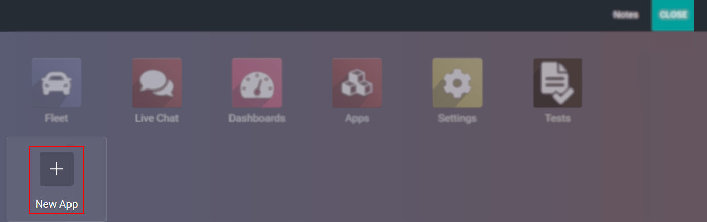
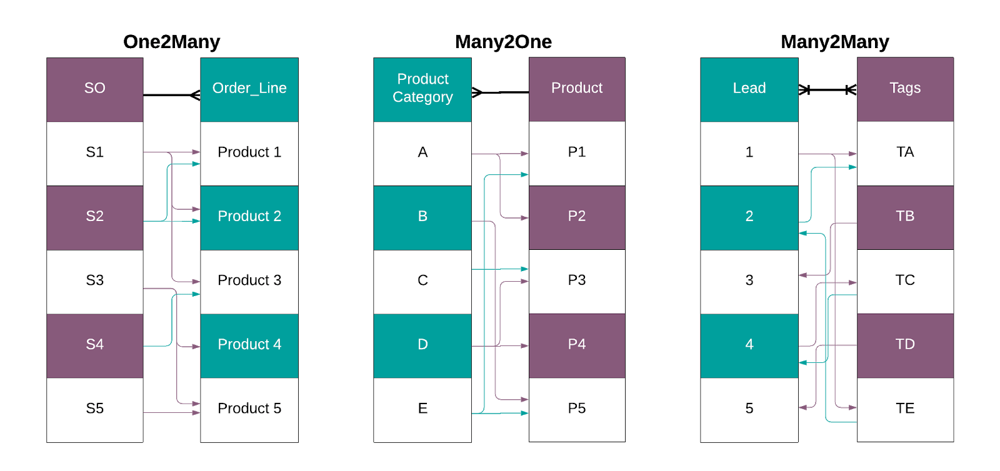
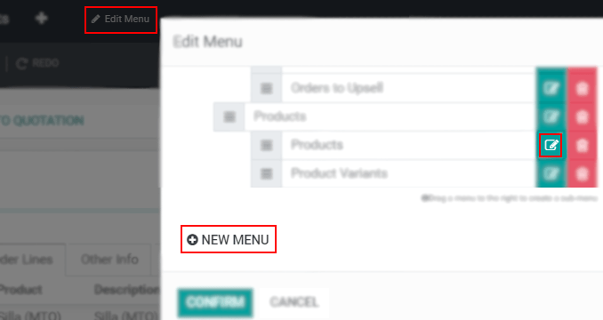

==============================
Understanding General Concepts
==============================

| Odoo Studio is a toolbox that allows you to add models or adapt functionalities on top of Odoo’s
  standard behavior without coding knowledge. You can also create custom views and modify existing
  ones without having to get into the XML code.
| Even for experienced developers, typing out code requires time. By using Odoo Studio, you can
  quickly get your models up and going and focus on the crucial parts of your application. The
  result is a user-friendly solution that makes customizations and designing new applications easy
  with or without programming skills.

Getting started
===============

One you start using Odoo Studio, you automatically create a new *module* that contains all your
modifications. These modifications can be done on existing screens (*views*), by adding new
*fields* in existing applications, or by creating an entirely new *model*.

What is a Module?
-----------------

| An Odoo **Module** can contain a number of elements, such as: business objects (models), object
  views, data files, web controllers, and static web data. An application is a collection of modules.
| In object-oriented programming, models usually represent a concept from the real world.
  Example: Odoo has models for Sales Orders, Users, Countries, etc. If you were to build an
  application to manage Real Estate sales, a model that represents the Properties for sale would
  probably be your first step.

.. _studio/concepts/understanding_general/models:

What is a Model (also called Object)?
-------------------------------------

A **Model** determines the logical structure of a database and fundamentally determines in which
manner data can be stored, organized, and manipulated. In other words, a model is a table of
information that can be bridged with other tables.

What are Fields?
----------------

| **Fields** compose models. It is where a record (a piece of data) is registered.
| Example: on the Real Estate application, fields on the Properties model would include
  the price, address, a picture, a link to the current owner, etc.
| There are 2 main types of fields in Odoo: *basic (or scalar) fields* and *relational fields*.
| Basic fields represent simple values, like numbers or text. Relational fields represent relations
  between models. So, if you have a model for *Customers* and another one for *Properties*, you
  would use a relational field to link each Property to its Customer.

Relational Fields in detail
~~~~~~~~~~~~~~~~~~~~~~~~~~~

| **Relational Fields** provide the option to link the data of one model with the data of another
  model.
| In Odoo, relational field types are: *One2many*, *Many2one*, *Many2many*.

| An **One2many** field is a *one-way* direction of selecting *multiple* records from a table.
| Example: a Sales Order can contain multiple Sales Order Lines, which also contain multiple fields
  of information.
| A **Many2one** field is a *one-way* direction of selecting *one* record from a table.
| Example: you can have many product categories, but each product can only belong to one category.
| A **Many2many** field is a *two-way* direction of selecting records from a table.
| Example: multiple tags can be added to a lead’s form.

.. note::
   An *One2many* field must have a *Many2one* related to it.

What are Views?
---------------

**Views** define how records are displayed. They are specified in XML which means that they can be
edited independently from the models that they represent. There are various types of views in Odoo,
and each of them represents a mode of visualization. Some examples are: *form*, *list*, *kanban*.

What is a Menu?
---------------

A **Menu** is a button that executes and action. In Odoo Studio, to create menus (models) and
rearrange their hierarchy, click on *Edit Menu*.

.. seealso::
   - `Studio Basics <https://www.odoo.com/fr_FR/slides/studio-31>`_