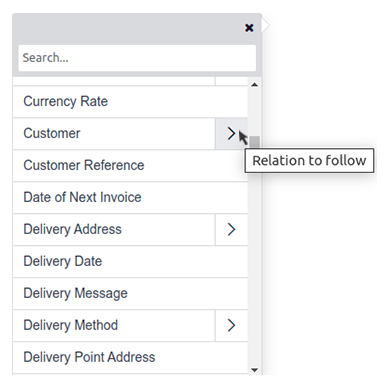

===========
PDF reports
===========

With Studio, you can :ref:`edit existing PDF reports <studio/pdf-reports/edit>` (e.g., invoices,
quotations, etc.) or :ref:`create new ones <studio/pdf-reports/edit>`.

.. _studio/pdf-reports/default-layout:

Default layout
==============

The default layout of reports is managed outside Studio. Go to :menuselection:`Settings`, then, in
the :guilabel:`Companies` section, click :guilabel:`Configure Document Layout`. Layout settings are
company-specific but apply to all reports.

.. tip::
   You can see how the different settings affect the report layout in the report preview on the
   right, or download  a sample invoice PDF by clicking :guilabel:`Download PDF Preview`.

Use the following settings:

.. _studio/pdf-reports/default-layout/layout:

- :guilabel:`Layout`: Four layouts are available:

  .. tabs::

     .. tab:: Light

        .. image:: pdf_reports/layout-light.png
           :alt: Light report layout sample

     .. tab:: Boxed

        .. image:: pdf_reports/layout-boxed.png
           :alt: Boxed report layout sample

     .. tab:: Bold

        .. image:: pdf_reports/layout-bold.png
           :alt: Bold report layout sample

     .. tab:: Striped

        .. image:: pdf_reports/layout-striped.png
           :alt: Striped report layout sample

.. _studio/pdf-reports/default-layout/font:

- :guilabel:`Font`: Seven fonts are available: Lato, Roboto, Open Sans, Montserrat, Oswald, Raleway,
  and Tajawal (which supports Arabic and Latin scripts). Go to the
  `Google Fonts website <https://fonts.google.com/>`_ to preview them.

.. _studio/pdf-reports/default-layout/logo:

- :guilabel:`Company logo`: Click the :guilabel:`Edit` button to upload or change the logo. This
  adds the logo to the company’s record on the *Company* model, which you can access by going to
  :menuselection:`Settings` and then clicking :guilabel:`Update Info` in the :guilabel:`Companies`
  section.

.. _studio/pdf-reports/default-layout/colors:

- :guilabel:`Colors`: Change the primary and secondary colors used to structure reports. The default
  colors are automatically generated based on the colors of the logo.

.. _studio/pdf-reports/default-layout/background:

- :guilabel:`Layout background`: The following backgrounds are available:

  - :guilabel:`Blank`: nothing is displayed.
  - :guilabel:`Geometric`: an image featuring geometric shapes is displayed in the background.
  - :guilabel:`Custom`: upload a custom background image.

.. _studio/pdf-reports/default-layout/tagline:

- :guilabel:`Company tagline`: This is displayed in the header of :ref:`external reports
  <studio/pdf-reports/header-footer/external>`. You can add multiple lines of text.

.. _studio/pdf-reports/default-layout/details:

- :guilabel:`Company details`: These are displayed in the header of :ref:`external reports
  <studio/pdf-reports/header-footer/external>`. You can add multiple lines of text.

.. _studio/pdf-reports/default-layout/footer:

- :guilabel:`Footer`: This text is used in the footer of :ref:`external reports
  <studio/pdf-reports/header-footer/external>`. You can add multiple lines of text. You can also
  edit the footer using the :ref:`report editor <studio/pdf-reports/edit>`.

.. _studio/pdf-reports/default-layout/paper:

- :guilabel:`Paper format`: to define the default paper size of reports. You can select
  :guilabel:`A4` (21 cm x 29.7 cm), :guilabel:`US Letter` (21.59 cm x 27.54 cm), or
  :guilabel:`QR codes page`. This can also be defined for individual reports in the
  :guilabel:`Paper format` field in :ref:`Studio <studio/pdf-reports/create>`.

.. _studio/pdf-reports/create:

Creating new PDF reports
========================

To create a new report for a model, access the model, click the **Toggle Studio** button, then click
:guilabel:`Reports`. Click :guilabel:`New` and, in the popup window that opens, select the type of
report. This is solely used to determine what is displayed in the header and footer:

.. _studio/pdf-reports/header-footer/external:

- :guilabel:`External`:

  - The header displays the company's :ref:`logo <studio/pdf-reports/default-layout/logo>`,
    :ref:`tagline <studio/pdf-reports/default-layout/tagline>`, and
    :ref:`details <studio/pdf-reports/default-layout/details>`.
  - The footer displays the values set in the
    :ref:`Footer <studio/pdf-reports/default-layout/footer>` field and the page number.

- :guilabel:`Internal`: The header displays the user's current date and time,
  :guilabel:`Company Name`, and page number. There is no footer.

- :guilabel:`Blank`: There is neither a header nor a footer. Click in the upper left corner of the
  page to edit the report.

Once you have created the report, you can start :ref:`editing it <studio/pdf-reports/edit>`.

.. _studio/pdf-reports/edit:

Editing PDF reports
===================

To access the reports available for a model, access the model (e.g., sales orders), click the
**Toggle Studio** button, then click :guilabel:`Reports`. Select an existing report to open it or
:ref:`create a new one <studio/pdf-reports/create>`.

.. tip::
   Alternatively, you can also open Studio, click :guilabel:`Reports`, and search for a specific
   report or model.

.. important::
   It is strongly recommended to **duplicate** the standard report and perform changes in the
   duplicated version. To duplicate a report, hover the mouse pointer on the top right corner
   of the report, click the vertical ellipsis icon (:guilabel:`⋮`), and then select
   :guilabel:`Duplicate`.

   .. image:: pdf_reports/duplicate-report.png
      :alt: Duplicating a PDF report

Options
-------

Once you've selected or created a report, you can use the options in the left part of the screen to:

- Change the :guilabel:`Report name`. The new name is applied everywhere (in Studio, under
  the :guilabel:`Print` button, and in the PDF file name).
- Modify the :guilabel:`Paper format`. If no value is selected, the format defined in the
  :ref:`default layout <studio/pdf-reports/default-layout/paper>` is used.
- :guilabel:`Show in print menu`: to add the report in the :guilabel:`Print` menu available from the
  record.
- :guilabel:`Reload from attachment`: to save the report as an attachment on the record the first
  time it is generated and reload the original version of the report any subsequent time. This is
  legally required for invoices and is mainly used in this case.
- :guilabel:`Limit visibility to groups`: to limit the availability of the PDF report to specific
  :doc:`user groups <../../general/users/access_rights>`.
- :guilabel:`Edit sources`: to modify the report directly in the :ref:`XML file
  <studio/pdf-reports/XML-editing>`.
- :guilabel:`Reset report`: to discard all changes made to the report and reset it to its standard
  version.
- :guilabel:`Print preview`: to generate and download a report preview.

Report editor
-------------

The report editor allows you to modify the formatting and contents of the report.

.. tip::
  - You can :guilabel:`Undo` or :guilabel:`Redo` changes using the related buttons or the shortcuts
    `CTRL Z` and `CTRL Y`.

  - Changes are saved automatically when you leave the report or manually using the
    :guilabel:`Save` button.

  - You can reset the report to its standard version by clicking the :guilabel:`Reset report` button
    in the left part of the screen.

.. important::
   Editing the header and footer of a report impacts all standard and custom reports.

Conditional blocks
~~~~~~~~~~~~~~~~~~

The dashed rectangles represent **conditional blocks** (*if/else* statements). These are used to
show/hide content based on specific conditions. Click on the block to view the conditions.

.. image:: pdf_reports/conditional-block-if.png
   :alt: View conditions applied to a block.

Select a value to preview its corresponding output and edit it if necessary.

.. image:: pdf_reports/conditional-block-else.png
   :alt: Preview the output of another condition.

.. note::
   Conditions can only be edited in :ref:`XML <studio/pdf-reports/XML-editing>`.

Other content
~~~~~~~~~~~~~

There are two types of text content in reports:

- Static text, i.e., the text that's not highlighted in blue, which can be modified directly in the
  editor.
- Dynamic text, i.e., the text that's highlighted in blue, which is replaced by field values when
  the report is generated, e.g., the SO number or the quotation date.

You can add content (e.g., fields, lists, tables, images, banners, etc.) to the report using
commands. Type `/` to open the :ref:`powerbox <knowledge/powerbox>`, then type the command's
name or select it from the list.

To add static text to the report, type the text where you want it.

For more advanced changes, you can :ref:`edit the report in the XML directly
<studio/pdf-reports/XML-editing>`.

.. _studio/pdf-reports/add-field:

Add a field
***********

To add a field, type `/` and select the :guilabel:`Field` command. In the list that opens, select
or search for the field; click the right arrow next to the field name to access the list of related
fields if needed. Then, specify the default value and press `Enter`.

Add a data table
****************

Data tables are used to display :ref:`relational fields <studio/fields/relational-fields>`. To add
a data table, type `/`, select the :guilabel:`Dynamic Table` command, and select the relation to be
displayed in the table.

.. note::
   Only relations of type `one2many` or `many2many` can be displayed as data tables.

Once the table has been added, you can add columns using the table tools. Position the cursor on top
of the column, then click the purple rectangle and select an option.

.. image:: pdf_reports/table-add-column.png
   :alt: Add a column in a dynamic table.

You can then insert the :ref:`field of your choice
<studio/pdf-reports/add-field>` in the columns. The dialog box that opens shows the source object
for the field (e.g., the *Tag* model) and the list of available fields.

.. image:: pdf_reports/dynamic-table.png
   :alt: List of available fields for the Tag model.

.. note::
   - The default row automatically iterates over the field's content, generating a row on the report
     for each field value (e.g., one row per tag). You can add static content rows above or below
     the generated rows using the table tools.
   - You can also add data tables by :ref:`modifying the report's XML <studio/pdf-reports/XML-editing>`.

Formatting
**********

To format text in the report, select it, then format it using the options in the
:ref:`knowledge/text-editor`.

  .. image:: pdf_reports/text-editor.png
     :alt: Format text using the text editor.

.. _studio/pdf-reports/XML-editing:

Editing the report's XML
------------------------

.. warning::
   Modifying the XML directly may result in report issues during :doc:`upgrades
   <../../../administration/upgrade>`. If this happens, simply copy your changes from the old
   database into your upgraded database.

To edit the report's XML, click :guilabel:`Edit sources` in the left pane.

Examples
~~~~~~~~

.. spoiler:: Modify a non-compliant table

   Sometimes, tables are not properly recognized as such due to complex structures. In those cases,
   you can still modify them manually in the report XML. For example, with a sales order, you can
   find the following structure in the XML (simplified for documentation purposes):

    .. code-block:: xml

       <!-- table root element -->
       <table>
           <!-- thead = table header, the row with column titles -->
           <thead>
               <!-- table row element -->
               <tr>
                   <!-- table header element -->
                   <th>Name</th>
                   <th>Price</th>
               </tr>
           </thead>
           <!-- table body, the main content -->
           <tbody>
               <!-- we create a row for each subrecord with t-foreach -->
               <tr t-foreach="record.some_relation_ids" t-as="line">
                   <!-- for each line, we output the name and price as table cells -->
                   <td t-out="line.name"/>
                   <td t-out="line.price"/>
               </tr>
           </tbody>
       </table>

    To modify a table, you must ensure that each row has the same number of data cells. For example,
    in the case above, you need to add a cell in the header section (with e.g., the column title)
    and another one in the body section with the field content (usually, with a `t-out` or
    `t-field` directive).

    .. code-block:: xml
       :emphasize-lines: 6,13

       <table> <!-- table root element -->
           <thead> <!-- thead = table header, the row with column titles -->
               <tr> <!-- table row element -->
                   <th>Name</th> <!-- table header element -->
                   <th>Price</th>
                   <th>Category</th>
               </tr>
           </thead>
           <tbody>  <!-- table body, the main content -->
               <tr t-foreach="record.some_relation_ids" t-as="line">  <!-- we create a row for each subrecord with t-foreach -->
                   <td t-out="line.name"/>  <!-- for each line, we output the name and price as table cells -->
                   <td t-out="line.price"/>
                   <td t-out="line.category_id.display_name"/>
               </tr>
           </tbody>
       </table>

    .. note::
       Cells can span multiple rows or columns. For more information, go to the
       `Mozilla Developer Network website <https://developer.mozilla.org/en-US/docs/Learn/HTML/Tables/Basics>`_.

    For example, you can modify the **Quotation/Order** report to add a column to display the
    product category in the main table:

      .. code-block:: xml
         :emphasize-lines: 6,13

         <table class="table table-sm o_main_table table-borderless mt-4">
             <!-- In case we want to repeat the header, remove "display: table-row-group" -->
             <thead style="display: table-row-group">
                 <tr>
                     <th name="th_description" class="text-start">Description</th>
                     <th>Product Category</th>
                     <th name="th_quantity" class="text-end">Quantity</th>
                     <th name="th_priceunit" class="text-end">Unit Price</th>
         [...]
                     <tr t-att-class="'bg-200 fw-bold o_line_section' if line.display_type == 'line_section' else 'fst-italic o_line_note' if line.display_type == 'line_note' else ''">
                         <t t-if="not line.display_type">
                             <td name="td_name">Bacon Burger</td>
                             <td t-out="line.product_id.categ_id.display_name"/>
                             <td name="td_quantity" class="text-end">
                                 3
                                 units
                                 

    .. image:: pdf_reports/XML-SO-product-category.png
       :alt: Add a Product Category column in a SO.

.. spoiler:: Add a data table

   To add a table in XML, you need to know the names of the fields and objects you wish to access
   and display. As an example, let's add a table that details the tags on a sales order:

   .. code-block:: xml

      <!-- table root element -->
      <table class="table">
          <!-- thead = table header, the row with column titles -->
          <thead>
              <!-- table row element -->
              <tr>
                  <!-- table header element -->
                  <th>ID</th>
                  <th>Name</th>
              </tr>
          </thead>
          <!-- table body, the main content -->
          <tbody>
              <!-- we create a row for each subrecord with t-foreach -->
              <tr t-foreach="doc.tag_ids" t-as="tag">
                  <!-- for each line, we output the name and price as table cells -->
                  <td t-out="tag.id"/>
                  <td t-out="tag.name"/>
              </tr>
          </tbody>
      </table>

   .. image:: pdf_reports/XML-data-table.png
      :alt: Add a data table in XML

   .. note::
      When adding tables manually, style them using `Bootstrap classes
      <https://getbootstrap.com/docs/5.1/content/tables>`_, like the `table` class included in the
      example above.

.. spoiler:: Conditional blocks

   If you want to show/hide content based on specific conditions, you can manually add `if/else`
   control statements in the report XML.

   For example, if you want to hide a custom data table if there are no tags, you can use the `t-if`
   attribute to define the condition, which is then evaluated as `True` or `False`. The table will
   not be displayed if there are no tags in the quotation.

   .. code-block:: xml
      :emphasize-lines: 2

      <!-- table root element -->
      <table class="table" t-if="len(doc.tag_ids) > 0">
          <!-- thead = table header, the row with column titles -->
          <thead>
              <!-- table row element -->
              <tr>
                  <!-- table header element -->
                  <th>ID</th>
                  <th>Name</th>
              </tr>
          </thead>
          <!-- table body, the main content -->
          <tbody>
              <!-- we create a row for each subrecord with t-foreach -->
              <tr t-foreach="doc.tag_ids" t-as="tag">
                  <!-- for each line, we output the name and price as table cells -->
                  <td t-out="tag.id"/>
                  <td t-out="tag.name"/>
              </tr>
          </tbody>
      </table>

   If you want to display another block in case the `t-if` statement is evaluated as `False`, you
   can specify it using the `t-else` statement. The `t-else` block must directly follow the `t-if`
   block in the document structure. There is no need to specify any condition in the `t-else`
   attribute. As an example, let's show a quick message explaining that there are no tags on the
   quotation:

   .. code-block:: xml
      :emphasize-lines: 22

      <!-- table root element -->
      <table class="table" t-if="len(doc.tag_ids) > 0">
          <!-- thead = table header, the row with column titles -->
          <thead>
              <!-- table row element -->
              <tr>
                  <!-- table header element -->
                  <th>ID</th>
                  <th>Name</th>
              </tr>
          </thead>
          <!-- table body, the main content -->
          <tbody>
              <!-- we create a row for each subrecord with t-foreach -->
              <tr t-foreach="doc.tag_ids" t-as="tag">
                  <!-- for each line, we output the name and price as table cells -->
                  <td t-out="tag.id"/>
                  <td t-out="tag.name"/>
              </tr>
          </tbody>
      </table>
      
No tag present on this document.

   By using the `t-if/t-else` notation, the report editor recognizes that these sections are
   mutually exclusive and should be displayed as conditional blocks:

   .. image:: pdf_reports/XML-condition-if.png
      :alt: Output preview if there are tags.

   You can switch conditions using the editor to preview their output:

   .. image:: pdf_reports/XML-condition-else.png
      :alt: Output preview if there are no tags.

   If you wish to have multiple options, you can also use `t-elif` directives to add intermediary
   conditions. For example, this is how the title of sales order reports changes based on the
   condition of the underlying document.

   .. code-block:: xml

      <h2 class="mt-4">
          Pro-Forma Invoice # 
          Quotation # 
          Order # 
          SO0000
      </h2>

   The title *Pro-Forma Invoice* is used depending on some contextual conditions. If these
   conditions are not met and the state of the document is either `draft` or `sent`, then
   *Quotation* is used. If none of those conditions are met, the report's title is *Order*.

.. spoiler:: Images

   Working with images in a report can be challenging, as precise control over image size and
   behavior is not always obvious. You can insert image fields using the report editor
   (:ref:`by using the /Field command <studio/pdf-reports/add-field>`), but inserting them in XML
   using the `t-field` directive and accompanying `t-options` attributes provides better sizing and
   positioning control.

   For example, the following code outputs the field `image_128` of the line's product as a
   64px-wide image (with an automatic height based on the image's aspect ratio).

   .. code-block:: xml

      

   The following options are available for image widgets:

   - `width`: width of the image, usually in pixels or CSS length units (e.g., `rem`) (leave empty
     for auto-width).
   - `height`: height of the image, usually in pixels or CSS length units (e.g., `rem`) (leave empty
     for auto-height).
   - `class`: CSS classes applied on the `img` tag; `Bootstrap classes
     <https://getbootstrap.com/docs/5.1/content/tables>`_ are available.
   - `alt`: alternative text of the image
   - `style`: style attribute; it allows you to override styles more freely than with
     `Bootstrap classes <https://getbootstrap.com/docs/5.1/content/tables>`_.

   These attributes must contain strings, i.e., text enclosed within quotes within quotes, e.g.,
   `t-options-width="'64px'"` (or, alternatively, a valid Python expression).

   .. note::
      The image widget cannot be used on an `img` tag. Instead, set the `t-field` directive on a
      `span` (for inline content) or `div` (for block content) node.

   For example, let's add a column with the product image in the quotation table:

   .. code-block:: xml
      :emphasize-lines: 4,14-20

      <table class="table table-sm o_main_table table-borderless mt-4">
          <thead style="display: table-row-group">
              <tr>
                  <th>Image</th>
                  <th name="th_description" class="text-start">Description</th>
                  <th>Product Category</th>
                  <th name="th_quantity" class="text-end">Quantity</th>
                  <th name="th_priceunit" class="text-end">Unit Price</th>
      [...]
              <t t-foreach="lines_to_report" t-as="line">
                  <t t-set="current_subtotal" t-value="current_subtotal + line.price_subtotal"/>
                  <tr t-att-class="'bg-200 fw-bold o_line_section' if line.display_type == 'line_section' else 'fst-italic o_line_note' if line.display_type == 'line_note' else ''">
                      <t t-if="not line.display_type">
                         <td>
                             
                         </td>
                          <td name="td_name">Bacon Burger</td>
                          <td t-out="line.product_id.categ_id.display_name"/>

   The `t-options-width` attribute restricts the image width to 64 pixels, and the Bootstrap classes
   used in `t-options-class` create a thumbnail-like border with rounded corners and a shadow.

   .. image:: pdf_reports/XML-images.png
      :alt: Add a column with the product image in the quotation table.
