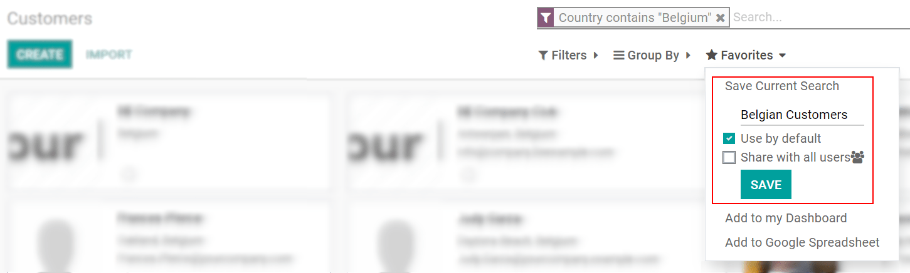
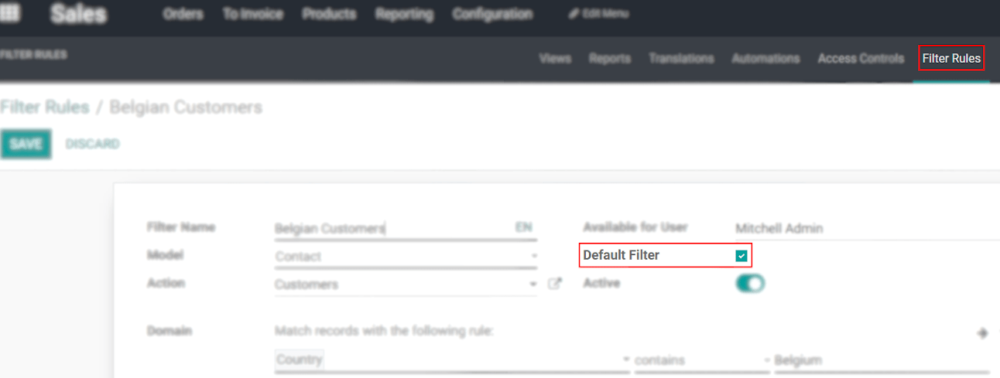
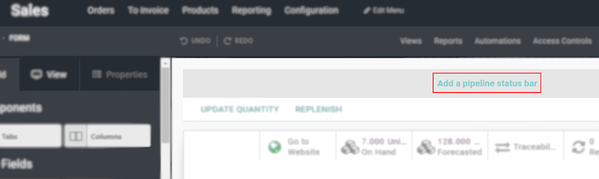
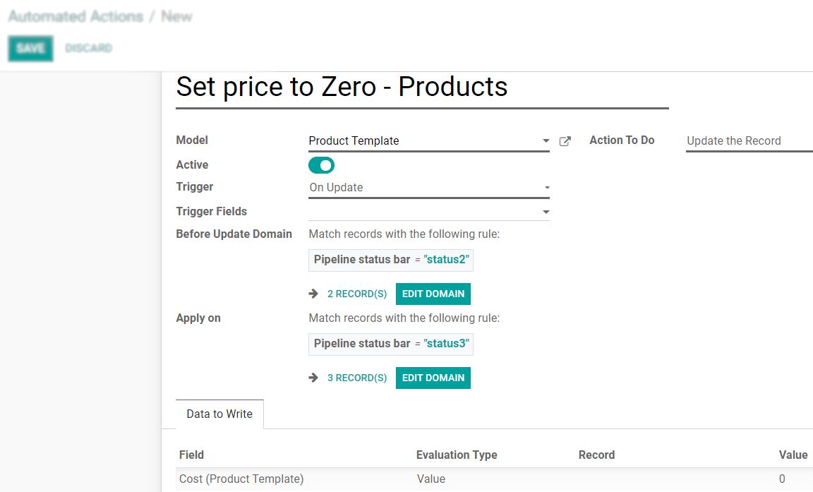

==========================================
Advanced Use Cases: Filters and Status Bar
==========================================

- **Case scenario 1: on Sales, set a filter on Belgian customers and define it as the default one
  (the user should still be able to unset the filter).**

On your customer’s page, use *Filters* > *Add Custom Filter* to group customers by country. Now,
under *Favorites*, *Save Current Search* enabling *Use by default* and *Save*.

On *Filter Rules* in Studio mode, select the respective filter and enable *Default Filter*.

- **Case scenario 2: add a status bar on the product form to manage its life cycle. Set the values:
  ‘Prototype’, ‘In use’ and ‘Deprecated’. By default, the Kanban view must be grouped by status.**

| On your product form, *Add a pipeline status bar* and name its values. Status bars are *selection*
  fields that give you the ability to follow a specific flow. They are useful to show you the
  progress that has been made.
| On the *Views* menu, access *Kanban* and, under its *View* options, set the *Default Group by* as
  *Pipeline status bar*.

Now, open your product form and set the right status for that product. As you move products
throughout stages (also through the product’s form), stages are shown in the Kanban view.

.. tip::
   To make modifications in the pipeline status bar, for example, remember to go back to *Form View*.

   .. image:: media/filters_status_bar/form_view.png
      :align: center
      :alt: View of Studio emphasizing the form view button in Odoo Studio

- **Case scenario 2.a: when a product goes from ‘In use’ to ‘Deprecate’, set its cost to 0€.**

Create an :doc:`automated action <../concepts/understanding_automated_actions>` with the selected
values:

- *Model*: Product Template
- *Trigger*: On Update
- *First Domain*: Pipeline status bar = In use
- *Second Domain*: Pipeline status bar = Deprecated
- *Action To Do*: Update the Record
- *Data to Write*: Cost (Product Template) > Value > 0

.. seealso::
   - :doc:`../concepts/understanding_general`