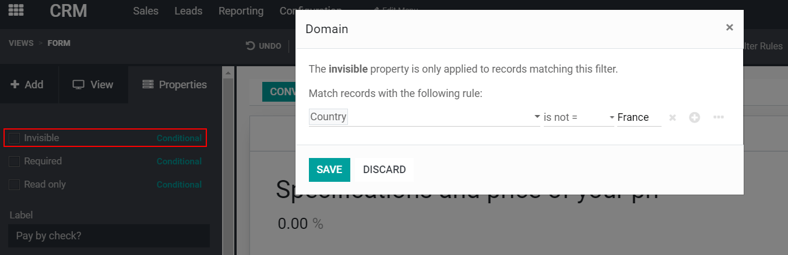
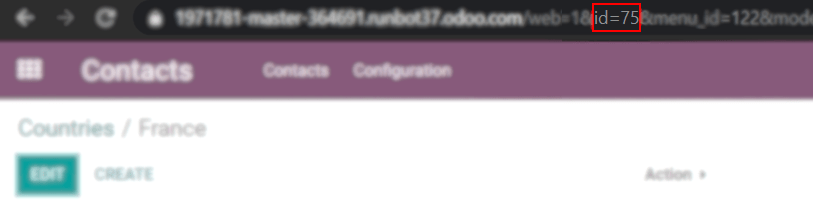
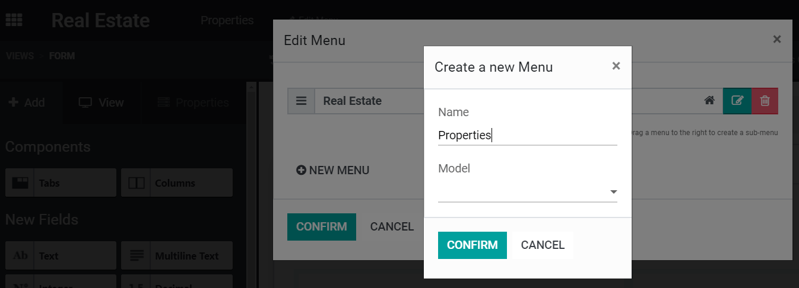
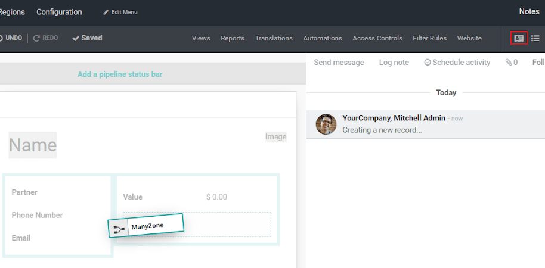
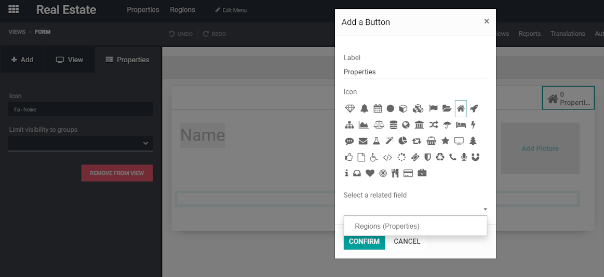
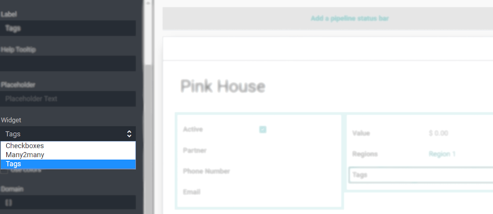
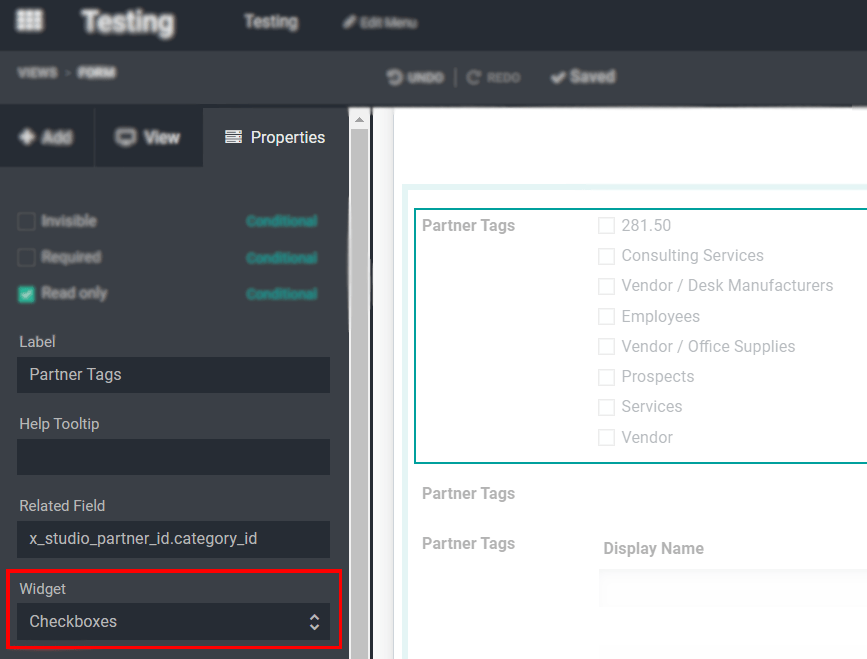
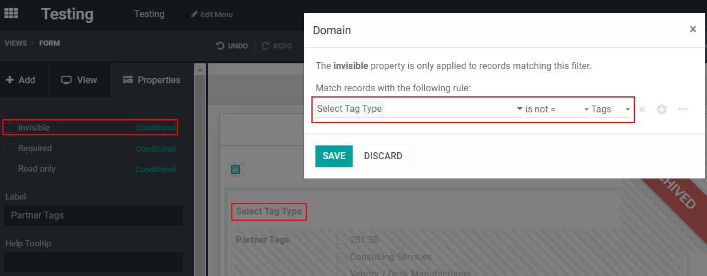
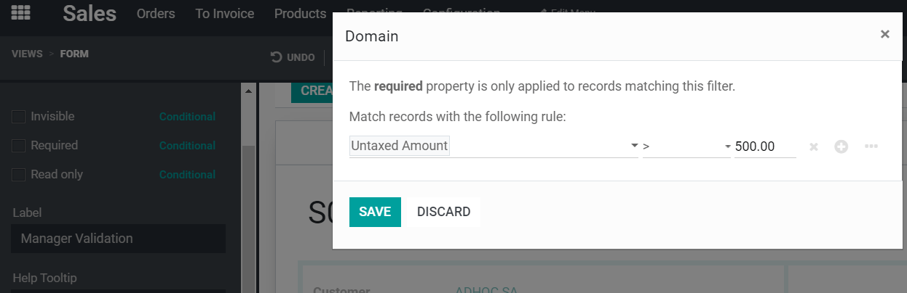
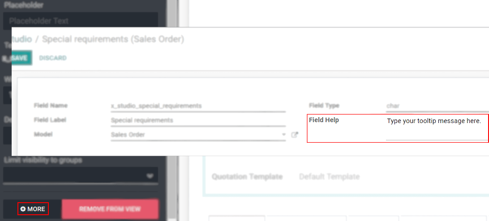

=====================================================
Advanced Use Cases: Creating Models and Adding Fields
=====================================================

- **Case scenario 1: on the leads’ form, if the chosen country is France, show a field
  'Pay by check?'**

| On your leads’ form, add a *Related Field* to *Country > Country Name*.
| Now, add a *Checkbox* field and define its invisibility options as *Country* (carefully select
  the one just created) *> is not = > France.*
| You can now hide the related field created (*Country*) if you wish.

| Another approach is to use the country’s ID. To do so, go to
  :menuselection:`Contacts --> Configuration --> Countries`, select France (for example), and on the
  URL check its *ID*.
| The related field invisibility path should now be *Country* (carefully select the one just
  created) *> is not = > 75*.
| Again, hide the related field with the country’s ID if you prefer.

- **Case scenario 2: create a model called 'Properties' and add fields called: company, value, name,
  address, active, image.**

From the dashboard, (optionally) start a new module. Then, click on *Edit Menu* and start a
*New Menu* (model). Set your menu name and *Confirm*. Now, on its form, drag & drop the necessary
fields.

- **Case scenario 2.a: now, you would like to have a model called 'Regions' to which each property
  must be linked. And, on 'Regions', you would like to see the properties for each region.**

| Go to *Edit Menu > New Menu* and create your menu, calling it *Regions*. Add the necessary fields
  on its form by dragging & dropping them.
| Now, in the form view of *Properties*, add a *Many2one* field with a relation to your model
  *Region*.

.. tip::
   The *Existing Fields* are the ones that are on the current model but not yet in the view.

   .. image:: media/models_fields/new_existing_fields.png
      :align: center
      :height: 420
      :alt: Form view and a Many2one field being dropped in Odoo Studio

| Now, go to the model *Regions*, select the form view, and add a status button selecting *Regions
  (Properties)* as your relational field.
| *Status buttons* are computed fields, meaning that they count the numbers of records on the
  related model, and allow you to access them.

.. tip::
   When searching for relations, click on *Search more* and filter it by *Custom*. This way you
   avoid creating duplicates.

   .. image:: media/models_fields/search_model_custom.png
      :align: center
      :alt: View of the search model window in Odoo Studio

- **Case scenario 2.b: in the model 'Properties', show all the tags as checkboxes instead of tags.**

Once the field *Tags* is added to the form, select it and, under its *Properties > Widgets*, choose
*Checkboxes*.

- **Case scenario 3: on the leads’ form, add a selection field with the values:'Tags' & 'List' &
  'Checkboxes'. According to the value of the field, show tags as many2many_tags, many2many_radio,
  or many2many(_list).**

In your form view, add a *Tags* field and relate it to *Partners Tag*. Under *Properties*, define
its *Widget* as *Many2many*. Do the same process another 2 times for *Checkboxes* and *Tags*.

| Now, add a *Selection* field and the necessary values.
| Continue by selecting your *Tags* fields, one by one, to set their *Invisible* options according
  to their *Widget*. In the example below, the invisibility rule for the *Partner Tags* is set as:
  *Select Tag type > is not = > Tags.*

- **Case scenario 4: on a quotation’s form, add a selection field called 'Manager Validation' with
  the values: ‘Accepted’ and ‘Refused’. Only a sales manager can see it, and the field should be
  set as mandatory if the untaxed amount is higher than 500€.**

On your quotation form, add a *Selection* field with the values *Accepted* and *Refused*. Set its
*Required* condition as *Untaxed Amount > 500* and the *Limit visibility to groups* as *Sales /
Administrator* or managers.

- **Case scenario 5: change the tooltip of a field for all views.**

| Activate the :doc:`Developer mode <../../../general/developer_mode/activate>` and open Studio.
| Select the necessary field and, under *Properties*, click on *More* to write your tooltip message
  on *Field Help*. The tooltip message is the explanatory message shown when the user hovers the
  field. The message here written is displayed on all views forms where the field is added.

.. note::
   The *Field Help* message can only be applied to *new* fields. If you would like to change/apply a
   tooltip for a specific field, use the *Help Tooltip* option under *Properties*.

   .. image:: media/models_fields/help_tooltip.png
      :align: center
      :height: 350
      :alt: View of the properties emphasizing the help tooltip option in Odoo Studio

.. seealso::
   - :doc:`../concepts/understanding_general`

