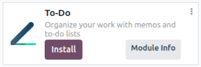
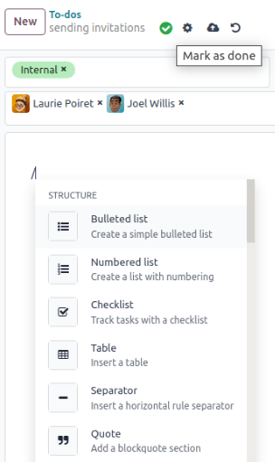
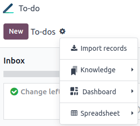

=====
To-do
=====

The To-Do app assists users in efficiently organizing and managing their work. It enables seamless
collaboration and streamlined workflows across different aspects of the business, offering features
such as creating and assigning tasks, setting deadlines, creating memos and to-do lists, monitoring
progress, and much more.

Configuration
=============

If To-Do is not yet installed on your database, go to the :guilabel:`Apps`, search for it, and click
:guilabel:`Install`.

.. _to-do/personal-stages:

Personal stages
===============

Your assigned to-dos are displayed on your dashboard in different by-default stages:

- :guilabel:`Inbox`: new to-dos;
- :guilabel:`Today`: to-dos of the day;
- :guilabel:`This Week`: to-dos of the week;
- :guilabel:`This Month`: to-dos of the month;
- :guilabel:`Later`: to-dos planned for later;
- :guilabel:`Done`: to-dos that are done;
- :guilabel:`Canceled`: to-dos that have been canceled.

.. note::
   - Drag and drop a task to move it from one stage to another.
   - Click the Settings button on a specific stage to :guilabel:`Fold`, :guilabel:`Edit`, or
     :guilabel:`Delete` the stage.

      .. image:: to_do/fold-edit-delete.png
         :align: center
         :alt: Settings button

Creating to-dos
===============

To create a to-do, click :guilabel:`New` or the **+** button next to a stage name. A new card pops
up. Add a title to your to-do, then click :guilabel:`Add` to save it, or :guilabel:`Edit` if you
want to edit it.

.. tip::
   You can create a new to-do on the fly from any app in Odoo by clicking the clock icon, and
   :guilabel:`Add a To-Do`:

   .. image:: to_do/add-a-to-do-on-the-fly.png
      :align: center
      :alt: Add a to-do on the fly

Editing to-dos
==============

Different actions are possible in a to-do:

- :guilabel:`Mark as done`: click the check mark button when the task has been completed;
- :guilabel:`Archive`, :guilabel:`Duplicate`, :guilabel:`Delete`, :guilabel:`Dashboard`, or
  :guilabel:`Convert to task`: click on the cog icon to see these options;
- :guilabel:`Tags`: select tags from the dropdown list to categorize your to-do. You can create a
  new tag simply by writing it;
- :guilabel:`Assignees`: select one or more users from the dropdown list to assign your to-do;
- **Customize your tasks content**: when typing / in the text area, a dropdown list of features
  related to the structure, format, media, navigation, widgets, banner, or basic blocks appear.
- :ref:`Personal stages <to-do/personal-stages>`: move your task to another stage by clicking on
  your desired stage.

.. note::
   To-dos, like private tasks, are only accessible to the users specified as assignees. You can use
   the :guilabel:`Assignees` field to share a to-do with other users.

Scheduling activities
=====================

To help you get things done, you can schedule activities. From a to-do, click on
:guilabel:`Activities`; or from the dashboard, click the clock icon on a to-do card, then
:guilabel:`+ schedule an activity`:

.. image:: to_do/schedule-activity.png
      :align: center
      :alt: schedule an activity

Then, fill in the required fields:

- :guilabel:`Activity type`: select the type of activity from the list;
- :guilabel:`Summary`: add a brief description of the activity;
- :guilabel:`Due date`: select the date the activity is due to;
- :guilabel:`Assigned to`: select an assignee for the activity;
- :guilabel:`Log a note`: you can add further description to the activity.

Click :guilabel:`Schedule`.

Convert to-dos into tasks
=========================

You can convert a to-do into a task and assign it to a project by going to the to-do you want to
convert, click the cog icon and :guilabel:`Convert to Task`. Select the :guilabel:`Project` you
want, add :guilabel:`Assignees`, :guilabel:`tags`, and click :guilabel:`Convert to Task`. The to-do
is now like a private task and appears in the Project app under :guilabel:`My Tasks`.

.. tip::
   When converting a to-do into a task, add or remove assignees to control who has access to the
   task. Note that its visibility also depends on the visibility settings of the project you are
   assigning it to.

Additional features
===================

Click the cog icon to display additional features:

:guilabel:`Import records`: to upload an Excel or CSV file to import in your to-do. Click
:guilabel:`Upload File`, select the file you want to import, then click :guilabel:`Select`.

:guilabel:`Knowledge`: to Insert a view of your to-dos in an article, click
:guilabel:`Insert View in article`, select the article, and click :guilabel:`New`. To insert a link
to your to-dos in an article, click :guilabel:`Insert Link in article`, select the article, and
click :guilabel:`New`.

:guilabel:`Dashboard`: to add your to-dos to :guilabel:`My Dashboard`, in the Dashboard app, click
:guilabel:`Add`.

:guilabel:`Spreadsheet`: to insert a link to your to-dos in a spreadsheet, select your spreadsheet
and click :guilabel:`confirm`.

.. tip::
   - Use the search bar to filter, group by, or save your search.
   - Use the different views to display your to-dos:

     - :guilabel:`Kanban`: it displays records as “cards” among different stages;
     - :guilabel:`List`: records are listed and grouped by stage;
     - :guilabel:`Activity`: used to display the activities linked to the to-dos. Data are displayed
       in a chart with the records forming the rows and the activity types the columns.
