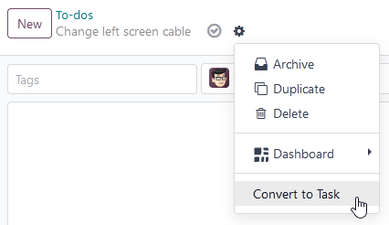
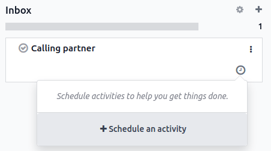
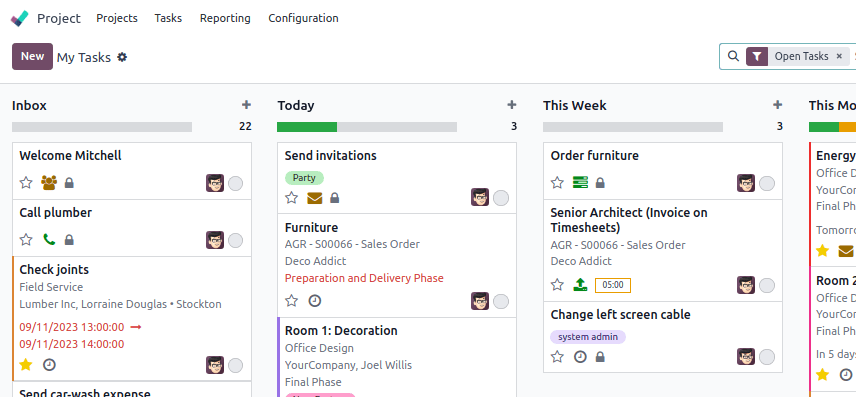

=====
To-do
=====

To-do assists you in organizing and managing personal tasks.

Creating to-dos
===============

To create a to-do, click :guilabel:`New` or the plus button (:guilabel:`➕`) next to a stage name.
Add a title to your to-do, then click :guilabel:`Add` to save it or :guilabel:`Edit` to access more
options.

If you choose to :guilabel:`Edit` a to-do, you have the option to add :guilabel:`Tags`,
:guilabel:`Assignees`, or more information using the Odoo Editor.

.. note::
   - Adding :guilabel:`Assignees` shares the to-do with the users selected.
   - Type `/` in the editor box to structure and format your content. You can also add media, links,
     and widgets.

.. tip::
   You can create a new to-do on the fly from anywhere in Odoo by opening the **command palette
   tool** with the keyboard shortcut ´ctrl+k´ and clicking :guilabel:`Add a To-Do`, or by clicking
   the clock button and then :guilabel:`Add a To-Do`.

   .. image:: to_do/add-on-the-fly.png
      :alt: Adding a to-do on the fly

Converting to-dos into project tasks
------------------------------------

If you use the :doc:`Project app <../services/project>`, you can convert to-dos into project tasks.
To do so, open a to-do and click the gear button (:guilabel:`⚙`), then :guilabel:`Convert to Task`.

Next, select the :guilabel:`Project`, :guilabel:`Assignees`, and :guilabel:`Tags`, then click
:guilabel:`Convert to Task`. The to-do is now a project task and appears in the selected project.

Managing the to-do pipeline
===========================

Your assigned **to-dos** are displayed on the app dashboard. You can drag and drop a to-do to move
it from one stage to another.

.. image:: to_do/to-do-pipeline.png
   :alt: Example of a to-do pipeline

.. tip::
   - Click the :guilabel:`+ Personal Stage` button on the left of the pipeline to create a new
     stage.
   - Click the gear button (:guilabel:`⚙`) next to a stage to :guilabel:`Fold`, :guilabel:`Edit`,
     or :guilabel:`Delete` it.

    .. image:: to_do/stage-options.png
       :alt: Stage settings button

Scheduling activities
---------------------

To schedule an activity on a to-do, click the clock button on the app dashboard, then the
:guilabel:`+ Schedule an activity` button.

To create the activity:

- Select an :guilabel:`Activity Type`.
- Select a :guilabel:`Due date`.
- Choose who the activity should be :guilabel:`Assigned to`.
- Add a brief :guilabel:`Summary` if needed. You can add a more elaborate description in the
  :guilabel:`Log a note` box.

Click :guilabel:`Schedule` to complete the action.

.. note::
   The :guilabel:`To Do` activity is *not* a to-do task. Selecting it does not create a to-do task.

Viewing to-dos in the Project app
---------------------------------

If you use the :doc:`Project app <../services/project>`, your to-dos also appear as private tasks
under the :guilabel:`My Tasks` view.

.. note::
   A padlock icon is visible on your private tasks to quickly identify them among your project
   tasks.
