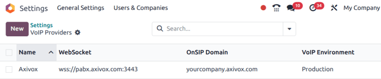
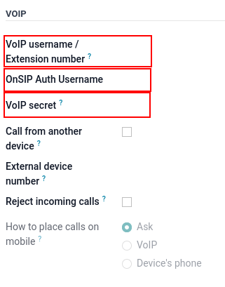

=================================
VoIP services in Odoo with Axivox
=================================

Introduction
============

Odoo VoIP (Voice over Internet Protocol) can be set up to work together with `Axivox
<https://www.axivox.com/>`_. In that case, an Asterisk server is **not** necessary, as the
infrastructure is hosted and managed by Axivox.

To use this service, `contact Axivox <https://www.axivox.com/contact/>`_ to open an account. Before
doing so, verify that Axivox covers the company's area, along with the areas the company's users
wish to call.

Configuration
=============

To configure Axivox in Odoo, go to the :menuselection:`Apps` application, and search for `VoIP`.
Then, install the :guilabel:`VoIP` module.

Next, go to :menuselection:`Settings app --> General Settings --> Integrations section`, and fill
out the :guilabel:`Asterisk (VoIP)` field:

- :guilabel:`OnSIP Domain`: set the domain created by Axivox for the account (e.g.,
  `yourcompany.axivox.com`)
- :guilabel:`WebSocket`: type in `wss://pabx.axivox.com:3443`
- :guilabel:`VoIP Environment`: set as :guilabel:`Production`

.. tip::
   Access the domain on the Axivox administrative panel by navigating to `https://manage.axivox.com/
   <https://manage.axivox.com/>`_. After logging into the portal, go to :menuselection:`Users -->
   Edit (next to any user) --> SIP Identifiers tab --> Domain`.

Configure VoIP user in Odoo
---------------------------

Next, the user is configured in Odoo, which **must** take place for every Axivox/Odoo user using
VoIP.

In Odoo, go to :menuselection:`Settings app --> Users & Companies --> Users`, then open the desired
user's form to configure :abbr:`VoIP (Voice over Internet Protocol)`. Under the
:guilabel:`Preferences` tab, fill out the :guilabel:`VOIP Configuration` section:

- :guilabel:`VoIP username` / :guilabel:`Extension number`: (Axivox) :guilabel:`SIP username`
- :guilabel:`OnSip Auth Username`: (Axivox) :guilabel:`SIP username`
- :guilabel:`VoIP Secret`: (Axivox) :guilabel:`SIP Password`
- :guilabel:`Call from another device`: option to always transfer phone calls to handset
- :guilabel:`External device number`: SIP external phone extension
- :guilabel:`Reject incoming calls`: option to reject all incoming calls
- :guilabel:`How to place calls on mobile`: method to make calls on a mobile device

.. tip::
   Access the domain on the Axivox administrative panel by navigating to `https://manage.axivox.com/
   <https://manage.axivox.com/>`_. After logging into the portal, go to :menuselection:`Users -->
   Edit (next to the user) --> SIP Identifiers tab --> SIP username / SIP password`.

   .. image:: axivox_config/manager-sip.png
      :align: center
      :alt: SIP credentials in the Axivox manager.

.. important::
   When entering the :guilabel:`SIP Password` into the user's :guilabel:`Preferences` tab, this
   value **must** be typed out manually and **not** pasted in. Pasting in causes a `401 server
   rejection error`.
