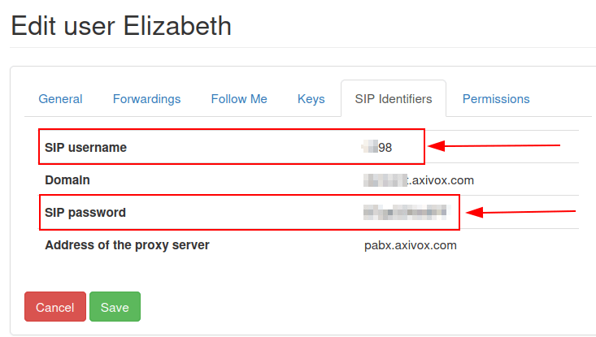

.. |VOIP| replace:: :abbr:`VoIP (Voice over Internet Protocol)`

======================
Odoo Phone with Axivox
======================

`Axivox <https://www.axivox.com/>`__ is a |VOIP| provider that can be set up to work with Odoo
**Phone**. An Axivox account is required to use this service.

To use this service, `contact Axivox <https://www.axivox.com/en/contact>`_ to open an account.
Before doing so, verify that Axivox covers the company's area, along with the areas the company's
users wish to call.

.. important::
   Before setting up an account with Axivox, verify the following requirements:

   - The business phone numbers are portable to Axivox. Some providers may be unable to release the
     phone number due to local or regional guidelines.
   - The locations of the company and its call recipients are covered by Axivox services. Axivox
     services are based in Europe, so international call performance may vary.

Configuration
=============

To configure Axivox services in the Odoo database, first :ref:`install <general/install>` the
**Phone** app.

.. _productivity/voip/view-axivox-credentials:

View credentials in Axivox
--------------------------

To view the necessary Axivox credentials, navigate to `manage.axivox.com
<https://manage.axivox.com/>`_ and log in, then go to :menuselection:`Users --> Edit`. Click the
**SIP Identifiers** tab to see the domain, SIP username, and SIP password.

Add Axivox credentials
----------------------

After :ref:`installing <general/install>` the *Phone - Axivox* module, go to the
:menuselection:`Phone app --> Configuration --> Providers`. Locate the *Axivox* provider entry, and
enter the following information:

- :guilabel:`OnSIP Domain`: the domain that was assigned when creating an account on `Axivox
  <https://manage.axivox.com/>`__. Replace `YOURACCOUNT` with the company account name.
- :guilabel:`VoIP Environment`: select :guilabel:`Production`.

.. image:: axivox_config/axivox-provider-config.png
   :alt: Axivox configuration settings in the *Odoo Phone* app.

Add user credentials
--------------------

Next, each user's Axivox credentials must be configured in Odoo. Navigate to
:menuselection:`Settings app --> Users & Companies --> Users` select the user, and click the
:guilabel:`VoIP` tab.

Add the following :ref:`Axivox credentials <productivity/voip/view-axivox-credentials>` for the
user:

- :guilabel:`Provider`: select :guilabel:`Axivox`.
- :guilabel:`Username`: the Axivox :guilabel:`SIP username`.
- :guilabel:`OnSip Auth Username`: the Axivox :guilabel:`SIP username`.
- :guilabel:`Secret`: the Axivox :guilabel:`SIP password`.

.. important::
   Make sure to manually type the :guilabel:`SIP password` into the user's :guilabel:`Preferences`
   tab. Pasting the value causes a `401 server rejection error`.

.. image:: axivox_config/axivox-user.png
   :alt: Axivox credentials in the user profile.
