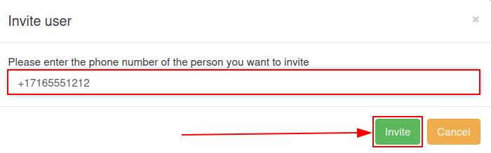
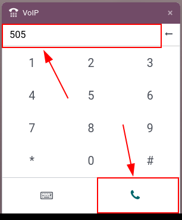

================
Conference calls
================

Conference calls help employees connect quickly and efficiently, so matters can be discussed in an
open forum of sorts. Attendees can be limited, via a sign-in code. That way, confidential matters
stay private.

This document covers the configuration of conference calls in Axivox for use in Odoo *VoIP*.

Add a virtual conference
========================

To add a virtual conference room, navigate to the `Axivox management console
<https://manage.axivox.com>`_. After logging in, click on :guilabel:`Conferences` in the menu on the
left.

Next, click the green button labeled, :guilabel:`Add a conference`, and a :guilabel:`New conference`
form appears.

.. image:: conference_calls/new-conference.png
   :align: center
   :alt: New conference form on Axivox.

From here, fill in the :guilabel:`Name` field, and set an :guilabel:`Internal extension`.

The internal extension is what everyone in the network uses to quickly dial into the conference
call, instead of typing in the whole phone number.

.. tip::
   Pick a number between three and five digits long, making it easy to remember and dial.

Next, set the :guilabel:`Access code`, if the conference room requires security. This is a password
to get into the conference, once the extension for the conference is dialed. Immediately after
dialing the extension, a digital receptionist prompts for the :guilabel:`Access code`.

In the :guilabel:`Administrator extension` field, click the drop-down menu, and select the user's
extension that manages the call.

Finally, in the :guilabel:`Wait for the administrator to start the conference` field, click the
drop-down menu, and select :guilabel:`Yes` or :guilabel:`No`.

Should the selection be :guilabel:`Yes`, then nobody is allowed to utilize the virtual conference
room until the administrator is present, and logged into the conference call.

When all fields are filled in, be sure to :guilabel:`Save` the configuration. Then, click
:guilabel:`Apply changes` in the upper-right corner to implement the change in production.

Upon doing so, the conference is added, and the Axivox administrator has the option to
:guilabel:`Delete` or :guilabel:`Edit` the conference from the Axivox :guilabel:`Conference` main
dashboard.

To invite an Axivox user to a specific conference call, click :guilabel:`Invite` to the right of the
desired conference, and proceed to enter the extension or phone number of the invitee in the pop-up
window that appears.

Once the extension or number is added into the :guilabel:`Please enter the phone number of the
person you want to invite` field, click the green :guilabel:`Invite` button, and the recipient
immediately receives a phone call, automatically linking them to the conference.

Incoming numbers
================

To open a conference to a wider audience, an Axivox conference can be linked to *Incoming numbers*.

To do that, log into the `Axivox management console <https://manage.axivox.com>`_, and click
:guilabel:`Incoming numbers` in the menu on the left.

On the :guilabel:`Incoming numbers` dashboard, click :guilabel:`Edit` to the far-right of the
:guilabel:`Number` to which the conference should be attached.

Then, under the first field, labeled, :guilabel:`Destination type for voice call`, click the
drop-down menu, and select :guilabel:`Conference`.

Next, in the :guilabel:`Conference` field, click the drop-down menu, and select the specific
conference that should be attached to this incoming number.

Now, whenever this incoming number is dialed, the caller is let into the conference, if there is not
an :guilabel:`Access code` required. If there *is* an :guilabel:`Access code` required, the caller
is then prompted to enter the :guilabel:`Access code` to enter the conference.

Start call in Odoo
==================

Anywhere in the Odoo database, open the *VoIP* widget, by clicking the :guilabel:`☎️ (phone)` icon,
located in the upper-right corner. Then, dial the specific extension number for the conference, and
click the :guilabel:`📞 (phone)` icon.

Once the digital receptionist answers, enter the :guilabel:`Access code` (if needed), and press the
:guilabel:`# (pound)` icon/key.
