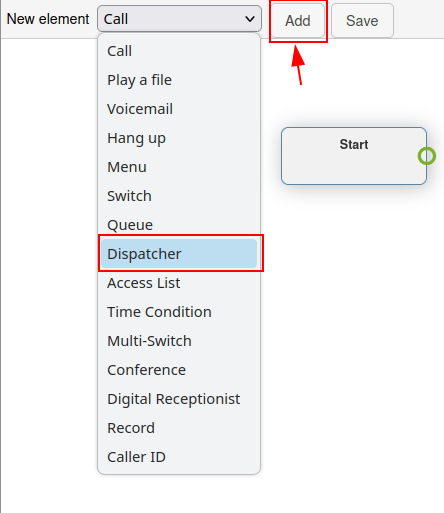
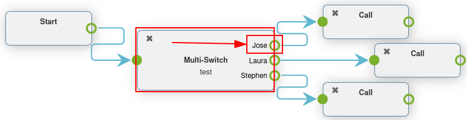

===================
Advanced dial plans
===================

Typically, companies have a lot of incoming calls every day, but many do not want their teams to
answer calls 24 hours a day, 7 days a week.

By using Axivox advanced dial plan features, the process can be automated, and routing can be set up
for all scenarios. This way, customers are never left waiting, or frustrated, because they cannot
get in touch with anyone.

By utilizing the advanced elements in dial plans, companies can automate call routing for certain
days or times, like company holidays. Companies can also allow callers to enter extensions
themselves, and get transferred automatically using a digital receptionist. This way, an
administrative team does **not** have to be available around the clock.

There is even the option to route callers, depending on where they are calling from in the world,
thus maximizing efficiency.

.. important::
   For more information on basic dial plans, and how to add elements, visit :doc:`dial_plan_basics`.

.. warning::
   Using a browser add-on for spelling may hinder the use of the visual editor in dial plans. Do
   **not** use a translator with the Axivox management console.

Advanced elements
=================

In Axivox dial plans (as described in :doc:`dial_plan_basics`), there are two advanced elements that
can be used.

- :guilabel:`Record`: recording feature is enabled (requires plan change, enabled in Axivox
  settings).
- :guilabel:`Caller ID`: replace the caller ID by the called number or free text.

To add one of these elements, navigate to the :guilabel:`Dial plans` page, located in the menu on
the left side of the `Axivox management console <https://manage.axivox.com>`_.

Next, click on the :guilabel:`Visual Editor` button to the right of the desired dial plan to edit
it. Finally, open the :guilabel:`New element` drop-down menu, select the element, and click
:guilabel:`Add`.

For more information, visit :ref:`voip/axivox/dial_plans`.

.. important::
   The :guilabel:`Record` element records calls that are routed through this element, and requires
   an additional plan change in Axivox.

To enable recording on Axivox, navigate to :guilabel:`Settings` in the `Axivox management console
<https://manage.axivox.com>`_. Then, go to the :guilabel:`Recording` drop-down menu, near the bottom
of the page. From there, select :guilabel:`Enabled` from the drop-down menu to enable recording
using the :guilabel:`Record` element in a dial plan.

.. tip::
   If the :guilabel:`Recording` drop-down menu is unavailable and unable to change, then consult
   Axivox to enable the feature.

The :guilabel:`Caller ID` element allows for the replacement of the caller ID downstream, after
routing.

Upon adding the :guilabel:`Caller ID` element to the dial plan, and double-clicking it to configure
it, two options appear.

The first is a :guilabel:`Free text` field, where any text can be input to replace the caller ID.
The second option is :guilabel:`Replace the caller ID by the called number`. This option replaces
the caller's ID with the :guilabel:`Incoming number`.

.. tip::
   A company may want to use the :guilabel:`Caller ID` element to replace the :guilabel:`Incoming
   number`, so employees, or outside transfers, cannot see the number, and information is kept
   private.

Basic routing elements
======================

Basic routing elements in Axivox dial plans provide extension-based routing. This can be done by
adding either a *Menu* to numerically link the dial-by-numbers to an action, or by using a *Digital
Receptionist* to automatically route or listen for an extension, based on a key input from the
caller.

The main difference between the two elements is that the *Digital Receptionist* does **not** need to
be pre-configured numerically with actions. Instead, it acts as a virtual receptionist.

- :guilabel:`Menu`: add a dial-by-number directory and configured downstream actions (not
  terminal). For example, a dial-by-numbers function could feature an element, wherein clicking '2'
  takes the caller to the element linked to '2' on the Menu element in the dial plan.
- :guilabel:`Digital Receptionist`: attach a virtual dispatcher to listen for extensions.

To add one of these elements, navigate to the :guilabel:`Dial plans` page, located in the menu on
the left side of the `Axivox management console <https://manage.axivox.com>`_. Next, click on the
:guilabel:`Visual Editor` button to the right of the dial plan, to edit the dial plan. Then, open
the :guilabel:`New element` drop-down menu, select the element, and click :guilabel:`Add`.

For more information, visit :ref:`voip/axivox/dial_plans`.

Digital receptionist scenario
-----------------------------

The *Digital Receptionist* element is a listen-feature that accurately routes callers through a dial
plan, based on the extension they enter, via the key pad.

Set a *Digital Receptionist* to eliminate the need of a team, or live receptionist, to be on-call
all the time. With that element in place, calls now reach their destination, without a real person
interjecting.

After adding the :guilabel:`Digital Receptionist` element to a dial plan, connect the appropriate
endpoints, and double-click on the element to set the :guilabel:`Timeout` on the
:guilabel:`receptionist` pop-up window that appears.

The :guilabel:`Timeout` can be set in `5` second increments, from `5` seconds to `60` seconds.

.. important::
   The :guilabel:`Digital Receptionist` element **requires** a :guilabel:`Play a file` element on
   either side of it, to explain what action to take, and when a wrong extension is entered.

.. example::
   While customizing a dial plan in a :guilabel:`Dialplan Editor` pop-up window, add a
   :guilabel:`Menu` element, with a :guilabel:`Greeting message` that might read, `Press star to
   dial an extension`.

   Then, on the :guilabel:`Menu` element, for the :guilabel:`* (star)` option, link a
   :guilabel:`Play a file` element, that plays an :guilabel:`Audio message` saying, 'Enter the
   extension of the person you are trying to reach'.

   Following the first :guilabel:`Play a file` element, add the :guilabel:`Digital Receptionist`
   element, followed by another :guilabel:`Play a file` element, which states, 'That is not a valid
   extension'.

   This last element is in place to close the loop, should the caller not enter a correct extension.

   Finally, this last :guilabel:`Play a file` element is looped back into the :guilabel:`Menu`
   element.

   .. image:: dial_plan_advanced/receptionist.png
      :align: center
      :alt: A digital receptionist element highlighted in an example dial plan.

.. important::
   Dial plan elements can be configured by double-clicking them, and selecting different features
   of the Axivox console to them.

   For example, an :guilabel:`Audio message` needs to be made, and then selected in a
   :guilabel:`Play a file` or :guilabel:`Menu` element.

   For more information, see this documentation :ref:`voip/axivox/audio_messages`.

Advanced routing elements
=========================

Advanced routing elements route calls automatically as they are received into the incoming
number(s). This can be configured using geo-location, whitelisting, or time-based variables. Calls
pass through a filter prior to their final destination, and are routed, based on the set
variable(s).

The following are advanced routing elements:

- :guilabel:`Dispatcher`: create a call filter to route traffic, based on the geo-location of the
  caller ID.
- :guilabel:`Access List`: create a tailored access list, with VIP customer preference.
- :guilabel:`Time Condition`: create time conditions to route incoming traffic around holidays, or
  other sensitive time-frames.

.. tip::
   Whitelisting is a technical term used to create a list of allowed numbers. Conversely,
   blacklisting is used to create a list of denied numbers.

To add one of these elements, navigate to the :guilabel:`Dial plans` page, located in the menu on
the left side of the `Axivox management console <https://manage.axivox.com>`_. Next, click on the
:guilabel:`Visual Editor` button to the right of the dial plan, to edit the dial plan. Then, open
the :guilabel:`New element` drop-down menu, select the element, and click :guilabel:`Add`. For more
information, visit :ref:`voip/axivox/dial_plans`.

Dispatcher scenario
-------------------

A *Dispatcher* element is a dial plan feature that directs calls, based on region or geo-location.
In most cases, the :guilabel:`Dispatcher` element in a dial plan is linked to the :guilabel:`Start`
element, in order to filter or screen calls as they come into an incoming number.

Double-click the :guilabel:`Dispatcher` element in the :guilabel:`Dialplan Editor` pop-up window to
configure it.

This element checks numbers (routed through this element), according to regular expressions. To add
a regular expression, click :guilabel:`Add a line` on the bottom of the :guilabel:`Dispatcher`
pop-up window.

Then, under :guilabel:`Name`, enter a recognizable name to identify this expression. This is the
name that appears in the :guilabel:`Dispatcher` element on the dial plan showcased in the
:guilabel:`Dialplan Editor` pop-up window.

In the :guilabel:`Regular expression` field, enter the country code, or area code, which Axivox
should route for incoming calls. This is especially helpful when a company would like to filter
their customers to certain queues, or users based on the customer's geo-location.

To specify all numbers behind a certain country code, or area code, include `\d+` after the country
code, or country code + area code.

.. image:: dial_plan_advanced/dispatcher.png
   :align: center
   :alt: Dispatcher configuration panel, with name, regular expression and add a line highlighted.

.. example::
  - `02\\d+`: validates the numbers starting with `02`
  - `00\\d+`: validates all numbers beginning with `00`
  - `0052\\d+` validates all numbers beginning with `0052` (Mexico country code)
  - `001716\\d+`: validates all numbers beginning with `001716` (USA country code + Western New York
    area code)

.. tip::
   A regular expression (shortened to "regex" or "regexp"), sometimes referred to as a "rational
   expression," is a sequence of characters that specifies a match pattern in text. In other words,
   a match is made within the given range of numbers.

When the desired configurations are complete on the :guilabel:`Dispatcher` pop-up window, be sure to
click :guilabel:`Save`.

Upon doing so, the :guilabel:`Dispatcher` element appears with different routes available to
configure, based on the :guilabel:`Regular Expressions` that were set.

Attach these routes to any :guilabel:`New element` in the :guilabel:`Dialplan Editor` pop-up window.

By default, there is an :guilabel:`Unknown` path that appears on the :guilabel:`Dispatcher` element
after setting at least one :guilabel:`Regular Expression`.

Calls follow this route/path when their number does not match any :guilabel:`Regular Expression` set
on the :guilabel:`Dispatcher` element.

.. image:: dial_plan_advanced/dispatcher-element.png
   :align: center
   :alt: Dial plan with dispatcher element highlighted.

Time condition scenario
-----------------------

When a :guilabel:`Time Condition` element is added to a dial plan, it has a simple :guilabel:`True`
and :guilabel:`False` routing.

After adding the :guilabel:`Time Condition` element to a dial plan, double-click it to configure the
variables. :guilabel:`Hour/Minute`, :guilabel:`Days of the week`, :guilabel:`Day of the month`, and
:guilabel:`Month` can all be configured.

If the time which the caller contacts the incoming number matches the set time conditions, then the
:guilabel:`True` path is followed, otherwise the :guilabel:`False` path is followed.

.. example::
   For a company that is closed yearly for the American Independence Day holiday (July 4th) the
   following time conditions should be set:

   - :guilabel:`Hour/Minute` - `0:0 to 23:59`
   - :guilabel:`Day of the week` - `All to All`
   - :guilabel:`Day of the month` - `From 4 to 4`
   - :guilabel:`Month` - `July`

The :guilabel:`Time Condition` element is especially useful for holidays, weekends, and to set
working hours. When a caller reaches a destination where they can be helped, either with a real
person or voicemail, this reduces wasted time and hangups.

.. image:: dial_plan_advanced/time-condition.png
   :align: center
   :alt: Time condition element set in a dial plan on Axivox. Time condition is highlighted.

.. important::
   To set the :guilabel:`Timezone` that the :guilabel:`Time Condition` operates under, navigate to
   `Axivox management console <https://manage.axivox.com>`_, and click :guilabel:`Settings` in the
   menu on the left. Then, set the :guilabel:`Timezone` using the second field from the bottom, by
   clicking the drop-down menu.

Access list scenario
--------------------

An *Access List* element in a dial plan allows for the routing of certain numbers, and disallows
(denies) other numbers.

After adding an :guilabel:`Access List` element to a dial plan, it can be configured by
double-clicking on the element directly in the :guilabel:`Dialplan Editor` pop-up window.

Two fields appear where regular expressions can based in the :guilabel:`Allow` and :guilabel:`Deny`
fields of the :guilabel:`Access List` pop-up window.

.. example::
   For a very important customer, their number can be set in the :guilabel:`Allow` field, and these
   callers can be sent directly to management.

.. tip::
   A regular expression (shortened to "regex" or "regexp"), sometimes also referred to as a
   "rational expression," is a sequence of characters that specifies a match pattern in text.

.. image:: dial_plan_advanced/access-config.png
   :align: center
   :alt: Access list element configuration with the allow/deny fields highlighted.

.. example::
   - `2\\d\\d`: validates numbers from `200 to 299`
   - `02\\d*`: validates all numbers beginning with `02`
   - `0017165551212`: validates the number (`0017165551212`)

After setting the :guilabel:`Allow` and :guilabel:`Deny` fields with regular expressions or numbers,
click :guilabel:`Save` on the :guilabel:`Access List` pop-up window.

Then, on the :guilabel:`Access list` element in the dial plan, three paths (or routes) are available
to link to further actions.

Unknown calls can be routed through the regular menu flow by adding a :guilabel:`Menu` element, and
connecting it to the :guilabel:`Unknown` path. :guilabel:`Refused` calls can be routed to the
:guilabel:`Hang up` element. Lastly, :guilabel:`Authorized` callers can be sent to a specific
extension or queue.

.. image:: dial_plan_advanced/access-list.png
   :align: center
   :alt: Access list element highlighted in an example dial plan.

Switches
========

A *Switch* element in Axivox is a simple activated/deactivated route action.

These can be activated or chosen quickly, allowing for quick routing changes, without altering the
dial plan.

Alternate routes can be configured, so that in a moments notice, they can be switched to. This could
be for new availability, or to adjust traffic flow for any number of reasons.

Axivox allows for a simple on/off switch, and a multi-switch, which can have several paths to choose
from.

- :guilabel:`Switch`: a manual on/off control that can divert traffic, based on whether it is opened
  (on) or closed (off).
- :guilabel:`Multi-Switch`: a mechanism to create paths, and turn them on and off, to divert
  incoming calls.

Basic switch
------------

A :guilabel:`Switch` can be set in the `Axivox management console <https://manage.axivox.com>`_ by
navigating to :guilabel:`Switches` in the left menu. To create a new switch click :guilabel:`Add a
switch` from the :guilabel:`Switches` dashboard, configure a :guilabel:`Name` for it, and click
:guilabel:`Save`.

Then, toggle the desired switch to either :guilabel:`On` or :guilabel:`Off`, from the
:guilabel:`State` column on the :guilabel:`Switches` dashboard.

This :guilabel:`On` / :guilabel:`Off` state automatically routes traffic in a dial plan, in which
this switch is set.

The traffic travels to the :guilabel:`Active` route when :guilabel:`On` is toggled in the switch.
The call traffic travels to the :guilabel:`Inactive` route when :guilabel:`Off` is toggled in the
switch.

Changes can be made on the fly, just be sure to click :guilabel:`Apply changes` to implement the
them.

Add a switch to dial plan
~~~~~~~~~~~~~~~~~~~~~~~~~

To add a :guilabel:`Switch` to a dial plan, navigate to `Axivox management console
<https://manage.axivox.com>`_, and click on :guilabel:`Dial plans` in the left menu. Then, click
:guilabel:`Visual Editor` next to the desired dial plan to open the :guilabel:`Dialplan Editor`
pop-up window.

Then, from the :guilabel:`New element` drop-down menu, select :guilabel:`Switch`, and then click
:guilabel:`Add`. Double-click on the element to further configure the :guilabel:`Switch` element.

.. image:: dial_plan_advanced/switch.png
   :align: center
   :alt: Switch configuration in a dial plan, with inactive and active routes highlighted.

Multi-switch
------------

A *Multi-Switch* element in Axivox is a switch where multiple paths can be configured, and switched
between.

To configure and set a :guilabel:`Multi-Switch` element, navigate to `Axivox management console
<https://manage.axivox.com>`_. Then, click on the :guilabel:`Switches` menu item in the left menu.

Toggle to the :guilabel:`Multi-switch` tab to create, or set, a pre-configured
:guilabel:`Multi-Switch` element.

To create a new :guilabel:`Multi-Switch`, click :guilabel:`Create new`. Then, enter a
:guilabel:`Name` for the element, and then enter the :guilabel:`Available choice`. Enter one
:guilabel:`Available choice` per line. Do **not** duplicate any entries.

Remember to click :guilabel:`Save` when done.

To select the :guilabel:`State` of the :guilabel:`Multi-Switch`, click the drop-down menu next to
the :guilabel:`Multi-Switch` name, under the :guilabel:`Multi-switch` tab on the
:guilabel:`Switches` dashboard.

The :guilabel:`State` chosen is the route that is followed in the dial plan. The :guilabel:`State`
can be edited on the fly, just be sure to click :guilabel:`Apply changes`.

Add a multi-switch to dial plan
~~~~~~~~~~~~~~~~~~~~~~~~~~~~~~~

To add a :guilabel:`Multi-Switch` element to a dial plan, navigate to `Axivox management console
<https://manage.axivox.com>`_, and click :guilabel:`Dial plans` in the left menu.

Then, select or create a dial plan. Next, click :guilabel:`Visual Editor` on the desired dial plan.

On the :guilabel:`Dialplan Editor` pop-up window that appears, click on the :guilabel:`New element`
drop-down menu, and select :guilabel:`Multi-Switch`. Then, click :guilabel:`Add`. Double-click on
the element to further configure the :guilabel:`Switch` element.

