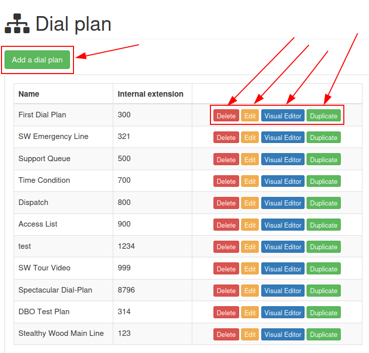

================
Dial plan basics
================

When someone calls a business, they might need to get in contact with customer support, a sales
team, or even a person's direct line. The caller might also be in search of some information about
the business, such as store hours. Or, they might want to leave a voicemail, so someone from the
company can call them back. With dial plans in Axivox, a company can manage how incoming calls like
this are handled.

Using proper call architecture through a dial plan, callers get directed to the right people, or to
the right information, in a quick, efficient manner.

This document covers the basic configuration of dial plans in Axivox.

.. seealso::
   For more information on advanced dial plans, visit :doc:`dial_plan_advanced`.

.. important::
   Using a browser add-on for spelling may hinder the use of the visual editor in dial plans. Do not
   use a translator with the Axivox management console.

.. _voip/axivox/dial_plans:

Dial plans
==========

Access dial plans by navigating to `Axivox management console <https://manage.axivox.com>`_, and
clicking on :guilabel:`Dial plans` from the menu on the left.

To add a new dial plan from the :guilabel:`Dial plan` page, click the green button labeled,
:guilabel:`Add a new dial plan`.

.. note::
   Axivox has no limit to the number of dial plans that can be created. These can be added, and
   improved upon, at any time. This allows for sandboxes to be created with many different
   configurations.

To edit an existing dial plan, choose one of the following options to the right of the saved dial
plan:

#. :guilabel:`Delete`: this action deletes the attached dial plan.
#. :guilabel:`Edit`: this action allows the user to edit the dial plan.
#. :guilabel:`Visual Editor`: this action opens a visual editor window, where the dial plan
   architecture can be viewed and edited.
#. :guilabel:`Duplicate`: this action duplicates the dial plan, and puts it at the bottom of the
   list, with an extension of one number (+1) larger than the original extension.

Dialplan editor (visual editor)
-------------------------------

When the :guilabel:`Visual Editor` button is clicked for a dial plan on the :guilabel:`Dial plan`
page, a pop-up :guilabel:`Dialplan Editor` window appears.

This pop-up window is the primary place where the architecture, or structure, of the dial plan is
configured. In this window, a :abbr:`GUI (graphical user interface)` appears, where various dial
plan elements can be configured and linked together.

.. image:: dial_plan_basics/dial-plan-visual.png
   :align: center
   :alt: Visual editor for an example dial plan, with the new element, Add, and Save buttons
         highlighted.

.. important::
   New dial plans come blank with :guilabel:`New element` options for the user to :guilabel:`Add`
   and :guilabel:`Save`.

   The method for saving in the :guilabel:`Dialplan Editor` is different from saving any other edits
   in the Axivox management console because the :guilabel:`Save` button **must** be pressed before
   closing the :menuselection:`Visual editor`.

   Then, before these changes can take place on the Axivox platform, the user **must** click
   :guilabel:`Apply changes` in the upper-right corner of the :guilabel:`Dial plan` page.

From the :guilabel:`Dialplan Editor` pop-up window, users can add a new element to the dial plan. To
do that, open the :guilabel:`New element` drop-down menu, and select the desired element. Then,
click :guilabel:`Add`.

Doing so adds that element to the visual editor display of the dial plan being modified. This
element can be moved where desired amongst the other elements present in the dial plan.

Connect elements in the dial plan by clicking and dragging outward from the :guilabel:`(open
circle)` icon on the right side of the element. Doing so reveals an :guilabel:`(arrow)` icon.
Proceed to drag this :guilabel:`(arrow)` icon to the desired element in the dial plan that it is
meant to connect with.

Connect the :guilabel:`(arrow)` icon to the circle on the left side of the desired element.

Calls displayed in the dial plan flow from left-to-right in the element.

In order to further configure a :guilabel:`New element`, double-click on the element inside the dial
plan, to reveal a subsequent pop-up window, wherein additional customizations can be entered.

Each element has a different configuration pop-up window that appears when double-clicked.

.. important::
   All elements **must** have a final destination in the dial plan in order to close a loop. This
   can be accomplished by implementing the :guilabel:`Hang up` element, or looping the element back
   to a :guilabel:`Menu` element or :guilabel:`Digital Receptionist` element elsewhere in the dial
   plan.

   .. image:: dial_plan_basics/loop-back.png
      :align: center
      :alt: Dial plan, shown with highlight looping open end back to the beginning of the menu
            element.

Once all desired dial plan elements and configurations are complete, remember to click
:guilabel:`Save` before exiting the :guilabel:`Dialplan Editor` pop-up window. Then, click
:guilabel:`Apply changes` on the :guilabel:`Dial plans` page to ensure they are implemented into
Axivox production.

Dial plan elements
------------------

The following elements are available in the :guilabel:`New element` drop-down menu, while designing
a dial plan in the :guilabel:`Dialplan Editor` pop-up window.

Basic elements
~~~~~~~~~~~~~~

These are the basic elements that are used in simple dial plans in Axivox:

- :guilabel:`Call`: call an extension or queue.
- :guilabel:`Play a file`: play an audio file or voice greeting.
- :guilabel:`Voicemail`: forward to a voicemail (terminal).
- :guilabel:`Hang up`: hang up the call (terminal).
- :guilabel:`Queue`: attach a call queue with a group of users to answer a call.
- :guilabel:`Conference`: add a conference room for a caller to connect to.

Basic routing elements
~~~~~~~~~~~~~~~~~~~~~~

Routing elements change or route the path of a caller, these are some basic routing elements used in
Axivox:

- :guilabel:`Menu`: add a dial-by-number directory and configure downstream actions (not terminal).
- :guilabel:`Switch`: attach a manual on/off control that can divert traffic based on whether it is
  opened (On) or closed (Off).
- :guilabel:`Digital Receptionist`: attach a virtual dispatcher to listen for extensions to connect
  to.

Advanced routing elements
~~~~~~~~~~~~~~~~~~~~~~~~~

These are the more advanced elements that route calls in Axivox:

- :guilabel:`Dispatcher`: create a call filter to route traffic based on the geo-location of the
  caller ID.
- :guilabel:`Access List`: create a tailored access list with VIP customer preference.
- :guilabel:`Time Condition`: create time conditions to route incoming traffic around holidays, or
  other sensitive time-frames.
- :guilabel:`Multi-Switch`: a mechanism to create paths, and turn them on and off, to divert
  incoming calls.

Advanced elements
~~~~~~~~~~~~~~~~~

The following are more advanced elements (not routing) in Axivox:

- :guilabel:`Record`: recording feature is enabled (requires plan change, enabled in Axivox
  settings).
- :guilabel:`Caller ID`: replace the caller ID by the called number or free text.

.. important::
   Dial plan elements can be configured by double-clicking them, and linking different aspects of
   the Axivox console to them.

Attach to incoming number
=========================

To attach an existing dial plan to an incoming number, go to `Axivox management console
<https://manage.axivox.com>`_ , and click on :guilabel:`Incoming numbers`.

Next, click :guilabel:`Edit` next to the number to which the dial plan should be attached.

Doing so reveals a separate page wherein that number's dial plan can be modified. To do that, select
:guilabel:`Dial plan` from the :guilabel:`Destination type for voice call` field drop-down menu.
Then, choose the desired dial plan from the :guilabel:`Dial plan` field that appears.

With that in place, that means when that specific number calls in, the configured dial plan is
activated, and runs through the prompts to properly route the caller.

Finally, :guilabel:`Save` the changes, and click :guilabel:`Apply changes` in the upper-right
corner.

Basic dial plan scenario
------------------------

The following showcases a basic dial plan scenario for call routing, where additional elements can
be added to expand the setup. This basic dial plan scenario includes the following linked elements
:menuselection:`Start --> Play a file --> Menu --> (Hang-up, Calls, Queues, Conferences) -->
(Voicemail, Hang-up)`.

.. image:: dial_plan_basics/basic-scenario.png
   :align: center
   :alt: Basic dial plan configuration.

.. seealso::
   This setup does **not** include any basic or advanced call routing. For more information on call
   routing, reference this documentation: :doc:`dial_plan_advanced`.
