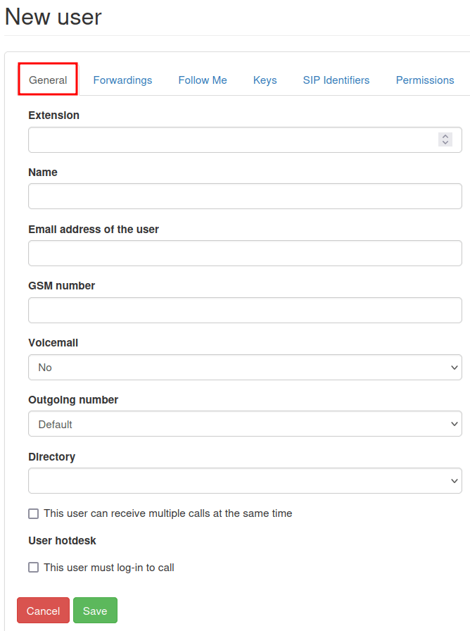
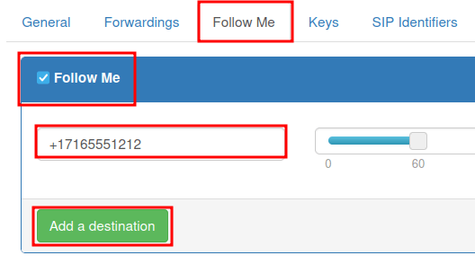

======================
Manage users in Axivox
======================

Managing Axivox :abbr:`VoIP (Voice over Internet Protocol)` users is an important part of setting up
:abbr:`VoIP (Voice over Internet Protocol)` in an Odoo database. Each Axivox user has a unique name,
phone number and/or extension, and a voicemail. This way, they can be reached in a variety of
convenient ways.

Axivox users are organized in a simple, straightforward way in the Axivox console, so an
administrator can manage users quickly and easily.

.. note::
   This documentation covers how to configure everything through a provider called, Axivox.
   Depending on the chosen VoIP provider, the processes to manage users may be different.

Overview
========

Begin at the Axivox management console by navigating to `https://manage.axivox.com
<https://manage.axivox.com>`_. Log in with the appropriate administrator credentials.

.. note::
   Actions in the Axivox management console **must** be double-saved, in order for the changes to
   take effect. To save any changes, click :guilabel:`Save` in the individualized changes screen.
   Then, to implement those changes, click the :guilabel:`Apply Changes` button in the upper-right
   corner of the console.

.. _voip/axivox/incoming_number:

Incoming numbers
----------------

Incoming numbers are all the numbers a company is paying to use to receive calls.

Click on :menuselection:`Incoming numbers` from the menu on the left of the Axivox management
console. Doing so reveals the :guilabel:`Incoming numbers` page, where all the incoming numbers are
listed, along with their :guilabel:`Destination` and SMS information.

The :guilabel:`Destination` determines the action that is taken, or the path the caller follows when
dialing said numbers.

To edit the :guilabel:`Destination`, click the :guilabel:`Edit` button to the far-right of the
incoming number line to be modified. Then, on the :guilabel:`Edit number` page that appears, the
:guilabel:`Destination type for voice call` can be changed.

The options available in the :guilabel:`Destination type for voice call` drop-down menu are as
follows:

- :guilabel:`Not configured`
- :guilabel:`Extension`
- :guilabel:`Dial plan`
- :guilabel:`Voicemail`
- :guilabel:`Hang up`
- :guilabel:`Conference`

Depending on the selection made in the :guilabel:`Destination type for voice call` drop-down menu, a
second, selection-specific drop-down menu is populated with further configuration options.
Additionally, more fields are revealed, based on the selection made in the :guilabel:`Destination
type for voice call` drop-down menu.

Once the desired configurations are complete, click :guilabel:`Save`, then click :guilabel:`Apply
changes` in the upper-right corner to implement them.

New users
=========

Every employee using :abbr:`VoIP (Voice over Internet Protocol)` at the company needs an Axivox user
account associated with them.

To view existing users in the Axivox management console, click :guilabel:`Users` from the menu on
the left of the console. Every user has a :guilabel:`Number`, :guilabel:`Name`, option for a
:guilabel:`Voicemail`, and an :guilabel:`Outgoing number` specified.

To create a new user in the Axivox console, click :guilabel:`Add a user` to reveal a :guilabel:`New
user` form. The following tabs are available for configuring the new user:

- :guilabel:`General`: basic information, including the extension of the user, can be set.
- :guilabel:`Forwardings`: internal forwards on 'no answer' or busy signals.
- :guilabel:`Follow Me`: external forward configuration.
- :guilabel:`Keys`: set hot-keys within the :abbr:`VoIP (Voice over Internet Protocol)` system.
- :guilabel:`SIP Identifiers`: :abbr:`SIP (Session Initiation Protocol)` username and password for
  external configuration.
- :guilabel:`Permissions`: set access rights for users in the Axivox management console.

General tab
-----------

Under the :guilabel:`General` tab of the :guilabel:`New user` form, in the :guilabel:`Extension`
field, input an extension that is unique to the user. This is the number internal users dial to
reach a specific employee.

In the :guilabel:`Name` field, input the employee name.

Next, fill out the :guilabel:`Email address of the user` field. A valid email address for the
employee should be added here, where the user receives business emails.

In the :guilabel:`GSM number` field, enter an alternative number at which the user can be reached.
Be sure to include the country code.

.. note::
   A country code is a locator code that allows access to the desired country's phone system. The
   country code is dialed first, prior to the target number. Each country in the world has its own
   specific country code.

   For a list of comprehensive country codes, visit: `https://countrycode.org
   <https://countrycode.org>`_.

In the :guilabel:`Voicemail` field, select either :guilabel:`Yes` or :guilabel:`No` from the
drop-down menu.

In the :guilabel:`Directory` field, the administrator has the option to leave it blank, by making no
changes, or selecting :guilabel:`Default` from the drop-down menu. The :guilabel:`Directory` is used
in the *Digital Receptionist* feature element of a dial-plan.

At the bottom of the :guilabel:`General` tab, there are two separate options with selection boxes.

The first option is :guilabel:`This user can receive multiple calls at the same time`. By selecting
this option, users are able to receive calls when on another call.

The second option, :guilabel:`This user must log-in to call`, provides the option to make it
mandatory for the user to log in.

.. note::
   If a company uses physical VoIP phones on desks, and wants their employees to be able to log in
   from *any* phone or desk in the office, they would make the selection for :guilabel:`This user
   must log-in to call`.

Once the desired configurations are complete, click :guilabel:`Save`, then click :guilabel:`Apply
changes` in the upper-right corner.

.. _voip/axivox/forwardings_tab:

Forwardings tab
---------------

Under the :guilabel:`Forwardings` tab of the :guilabel:`New user` form, a company can decide what
happens if someone calls a user, and the call is not answered.

.. important::
   Forwardings are disabled when the :guilabel:`Follow Me` option is enabled.

For example, under the :guilabel:`Forwarding on no answer` field, when the button for :guilabel:`Add
a destination` is selected, the option to add a specific user or phone number is revealed. After
entering the :guilabel:`Destination`, a specific time frame can be selected by sliding the
:guilabel:`seconds bar` to the desired ring time.

Additional :guilabel:`Destinations` can be added on with different ring times.

.. note::
   Ring times can be staggered, so the call is forwarded to another user after the first user does
   not pick up the call. The option to :guilabel:`Send to voicemail as a last resort` is available
   to the administrator, should the :guilabel:`Destinations` not pick up.

Under the :guilabel:`Forwarding on busy` field, an administrator can :guilabel:`Add a destination`.
When clicked, they can then set the :guilabel:`Destination` (user) and time frame. Should the
original user's :abbr:`VoIP (Voice over Internet Protocol)` extension, or incoming number, be busy,
the call is forwarded to the destination(s).

.. image:: manage_users/forwardings-tab.png
   :align: center
   :alt: Manage forwarding calls to different users or phone numbers in the Forwardings tab.

When the desired configurations are complete, click :guilabel:`Save`, then click :guilabel:`Apply
changes` in the upper-right corner of the page.

Follow Me tab
-------------

When the :guilabel:`Follow Me` option is selected, under the :guilabel:`Follow Me` tab of the
:guilabel:`New user` form, no :menuselection:`Forwardings` can be made.

Also, when the :guilabel:`Follow Me` option is selected, the :guilabel:`Add a destination` button
can be selected to add users, or a destination phone number, to the original user's account. That
way, these added numbers ring when a call is received.

After entering the :guilabel:`Destination`, a specific time frame can be made by sliding the
:guilabel:`seconds bar` to the desired ring time. Additional :guilabel:`Destinations` can be added
with different ring times.

.. note::
   The original user's :abbr:`VoIP (Voice over Internet Protocol)` number does **not** ring with
   this option selected. Ring times can also be staggered, so the call is forwarded to another user
   after the first user does not pick up the call.

.. important::
   The Odoo mobile app, or another :abbr:`SIP (Session Initiation Protocol)` mobile client, allows
   for simultaneous ringing of the user's extension or incoming number. For more information, visit
   the :doc:`VoIP Mobile Integrations <../devices_integrations>` documentation.

Once all desired configurations are complete, click :guilabel:`Save`, then click :guilabel:`Apply
changes` in the upper-right corner.

Keys tab
--------

Under the :guilabel:`Keys` tab of the :guilabel:`New user` form, speed dial actions for the user can
be configured. Some more advanced options are available, as well.

The following options are available to set to numerical values `1-20`.

These actions can be set on each number:

- :guilabel:`Not configured`: the default action, which is nothing.
- :guilabel:`BLF (Busy lamp fields)`: this action shows the status of other users' phones connected
  to the Axivox phone system. This is primarily used on a desk-phone.
- :guilabel:`Quick Call`: this action allows for a speed-dial of an external number.
- :guilabel:`Line`: this action allows the user to call another user.
- :guilabel:`Switch`: this action allows the user to switch between calls from a desk-phone.
- :guilabel:`Pickup`: this action allows the user to pick up an incoming call from a desk-phone.

.. image:: manage_users/user-keys.png
   :align: center
   :alt: Manage user page with Keys tab highlighted and number 2 key drop-down menu selected (with
         highlight)

Once all the desired configurations are complete, click :guilabel:`Save`, then click
:guilabel:`Apply changes` in the upper-right corner.

.. important::
   Many of the preceding options have secondary options available, as well, that can be used to link
   a user, or external phone number. These **must** be filled out in conjunction with the initial
   action.

.. note::
   The :guilabel:`Number of keys` field can be changed by entering in the desired numerical value in
   the :guilabel:`Number of keys` field, located at the top of the :guilabel:`Keys` tab of the
   :guilabel:`New user` form.

SIP Identifiers tab
-------------------

*SIP*, which stands for Session Initiation Protocol telephony, allows one to make and receive calls
through an internet connection. The :guilabel:`SIP Identifiers` tab on the :guilabel:`New user`
form, contains credentials needed to configure Axivox users in Odoo and/or a different :abbr:`SIP
(Session Initiation Protocol)` mobile client.

.. seealso::
   See the documentation on configuring Axivox, using the SIP identifiers:

   - :doc:`Use VoIP services in Odoo with Axivox <axivox_config>`
   - :doc:`Axivox Mobile Integrations <../devices_integrations>`

Under the :guilabel:`SIP Identifiers` tab, the :guilabel:`SIP username` field represents the user's
information that was entered in the :guilabel:`Extension` field, under the :guilabel:`General` tab.

The :guilabel:`Domain` field is assigned to the company by the Axivox representative.

The value in the :guilabel:`SIP Password` field is unique for every Axivox user. This value is used
to sign into Axivox on Odoo, and for any mobile :abbr:`SIP (Session Initiation Protocol)` clients.

.. image:: manage_users/sip-identifiers-tab.png
   :align: center
   :alt: Important credentials used for external configurations of Axivox VoIP.

The value listed in the :guilabel:`Address of the proxy server` field is typically:
`pabx.axivox.com`, but is subject to change by Axivox, so be sure to check the :guilabel:`SIP
Identifiers` tab for the most accurate value.

Once all desired configurations have been made, click :guilabel:`Save`, then click :guilabel:`Apply
changes` in the upper-right corner.

Permissions tab
---------------

Under the :guilabel:`Permissions` tab of a :guilabel:`New user` form, a :guilabel:`Username` and
:guilabel:`Password` can be entered for the user.

Beneath those fields, the following permissions can be granted to Axivox users for portal access:

- :guilabel:`User portal access`
- :guilabel:`User management`
- :guilabel:`Administrator access`
- :guilabel:`Phone management`
- :guilabel:`User group management`
- :guilabel:`Phone number management`
- :guilabel:`Dial plan management`
- :guilabel:`Pickup group management`
- :guilabel:`Switch management`
- :guilabel:`Conference management`
- :guilabel:`Queue management`
- :guilabel:`Voicemail management`
- :guilabel:`Audio messages management`
- :guilabel:`Music on hold management`
- :guilabel:`Directory management`
- :guilabel:`Call list`
- :guilabel:`Connected user list`
- :guilabel:`Global settings`
- :guilabel:`Apply changes button`
- :guilabel:`Invoice download`
- :guilabel:`Invoice details`
- :guilabel:`Blacklist management`
- :guilabel:`Conference participant management`

To access credentials for the Axivox user portal, navigate to the top of the
:menuselection:`Permissions` tab. Then, copy the :guilabel:`Username`, and enter the correct
:guilabel:`Password` for the individual user. There is a minimum of 8 characters for a user
password.

.. note::
   These are the same permissions granted to the Axivox administrator that are listed in the menu on
   the left in the Axivox management console. Should a selection state :guilabel:`No`, or
   :guilabel:`No access`, then the menu option does **not** populate for the user.

Once all the desired configurations are complete, click :guilabel:`Save`, then click
:guilabel:`Apply changes` in the upper-right corner.

Upon finishing the setup for a new user, an :ref:`voip/axivox/incoming_number` can be linked.

.. image:: manage_users/user-permissions.png
   :align: center
   :alt: Manage a user page, with the permissions tab highlighted, along with the first permission
         highlighted indicating a no selection.

.. _voip/axivox/user_groups:

User groups
===========

A user group is a grouping of Axivox users that can be linked to a queue for call center
capability.

To begin using user groups, navigate to `https://manage.axivox.com <https://manage.axivox.com>`_.

Then, log in with the appropriate administrator credentials. From the menu on the left of the Axivox
administrative panel, click into :guilabel:`User Groups`.

To add a user group from the :guilabel:`User Groups` page, click :guilabel:`Add a group`.

Next, name the group, by entering text into the :guilabel:`Name` field. Then, add a member to the
group by typing the first few letters of the user's name into the :guilabel:`Members` field. The
user populates in a drop-down menu below the field. Then, click on the desired user, and they are
added to the user group.

Repeat this process to add more users to the group.

Once all desired configurations are complete, click :guilabel:`Save`, then click :guilabel:`Apply
changes` in the upper-right corner.
