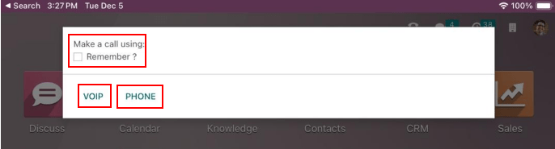
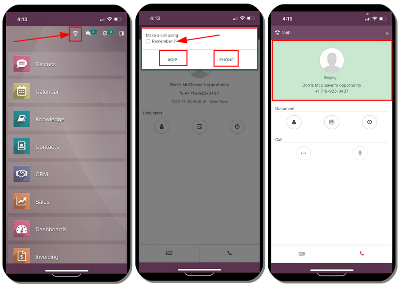
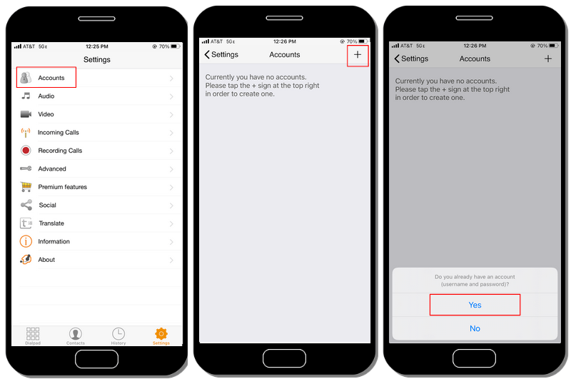
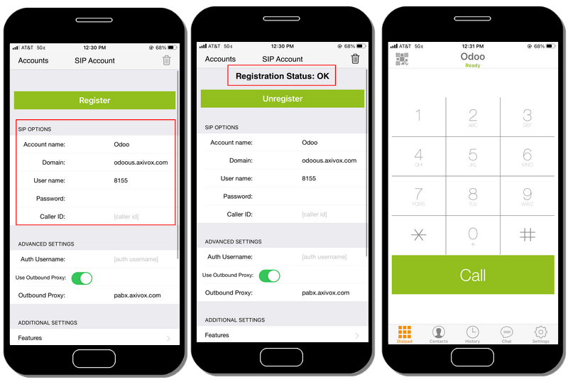
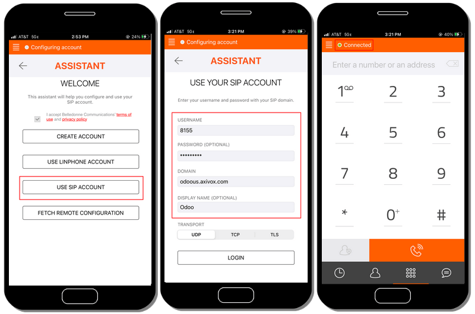

========================
Devices and integrations
========================

:abbr:`VoIP (Voice over Internet Protocol)` can be used on many different devices, such as a
computer, tablet, mobile phone, and many more. This is helpful in that it reduces costs, and
employees can work from anywhere in the world, so long as they have a broadband internet connection.

Odoo *VoIP* is SIP (Session Initiation Protocol) compatible, which means it can be used with *any*
:abbr:`SIP (Session Initiation Protocol)` compatible application.

This document covers the process of setting up Odoo *VoIP* across different devices and
integrations.

Odoo is fully-integrated with all Odoo apps, allowing users to click into any app, and schedule a
call as an activity in the chatter.

.. example::
   For example, in the *CRM* app, a user can click into an opportunity, and click on
   :guilabel:`Activities` in the chatter.

   Next, they can choose :guilabel:`Call`, and under :guilabel:`Due Date`, they can select a date.

   Once they click :guilabel:`Save`, an activity shows up in the chatter.

   Should the :guilabel:`Due Date` be for today's date, the activity shows up in the :abbr:`VoIP
   (Voice over Internet Protocol)` widget.

   .. image:: devices_integrations/crm-voip-widget.png
      :align: center
      :alt: View of CRM leads and the option to schedule an activity for Odoo Discuss.

Odoo VoIP (laptop/desktop computer)
===================================

The Odoo *VoIP* (Voice over Internet Protocol) module and widget can be used from any browser on a
laptop or desktop device. Simply click on the :guilabel:`☎️ (phone)` icon in the upper-right corner,
while in the Odoo database, and the widget appears.

.. seealso::
   To see how to use the :abbr:`VoIP (Voice over Internet Protocol)` widget on a desktop/laptop
   computer, check out this documentation: :doc:`voip_widget`.

Odoo VoIP (tablet/mobile device)
================================

The Odoo *VoIP* app can be used on tablets and mobile phones, through the Odoo Android or Apple IOS
applications. Additionally, a mobile web browser can be used to access the database.

.. warning::
   Odoo Android and Apple IOS applications are no longer being maintained by Odoo on the Android and
   Apple portals. This means Odoo support only handles limited scopes of Odoo Android or Apple IOS
   support tickets.

.. important::
   While outgoing calls can be placed using Odoo on a mobile device, be aware that Odoo is **not** a
   full :abbr:`VoIP (Voice over Internet Protocol)` application, and does **not** ring on incoming
   calls. If the user needs to be reachable on a mobile device at all times, an app, like Zoiper,
   should be used. Apps like that stay connected in the background at all times.

   For more information, see this documentation: :ref:`voip/zoiper`.

While in the mobile application on a mobile device/tablet, access the Odoo *VoIP* widget, by tapping
on the :guilabel:`☎️ (phone)` icon in the upper-right corner. The widget appears in the lower-left
corner.

When first making a call from the tablet using the mobile application, the user is prompted to
:guilabel:`Allow` the database to use the microphone. Click :guilabel:`Allow` when prompted to
continue with the call using the microphone.

This step is **necessary**, whether using the mobile Odoo application or web browser.

.. image:: devices_integrations/allow-mic.png
   :align: center
   :alt: Allow the database to access the microphone.

Odoo then asks how to make the call. The two options are : :guilabel:`VOIP` or :guilabel:`Phone`
(should the tablet be enabled for calling). Click the box next to :guilabel:`Remember ?` should this
decision be the default moving forward.

Here is the layout of what the Odoo *VoIP* app looks like on a mobile device:

.. _voip/zoiper:

Zoiper Lite
===========

*Zoiper Lite* is a free :abbr:`VoIP (Voice over Internet Protocol)` :abbr:`SIP (Session Initiation
Protocol)` dialer with voice and video.

To start using the *Zoiper* app, download it to the device, via the `Zoiper download page
<https://www.zoiper.com/en/voip-softphone/download/current>`_.

A mobile device is the most common installation, and this document covers how to set up on the
*Zoiper* IOS application. Screenshots and steps may differ depending on the set up conditions.

After installing the *Zoiper* application on the mobile phone, open the application, and tap on
:guilabel:`Settings`. Navigate to :menuselection:`Accounts`, and tap on the :guilabel:`+ (plus)`
icon to add an account.

If the :abbr:`VoIP (Voice over Internet Protocol)` account is already set up, then click
:guilabel:`Yes`. This means an account username and password has already been produced.

Next, tap on :guilabel:`Select a provider`. On the screen that populates, tap :guilabel:`Country`,
in the upper-right corner, to narrow the providers down to a specific country. Choose the country
for the provider that is being configured, then find the :guilabel:`Provider`, and select it.

.. example::
   If the provider being configured is *Axivox*, then select :guilabel:`Belgium`. Then, choose
   :guilabel:`Axivox` as the provider.

.. image:: devices_integrations/provider-zoiper-odoo.png
   :align: center
   :alt: Zoiper account setup, choosing the provider.

Under :abbr:`SIP (Session Initiation Protocol)` options, enter the :guilabel:`Account name`,
:guilabel:`Domain`, :guilabel:`Username`, and :guilabel:`Password`. All this information varies,
based on the account.

.. tip::
   To access this information, via the *Axivox* portal, navigate to :menuselection:`Users --> Choose
   user --> Edit --> SIP Identifiers tab`. The :guilabel:`SIP username`, :guilabel:`Domain`,
   :guilabel:`SIP password`, and :guilabel:`Address of the proxy server` are all present in this
   tab.

.. list-table::
   :header-rows: 1

   * - Zoiper Field
     - Axivox Field
   * - Account name
     - *Can be anything*
   * - Domain
     - Domain
   * - Username
     - SIP username
   * - Password
     - SIP password

Once this account information is entered, click the green :guilabel:`Register` button at the top of
the screen. Once the registration information is checked, *Zoiper* populates a message, stating
:guilabel:`Registration Status: OK`.

At this point, *Zoiper* is now set up to make phone calls using the :abbr:`VoIP (Voice over Internet
Protocol)` service.

Linphone
========

*Linphone* is an open-source :abbr:`VoIP (Voice over Internet Protocol)` :abbr:`SIP (Session
Initiation Protocol)` softphone, used for voice, video, messaging (group and individual), as well as
conference calls.

To start using the *Linphone* app, download it to the device, via the `Linphone download page
<https://new.linphone.org/technical-corner/linphone?qt-technical_corner=2#qt-technical_corner>`_.

A mobile device is the most common installation, and this document covers how to set up the
*Linphone* IOS application. Screenshots and steps may differ depending on the circumstances.

To begin configuring *Linphone* for use with a :abbr:`SIP (Session Initiation Protocol)` provider,
first open *Linphone*, and an assistant screen appears.

From this screen, select :guilabel:`Use SIP Account`. Then, on the following screen, enter the
:guilabel:`Username`, :guilabel:`Password`, :guilabel:`Domain`, and :guilabel:`Display Name`. Once
complete, press :guilabel:`Login`.

At this point, *Linphone* is ready to start making calls, once there is a green button at the top of
the application screen that reads, :guilabel:`Connected`.

.. tip::
   *Linphone* makes a variety of applications for mobile and desktop devices in operating systems,
   such as Windows, Linux, Apple, and Android. Because *Linphone* is an open-source project, many
   new updates are released on a regular basis.

   See `Linphone's wiki-documentation page
   <https://wiki.linphone.org/xwiki/wiki/public/view/Linphone/>`_.
