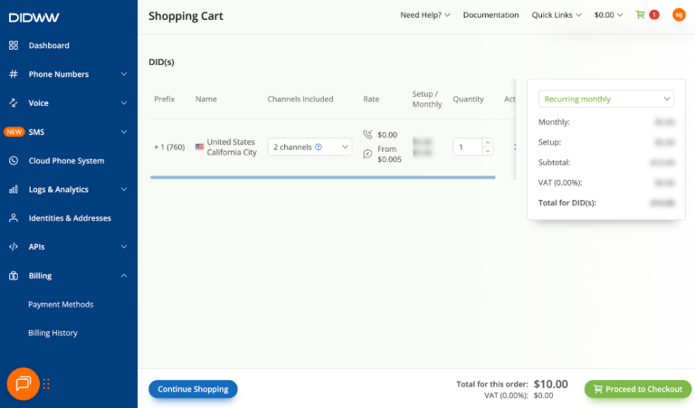
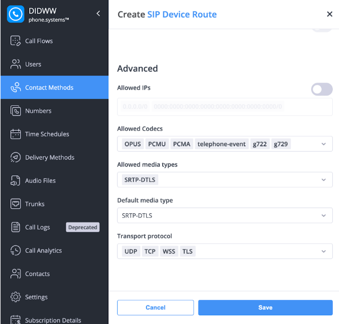
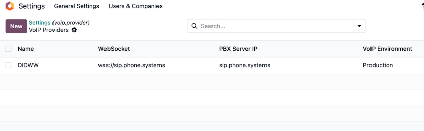
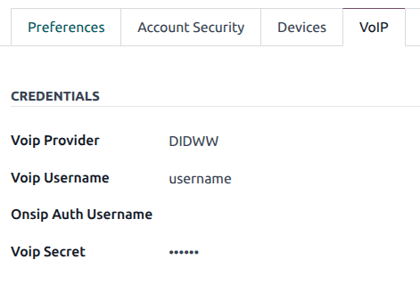

================================
VoIP services in Odoo with DIDWW
================================

*DIDWW* is a global *VoIP* and SIP trunking provider. An active account with DIDWW is required to
use this service.

Before creating an account with DIDWW, make sure that the company's location and the applicable
regions are supported by DIDWW's services.

DIDWW setup
===========

After verifying country coverage and availability, create an account with `DIDWW
<https://www.didww.com/>`_. Then navigate to the `DIDWW Dashboard
<https://my.didww.com/#/dashboard>`_.

To transfer existing numbers from an existing telephone network service provider, follow the steps
outlined on the `DIDWW website <https://doc.didww.com/phone-numbers/number-porting/index.html>`_.

Purchase new numbers
--------------------

To puchase new phone numbers, click :guilabel:`Buy Numbers` in the dashboard, then follow the
instructions to complete the purchase.

When buying a new number, it **must** support both inbound calls and Local CLI.

Enable phone.systems
--------------------

Next, click :guilabel:`Cloud Phone System` in the dashboard sidebar. Then, click :guilabel:`Launch
admin UI`.

.. important::
   The *phone.systems PBX* feature is an extra paid service in DIDWW, and may require additional
   fees.

To create a new user, click :guilabel:`Users`, click the plus sign, then enter the necessary
information.

Click :guilabel:`Contact Methods`, then click the plus sign to add a new *SIP Device Route*.

Configure or add the following parameters:

- :guilabel:`Allowed Codecs`: `OPUS`, `PCMU`, `PCMA`, `telephone-event`, `g722`, `g729`.
- :guilabel:`Allowed media types`: `SRTP-DTLS`
- :guilabel:`Default media type`: `SRTP-DTLS`
- :guilabel:`Transport protocol`: `UDP`, `TCP`, `WSS`, `TLS`

.. tip::
   If no phone number available from drop-down selection in *Inbound and Outbound DID/Caller ID*
   selection, the :guilabel:`Inbound voice trunk` needs to be modified. Navigate to the dashboard,
   then click :guilabel:`My Numbers`. Scroll to :guilabel:`Configuration`. In the :guilabel:`Inbound
   voice trunk` field, select :guilabel:`phone.systems`.

Odoo setup
==========

In *Odoo*, navigate to :menuselection:`Settings app --> Integrations --> VoIP --> Manage Providers`.
Click :guilabel:`New`.

Enter the name, `DIDWW`, then update the :guilabel:`WebSocket` field with `wss://sip.phone.systems`.
Under :guilabel:`PBX Server IP`, enter `sip.phone.systems`.

To configure a user's VoIP provider, click the user avatar in the top-right of the database, then
click :guilabel:`My Preferences`. Click into the :guilabel:`VoIP` tab, then under the :guilabel:`Voip
Provider` field, select :guilabel:`DIDWW`. Finally, enter the :guilabel:`Voip Username` and
:guilabel:`Voip Secret`, then save.

