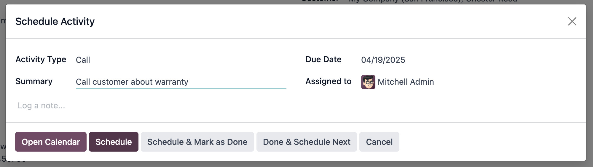

=======================
Support calls with VoIP
=======================

.. |VOIP| replace:: :abbr:`VoIP (Voice over Internet Protocol)`

A useful tool for support teams, Odoo |VOIP| is used as a way to get in contact with customers that
need some help. Using |VOIP| can help improve customer satisfaction, reduce support costs, and
allows support agents to navigate an Odoo database while on a call.

Instead of being tied to their desks, support agents can take calls from anywhere they have access
to Odoo :doc:`VoIP <../voip>`.

.. important::
   This feature requires at least one :doc:`call queue <axivox/call_queues>` to be configured.

.. seealso::
   `Odoo Tutorial: Working as a Support Agent
   <https://www.odoo.com/slides/slide/working-as-a-support-agent-odoo-voip-4617>`_

Log into a support queue
========================

If :doc:`call queues <axivox/call_queues>` are set up, begin a support shift by logging into a call
queue.

Begin by clicking :icon:`oi-voip` :guilabel:`(VoIP)` in the top-right corner of the Odoo database.
From there, click :icon:`fa-keyboard-o` :guilabel:`(keyboard)`, then dial the *agent connection*
number and click :icon:`fa-phone` :guilabel:`(phone)`.

Once the support agent calls their *agent connection code*, they'll hear a short message letting
them know they are logged into the queue. From here, the agent receives support calls according to
the administrator's :doc:`call queue strategy <axivox/call_queues>`. When a support agent receives a
call, the Odoo |VOIP| widget appears in the bottom-right corner of their screen with the caller's
phone number, as well as their name if the number is tied to a customer profile.

.. note::
   When support staff are added as :doc:`static agents <axivox/call_queues>` to a call queue, they
   do not need to log into the queue to receive calls from that queue.

Call a customer from a support ticket
=====================================

As part of a support agent's daily tasks, they might be asked to call customers with open support
tickets. With Odoo |VOIP|, the support agent can stay in the Odoo database throughout the entire
workflow.

From the database's home page, click the **Helpdesk** app, click into a helpdesk, and then open a
ticket. If the ticket does not already have a call activity scheduled, click :guilabel:`Activities`
in the ticket's chatter, then set the activity's :guilabel:`Activity Type` to :guilabel:`Call`, and
then fill out the rest of the activity form, and finally click :guilabel:`Schedule`.

From here, the agent has three ways to make a call:

- Hover over the :guilabel:`Phone` field in the ticket, then click :icon:`fa-phone`
  :guilabel:`Call`.
- In the ticket's chatter, click the customer's phone number.
- In the upper-right corner, click the :icon:`oi-voip` :guilabel:`(VoIP)` icon to open the |VOIP|
  widget. From the :guilabel:`Next Activities` tab, select the call, and finally click the
  :icon:`fa-phone` :guilabel:`(phone)` icon near the bottom of the widget.

Work during a call
------------------

Once the call with the customer begins, the support agent can still move about the Odoo database.
Also, there are shortcut icons in the |VOIP| widget that the support agent can use to access common
actions, like sending an email to the customer, or pulling up their profile. Learn more about
:doc:`the documents a support agent can access <voip_widget>` during a call.

The support agent can also take some actions during the call:

- :icon:`fa-arrows-h` :guilabel:`(transfer)`: Transfer a call to another team member.
- :icon:`fa-microphone` :guilabel:`(microphone)`: The support agent can mute themselves during a
  call.
- :icon:`fa-pause` :guilabel:`(pause)`: Place the caller on hold.

Handle call follow-ups
----------------------

The |VOIP| widget can handle some common follow-up tasks, but support agents can still navigate Odoo
for tasks not available in the widget.

Here are some of the common follow-up tasks that can be managed from the |VOIP| widget:

- Send a follow-up email sharing troubleshooting steps with the customer using the
  :icon:`fa-envelope` :guilabel:`(envelope)` icon.
- Update the customer's mailing address by clicking on the :icon:`fa-user` :guilabel:`(user)` icon,
  which opens their profile.
- Schedule a second call with the customer by clicking the :icon:`fa-clock-o` :guilabel:`(clock)`
  icon, setting the :guilabel:`Activity Type` field to :guilabel:`Call`, and then filling out the
  rest of the form.

End the support call
--------------------

When it is time to end the call, the support agent clicks the red :icon:`fa-phone`
:guilabel:`(phone)` icon in the lower-right corner of the |VOIP| widget. When they do, the call is
logged in the ticket's chatter.

If they have not done so already, the support agent then marks the phone call activity as done. To
do so, navigate to the ticket's chatter and find the :guilabel:`Planned Activities` section, then
click :icon:`fa-check` :guilabel:`Mark Done` on the planned call to remove it from the
:guilabel:`Next Activities` tab in the |VOIP| widget.

Log out of a support queue
==========================

Once the agent's shift ends, or if they are taking a break, they can log out of the support call
queue.

Begin by clicking :icon:`oi-voip` :guilabel:`(VoIP)` in the top-right corner of the Odoo database.
From there, click :icon:`fa-keyboard-o` :guilabel:`(keyboard)`, then dial the *agent disconnection*
number and click :icon:`fa-phone` :guilabel:`phone`.

Once the support agent calls their *agent disconnection code*, they'll hear a short message letting
them know they are logged out of the queue. From here, the agent will no longer receive support
calls until they log back in.
