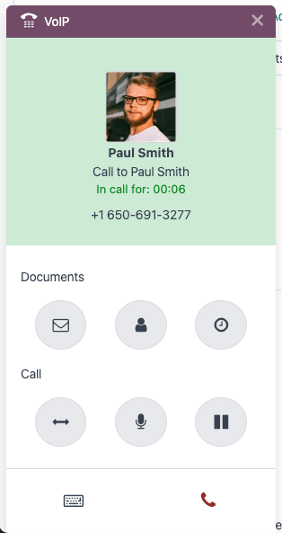

=====================
Sales Calls with VoIP
=====================

.. |VOIP| replace:: :abbr:`VoIP (Voice over Internet Protocol)`

A company's sales team benefits from |VOIP| by way of increased call efficiency, reduced costs, as
well as enabling a salesperson to navigate the Odoo database while on a call through |VOIP|. Instead
of needing a separate phone to handle sales calls, the salesperson makes their calls right from the
Odoo database.

This article goes over setting up Odoo |VOIP| for a sales team that already has |VOIP| configured.
If |VOIP| is **not** configured, refer to the  :doc:`set up VoIP <../voip>` documentation to set up
|VOIP|.

.. example::
   Check out the `Odoo Academy for a video tutorial
   <https://www.odoo.com/slides/slide/sales-calls-with-voip-4562>`_ covering this workflow.

Make a sales call
=================

This workflow begins in the **CRM** app. As a salesperson, click into a sales opportunity. If it
does not already have a call activity scheduled, click :guilabel:`Activities`, then set the
:guilabel:`Activity Type` to :guilabel:`Call`, and then fill out the rest of the activity form, and
finally click :guilabel:`Schedule`.

From here, there are three ways to begin a phone call with the customer:

- Hover over the :guilabel:`Phone` field in the opportunity form, then click :icon:`fa-phone`
  :guilabel:`Call`.
- In the opportunity's chatter, click the customer's phone number.
- In the upper-right corner of the screen, click the :icon:`oi-voip` :guilabel:`(VoIP)` icon to open
  the |VOIP| widget, then click on the call from the :guilabel:`Next Activities` tab, and finally
  click the :icon:`fa-phone` :guilabel:`(phone)` icon near the bottom of the widget.

Work during a call
------------------

Once the call with the customer begins, the salesperson can still move about the Odoo database.
There's also shortcut icons in the |VOIP| widget that the salesperson can use to access common
actions, like sending an email to the customer, or pulling up their profile. Learn more about
:doc:`the documents a salesperson can access <voip_widget>` during a call.

The salesperson can also take some actions during the call:

- :icon:`fa-arrows-h` :guilabel:`(transfer)`: Transfer a call to another team member.
- :icon:`fa-microphone` :guilabel:`(microphone)`: The salesperson can mute themselves during a call.
- :icon:`fa-pause` :guilabel:`(pause)`: Place the caller on hold.

Handle call follow-ups
----------------------

The |VOIP| widget can handle some common follow-up tasks, but salespeople can still navigate Odoo
for tasks not available in the widget.

Here are some of the common follow-up tasks that can be managed from the |VOIP| widget:

- Send a follow-up email sharing new product offerings to the customer using the :icon:`fa-envelope`
  :guilabel:`(envelope)` icon.
- Update the customer's mailing address by clicking on the :icon:`fa-user` :guilabel:`(user)` icon,
  which opens their profile.
- Schedule a second call with the customer by clicking on the :icon:`fa-clock`:guilabel:`(clock)` ,
  setting the :guilabel:`Activity Type` field to :guilabel:`Call`, and then filling out the rest of
  the form.

Send a quotation while on a call
--------------------------------

If the customer's ready to see a sales quotation while on the call, the salesperson can send that
quotation without leaving the call.

To send a quotation while on a call, the salesperson should be in the sales opportunity they
initiated the call from. From here, they'll :doc:`send the quotation as they normally would
<../../sales/sales/sales_quotations/create_quotations>`.

An added benefit of being on the call with the customer while the salesperson is sending the the
quotation is that any specific questions are answered in real-time.

End the sales call
------------------

When it is time to end the call, the salesperson clicks the red :icon:`fa-phone` :guilabel:`(phone)`
icon in the lower-right corner of the |VOIP| widget. When they do, the call is logged in the
opportunity's chatter.

If they have not done so already, the salesperson then marks the phone call activity as done.
Navigate to the opportunity's chatter and find the :guilabel:`Planned Activities` section, then
click :icon:`fa-check` :guilabel:`Mark Done` on the planned call to remove it from the
:guilabel:`Next Activities` tab in the |VOIP| widget.
