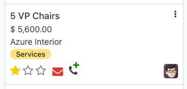

============
VoIP actions
============

.. |VOIP| replace:: :abbr:`VoIP (Voice over Internet Protocol)`

The |VOIP| widget is an add-on made available to Odoo users by installing the |VOIP| module. Instead
of managing mobile devices for every salesperson, fumbling through call transfers for upset
customers, or needing a meeting room to handle a conference call, utilize the |VOIP| widget to
tackle any of these business needs.

Navigate the VoIP widget
========================

The |VOIP| widget contains three tabs: :guilabel:`Recent`, :guilabel:`Next Activities`, and
:guilabel:`Contacts`, which are used for managing calls and day-to-day activities in Odoo. Use the
search bar to find contacts faster.

.. image:: voip_widget/voip-tabs.png
   :alt: VoIP tabs that can be clicked on.

Recent tab
----------

Under the :guilabel:`Recent` tab of the |VOIP| widget, the call history for the user is available.
This includes incoming and outgoing calls. Any number can be clicked to begin a call.

Next activities tab
-------------------

Under the :guilabel:`Next Activities` tab of the |VOIP| widget, a user can see any calls assigned to
them, and which ones are due to be completed for the day.

Click an activity from this tab to perform any of these actions to prepare for and complete (found
under the **Documents** heading):

- :icon:`fa-envelope` :guilabel:`(envelope)`: send an email to a contact (e.g., coworkers or
  clients)
- :icon:`fa-user` :guilabel:`(user)`: shows the contact information for this contact
- :icon:`fa-file-text-o` :guilabel:`(documents)`: shows the attached record in Odoo (like sales
  orders)
- :icon:`fa-clock-o` :guilabel:`(Activities)`: schedule an activity

When viewing the activity, the user can also manage the activity's details and status:

- :icon:`fa-check` :guilabel:`(check)`: marks the activity as complete
- :icon:`fa-pencil` :guilabel:`(edit)`: edits the activity (like its due date)
- :icon:`oi-close` :guilabel:`(close)`: cancels the activity

To call the customer related to a scheduled activity, click the :icon:`fa-phone` :guilabel:`(phone)`
icon. Click the :icon:`fa-keyboard-o` :guilabel:`(keyboard)` icon to dial another number.

Add a call
~~~~~~~~~~

From the database home page, click :menuselection:`CRM app`. On the :guilabel:`Pipeline`, make sure
it is open to the Kanban view. Next, near the top of the screen, click the :icon:`oi-voip`
:guilabel:`VoIP` icon and make sure the |VOIP| widget is opened to the :guilabel:`Next Activites`
tab. After that, hover over the opportunity that should have a call and click the :icon:`fa-phone`
:guilabel:`(phone)` with the small green :icon:`fa-plus` :guilabel:`plus` icon.

To remove a call from the :guilabel:`Next activities` tab, hover over the opportunity that has a
call scheduled, and click the red :icon:`fa-phone` :guilabel:`(phone)` icon that appears with the
:icon:`fa-minus` :guilabel:`(minus)` icon.

Contacts tab
------------

Under the :guilabel:`Contacts` tab of the |VOIP| widget, a user can access a contact in the
**Contacts** app.

Any contact that has a saved phone number can be called by clicking into the contact from the |VOIP|
widget's :guilabel:`Contacts` tab.

A search feature is also available at the top of the widget, represented by a :icon:`fa-search`
:guilabel:`(search)` icon. Use this tool to find a specific contact. Scheduled activities will not
appear as search results.

Make a phone call with VoIP
===========================

One of the primary purposes of |VOIP| is to make phone calls without needing a phone. Here are the
three ways to make a phone call in the Odoo database. First, click the :icon:`oi-voip`
:guilabel:`(VoIP)` icon, located in the top-right of the navigation bar. From here:

- Enter the phone number to be called by clicking the :icon:`fa-keyboard-o` :guilabel:`(keyboard)`
  icon, and then entering the phone number.
- Click the :icon:`fa-phone` :guilabel:`(phone)` icon to redial the last called contact.
- Search for a specific contact's name or go to the :guilabel:`Contacts` tab. Then, select the
  contact and click the :icon:`fa-phone` :guilabel:`(phone)` icon.

When receiving calls in Odoo, the |VOIP| widget rings, and displays a notification. To close the
widget, click the :icon:`oi-close` :guilabel:`(close)` icon in the upper-right of the widget's
screen.

.. note::
   The |VOIP| number is the one provided by Axivox. It can be accessed by navigating to
   `https://manage.axivox.com/ <https://manage.axivox.com/>`_. After logging into the portal, go to
   :menuselection:`Users --> Outgoing number` (column).

Transfer a phone call
---------------------

Manually transferring a call only happens when on a call. To transfer a call within the |VOIP|
widget, first, answer the call using the green :icon:`fa-phone` :guilabel:`(phone)` icon.

Once the incoming call is answered, click the :icon:`fa-arrows-h` :guilabel:`(left-right arrows)`
icon. Then, enter the extension of the user the call should be forwarded to. Finally, click
:guilabel:`Transfer` to route the call to that phone number.

.. tip::
   To find the extension for a user, consult the |VOIP| administrator. If the user has
   :guilabel:`Administration` access rights set to :guilabel:`Settings`, find extensions by going to
   :menuselection:`Settings app` and click the :icon:`fa-arrow-right` :guilabel:`Manage Users`
   button. Select the user, and go to the :guilabel:`VoIP` tab. That user's extension is their
   :guilabel:`VoIP username`.

If the user does not pick up the call or is busy with another call, then calls can be automatically
transferred. This gets configured with the |VOIP| service provider.

Forward a phone call
--------------------

To forward a call within the |VOIP| widget, first, answer the call using the green :icon:`fa-phone`
:guilabel:`(phone)` icon.

Then, click the :icon:`fa-arrows-h` :guilabel:`(left-right arrows)` icon. Enter the full phone
number of the user the call should be forwarded to. Finally, click :guilabel:`Transfer` to route the
call to that phone number.

Send an email through the VoIP widget
=====================================

Emails can also be sent through the |VOIP| widget. This is helpful for sending follow-up emails to
the call participants, emailing a question to a coworker, or reminding a vendor to send over some
components during a check-in call.

To send an email through the |VOIP| widget, click the :icon:`oi-voip` :guilabel:`(VoIP)` icon,
located in the top navigation bar. When this is clicked, the |VOIP| widget will appear in the
bottom-left corner of the page. Then, search for a contact to email or find them in the
:guilabel:`Contacts` tab of the |VOIP| widget.

Next, click the :icon:`fa-envelope-o` :guilabel:`(envelope)` icon, and then select the email
recipients, enter the email's subject line, and write the email. When it is ready to be sent, click
:guilabel:`Send`. To schedule an email to send later, click the :icon:`fa-caret-down`
:guilabel:`(dropdown)` icon next to :guilabel:`Send`, click :guilabel:`Send Later`, pick the
scheduled time, and click :guilabel:`Schedule`.

.. _voip/voip_widget/troubleshooting_voip:

Troubleshooting the VoIP widget
===============================

Each section below goes through common issues with the |VOIP| widget and how to resolve them.

Missing parameter
-----------------

If a *Missing Parameter* error message appears in the |VOIP| widget, refresh the window, and try
again.

Incorrect number
----------------

If an *Incorrect Number* error message appears in the |VOIP| widget, make sure to use the
international format, leading with the :icon:`fa-plus` :guilabel:`(plus)`, followed by the
international country code (e.g., +16506913277, where `+1` is the international prefix for the
United States.)

The websocket connection with the server has been lost
------------------------------------------------------

If a *The websocket connection with the server has been lost. Please try to refresh the page.* error
message appears in the |VOIP| widget, then refresh the page close other browser tabs.

This error is caused by returning to the database after a period of inactivity, like lunch, or if
there are too many browser tabs open.

Failed to start the user agent
------------------------------

If a *Failed to start the user agent. The URL of the websocket may be wrong. Please have an
administrator verify the websocket server URL in the General Settings.* error message appears in the
|VOIP| widget, then update the browser and computer.

This error is caused by the browser or computer not being up-to-date (and can also cause issues with
the microphone).

Grayed-out VoIP widget
----------------------

If the |VOIP| widget is completely grayed out and cannot be interacted with, then update the browser
and computer, and delete the Google Chrome extension causing the problem.

Cannot connect to the VoIP phone number
---------------------------------------

If the user cannot connect to their |VOIP| phone number, then their Odoo profile is missing their
:guilabel:`Voip Secret`. To add this, click the user avatar, and then click :guilabel:`My Profile`.
From here, click the :guilabel:`VoIP` tab, and then enter the user's :guilabel:`Voip Secret`. This
is the user's password to their account for their |VOIP| service provider.
