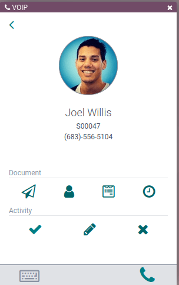
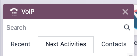

===========
VoIP widget
===========

.. |VOIP| replace:: :abbr:`VoIP (Voice over Internet Protocol)`

The *VoIP* (Voice over Internet Protocol) widget is an add-on made available to Odoo users by
installing the |VOIP| module. Instead of managing mobile devices for every salesperson, fumbling
through call transfers for upset customers, or needing a meeting room to handle a conference call,
utilize the |VoIP| widget to tackle any of these business needs.

Install the VoIP module
=======================

To use |VOIP|, it must first be :doc:`installed <../../general/apps_modules>`.

Once the module is installed, a :icon:`oi-voip` :guilabel:`(VoIP)` icon will appear at the top of
the screen. This is where phone calls are made from within Odoo. When this icon is clicked, a |VOIP|
pop-up widget appears on the screen, and is where emails can be sent, user and employee info can be
edited, and activities can be managed. While this pop-up widget is open, the user can navigate
through their Odoo apps.

Sign up for a VoIP service provider
===================================

While |VOIP| setup is minimal in Odoo, all mapping happens in the external |VOIP| service provider.
Two verified providers are :doc:`OnSIP <onsip>` and :doc:`Axivox <axivox>`. If these providers
cannot be used, an alternate provider must meet these requirements to connect with Odoo:

- |VOIP| host must provide access to a SIP server via a websocket connection
- |VOIP| host must support WebRTC protocol

To add the credentials for the alternate provider, go to the **Settings** app and search for `VoIP`.
In the :guilabel:`Integrations` section under :guilabel:`VoIP`, click :guilabel:`Manage Providers`.
And then, click :guilabel:`New` and enter the requested information (like the websocket's URL). Note
that the :guilabel:`OnSIP Domain` field is where the domain created by the alternate provider goes.

If any issues with the |VOIP| service provider are encountered, then reach out to their support
team. If any issues when setting up the |VOIP| service provider are encountered in Odoo, then follow
the :ref:`relevant troubleshooting steps <voip/voip_widget/troubleshooting_voip>`.

.. warning::
   Odoo **cannot** verify that every alternate provider is compatible with Odoo's systems. However,
   if the above requirements are met, then no issues should be found.

Make a phone call with VoIP
===========================

One of the primary purposes of |VOIP| is to make phone calls without needing a phone. Here are the
three ways to make a phone call in the Odoo database:

- Click the :icon:`oi-voip` :guilabel:`(VoIP)` icon, located in the top-right of the navigation bar.
  Then, enter the phone number to be called by clicking the :icon:`fa-keyboard-o`
  :guilabel:`(keyboard)` icon, and then entering the phone number to be called.

   - To return to the widget's home page, click the :icon:`fa-keyboard-o` :guilabel:`(keyboard)`
     icon again.

- Click the :icon:`oi-voip` :guilabel:`(VoIP)` icon, located in the top-right of the navigation bar.
  Then, click the :icon:`fa-phone` :guilabel:`(phone)` icon to redial the last called contact.
- Click the :icon:`oi-voip` :guilabel:`(VoIP)` icon, located in the top-right of the navigation bar.
  Then, search for a specific contact's name or go to the :guilabel:`Contacts` tab. Then, select the
  contact and click the :icon:`fa-phone` :guilabel:`(phone)` icon.

When receiving calls in Odoo, the |VOIP| widget rings, and displays a notification. To close the
widget, click the :icon:`oi-close` :guilabel:`(close)` icon in the upper-right of the widget's
screen.

.. note::
   The :abbr:`VoIP (Voice over Internet Protocol)` number is the one provided by Axivox. It can be
   accessed by navigating to `https://manage.axivox.com/ <https://manage.axivox.com/>`_. After
   logging into the portal, go to :menuselection:`Users --> Outgoing number` (column).

Send an email through the VoIP widget
=====================================

While phone calls are handled through the |VOIP| widget, emails can also be sent through it. This is
helpful for sending follow-up emails to the call participants, emailing a question to a coworker, or
reminding a vendor to send over some components during a check-in call.

To send an email through the |VOIP| widget, click the :icon:`oi-voip` :guilabel:`(VoIP)` icon,
located in the top navigation bar. When this is clicked, the |VOIP| widget will appear in the
bottom-right corner of the page. Then, search for a contact to email or find them in the
:guilabel:`Contacts` tab of the |VOIP| widget. Next, click the :icon:`fa-envelope-o`
:guilabel:`(envelope)` icon, and then select the email recipients, enter the email's subject line,
and write the email. When it is ready to be sent, click :guilabel:`Send`. To schedule an email to
send later, click the :icon:`fa-caret-down` :guilabel:`(dropdown)` icon next to :guilabel:`Send`,
click :guilabel:`Send Later`, pick the scheduled time, and click :guilabel:`Schedule`.

Navigate the VoIP widget
========================

The |VOIP| widget contains three tabs: :guilabel:`Recent`, :guilabel:`Next Activities`, and
:guilabel:`Contacts`, which are used for managing calls and day-to-day activities in Odoo. Use the
search bar to find contacts faster.

Recent tab
----------

Under the :guilabel:`Recent` tab of the |VOIP| widget, the call history for the user is available.
This includes incoming and outgoing calls. Any number can be clicked to begin a call.

Next activities tab
-------------------

Under the :guilabel:`Next Activities` tab of the |VOIP| widget, a user can see any activities
assigned to them, and which ones are due to be completed for the day.

Click an activity from this tab to perform any of these actions to prepare for and complete (found
under the **Documents** heading):

- :icon:`fa-envelope` :guilabel:`(envelope)`: send an email to a contact (e.g., coworkers or
  clients)
- :icon:`fa-user` :guilabel:`(user)`: shows the contact information for this contact
- :icon:`fa-file-text-o` :guilabel:`(documents)`: shows the attached record in Odoo (like sales
  orders)
- :icon:`fa-clock-o` :guilabel:`(Activities)`: schedule an activity

When viewing the activity, the user can also manage the activity's details and status:

- :icon:`fa-check` :guilabel:`(check)`: marks the activity as complete
- :icon:`fa-pencil` :guilabel:`(edit)`: edits the activity (like its due date)
- :icon:`oi-close` :guilabel:`(close)`: cancels the activity

To call the customer related to a scheduled activity, click the :icon:`fa-phone` :guilabel:`(phone)`
icon. Click the :icon:`fa-keyboard-o` :guilabel:`(keyboard)` icon to dial another number.

Contacts tab
------------

Under the :guilabel:`Contacts` tab of the |VOIP| widget, a user can access a contact in the
**Contacts** app.

Any contact that has a saved phone number can be called by clicking into the contact from the |VOIP|
widget's :guilabel:`Contacts` tab.

A search feature is also available at the top of the widget, represented by a :icon:`fa-search`
:guilabel:`(search)` icon. Use this tool to find a specific contact. Scheduled activities will not
appear as search results.

.. _voip/voip_widget/troubleshooting_voip:

Troubleshooting the VoIP widget
===============================

Each section below goes through common issues with the |VOIP| widget and how to resolve them.

Missing parameter
-----------------

If a *Missing Parameter* error message appears in the Odoo |VOIP| widget, refresh the Odoo window,
and try again.

Incorrect number
----------------

If an *Incorrect Number* error message appears in the Odoo |VOIP| widget, make sure to use the
international format, leading with the :icon:`fa-plus` :guilabel:`(plus)`, followed by the
international country code (e.g., +16506913277, where `+1` is the international prefix for the
United States.)

The websocket connection with the server has been lost
------------------------------------------------------

If a *The websocket connection with the server has been lost. Please try to refresh the page.* error
message appears in the Odoo |VOIP| widget, then refresh the page close other browser tabs.

This error is caused by returning to the database after a period of inactivity, like lunch, or if
there are too many browser tabs open.

Failed to start the user agent
------------------------------

If a *Failed to start the user agent. The URL of the websocket may be wrong. Please have an
administrator verify the websocket server URL in the General Settings.* error message appears in the
Odoo |VOIP| widget, then update the browser and computer.

This error is caused by the browser or computer not being up-to-date (and can also cause issues with
the microphone).

Grayed-out VoIP widget
----------------------

If the |VOIP| widget is completely grayed out and cannot be interacted with, then update the browser
and computer, and delete the Google Chrome extension causing the problem.

Cannot connect to the VoIP phone number
---------------------------------------

If the user cannot connect to their |VOIP| phone number, then their Odoo profile is missing their
:guilabel:`Voip Secret`. To add this, click the user avatar, and then click :guilabel:`My Profile`.
From here, click the :guilabel:`VoIP` tab, and then enter the user's :guilabel:`Voip Secret`. This
is the user's password to their account for their |VOIP| service provider.
