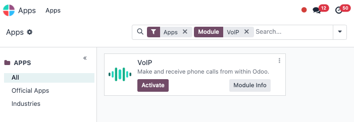
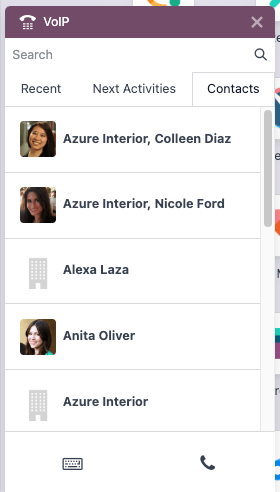
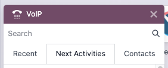

===========
VoIP widget
===========

.. |VOIP| replace:: :abbr:`VoIP(Voice over Internet Protocol)`

The *VoIP* (Voice over Internet Protocol) widget is an add-on made available to Odoo users by
installing the |VOIP| module. Instead of managing mobile devices for every salesperson, fumbling
through call transfers for upset customers, or needing a meeting room to handle a conference call,
utilize the |VoIP| widget to tackle any of these business needs.

Install the VoIP module
=======================

|VOIP| is a separate module that must be installed before it can be configured.

To add |VOIP| to a database, start in the Odoo database's home page, and then click on the **Apps**
application. Then, click on the search bar and search for `VoIP`. In the |VOIP| card, click
:guilabel:`Activate`.

Once the module is installed, a :icon:`oi-voip` (|VOIP|) icon will appear at the top of the screen.
This is where phone calls are made from within Odoo. When this icon is clicked, a |VOIP| pop-up
widget will appear on the screen, and is where emails can get sent, user and employee info can be
edited, and activities can be managed. While this pop-up widget is open, the user can navigate
through their Odoo apps.

Make a phone call with VoIP
===========================

One of the primary purposes of |VOIP| is to make phone calls without needing a phone. To make a
phone call in the Odoo database, click the :icon:`oi-voip` (|VOIP|) icon, located in the top
navigation bar. Then, enter the phone number to be called by clicking the :icon:`fa-keyboard-o`
(**keyboard**) icon, and then entering the phone number to be called, or the :icon:`fa-phone`
(**phone**) icon to redial the last called contact.

The user can also call a specific contact if the user searches for a specific contact or clicks the
:guilabel:`Contacts` tab, and then clicks on a contact, and finally clicks the :icon:`fa-phone`
(**phone**) icon.

When receiving calls in Odoo, the |VOIP| widget rings, and displays a notification. To close the
widget, click the :icon:`fa-times` (**cancel**) in the upper-right of the widget's screen.

.. note::
   The :abbr:`VoIP (Voice over Internet Protocol)` number is the one provided by Axivox. It can be
   accessed by navigating to `https://manage.axivox.com/ <https://manage.axivox.com/>`_. After
   logging into the portal, go to :menuselection:`Users --> Outgoing number` (column).

Send and email through the VoIP widget
======================================

While phone calls are handled through the |VOIP| widget, emails can also be sent through it. This is
helpful for quickly sending follow-up emails to the call participants, emailing a question to a
coworker, or reminding a vendor to send over some components during a check-in call.

To send an email through the |VOIP| widget, click the :icon:`oi-voip` (|VOIP|) icon, located in the
top navigation bar. Then, search for a contact to email or find them in the :guilabel:`Contacts` tab
of the |VOIP| widget. Next, click the :icon:`fa-envelope-o` (**envelope**) icon, and then select the
email recipients, enter the email's subject line, and write the email. When it is ready to be sent,
click :guilabel:`Send`. If the email should be sent later, click :icon:`fa-caret-down` (**triangle
pointed down**) next to :guilabel:`Send`, and then click :guilabel:`Send Later`, and then pick the
schedule time and click :guilabel:`Schedule`.

Navigate the VoIP widget
========================

The |VOIP| widget contains three tabs: :guilabel:`Recent`, :guilabel:`Next Activities`, and
:guilabel:`Contacts`, which are used for managing calls and day-to-day activities in Odoo. A search
bar is also included to make finding contacts faster.

Recent tab
----------

Under the :guilabel:`Recent` tab of the |VOIP| widget, the call history for the user is available.
This includes incoming and outgoing calls. Any number can be clicked to begin a call.

Next activities tab
-------------------

Under the :guilabel:`Next Activities` tab of the |VOIP| widget, a user can see any activities
assigned to them, and which ones are due to be completed for the day.

Click an activity from this tab to perform any of these actions to prepare for and complete (found
under the *Documents* heading):

- :icon:`fa-envelope-o` (**envelope**): send an email to a contact (e.g., coworkers or clients)
- :icon:`fa-user` (**person**): shows to the contact information for this contact
- :icon:`fa-file-text-o` (**documents**): shows to the attached record in Odoo (like sales orders)
- :icon:`fa-clock-o` (**clock**): schedule an activity

When viewing the activity, the user can also manage the activity's details and status:

- :icon:`fa-check` (**check**): marks the activity as complete
- :icon:`fa-pencil` (**edit**): edits the activity (like its due date)
- :icon:`fa-times` (**cancel**): cancels the activity

To call the customer related to a scheduled activity, click the :icon:`fa-phone` (**phone**). Click
the :icon:`fa-keyboard-o` (**keyboard**) icon to dial another number.

Contacts tab
------------

Under the :guilabel:`Contacts` tab of the |VOIP| widget, a user can access a contact in the
**Contacts** app.

Any contact that has a saved phone number can be called by clicking into the contact from the |VOIP|
widget's :guilabel:`Contacts` tab.

A search feature is also available at the top of the widget, represented by a :icon:`fa-search`
(**search**) icon. Use this tool to find a specific contact. Scheduled activities will not appear as
search results.

Troubleshooting the VoIP widget
===============================

.. tip::
   If a *Missing Parameter* error message appears in the Odoo |VOIP| widget, refresh the Odoo
   window, and try again.

   .. image:: voip_widget/missing-parameter.png
      :alt: "Missing Parameter" error message in the Odoo softphone.

.. tip::
   If an *Incorrect Number* error message appears in the Odoo |VOIP| widget, make sure to use the
   international format, leading with the :icon:`fa-plus` (**add**) sign, followed by the
   international country code.

   (E.g., +16506913277, where `+1` is the international prefix for the United States.)

   .. image:: voip_widget/incorrect-number.png
      :alt: "Incorrect Number" error message in the Odoo softphone.
