========
WhatsApp
========

**WhatsApp** is an instant messaging and voice-over-IP app that allows users to send messages, make
calls, and share content. Businesses can use `WhatsApp Business
<https://developers.facebook.com/products/whatsapp/>`_ to communicate with their customers by text,
send documents and provide support.

.. warning::
   WhatsApp is an Odoo Enterprise-only application that does not work in Odoo Community edition. To
   sign up for Odoo Enterprise edition, click here: `Odoo Free Trial <https://www.odoo.com/trial>`_.

.. seealso::
   For more information on migrating from Odoo Community version to Odoo Enterprise version see this
   documentation: :doc:`../../../administration/maintain/enterprise`.

With the **Odoo WhatsApp** app, a company can connect a WhatsApp Business Account (WABA) to an Odoo
database, which allows for the following:

- Receive and reply to WhatsApp messages directly from an Odoo database
- Create new templates with dynamic placeholders/variables
- Send pre-approved templates that use dynamic variables, such as:

  - Quotations from the Sales app
  - Receipts and invoices from the Point of Sale app
  - Tickets from the Events app

.. seealso::
   - `Meta Business: create message templates for the WhatsApp Business account
     <https://www.facebook.com/business/help/2055875911147364>`_.
   - `Meta Business: connect a phone number to the WhatsApp Business account
     <https://www.facebook.com/business/help/456220311516626>`_.
   - `Meta Business: change the WhatsApp Business display name
     <https://www.facebook.com/business/help/378834799515077>`_.

WhatsApp is a messaging service operated by Meta, which is the parent company of Facebook. WhatsApp
is commonly used as a communication tool in many countries and by many businesses. This
documentation will cover the integration of a WhatsApp Business Account with Odoo. The company's
Meta account is configured in Odoo via an :abbr:`API (Application Programming Interface)`
connection.

The WhatsApp connector supports two flows: company initiated, and customer initiated. A company can
initiate a discussion by sending a template to one or more people. Once the template is sent, the
recipient can answer in order to trigger a discussion between the sender and the receiver (a
*Discuss* chat window will pop up if the customer answers within 15 days).

If the discussion is initiated by the client (e.g. by sending to the company's public WhatsApp
number), then Odoo will open a group chat with all operators responsible for this WhatsApp channel.

.. tip::
   It is recommended to set up multiple WhatsApp accounts for different departments. For example,
   the help desk team and sales teams can chat on different channels.

WhatsApp configuration in a Meta
================================

A WhatsApp integration with Odoo uses a standard :abbr:`API (Application Programming Interface)`
connection, and is configured on Meta in the following steps:

#. Create a Meta business account
#. Create a Meta developer account
#. Setup an *app* and WhatsApp *product* on Meta's developer console
#. Test the API connection.

Once connected, messages are then sent and received through Odoo's *Discuss* application using the
WhatsApp :abbr:`API (Application Programming Interface)`.

Meta business account setup
---------------------------

To create a Business account with Meta (owner of Facebook) navigate to: `Facebook Business Manager
<https://business.facebook.com/overview>`_. Begin by clicking :guilabel:`Create account` and then
enter the business name, the administrator's name, and a work email address. Then click
:guilabel:`Next`, and a pop-up window will appear prompting to confirm the email address. After
confirming, click :guilabel:`Done` to close the window.

Next, follow the instructions in the email sent by Facebook to confirm the creation of the business
account and to complete the setup process.

.. seealso::
   `Set up a Meta business account
   <https://www.facebook.com/business/help/1710077379203657?id=180505742745347>`_.

.. important::
   If the business account is linked to a personal Facebook account then the administrator must
   toggle between the personal account to the business account for the remainder of the
   configuration.

   To toggle to the business account navigate to the `Facebook Developer Console
   <https://developers.facebook.com>`_ and click on the *account name* in the upper right corner.
   Under the :guilabel:`Business Accounts` heading, click on the desired business that the WhatsApp
   configuration should take place in. This will be the account for which Odoo will send and receive
   WhatsApp messages.

   .. image:: whatsapp/toggle.png
      :align: center
      :alt: Toggle between Meta personal and business accounts.

.. important::
   In order to create a Meta business account, the user must already have a personal Facebook
   account that has existed for a minimum of one hour prior to setting up the Facebook Business
   account. Trying to create the business account prior to this time will result in an error.

App creation
------------

On the `Meta for Developers <https://developers.facebook.com>`_ dashboard, sign in with the Meta
developer account. If no account is configured yet, link a Facebook account to create a Meta
developer account.

.. note::
   A Facebook *developer* account is different than a Facebook *business* account. While developer
   accounts are made up of personal Facebook accounts, business accounts are **not** as they
   represent a business and manage all of the business's assets in Meta, such as apps.

.. seealso::
   `Set up the WhatsApp Business Platform
   <https://www.facebookblueprint.com/student/collection/409587/path/360218>`_.

Click on :guilabel:`My Apps` in the top right corner after successfully signing in to the Meta
developer account. This will redirect the administrator to all the apps the developer has configured
in this specific developer account. Click on :guilabel:`Create App` to begin the process of
configuring a new Meta application.

App type
--------

On the :menuselection:`Create an app` page, select :guilabel:`Other` under the section labeled,
:guilabel:`Looking for something else?`, and then click :guilabel:`Next` to be directed to another
page in order to select the app type. Then, click on the first option listed under the
:guilabel:`Select an app type` label, titled :guilabel:`Business`. This selection allows for the
creation and management of the WhatsApp :abbr:`API (Application Programming Interface)`.

Now, click :guilabel:`Next` to configure the app, as desired. When the app *type* has been
configured, the administrator will move onto the app *details* section.

App details
-----------

On the :guilabel:`Details` section of the :guilabel:`Create an app` process, enter `Odoo` in the
field under the :guilabel:`Add an app name` label.

.. note::
   The app name can be changed at a later time in the settings, if necessary.

.. warning::
   Trademarks and branded elements may not be used in this text section. These include the Meta
   group of companies. Do not include the word: `WhatsApp` or the system will flag this in error.

Next, enter the developer email address in the field under the :guilabel:`App contact email` label.

Lastly, set the :guilabel:`Business Account - Optional` field to the Meta business account profile,
using the drop-down menu. To finish, click :guilabel:`Create app`. This action will create the app
and prompts the *Meta Platform Terms* and *Developer Policies* agreements.

To accept the agreements, enter the Facebook password for security purposes, and click
:guilabel:`Submit` to finalize the app creation. The browser will then direct to the :guilabel:`Meta
for Developers` dashboard.

.. note::
   If the Meta business account is prohibited from advertising, claiming an app won't be allowed. To
   resolve this issue navigate to `<https://business.facebook.com/business>`_ for assistance.

   For more information, see `Meta's documentation on advertising restrictions
   <https://www.facebook.com/business/help/975570072950669>`_.

Add a WhatsApp product to the app
---------------------------------

Now that the basic structure of the app has been created, a product will need to be added to the
app. Begin by accessing the Meta app dashboard by navigating to
`<https://developers.facebook.com/apps>`_, and clicking on the app that is being configured.

On the next page: since WhatsApp will be used, click :guilabel:`Set up` next to the box containing
WhatsApp, located towards the bottom of the page.

.. seealso::
   `Meta's WhatsApp developer documentation <https://developers.facebook.com/docs/whatsapp/>`_.

The page then directs to the configuration page for the :guilabel:`WhatsApp Business Platform API`.
Use the drop-down menu to select the Meta business to be configured for the :guilabel:`Select a Meta
Business Account` option, and then click :guilabel:`Continue` to confirm the selection.

.. note::
   When :guilabel:`Continue` is clicked, the administrator agrees to Meta's terms and conditions as
   linked on the :guilabel:`Meta App Dashboard`.

.. note::
   Once the WhatsApp product is added to the app, Meta will provide a WhatsApp test phone number
   with 5 test messages.

Start using the WhatsApp API
----------------------------

After finishing the previous WhatsApp product wizard, and clicking :guilabel:`Continue`, the browser
should have directed to the WhatsApp :guilabel:`Quickstart` page; this :guilabel:`Quickstart` page
is where to begin configuring the WhatsApp API by adding a phone number and then sending an initial
test message.

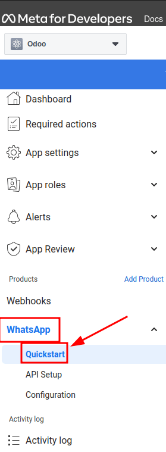

.. note::
   If the browser isn't on the :guilabel:`Quickstart` page for WhatsApp, navigate to
   `<https://developers.facebook.com/apps>`_ and click on the app that is being configured, (the
   app name is `Odoo` if the instructions above were followed).

   Then, in the menu on the left-hand side of the page, click the :guilabel:`v (menu toggle)` icon
   next to the :guilabel:`WhatsApp` section heading. A small menu will open, containing the
   following options:

   - :guilabel:`Quickstart`
   - :guilabel:`API Setup`
   - :guilabel:`Configuration`

   Click the :guilabel:`Quickstart` option, and then click :guilabel:`Start using the API`.

API Setup
~~~~~~~~~

After clicking on :guilabel:`Start using the API`, the page navigates to the :guilabel:`API Setup`.
Now that the test number has been created, a test message can be sent to confirm that WhatsApp is
working properly. To begin, navigate to the section on the page labeled :guilabel:`Send and receive
messages` and click the drop-down menu next to :guilabel:`To`, under :guilabel:`Step 1 Select phone
numbers`.

Now, select the only option available: :guilabel:`Manage phone number list`. Follow the steps and
add up to five numbers to send the free test messages to. After entering the appropriate country
code and phone number, click on :guilabel:`Next`.

.. important::
   Adding a phone number to send to in this step will allow for a successful test to be sent by the
   terminal. This is critical to ensure the WhatsApp :abbr:`API (Application Programming Interface)`
   is working.

A verification code from WhatsApp Business is then sent to the phone number, which needs to be input
on the next screen to verify ownership of the number. Enter the verification code and click
:guilabel:`Next` to verify the number.

Send a test message via terminal
~~~~~~~~~~~~~~~~~~~~~~~~~~~~~~~~

Next, send a test message via the terminal. Under the section labeled :guilabel:`Step 2 Send
messages with the API`, click :guilabel:`Send Message`. A test message will then be sent to the
phone number that was set in the previous section.

Upon successfully receiving the message to the number, move onto the next section to produce and
configure webhooks.

.. _productivity/whatsapp/webhooks:

WhatsApp configuration in Odoo
==============================

The next steps configured in this section are all within the Odoo database. A few different values
for a token, phone number, and account IDs all need to be configured in Odoo; these values are
necessary in order to create a :guilabel:`Callback URL` and :guilabel:`Webhook Verify Token`, which
are then used to configure the webhooks (in order to receive messages back into the database).

In Odoo, navigate to :menuselection:`WhatsApp app --> Configuration --> WhatsApp Business Accounts`.
Then click :guilabel:`New` to configure the WhatsApp business account in Odoo.

In another browser tab, navigate to :menuselection:`https://developers.facebook.com --> My Apps -->
WhatsApp --> API Configuration`, and then copy the following values from the Meta developer console
into the corresponding fields in Odoo:

.. list-table::
   :header-rows: 1
   :stub-columns: 1

   * - Name
     - Meta Console
     - Odoo Interface
   * - Phone
     - :guilabel:`Phone number ID`
     - :guilabel:`Phone Number ID`
   * - Token
     - :guilabel:`Temporary access token`
     - :guilabel:`Access Token`
   * - App ID
     - :guilabel:`App ID`
     - :guilabel:`App ID`
   * - Account ID
     - :guilabel:`WhatsApp Business Account ID`
     - :guilabel:`Account ID`

To retrieve the :guilabel:`App Secret`, navigate to the Meta developer console,
`<https://developers.facebook.com/apps>`_ and select the app that Odoo is being configured in. Then
in the left-side menu, under :guilabel:`App settings`, select :guilabel:`Basic`.

Next, click :guilabel:`Show` next to the field :guilabel:`App secret`, and enter the account
password to verify ownership. Copy the :guilabel:`App secret` and then paste that copied value into
the :guilabel:`App Secret` field on the Odoo :guilabel:`WhatsApp Business Account` configuration
dashboard.

To complete the setup of the WhatsApp business account in Odoo, click :guilabel:`Test Connection`. A
successful message in green will populate in the upper-right corner of the dashboard if the
configuration is set correctly.

Configuring webhooks
--------------------

To configure the webhooks for WhatsApp in Odoo, navigate to
`<https://developers.facebook.com/apps>`_ and select the app that Odoo is being configured in. Next
under the :guilabel:`WhatsApp` menu heading on the left side of the screen, click on the
:guilabel:`API Setup` menu item. Finally go to the section marked :guilabel:`Step 3: Configure
webhooks to receive messages` and click on :guilabel:`Configure webhooks`.

.. tip::
   Another way to configure *Webhooks* is to navigate to `<https://developers.facebook.com/apps>`_
   and select the app that Odoo is being configured in. Then select :guilabel:`Webhooks` in the left
   hand menu.

   .. image:: whatsapp/webhooks.png
      :align: center
      :alt: Manually navigating to the Whatsapp webhooks configuration.

On the :menuselection:`Webhook configuration` page, click on :guilabel:`Edit`, where both the
:guilabel:`Callback URL` and :guilabel:`Webhook Verify Token` values from the Odoo will be added.

..  note::
    Both the :guilabel:`Callback URL` and :guilabel:`Webhook Verify Token` values were automatically
    populated after clicking on :guilabel:`Test Connection` in the previous step.

In a separate browser window, retrieve the necessary values in Odoo by navigating to
:menuselection:`WhatsApp app --> Configuration --> WhatsApp Business Accounts` and select the
account that is being configured. Locate the values under the section labeled :guilabel:`Receiving
Messages`.

Copy and paste the :guilabel:`Callback URL` from Odoo into the :guilabel:`Callback URL` field in
Meta. Similarly, copy and paste the :guilabel:`Webhook Verify Token` into the :guilabel:`Verify
Token` field on the Meta developer console, as well.

Finally, click :guilabel:`Verify and save` to record the values in the Meta developer console.

Webhook fields
~~~~~~~~~~~~~~

Now input individual webhook fields into Meta's developer console, under the :guilabel:`Webhook
fields` section. Click :guilabel:`Manage` and when the pop-up window appears, check the boxes in the
:guilabel:`Subscribe` column for the following *field names*:

- account_update
- message_template_quality_update
- message_template_status_update
- messages
- template_category_update

After making the selections, click :guilabel:`Done`.

The finished :guilabel:`Webhooks` configuration will appear like this in the Meta developer console:

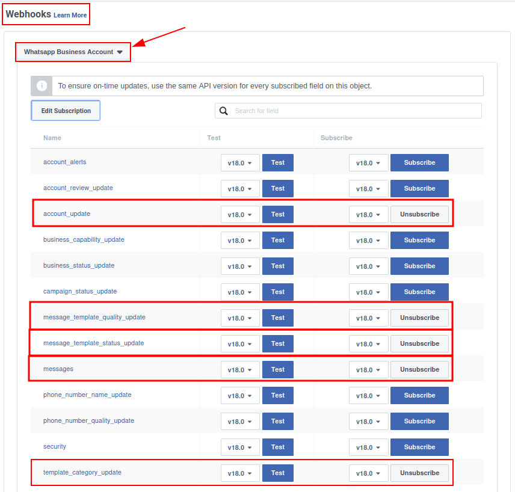

.. important::
   The :guilabel:`Webhook fields` will only appear once the subscription is confirmed using the
   :guilabel:`Callback URL` and :guilabel:`Webhook Verify Token`.

.. seealso::
   `Meta's WhatsApp documentation on setting webhooks
   <https://developers.facebook.com/docs/whatsapp/cloud-api/guides/set-up-webhooks>`_.

Add phone number
~~~~~~~~~~~~~~~~

To configure the phone number to use for WhatsApp in Odoo, navigate back to the Meta developer
console (`<https://developers.facebook.com/apps>`_) and again select the app that Odoo is being
configured in. Under the :guilabel:`WhatsApp` menu heading on the left side of the screen, click on
the :guilabel:`API Setup` menu item. From there, go to the section marked: :guilabel:`Step 5: Add a
phone number`, and click on :guilabel:`Add phone number`.

In the fields, enter a :guilabel:`Business name` as well as a :guilabel:`Business website or profile
page`.

.. tip::
   The :guilabel:`Business website or profile page` field can be a social media page's :abbr:`URL
   (Uniform Resource Locator)`.

Complete filling out the business information by next selecting the country that the company does
business in from the drop-down menu in the :guilabel:`Country` section. Add an address if desired,
however, this information is optional. After adding the location, click :guilabel:`Next` to
continue.

The following page contains information for the :guilabel:`WhatsApp Business profile`. Complete the
following sections, accordingly:

- :guilabel:`WhatsApp Business Profile Display Name`
- :guilabel:`Timezone`
- :guilabel:`Category`
- :guilabel:`Business description` (optional)

Once these sections are complete, click :guilabel:`Next`. The page refreshes and then prompts the
administrator to :guilabel:`Add a phone number for WhatsApp` in the respective field. Here, enter
the phone number to configure in WhatsApp.

.. seealso::
   `Migrate an Existing WhatsApp Number to a Business Account
   <https://developers.facebook.com/docs/whatsapp/cloud-api/get-started/migrate-existing-whatsapp-
   number-to-a-business-account>`_.

Next, choose a verification method for the phone number. Select either :guilabel:`Text message` or
:guilabel:`Phone call`, and then click :guilabel:`Next` proceed.

The phone number entered will receive either a text or a phone call by WhatsApp with a code,
depending on the verification method chosen. Enter that verification code into the
:guilabel:`Verification code` field and click :guilabel:`Next` to finish.

.. warning::
   If a payment method hasn't been added this will be necessary to proceed. `Visit Meta's
   documentation on how to add a payment method in Meta's Business Manager
   <https://www.facebook.com/business/help/915454841921082?id=180505742745347>`_. This is part of
   Meta's fraud detection system, in order to ensure that the account/company are real a payment
   method is required to proceed.

.. seealso::
   `Meta for Developers: Add a Phone Number
   <https://developers.facebook.com/docs/whatsapp/cloud-api/get-started/add-a-phone-number>`_.

.. _productivity/whatsapp/token:

Permanent token
~~~~~~~~~~~~~~~

After configuration and testing are complete, a permanent token should be created to replace the
:guilabel:`Temporary token`.

.. seealso::
   `Meta for Developers: System User Access Tokens
   <https://developers.facebook.com/docs/whatsapp/business-management-api/get-started#system-user-
   access-tokens>`_.

Begin by navigating to `<https://business.facebook.com/>`_ and then go to :menuselection:`Business
settings --> User --> System Users`. Select an existing system user or create a new system user by
clicking on :guilabel:`Add`.

Assets now must be added to the system user and then a permanent token can be generated.

Click on :guilabel:`Add assets`, and when the pop-up window appears select :guilabel:`Apps` under
the :guilabel:`Select asset type`. Then, select the Odoo app and toggle the permissions to *On*
under the :guilabel:`Full control` option. Set this new permission setting by clicking
:guilabel:`Save Changes`, to which a confirmation window will appear, acknowledging the addition of
the asset to the system user. Finish by clicking :guilabel:`Done`.

Next, the permanent token will be generated. Click on :guilabel:`Generate new token`, and a pop-up
window will appear asking which app this token should be generated for. Select the :guilabel:`App`
that this token is for. Then determine the expiration date of either :guilabel:`60 days` or
:guilabel:`Never`.

Finally, when Meta asks which permissions should the system user allow, add all of the following
permissions:

- WhatsApp_business_messaging
- WhatsApp_business_management

When permissions are set, click :guilabel:`Generate token`. Copy the token value that populates on
the screen that follows.

With that token value, update the :guilabel:`Access Token` field in the WhatsApp business account in
Odoo by navigating to :menuselection:`WhatsApp app --> Configuration --> WhatsApp Business
Accounts`.

Go live with the Meta app
=========================

Finally, to launch the app, the Meta app must be set to :guilabel:`Live` in the Meta developer
console. Navigate to `<https://developers.facebook.com/apps>`_ and click on the app that is being
configured. In the top menu, toggle the :guilabel:`App Mode` field from :guilabel:`Development` to
:guilabel:`Live`.

.. important::
   If the app status is not set to *live*, then the database will only be able to contact the test
   numbers specified in the developer console.

.. warning::
   A privacy policy URL must be set in order for the app to be set to live. Go to the Meta developer
   console, `<https://developers.facebook.com/apps>`_ and select the app that Odoo is being
   configured in. Then, using the menu on the left side of the screen, go to :menuselection:`App
   Settings --> Basic`. Then, enter the privacy policy hyperlink address under the
   :guilabel:`Privacy Policy URL` field of the form. Click :guilabel:`Save changes` to apply the
   privacy policy to the app.

Once the app has gone live in the Meta developer console, a confirmation email is sent to the
administrator.

.. _productivity/whatsapp/templates:

WhatsApp templates
==================

WhatsApp templates are saved messages that are used repeatedly to send messages from the database.
They allow users to send quality communications, without having to compose the same text repeatedly.

Creating different templates that are tailored to specific situations lets users choose the right
message for the right audience. This increases the quality of the message and the overall
engagement rate with the customer.

WhatsApp templates can be created on both the Odoo and Meta consoles. The following process will
overview the process for creating templates in Odoo and then afterward in Meta.

.. important::
   WhatsApp has an approval process that must be completed before the template can be used.
   :ref:`productivity/whatsapp/approval`.

.. _WhatsApp/templates:

Creating templates in Odoo
--------------------------

To access and create WhatsApp templates, begin by navigating to the :menuselection:`WhatsApp app -->
Templates` dashboard.

At the bottom of an individual template's form, there are three tabs: :guilabel:`Body`,
:guilabel:`Buttons`, and :guilabel:`Variables`; these three tabs combined create the WhatsApp
template.

The text is entered into the :guilabel:`Body` tab, and dynamic content that is called out in the
:guilabel:`Body` tab is specified in the :guilabel:`Variables` tab. Every piece of dynamic content
(e.g., placeholders) in the message (body) is specifically called out and specified in the
:guilabel:`Variables` tab.

Templates are prefabricated layouts that allow users to send professional looking messages to
customers. These templates are capable of containing dynamic data that will populate in the end
message using variables that are set in the template configuration. For example, messages can
contain the end user's name, call out specific products, or reference a sales order, to name a few
convenient and impactful variables.

To create a WhatsApp template, go to the :menuselection:`WhatsApp app --> Templates` dashboard and
click :guilabel:`New`. On the form, enter a :guilabel:`Name` for the template, and select a
:guilabel:`Language`.

.. important::
   In order to complete this next task, administrator access rights are needed to edit the
   :guilabel:`Applies to` field. See this :doc:`access rights documentation
   <../general/users/access_rights>` for more information.

In the :guilabel:`Account` drop-down menu, select the *WhatsApp business account* in Odoo that this
template should link to. Next, under the :guilabel:`Applies to` field select the *model* the server
action will apply to for this template.

.. tip::
   These models can also be accessed in :ref:`developer mode <developer-mode>`. On a contact form
   (or similar relevant form in Odoo), navigate to the model that will be referenced, and hover over
   any field name. A box of backend information will reveal itself with the specific Odoo
   :guilabel:`Model` name in the backend. Search (using the front-end name) for this model in the
   :guilabel:`Applies to` drop-down menu in the WhatsApp template.

.. warning::
   Often when changing the model or :guilabel:`Applies to` field, the :guilabel:`Phone Field` may
   produce an error The :guilabel:`Phone Field` should always be set to the `Phone` or `Mobile`
   model.

To search available fields, type in the front-end name in the :guilabel:`Search...` box.  This will
find a result from all of the available fields for the model (:guilabel:`Applies to`) that the
template is created for.

.. note::
   In order to find specific fields, multiple levels may need to be navigated in the search results
   box. Use the :guilabel:`> (right chevron)` and :guilabel:`⬅️ (left arrow)` icons to navigate
   between the menu levels.

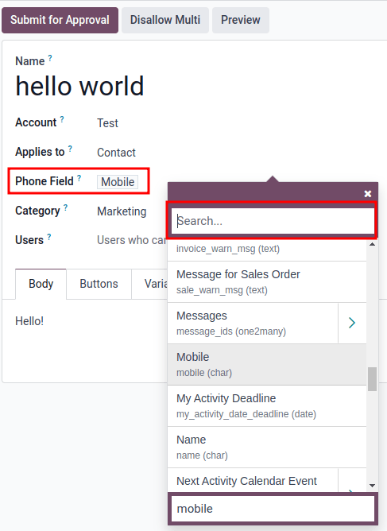

Change the :guilabel:`Category` to fit either a :guilabel:`Marketing`, :guilabel:`Utility`, or
:guilabel:`Authentication` category. In most instances the first two options will be used, unless
the user would like to send a password reset or something security related. Set to
:guilabel:`Marketing` should there be anything promotional being sent and set to :guilabel:`Utility`
should there be general transactional messages being sent (i.e., sales order, event ticket, etc).

.. important::
   Specifying an incorrect category can cause a flag/rejected status from Meta during the approval
   process.

Add any :guilabel:`Users` that are allowed to use this template. In the right-side column, a
:guilabel:`Header type` can be configured along with a :guilabel:`Header message`, as well.

The available :guilabel:`Header types` are as follows:

- Text
- Image
- Video
- Document
- Location (variables need to be set)

Navigate to the :guilabel:`Body` tab to configure the main message of the template.

When all the necessary changes are made to the template, click on the :guilabel:`Submit for
approval` button in the upper-left corner. This will cause the status of the template to change to
:guilabel:`Pending`.

The status will remain in :guilabel:`Pending` until a decision has been made by Meta, whereby a
confirmation email will then be sent indicating that the template has been approved (or rejected).
The templates will then need to be synced from the Odoo database.

See this section for more information on :ref:`syncing templates <productivity/whatsapp/sync>`.

.. tip::
   There are pre-configured demo data templates available in Odoo to use or modify. These templates
   can be used as-is or modified to suit a specific business need.

   To use these templates, navigate to :menuselection:`WhatsApp app --> Templates` and select a
   pre-configured template. Click :guilabel:`Submit for Approval` to start the approval process. An
   email will be sent to the administrator of the Meta account when the template has been approved.

Buttons
~~~~~~~

Buttons can be added into the message from the :guilabel:`Buttons` tab. Enter the :guilabel:`Type`
(either :guilabel:`Visit Website`, :guilabel:`Call Number`, or :guilabel:`Quick Reply`), and then
specify the :guilabel:`Button Text`, :guilabel:`Call Number` or :guilabel:`Website URL` (including
:guilabel:`Url Type`), depending on the :guilabel:`Type` of button.

.. note::
   Buttons can also be added on the Meta business console. See Meta's WhatsApp template dashboard by
   navigating to `<https://business.facebook.com/wa/manage/home>`_. Then go to
   :menuselection:`Account tools --> Message templates`.

Using placeholders and variables
~~~~~~~~~~~~~~~~~~~~~~~~~~~~~~~~

Dynamic variables reference certain fields within the Odoo database to produce unique data in the
WhatsApp message when using a template. Dynamic variables are encoded to display fields from within
the database, referencing fields from within a model.

.. example::
   Many companies like to customize their WhatsApp messages with a personalized piece of customer
   information to grab attention. This can be accomplished in Odoo by referencing a field within a
   model by setting a dynamic variable. For example, a customer's name can be referenced in the
   email from the :guilabel:`Customer` field on the :guilabel:`Sales Order` model.

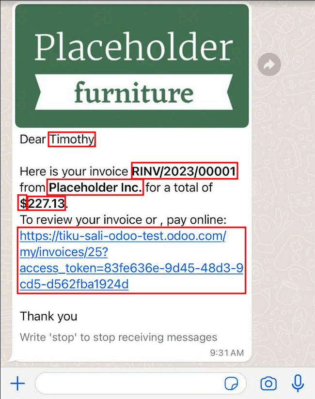

Dynamic variables can be added in to the :guilabel:`Body` by adding :guilabel:`placeholders` in the
*text*. To add a placeholder in the *message body* enter the following text `{{1}}`. For the second
placeholder enter `{{2}}` and increase incrementally as more placeholders are added to the text.

.. example::
   *The following is the text from payment receipt template body:*

   Dear {{1}},

   | Here is your invoice *{{2}}* from *{{3}}* for a total of *{{4}}{{5}}*.
   | To review your invoice or pay online: {{6}}

   Thank you

.. seealso::
   :ref:`productivity/whatsapp/templates`.

These placeholders must be configured on the :guilabel:`Variables` tab of the template before
submitting for approval from Meta. To edit the dynamic variables on a template, first change the
:guilabel:`Type` to :guilabel:`Field of Model`. This allows Odoo to reference a field within a model
to produce unique data in the message being sent.

Next, edit the :guilabel:`Field` of the dynamic variables. The :guilabel:`Applies to` field in the
template should be edited prior to ensure the correct model and field are referenced.

To search the available fields, type in the front-end name of the field in the search box. This will
find a result from all of the available fields for the model (:guilabel:`Applies to`) that the
template is created for. There may be multiple levels that need to be configured.

.. example::
   The following is an example of the variables set for the above placeholders in the payment
   receipt noted above:

   .. list-table::
      :header-rows: 1
      :stub-columns: 1

      * - Name
        - Sample Value
        - Type
        - Field
      * - body - {{1}}
        - Azure Interior
        - Field of Model
        - `Partner`
      * - body - {{2}}
        - INV/2022/00001
        - Field of Model
        - `Number`
      * - body - {{3}}
        - My Company
        - Field of Model
        - `Company`
      * - body - {{4}}
        - $
        - Field of Model
        - `Currency > Symbol`
      * - body - {{5}}
        - 4000
        - Field of Model
        - `Amount`
      * - body - {{6}}
        - \https://..
        - Portal link
        -

.. example::
   For example, in the :guilabel:`Body` tab, if the following is typed, "Hello {{1}},", then `{{1}}`
   must be set in the :guilabel:`Variables` tab. For this specific case, the message should greet
   the customer by name, so the `{{1}}` should be configured to populate the `{{1}}`
   :guilabel:`Field` with the :guilabel:`Customer` name.

.. warning::
   Customizing WhatsApp templates is out of the scope of Odoo Support.

.. _productivity/whatsapp/approval:

Meta template approval
~~~~~~~~~~~~~~~~~~~~~~

After updating the dynamic variables on the template, the template needs to be submitted to Meta for
approval again. Click :guilabel:`Submit for Approval` to start the approval process. An email will
be sent to the administrator of the Meta account when the template has been approved.

Following the approval from Meta, sync the templates again in the Odoo database. See this
documentation: :ref:`productivity/whatsapp/sync`.

.. tip::
   To see the status to Meta's WhatsApp template dashboard by navigating to
   `<https://business.facebook.com/wa/manage/home>`_. Then go to :menuselection:`Account tools -->
   Message templates`.

.. _productivity/whatsapp/sync:

Syncing templates
~~~~~~~~~~~~~~~~~

Templates must be synced on the Odoo database once they are approved by the Meta team. To do so,
begin by navigating to :menuselection:`WhatsApp app --> Configuration --> WhatsApp Business
Accounts` and select the configuration that should be synced. Under the section marked
:menuselection:`Sending messages`, towards the bottom, click on :guilabel:`Sync Templates`. Meta
will update the templates that are approved so that they can be utilized with various apps in the
database.

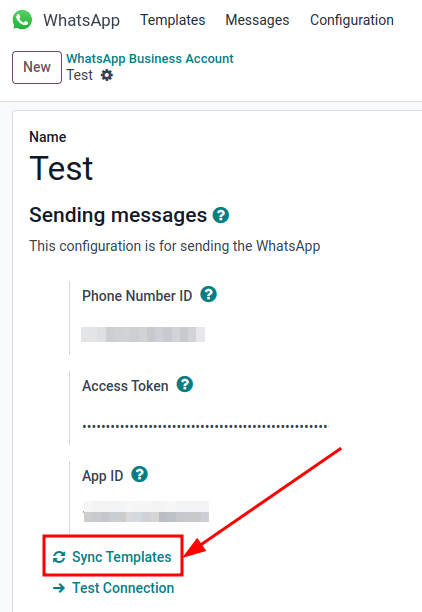
         highlighted.

A successful message in green appears in the upper-right corner with the number of templates
updated.

.. tip::
   Templates can also be synced individually from the template itself. Navigate to the
   :menuselection:`WhatsApp app --> Templates` dashboard and select the template to sync. Then,
   click on the :guilabel:`Sync Template` button located in the top menu of the template's form.

Creating templates in Meta
--------------------------

First, navigate to `Meta's WhatsApp template dashboard
<https://business.facebook.com/wa/manage/home>`_, and then go to :menuselection:`Account tools -->
Message templates`.

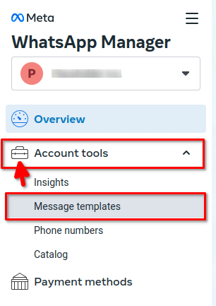

To create a WhatsApp template, click on the blue :guilabel:`Create template` button, and then select
the :guilabel:`Category`. The options listed include: :guilabel:`Marketing`, :guilabel:`Utility`,
and :guilabel:`Authentication`. In most instances the first two options will be used, unless the
user would like to send a password reset or something security related.

Enter the :guilabel:`Name` of the template and then select the :guilabel:`Language` for the
template.

.. note::
   Multiple languages can be selected by typing the language name(s) and selecting the other
   languages as needed.

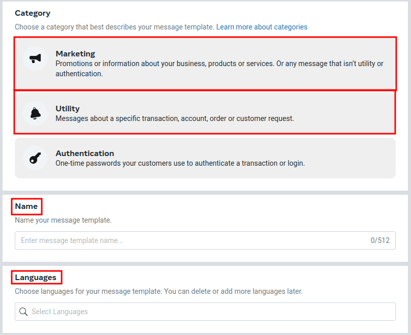
         highlighted.

After making the appropriate selections, click on :guilabel:`Continue` in the upper-right corner.
The page redirects to the :guilabel:`Edit template` page. Here the :guilabel:`Header`,
:guilabel:`Body`, :guilabel:`Footer` and :guilabel:`Buttons` are configured. To the right of the
template is a preview of what the template will look like in production.

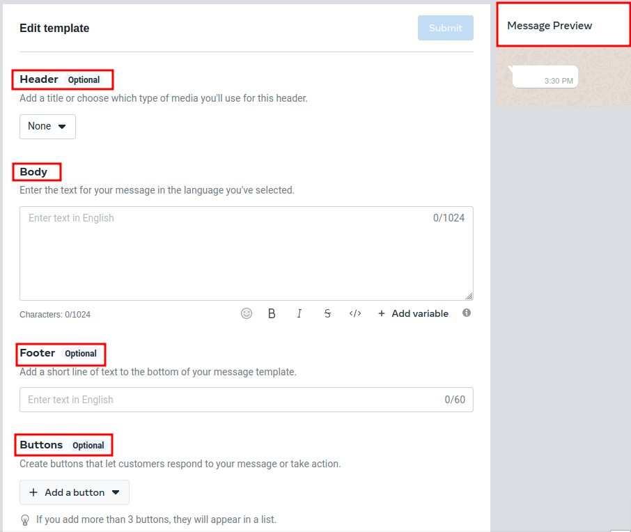

When all the necessary changes are made to the template, click on the :guilabel:`Submit` button in
the upper-right corner. A confirmation window appears to confirm the language— click
:guilabel:`Confirm` to approve and then another window appears stating that the template will be
submitted to Meta for review and approval.

The :guilabel:`Status` of the template will remain in :guilabel:`In review` until a decision has
been made by Meta. Once an email confirmation is received approving the template, the templates will
need to be synced from within the Odoo database.

.. seealso::
   For more information on configuring templates on the Meta developer console visit `Meta's
   WhatsApp template documentation
   <https://developers.facebook.com/docs/whatsapp/business-management-api/message-templates/>`_.

Notifications
=============

Notifications in WhatsApp are handled similar to a message conversation in Odoo. A pop-up window
appears with the received conversation from the customer. By default, notifications are set in the
WhatsApp business account configuration in Odoo.

Notification settings can be adjusted by navigating to :menuselection:`WhatsApp app -->
Configuration --> WhatsApp Business Accounts`. From there, select the account and scroll down to the
:menuselection:`Control` section where notifications are handled. Under the :guilabel:`Notify users`
heading, type in the field which user(s) should be notified for this particular WhatsApp channel.

.. note::
   Once a conversation is initiated between a user and a customer, notifications to all the users
   specified in the WhatsApp business account configuration won't occur. Only notifications to the
   user(s) in the conversation will occur. Should the user not respond within 15 days, the
   customer's reply after the 15 days will populate once again to all the users specified in the
   WhatsApp configuration.

Adding users to chat
====================

Users can be added to a WhatsApp chat by expanding the WhatsApp pop-up window. WhatsApp
conversations are located in the *Discuss* app. Click on the :guilabel:`👤+ (add user)` icon next to
it, and a window appears to invite users to the conversation.

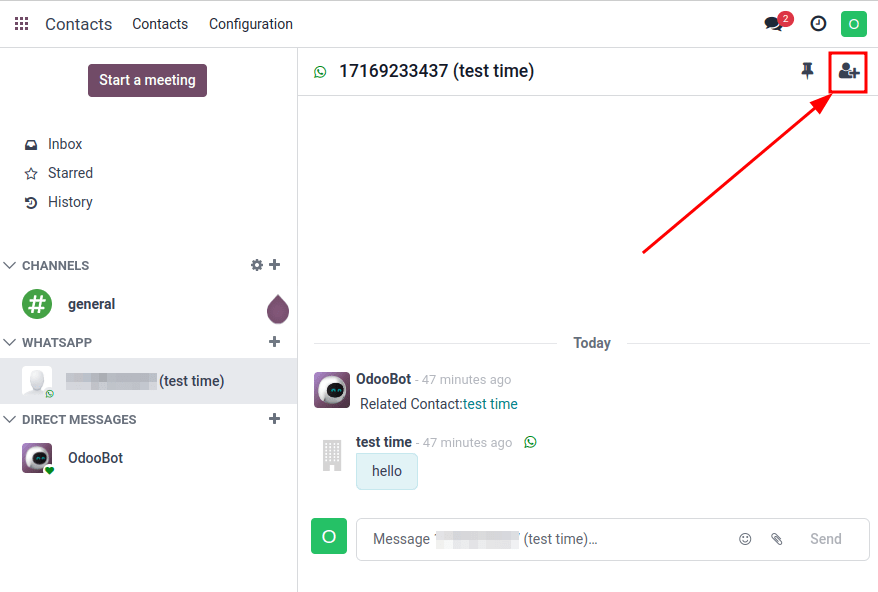

WhatsApp API FAQ
================

Verification
------------

As of February 1, 2023, if the Meta app requires advanced level access to permissions, a complete
business verification may need to be completed. This includes submitting office business documents
to Meta. `See this documentation
<https://developers.facebook.com/docs/development/release/business-verification>`_.

.. seealso::
   `Meta's WhatsApp access verification documentation
   <https://developers.facebook.com/docs/development/release/access-verification/>`_.

Template errors
---------------

Editing templates can cause tracebacks and errors unless the exact process is followed above, here:
(:ref:`productivity/whatsapp/templates`).

Duplicate validation error
~~~~~~~~~~~~~~~~~~~~~~~~~~

When syncing the templates there may be an instance when there are multiple templates with the same
name on Meta's business manager and in Odoo. This causes a duplicate validation error. To correct
this issue, rename the duplicate template name on Odoo and sync the templates once again by
following the steps here: :ref:`productivity/whatsapp/sync`.

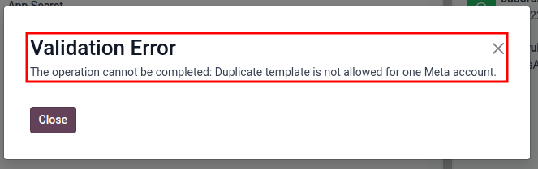

Token errors
------------

User error
~~~~~~~~~~

Should the temporary token not be replaced with a permanent token a user error will populate in Odoo
when testing the connection after sending fails. To correct this issues see
:ref:`productivity/whatsapp/token`.

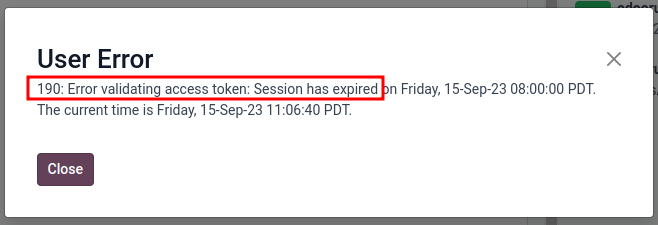

System user error 100
~~~~~~~~~~~~~~~~~~~~~

Should the system user be an :guilabel:`Employee` when setting up the permanent token, a user error
100 will populate.

To correct this error, create an :guilabel:`Admin` system user, following the process outlined here:
:ref:`productivity/whatsapp/token`.

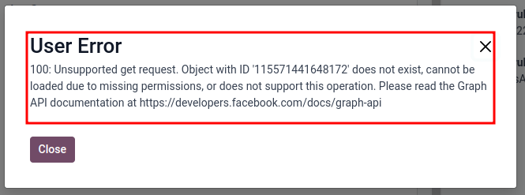
