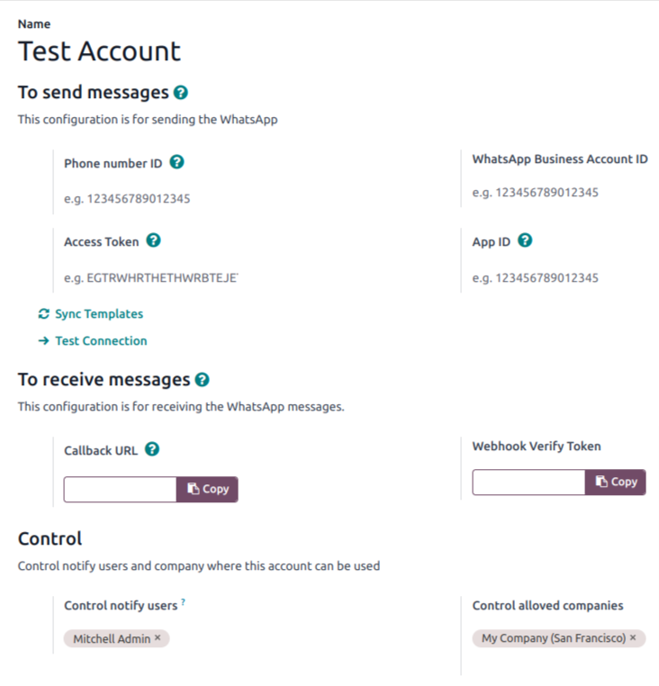
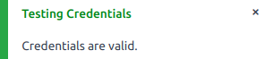
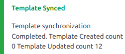

======================================
Add WhatsApp Bussiness Account in Odoo
======================================

.. _whatsapp/configuration:

Configuration
-------------

To add your :doc:`WhatsApp Bussiness Account <account_create_on_meta>` To Odoo database
Go to :menuselection:`WhatsApp --> Configuration --> Accounts`. Here you can simply add
your WhatsApp account by clicking on :guilabel:`NEW` adding credentials such as phone
number ID and access token.

Configuration for sending message
~~~~~~~~~~~~~~~~~~~~~~~~~~~~~~~~~

To send a WhatsApp Template User needs to configure following details about their
:doc:`WhatsApp Bussiness Account <account_create_on_meta>` in Odoo.

- :guilabel:`Name`: User can give any convenient name to WhatsApp Account. It will be helpful for
  User to identify in case of multiple :doc:`WhatsApp Bussiness Account <account_create_on_meta>`.
- :guilabel:`Phone Number Id`: Here user needs to provide Phone number ID which User would have
  got while creating the APP for the the :doc:`WhatsApp Bussiness Account
  <account_create_on_meta>`.
- :guilabel:`Access Token`: You can enter the **Temporary access token** or You can `Generate
  Permanent token <https://developers.facebook.com/docs/whatsapp/business-management-api/
  get-started#1--acquire-an-access-token-using-a-system-user-or-facebook-login>`_ for
  your APP.
- :guilabel:`WhatsApp Bussiness Account ID`: User needs to enter the :abbr:`WABA
  (WhatsApp Bussiness Account ID)` from the :guilabel:`APP` credentials.
- :guilabel:`App ID`: Enter the App Id which you would have got while setting up the
  :doc:`WhatsApp Bussiness Account <account_create_on_meta>`.

.. _whatsapp/webhook_config_odoo:

Configuration for recieving message
~~~~~~~~~~~~~~~~~~~~~~~~~~~~~~~~~~~

To receive message from WhatsApp you need to configure the following details. Then you
can use this information to :ref:`Configure Web Hook on the Meta APP <whatsapp/webhook_meta>`.

- :guilabel:`Callback URL`: It will be the URL where :ref:`Meta APP's WEBHOOK
  <whatsapp/webhook_meta>` will send the callback when Recipient replies to the Bussiness.
- :guilabel:`Webhook Verify Token`: You can enter any token. This will be required while
  verifying Webhook on the :ref:`Meta App <whatsapp/webhook_meta>`.

Users and Companies
~~~~~~~~~~~~~~~~~~~

You can define which users and companies can use this WhatsApp Account by adding below details.

- :guilabel:`Notify Users`: Under this tab user can enter the list of user. these list of users
  will be added to the Communication Channel, If Template used for such communication belongs to
  this WhatsApp Account.
- :guilabel:`Allowed Companies`: You can select companies here, only such company will be able to
  access this Account.

Test Connection
~~~~~~~~~~~~~~~

Once, You Enter all the above information then you can click on the Button :guilabel:`Test
Connection`. It will check with the :guilabel:`Meta WhatsApp API`, whether the entered details
are correct or not. If everything is correct then it will display the success message given as
below.

Sync Templates from Meta API
----------------------------

By clicking on the button :guilabel:`Sync Template`, user can fetch all the created
:doc:`WhatsApp Templates <../template/template_configuration>` on their :doc:`WhatsApp
Bussiness Account  <account_create_on_meta>`. User will be displayed notification of
successful synchronization of :doc:`WhatsApp Templates <../template/template_configuration>`.

Once user synchronizes WhatsApp Template Succesfully, user will be able to see :doc:`WhatsApp
Templates <../template/template_configuration>` associated with the the Whatspp Bussiness Account
by clicking on the stat button :guilabel:`Templates`.
