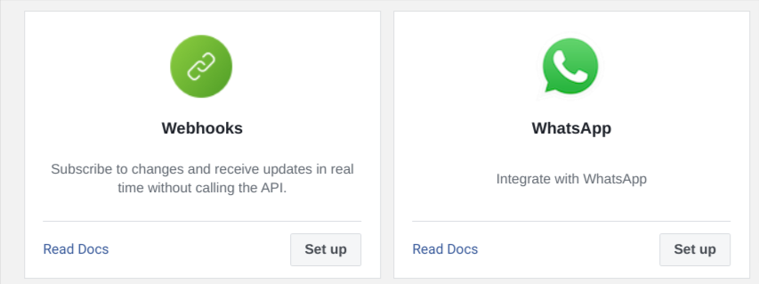
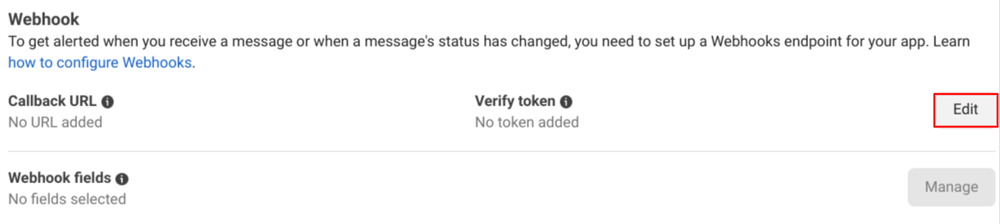

=====================
Configuration on Meta
=====================

Create Meta Business Account
============================

.. _whatsapp/create_meta_bussiness:

Create Meta Business Account
----------------------------

You need to register your Bussiness on the `Meta <https://business.facebook.com/>`_ to
use the feature of WhatsApp messaging. Once You verify your Meta Bussiness Account
You can add your Phone Number to it. you can send the messages using your Phone Number.

.. seealso::
   - `Create a WhatsApp Business platform account <https://www.facebook.com/business/help/2087193751603668?id=2129163877102343>`_
   - `Meta Bussiness Verification <https://developers.facebook.com/docs/development/release/business-verification>`_

.. _whatsapp/create_meta_app:

Create an APP on Meta
---------------------

First You need to create a `Facebook Developer Account <https://developers.facebook.com/
docs/development/register>`_. Once you login using :guilabel:`Facebook Developer Account`,
From :guilabel:`My Apps` Click the :guilabel:`Create APP` button.

Select :guilabel:`Other` in use case. Select an app type as :guilabel:`Bussiness` and click
on :guilabel:`Next`. Add App Name and Contact details. Here you can specify your relevant
:ref:`Meta Bussiness Account <whatsapp/create_meta_bussiness>`. Then click on the
:guilabel:`Create app` button. Enter the Password and your New :guilabel:`Meta App` is ready to use for production
use case.

Adding Products to Meta App
---------------------------

From your `Meta App <https://developers.facebook.com/apps>`_ select any App and go to
:guilabel:`Dashboard`. If you have followed steps to :ref:`Create an APP on Meta
<whatsapp/create_meta_app>`, then you will be able to add the product such as Webhooks
and WhatsApp.

Add WhatsApp To Meta App
~~~~~~~~~~~~~~~~~~~~~~~~

Click on the :guilabel:`Set up` button for the Product :guilabel:`WhatsApp`. By clicking on the
:guilabel:`Add phone number` you can add your phone number to send the WhatsApp message. Recipient
will recieve message from this number.

.. _whatsapp/webhook_meta:

Configure Webhooks to Recieve message
~~~~~~~~~~~~~~~~~~~~~~~~~~~~~~~~~~~~~

Now From your :ref:`Meta App <whatsapp/create_meta_app>` go to :menuselection:`WhatsApp
--> configuration`.

Click on :guilabel:`Edit`. Here you need to add the :guilabel:`Callback URL` and :guilabel:`Token`
Which you could have configured, While setting up :ref:`WhatsApp Bussiness Account
<whatsapp/webhook_config_odoo>` in Odoo.
