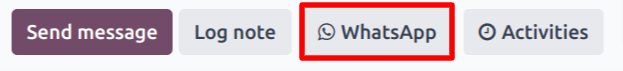
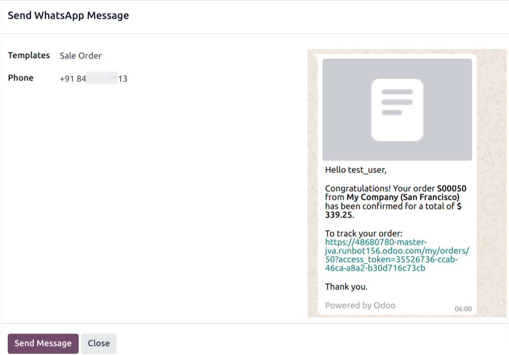
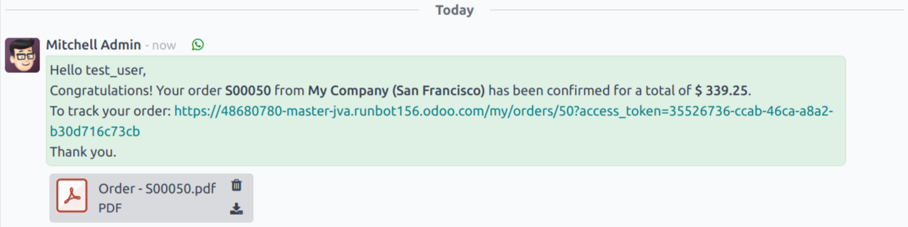
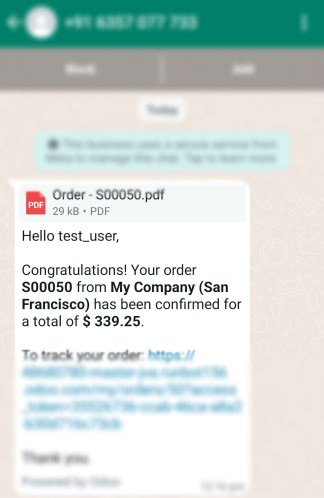
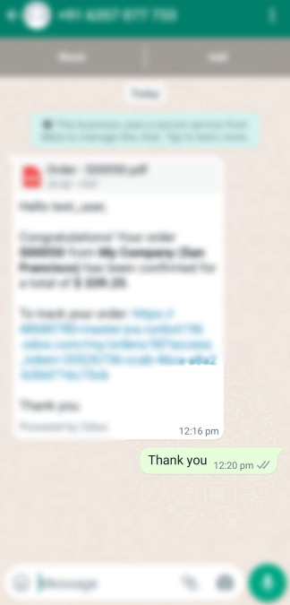
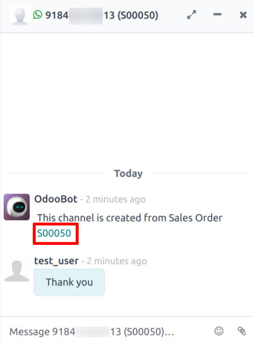
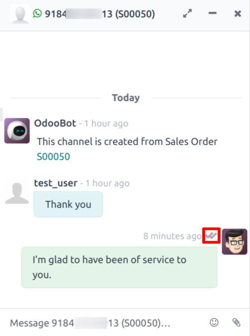
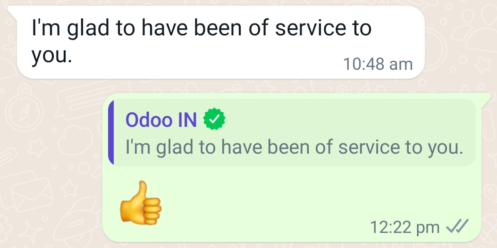
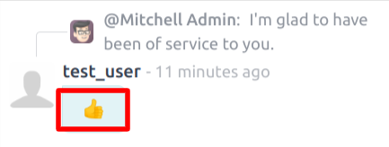
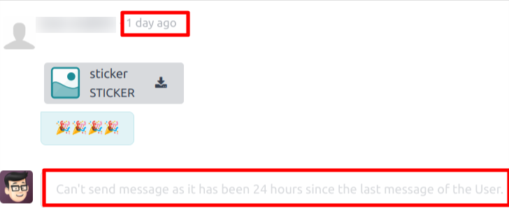

==========================================
Communication With Customer Using Template
==========================================

Once You :doc:`Create a WhatsApp Template <../template/template_configuration>` in your
Odoo database. Now, You can send the Template to the Customer through WhatsApp message.

.. whatsapp/send_document_to_customer:

Send Document To Customer
=========================

User can see :guilabel:`WhatsApp` icon in the **Chatter** of the Form view of `Model`.

Click on that :guilabel:`WhatsApp` icon. Popup will open.

Select the :doc:`Template <../template/template_configuration>` and click on the :guilabel:`Send
Messsage`. After few seconds you can see the `Logs` in the **Chatter**.

.. whatsapp/response_to_customer:

Response to Customer
====================

Now Customer to whom bussiness has sent the Document must have received the Documnent in their
WhatsApp.

.. whatsapp/chat_in_discuss:

Chat in Discuss
===============

Still There would be no Channel created in :doc:`Discuss <../../discuss>`
for that Document.

Customer replies from the WhatsApp. You can see new channel created in :doc:`Discuss
<../../discuss>` for that Document. Conversation beetween the Bussiness and Customer
can be seen from this channel. Such channel will exist till the **15 Days** since the last
conversation from the Customer.

You will be able to see new channel is created for that Document. You can see the replies from
Customer in this channel.

You can reply to Customer from that channel. It will send the WhatsApp message to Customer.
Here, Double tick means that Customer has read your message.

.. whatsapp/reaction:

WhatsApp Reaction
=================

If Customer sends the **Reaction** to the Bussiness.

You will receive a similiar **Reaction** in :doc:`Discuss <../../discuss>`.

.. _whatsapp_app/unable_channel:

Existance Of Channel
====================

If There is no further reply from WhatsApp user in last 24 hours then it will unpin that
Document's Channel. You won't be able to send the message from :doc:`Discuss <../../discuss>`
through that channel. In the case of Customer replies to the Bussiness within**15 days**,
only such channel will be accessible to communicate again.

