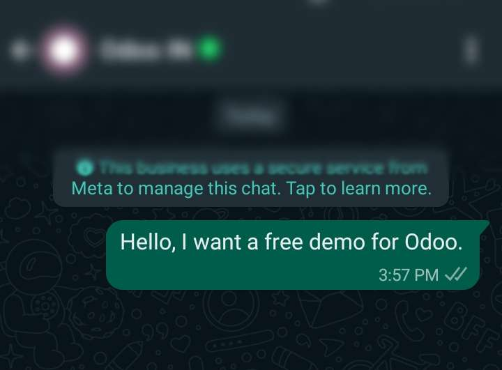
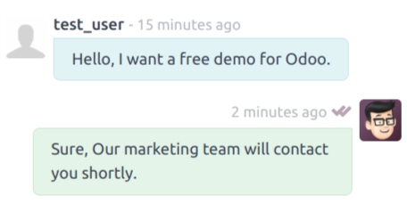

==================================
Communication Without Any Template
==================================

For instance, Customer go to Bussiness Website and clicks on the :guilabel:`WhatsApp` icon and
directly sends the WhatsApp message to the Bussiness.

New Channel in **Discuss** for that conversation will be created. you can keep track of that
Customer using that channel. Such channels also get deactivated after the **15 Days** of
the last conversation from the Customer.

