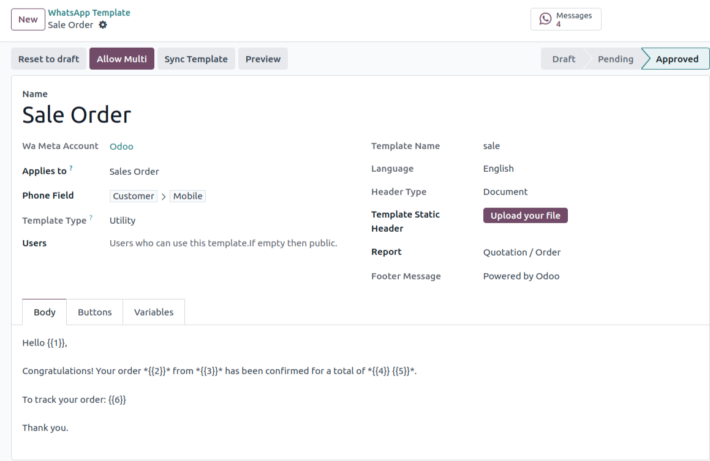
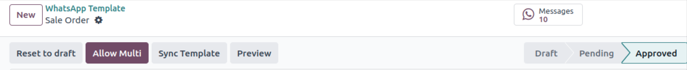
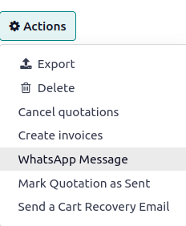
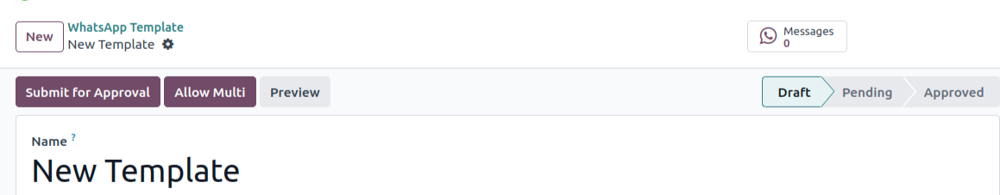

=========================
Get Started with WhatsApp
=========================

WhatsApp Template
=================

Go to :menuselection:`WhatsApp --> Template`. Here you can simply add your WhatsApp Template.
By clicking on :guilabel:`New` adding credentials such as name, header type , footer message.

Template Configuration
----------------------

Fill out the below details.

:guilabel:`Name`: This field is used to specify the name or title of the WhatsApp template.
It helps identify the type or purpose of the template.

:guilabel:`Applies To`: This field is used to determine that the current template implies to
which `Model`. i.e. Choosing :guilabel:`Sales Order` as :guilabel:`Applies To` in the
template means that you can select this template only while you are sending the Template from the
Sale Order.

:guilabel:`Phone Fields`:  It is a field selector which can select any field which can store the
phone number.

 - If user has selects :guilabel:`Applies To` as per the above screenshot then while sending
   document from :guilabel:`Sales Order` the message is sent to the mobile number associated with
   customer of the Sale order.

:guilabel:`Template Type`: There are **3** types of template

   #. :guilabel:`Authentication` - One-time passwords that your customers use to authenticate a
      transaction or login.
   #. :guilabel:`Marketing` - Promotions or information about your business, products or services.
      Or any message that isn't :guilabel:`utility or authentication`.
   #. :guilabel:`Utility` - Messages about a specific transaction, account, order or customer
      request.

:guilabel:`Users`: If we do not select any specific users, then everyone within the system can use
the template.

:guilabel:`Language`: This field is used to specify the language in which the WhatsApp Template is
sent.

:guilabel:`Template Name`: This field is automatically computed while creating a Template.

:guilabel:`Header Type`: This field determines the type of header used in the WhatsApp
template. There are **5** possible options:

- :guilabel:`Text`: If we select :guilabel:`Header Type` as a :guilabel:`Text` then
  :guilabel:`Template Header Text` field will be visible, where you can enter the plain text with
  maximum **1** variable. Recipient will be able to see this text as the header of the WhatsApp
  message.
- :guilabel:`Image`: The header includes an image, which must be uploading in **JPEG or PNG**
  format.
- :guilabel:`Video`: The header includes a video, which can be uploading in either **MP4 or 3GP**
  format.
- :guilabel:`Documents`: There are **2** types available
   - :guilabel:`Static Template Header`: This field is used to uploded the static template
     document.
   - :guilabel:`Report`: When :guilabel:`Applies to` is selected, You can select
     which Document for that `Model` need to send to the customer in the WhatsApp message.
- :guilabel:`Location`: When you select this options you can see **4** location variables created
  under the :guilabel:`Variables` page.

   #. :guilabel:`Location Name`: This field is used to specify the name or title of the location.
   #. :guilabel:`Location Address`: Here, you can provide the address of the particular location.
   #. :guilabel:`Latitude`: Here, Give the Latitude of the Location.
   #. :guilabel:`Longitude`: Here, Give the Longitude of the Location.

:guilabel:`Footer Message Field`: This fields describes the text that appears in the
footer of the WhatsApp message.

WhatsApp Message Components
---------------------------

Body
~~~~

In the body page of a WhatsApp template, you write the content that will be
displayed to the recipient. Within this content, variables can be used. i.e,
Variables are represented by {{1}}, {{2}}, and so on.

Buttons
~~~~~~~

In the button page of the template, there are **3** types of buttons available. You can
add maximum **3** button of type :guilabel:`Quick Reply`. You can add maximum **1**
button of type :guilabel:`Visit Website` and :guilabel:`Call Number`.

- :guilabel:`Visit Website`: This button allows the recipient to visit a website directly.
  There are **2** types of Visit Website buttons:

   - :guilabel:`Static`: You can provide static :guilabel:`Website URL`.
   - :guilabel:`Dynamic`: You can generate the link dynamically.

- :guilabel:`Call Number`: This button enables the recipient to make a direct call from within the
  WhatsApp preview section. When clicked, it initiates a phone call to the specified number.

   .. image:: template_configuration/button-call-visit.png
      :align: center
      :alt: View of Buttons in Odoo Discuss

- :guilabel:`Quick Reply`: This button is used predefined responses for the recipient.

   .. image:: template_configuration/buttons-quick.png
      :align: center
      :alt: View of Buttons in Odoo Discuss

Variables
~~~~~~~~~

This page of WhatsApp Template list down variables that are used within the body,header
or button of the template.

:guilabel:`Name`: This field is computed automatically.

:guilabel:`Sample Value`: This field where you can provide a value based on
the variable type.

:guilabel:`Type Field`: This field allows you to specify the type of data that the variable
represents.There are **5** different types available.

   #. :guilabel:`User Name`: This type is used to display the name of the current User of the
      system.
   #. :guilabel:`User Mobile`: This type is used to display the phone number of the current user
      who receives the template.
   #. :guilabel:`Free Text`: With this type, you can enter any text value, and it is displayed
      in the WhatsApp Message.
   #. :guilabel:`Portal Link`: This type is used when you want to include a link to a specific
      portal or website.
   #. :guilabel:`Fields of Model`: This type allows you to reference fields of the `Model`
      of the Template.

   .. image:: template_configuration/variables.png
      :align: center
      :alt: View of Variables of a body,buttons and buttons messages in Odoo WhatsApp

WhatsApp Template Buttons
-------------------------

You can see following buttons in the header of the Template.

:guilabel:`Message`: This stat button is used to determine the number of messages sent using this
Template.

:guilabel:`Preview`: This button is used to preview the message before sending it.

:guilabel:`Reset To draft`: This button is used to change the status to `Draft` and you can edit
this Template.

:guilabel:`Allow Multi`: By clicking on this button you can add a new `Action` to the Template's
respective `Model`.

Sync Template
-------------

You can synchronize the changes from :guilabel:`WhatsApp Meta API` by clicking on the
:guilabel:`Sync Template` button.

Submit For Approval
-------------------

When you click the :guilabel:`Submit for Approval` button, the WhatsApp templates are sent for
the approval to your :doc:`WhatsApp Business Account<../account/account_create_on_meta>`.
At this stage, the Templates enter a `pending` status will be change the appoved once it is
approved on the :doc:`WhatsApp Business Account<../account/account_create_on_meta>`.

