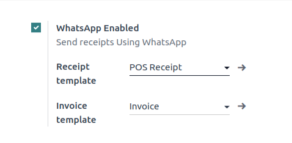

========================================
WhatsApp Template With POS Configuration
========================================

Create Template
---------------

Create a :doc:`Template  <../template/template_configuration>` for
:guilabel:`Point of Sale Orders`.

.. important::
   The header type is compulsory to select an :guilabel:`image` for POS.

In POS
------

Go to :menuselection:`Point of Sale --> configuration --> settings`. Enable the boolean
:guilabel:`WhatsApp enabled`.

Start a Session
~~~~~~~~~~~~~~~

Create a :doc:`POS Order <../../../sales/point_of_sale>`, You can see the :guilabel:`WhatsApp`
icon as below after the successful Payment. By clicking on that icon, :guilabel:`POS Receipt`
will be sent to the WhatsApp.

 .. image:: whatsapp_template_pos/pos-receipt.png
    :align: center
    :alt: POS Order Receipt in Odoo POS
