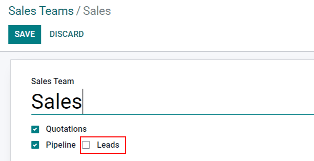
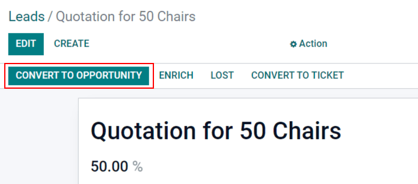
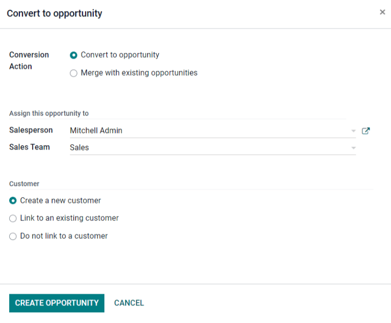
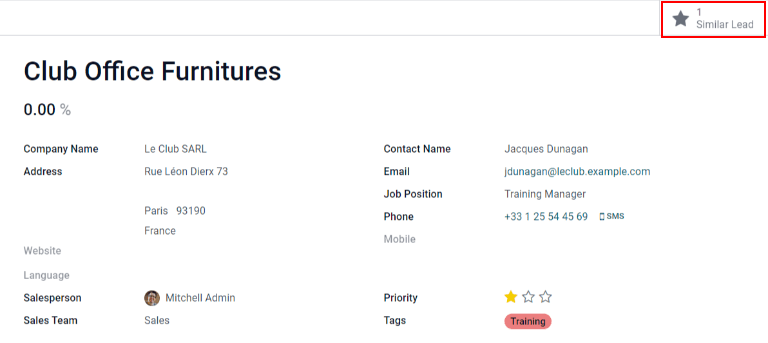
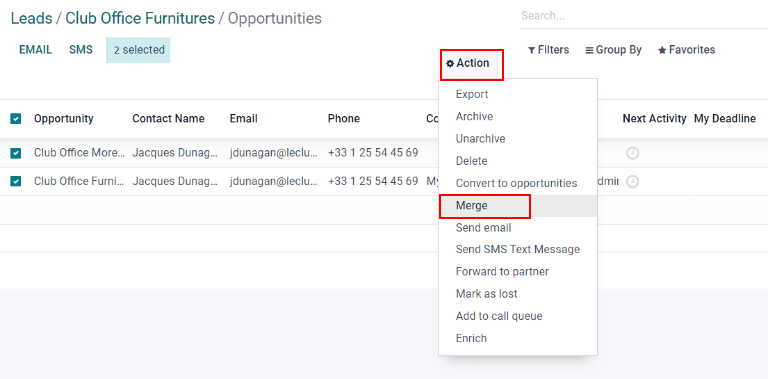

================================
Convert leads into opportunities
================================

*Leads* act as qualifying steps before an opportunity is created. This provides additional time
before a potential opportunity is assigned to a sales person.

Configuration
=============

To activate the *Leads* setting, navigate to :menuselection:`CRM app --> Configuration --> Settings`
and check the box labeled, :guilabel:`Leads`. Then, click :guilabel:`Save`.

.. image:: convert/convert-leads-leads-setting.png
   :align: center
   :alt: Leads setting on CRM configuration page.

Activating this feature adds a new menu, :guilabel:`Leads`, to the header menu bar at the top of the
screen.

Once the *Leads* setting has been activated, it applies to all sales teams by default. To turn off
leads for a specific team, navigate to :menuselection:`CRM app --> Configuration --> Sales Teams`.
Then, select a team from the list to open the record, and uncheck the :guilabel:`Leads` box. Once
done, click :guilabel:`Save`.

Convert a lead into an opportunity
==================================

To convert a lead into an *opportunity*, navigate to :menuselection:`CRM --> Leads`, and click on a
:guilabel:`Lead` from the list to open it.

In the upper-left corner of the screen, click the :guilabel:`Convert to Opportunity` button, which
opens a :guilabel:`Convert to opportunity` pop-up window.

On the :guilabel:`Convert to opportunity` pop-up window, in the :guilabel:`Conversion action` field,
select the :guilabel:`Convert to opportunity` option.

.. note::
   If a lead, or an opportunity, already exists in the database for this customer, Odoo
   automatically suggests merging both leads/opportunities. For more information on merging leads
   and opportunities, see the section on how to :ref:`merge leads
   <sales/crm/acquire_leads/merge-leads>` below.

Then, select a :guilabel:`Salesperson` and a :guilabel:`Sales Team` to which the opportunity should
be assigned.

If the lead has already been assigned to a salesperson or a team, these fields automatically
populate with that information.

Under the :guilabel:`Customer` heading, choose from the following options:

- :guilabel:`Create a new customer`: Choose this option to use the information in the lead to create
  a new customer.
- :guilabel:`Link to an existing customer`: Choose this option, then select a customer from the
  resulting drop-down menu, to link this opportunity to the existing customer record.
- :guilabel:`Do not link to a customer`: Choose this option to convert the lead, but not link it to
  a new or existing customer.

Lastly, when all configurations are complete, click :guilabel:`Create Opportunity`.

.. _sales/crm/acquire_leads/merge-leads:

Merge leads and opportunities
=============================

Odoo automatically detects similar leads and opportunities by comparing the email addresses of the
associated contacts. If a similar lead/opportunity is found, a :guilabel:`Similar Lead` smart button
appears at the top of the lead/opportunity record.

To compare the details of the similar leads/opportunities, click the :guilabel:`Similar Leads`
button. This opens a kanban view with only the similar leads/opportunities. Click into each card to
view the details for each lead/opportunity, and confirm if they should be merged.

.. important::
   When merging, Odoo gives priority to whichever lead/opportunity was created in the system first,
   merging the information into the first created lead/opportunity. However, if a lead and an
   opportunity are being merged, the resulting record is referred to as an opportunity, regardless
   of which record was created first.

After confirming that the leads/opportunities should be merged, return to the kanban view using
breadcrumbs, or by clicking the :guilabel:`Similar Lead` smart button. Click the :guilabel:`☰
(three vertical lines)` icon to change to list view.

Check the box on the left of the page for the leads/opportunities to be merged. Then, click the
:guilabel:`Action ⚙️ (gear)` icon at the top of the page, to reveal a drop-down menu. From that
drop-down menu, select the :guilabel:`Merge` option to merge the selected opportunities (or leads).

When :guilabel:`Merge` is selected from the :guilabel:`Action ⚙️ (gear)` drop-down menu, a
:guilabel:`Merge` pop-up window appears. In that pop-up window, decide to :guilabel:`Assign
opportunities to` a :guilabel:`Salesperson` and/or :guilabel:`Sales Team`.

Below those fields, the leads/opportunities to merge are listed, along with their related
information. To merge those selected leads/opportunities, click :guilabel:`Merge`.

.. note::
   When merging opportunities, no information is lost. Data from the other opportunity is logged in
   the chatter, and the information fields, for reference.

