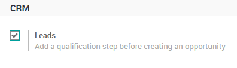
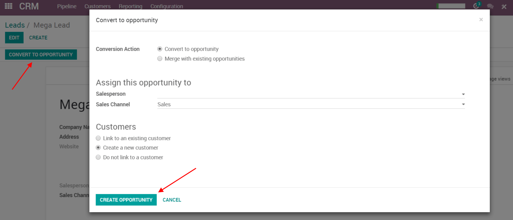

================================
Convert leads into opportunities
================================

The system can generate leads instead of opportunities, in order to add
a qualification step before converting a *Lead* into an
*Opportunity* and assigning to the right sales people. 

You can activate this mode from the CRM Settings. It applies to all your sales
channels by default. But you can make it specific for specific channels
from their configuration form.

Configuration
=============

For this feature to work, go to :menuselection:`CRM --> Configuration --> Settings`
and activate the *Leads* feature.

You will now have a new submenu *Leads* under *Leads* where they
will aggregate.

.. image:: convert/convert02.png
    :align: center

Convert a lead into an opportunity
==================================

When you click on a *Lead* you will have the option to convert it to
an opportunity and decide if it should still be assigned to the same
channel/person and if you need to create a new customer.

If you already have an opportunity with that customer Odoo will
automatically offer you to merge with that opportunity. In the same
manner, Odoo will automatically offer you to link to an existing
customer if that customer already exists.

Merge opportunities
===================

Odoo will also automatically propose to merge opportunities if they have
the same email address. When merging opportunities, Odoo merges the
information into the opportunity which was created first, giving
priority to the information present on the first opportunity. 

No information is lost: data from the other opportunity is logged in the
chatter and the information fields for easy access.

.. image:: convert/convert_04.png
    :align: center

Would you find a duplicate yourself, ...you can also merge opportunities
or leads even if the system doesn't propose it.

Here’s how, from the list view. Select the opportunities or leads you
want to merge and the action button will appear. Then, you can select merge.

.. image:: convert/convert_05.png
    :align: center

.. note::
   It is also possible to merge more than 2 opportunities or leads.