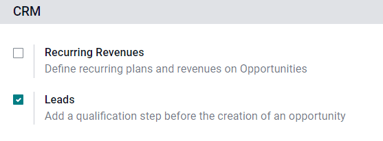
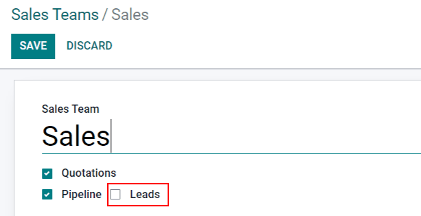
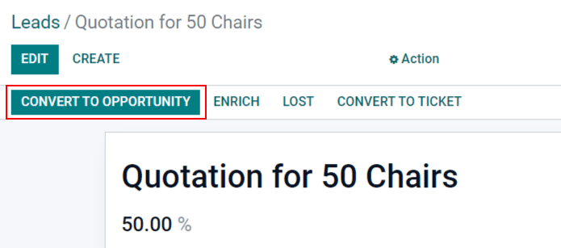
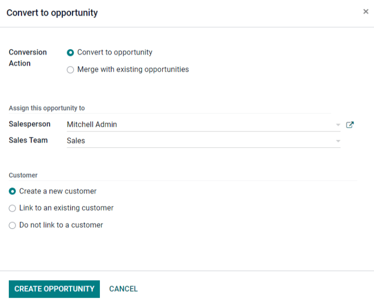

================================
Convert leads into opportunities
================================

When moving opportunities through the *CRM* pipeline, *Leads* act as a qualifying step before a
formal opportunity is created. Enabling *Leads* provides additional time to review an opportunity's
potential and gauge its viability before it's assigned to a salesperson.

.. _crm/configure-leads:

Configuration
=============

To activate the *Leads* setting, navigate to :menuselection:`CRM app --> Configuration --> Settings`
and check the box labeled, :guilabel:`Leads`. Then, click :guilabel:`Save`.

Activating this feature adds the :guilabel:`Leads` menu option to the header bar located along the
top of the screen.

Once the *Leads* setting has been activated, it applies to all sales teams by default. To turn off
leads for a specific team, navigate to :menuselection:`CRM app --> Configuration --> Sales Teams`.
Then, select a team from the list to open that team's configuration page. Clear the
:guilabel:`Leads` checkbox, located beneath the :guilabel:`Sales Team` field, then click
:icon:`fa-cloud-upload` :guilabel:`Save`.

Convert a lead into an opportunity
==================================

To convert a lead into an *opportunity*, navigate to :menuselection:`CRM app --> Leads`, and click
on a lead from the list to open it.

.. warning::
   Attempting to convert a lead with a 100% probability into an opportunity will result in an error
   message.

   .. image:: convert/100-percent-lead-error.png
      :alt: The error message that appears when attempting to convert a 100% probability lead into
            an opportunity.

Click the :guilabel:`Convert to Opportunity` button, located at the top-left of the page.

This opens a *Convert to opportunity* pop-up. Here, select the :guilabel:`Convert to opportunity`
option in the :guilabel:`Conversion Action` field.

Then, select a :guilabel:`Salesperson` and a :guilabel:`Sales Team` to which the opportunity should
be assigned. Neither field is required, but if a selection is made in the :guilabel:`Salesperson`
field, the :guilabel:`Sales Team` is automatically populated based on the assignee's assigned team.

If the lead has already been assigned to a salesperson or a team, these fields automatically
populate with that information.

Under the :guilabel:`Customer` heading, choose from the following options:

- :guilabel:`Create a new customer`: Choose this option to use the information in the lead to create
  a new customer record.
- :guilabel:`Link to an existing customer`: Choose this option, then select a customer from the
  drop-down menu to link this opportunity to.

Lastly, when all configurations are complete, click :guilabel:`Create Opportunity`.

To view the newly created opportunity, navigate to :menuselection:`CRM app --> My Pipeline`.

Merging similar leads and opportunities
---------------------------------------

If a :guilabel:`Similar Leads` smart button appears at the top of the page for the lead, a similar
lead or opportunity already exists in the database. Before converting the current lead, click the
smart button to check if the leads should be merged.

 .. image:: convert/similar-leads-smart-button.png
    :alt: Close up of a lead with emphasis on the Similar Leads smart button.

To merge this lead with an existing similar lead or opportunity, click the :guilabel:`Convert to
Opportunity` button and select :guilabel:`Merge with existing opportunities` in the
:guilabel:`Conversion Action` field. This generates a list of the similar leads/opportunities to be
merged.

When merging, Odoo gives priority to whichever lead/opportunity was created in the system first,
merging the information into the first created lead/opportunity. The resulting record is an
opportunity.
