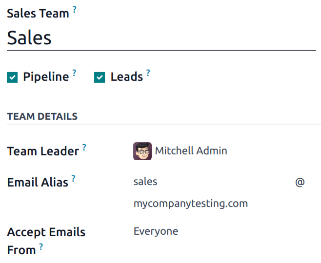
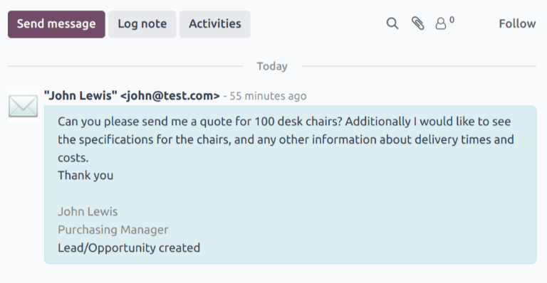
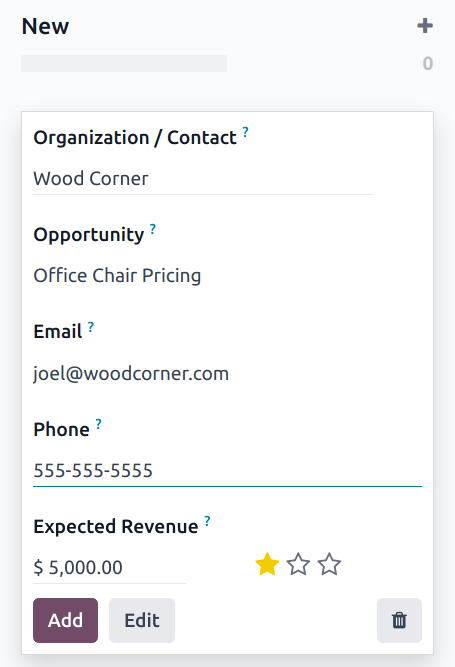

=====================================
Create leads (from email or manually)
=====================================

.. |st-o| replace:: :icon:`fa-star-o`
.. |st| replace:: :icon:`fa-star`

Leads can be added to the *CRM* app from custom email aliases, and by manually creating new
records. This is in addition to the leads and opportunities created in the app through the
:doc:`website contact form <opportunities_form>`.

First, ensure the *Leads* feature is enabled in the database by navigating to :menuselection:`CRM
app --> Configuration --> Settings`. Tick the :guilabel:`Leads` checkbox, then click
:guilabel:`Save`.

.. _crm/configure_email_alias:

Configure email aliases
=======================

Each sales team has the option to create and utilize their own unique email alias. When messages
are sent to this address, a lead (or opportunity), is created with the information from the
message.

To create or update a sales teams' email alias, navigate to :menuselection:`CRM app -->
Configuration --> Sales Teams`. Click on a team from the list to open the team's details page.

In the :guilabel:`Email Alias` field, enter a name for the email alias, or edit the existing name.
In the :guilabel:`Accept Emails From` field, use the drop-down menu to choose who is allowed to send
messages to this email alias:

- :guilabel:`Everyone`: messages are accepted from any email address.
- :guilabel:`Authenticated Partners`: only accepts messages from email addresses associated with a
  a partner (contact or customer) record.
- :guilabel:`Followers only`: only accepts messages from those who are following a record related to
  the team, such as a lead or opportunity. Messages are also accepted from team members.
- :guilabel:`Authenticated Employees`: only accepts messages from email addresses that are connected
  to a record in the *Employees* app.

Leads created from email
------------------------

Leads created from email alias messages can be viewed by navigating to :menuselection:`CRM app -->
Leads`. Click a lead from the list to open it, and view the details.

The email received by the alias is added to the *chatter* thread for the lead. The subject line of
the message is added to the title field, and the :guilabel:`Email` field is updated with the
contact's email address.

.. note::
   If the *leads* feature is **not** enabled on the database, messages to the email alias are added
   to the database as opportunities.

.. seealso::
   :doc:`../../../general/email_communication`

Manually create leads
=====================

Leads can be added directly to the *CRM* app by manually creating a new record. Navigate to
:menuselection:`CRM app --> Leads` to view a list of existing leads.

.. tip::
   Leads can also be added via the :doc:`Generate Leads <lead_mining>` button.

At the top-left of the list, click :guilabel:`New` to open a blank :guilabel:`Leads` form.

In the first field of the new form, enter a title for the new lead. Next, enter a :guilabel:`Contact
Name`, and a :guilabel:`Company Name`.

.. note::
   If a lead is :doc:`converted to an opportunity <convert>`, the :guilabel:`Company Name` field is
   used to either link this opportunity to an existing customer, or to create a new customer.

Manually create opportunities
-----------------------------

To manually create an opportunity, navigate to :menuselection:`CRM app --> Sales --> My Pipeline`.
At the top-left of the page, click :guilabel:`New` to create a new opportunity Kanban card. In the
:guilabel:`Organization/Contact` field, enter the name of the company the opportunity is for.

Choose a name, and enter it in the :guilabel:`Opportunity` field. *This is a required field.* When
manually creating an opportunity, it is helpful to add a name that relates to the details of the
opportunity.

.. example::
   In the example below, the opportunity is named `5 VP Chairs`. This identifies the product the
   customer is interested in, as well as the potential number of products.

   .. image:: email_manual/opportunity-example.png
      :align: center
      :alt: An example of an opportunity in the CRM pipeline.

Enter the contact information for the opportunity in the :guilabel:`Email` and :guilabel:`Phone`
fields.

In the :guilabel:`Expected Revenue` field, enter an estimated value for the opportunity.

.. note::
   The information in the :guilabel:`Expected Revenue` and priority fields can be used to track
   performance for individual salespeople, and on a team basis. See
   :doc:`../performance/expected_revenue_report` and :doc:`../track_leads/lead_scoring` for more
   information.

Then, use the |st-o| :guilabel:`(star)` icons to assign a priority.

- |st-o| |st-o| |st-o|: low priority
- |st| |st-o| |st-o|: medium priority
- |st| |st| |st-o|: high priority
- |st| |st| |st|: very high priority

.. note::
   Assigning a priority changes the order of leads in Kanban view, with higher priority leads
   displayed first.

Once all the necessary information has been entered, click :guilabel:`Add`.

