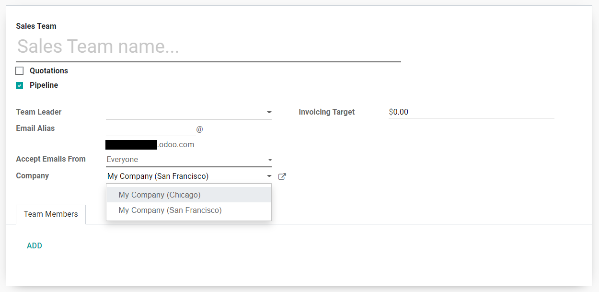

=======================================
Generating leads/opportunities by email
=======================================

Automating the lead/opportunity generation will considerably improve your team's efficiency.
Utilizing email aliases and a contact form in your database can aid in that improvement.

By default, any email sent to *sales@database\_domain.ext* will create an opportunity in the
default sales channel's pipeline associated with that particular email.

Configure email aliases
=======================

Each sales team can use its own email alias to filter generated leads/opportunities automatically
to their pipeline. This functionality can be  useful if you manage several sales teams with
specific individual business processes. You will find Sales Team configurations under
:menuselection:`Configuration --> Sales Teams`.

