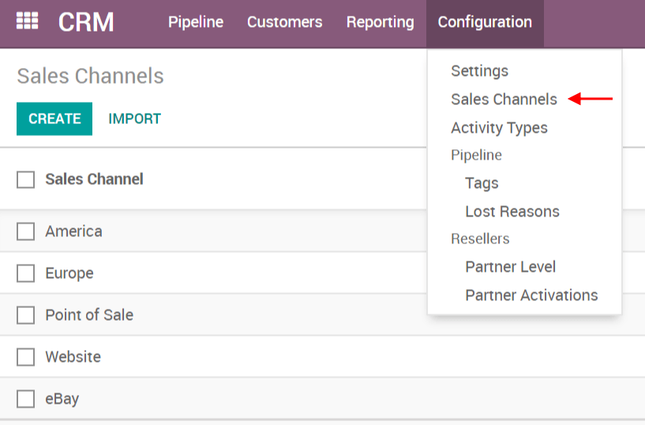

========================================
Generate leads/opportunities from emails
========================================

Automating the lead/opportunity generation will considerably improve
your efficiency. By default, any email sent to
*sales@database\_domain.ext* will create an opportunity in the
pipeline of the default sales channel.

Configure email aliases
=======================

Each sales channel can have its own email alias, to generate
leads/opportunities automatically assigned to it. It is useful if you
manage several sales teams with specific business processes. You will
find the configuration of sales channels under
:menuselection:`Configuration --> Sales Channels`.

