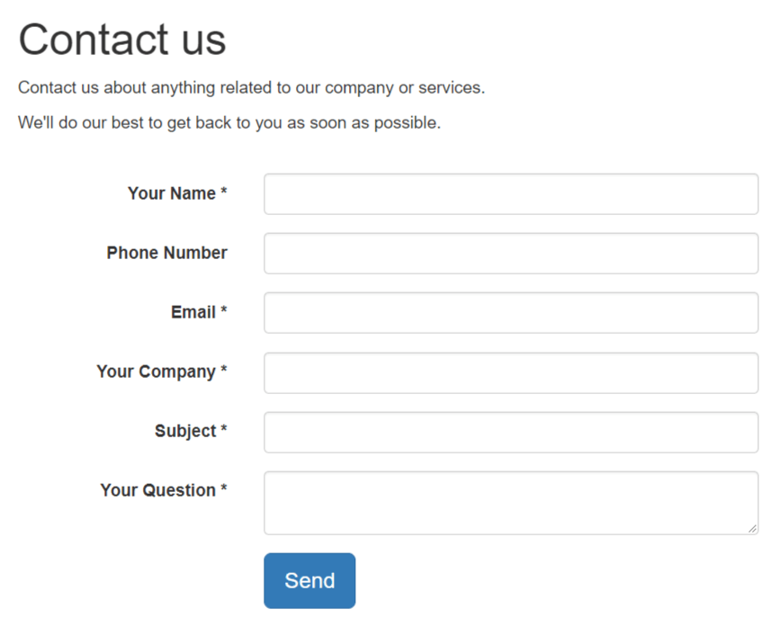
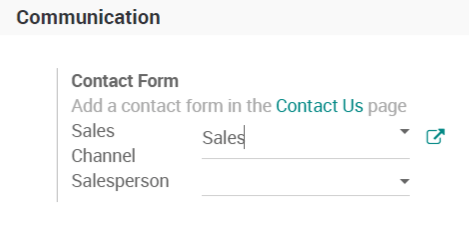
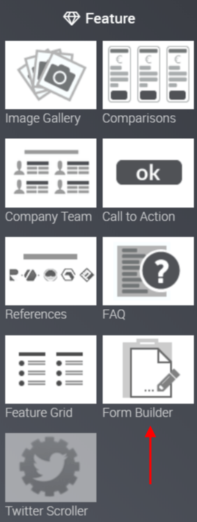
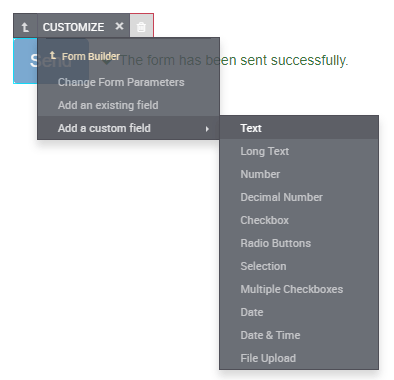
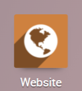
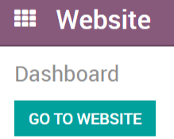

===========================================================
Generate leads/opportunities from your website contact page
===========================================================

Automating the lead/opportunity generation will considerably improve
your efficiency. Any visitor using the contact form on your website will
create a lead/opportunity in the pipeline.

Use the contact us on your website
==================================

You should first go to your website app.

|image0|\ |image1|

With the CRM app installed, you benefit from a ready-to-use contact form
on your Odoo website that will generate leads/opportunities
automatically.

To change to a specific sales channel, go to :menuselection:`Website
--> Configuration --> Settings` under *Communication* you will find the
Contact Form info and where to change the *Sales Channel* or
*Salesperson*.

Create a custom contact form
============================

You may want to know more from your visitor when they use the contact form to
you will need to build a custom contact form on your
website. These contact forms can generate multiple types of records in
the system (emails, leads/opportunities, project tasks, helpdesk
tickets, etc.)

Configuration
=============

You will need to install the free *Form Builder* module, only
available in Odoo Enterprise.

Create a custom contact form
----------------------------

First, go to the page where you want to put your contact form. In edit mode, drag
the form builder onto the page, and you will be able to add all the fields
you wish.

By default, any new contact form will send an email. You can switch to
lead/opportunity generation in *Change Form Parameters*.

.. note::
   If the same visitor uses the contact form twice, the second
   entry will be added to the first lead/opportunity in the chatter.

Generate leads instead of opportunities
=======================================

When using a contact form, you should use a qualification step
before assigning the form to the right sales people. To do so, activate *Leads*
in CRM settings and refer to :doc:`convert`.

