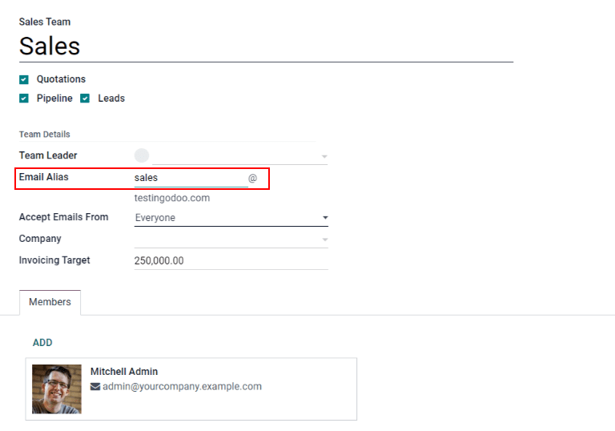
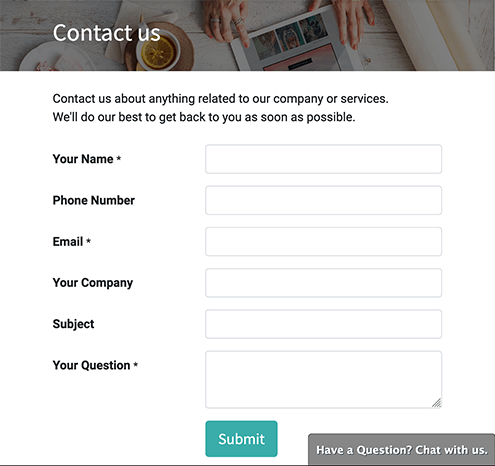
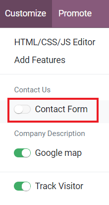
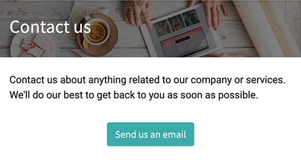
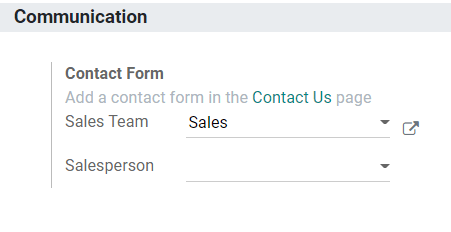
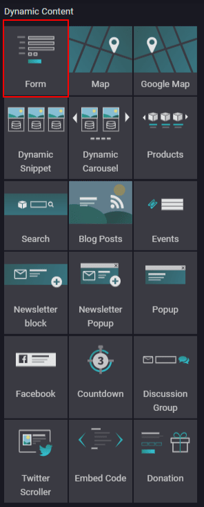
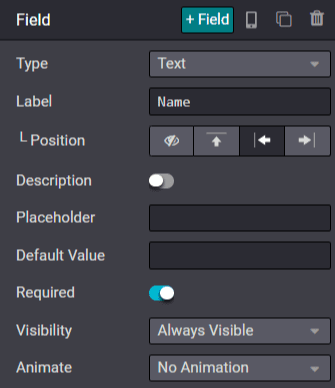

============================
Generate leads/opportunities
============================

Two key ways to generate new leads or opportunities for your business are through email aliases and
website contact forms. Odoo automatically creates leads in your CRM whenever someone sends a
message to a Sales Team email alias or fills out a contact form on your website.

Configure email aliases
=======================

Each Sales Team can use its own unique email alias to generate leads/opportunities. Any email sent
to a Sales Team's email alias will automatically create a lead (if leads are activated in your CRM
settings) or an opportunity in the pipeline for that particular team. Configure custom email
aliases on the configuration page for each Sales Team by navigating to :menuselection:`CRM -->
Configuration --> Sales Teams`.

Use Contact Forms on your website
=================================

By default, your website's *Contact Us* page displays Odoo's ready-to-use Contact Form. Whenever
someone submits this form, a lead or an opportunity is generated in your database.

The Contact Form can be activated or deactivated at any time by going to :menuselection:`Website
--> Go to Website --> Customize --> Contact Form`.

When the Form is deactivated, the *Contact Us* page simply displays a button to email your company
directly. Any email sent this way will generate a lead/opportunity.

Choose which Sales Team or salesperson is automatically assigned to the leads/opportunities created
from the Contact Form by going to :menuselection:`Website --> Configuration --> Settings -->
Communication`.

Customize Contact Forms
=======================

Contact Forms can be customized for the specific information your team needs, using the free *Form
Builder* module.

The *Form Builder* module is installed automatically when a Form element is added to a web page via
the Website Builder. It can also be installed manually from the :guilabel:`Apps` page.

.. tip::
   Forms can be created from scratch to serve a wide variety of purposes. However, Odoo's default
   *Contact Us* page is designed to fit most users' needs. Start with the default form and modify
   from there.

Edit Contact Form fields
------------------------

In Edit mode on your website, click on any field to start editing it. The following information can
be edited for each field on the Contact Form:

- :guilabel:`Type`: Choose a custom field option or an existing field. Examples include phone, file
  upload, language, etc.
- :guilabel:`Input Type`: Determine the type of entry customers should input. Available options are
  text,email, telephone, and URL.
- :guilabel:`Input Placeholder`: Type in an example to guide users how to input information where
  formatting is important, such as a phone number or email address.
- :guilabel:`Label Name`: Type in the display name to show users what information is needed from
  them.
- :guilabel:`Label Position`: Choose the way the label is aligned with the rest of the form. The
  label can be hidden, above the field, to the far left of the field, or right adjusted and closer
  to the field.
- :guilabel:`Required`: Toggle this option for information that you absolutely need entered.
- :guilabel:`Hidden`: Toggle this option to hide the field without deleting it.
- :guilabel:`Shown on Mobile`: Toggle this option to show the field to users on mobile devices.

By default, when a Form is submitted, it sends you an email with the customer's inputted
information. To have it automatically generate a lead/opportunity instead, edit the Form and select
:guilabel:`Create an Opportunity` as the Action.

.. tip::
   If leads are activated in your CRM settings, selecting :guilabel:`Create an Opportunity`
   generates a lead instead. To learn more about activating leads in the CRM settings, head over to
   :doc:`convert`.
